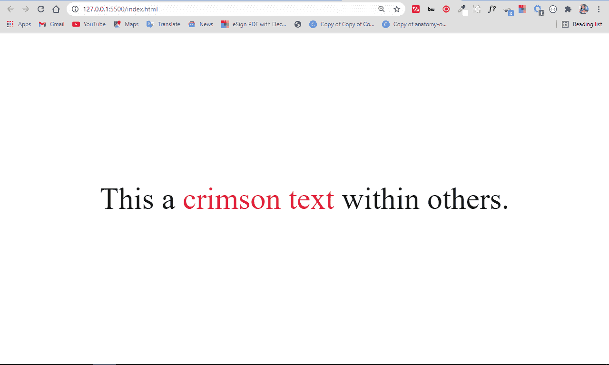
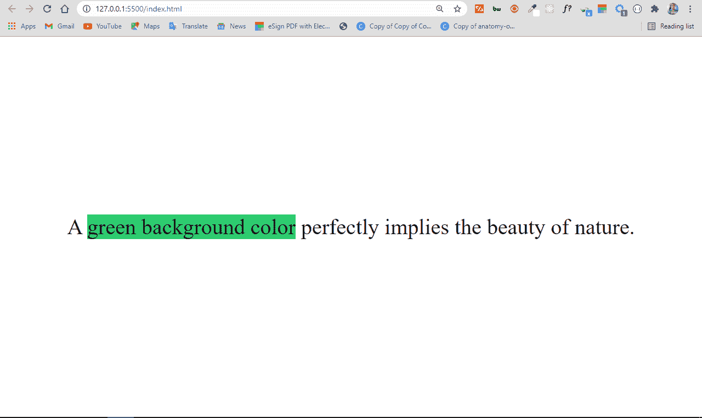
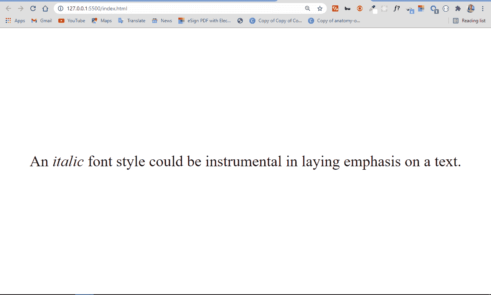
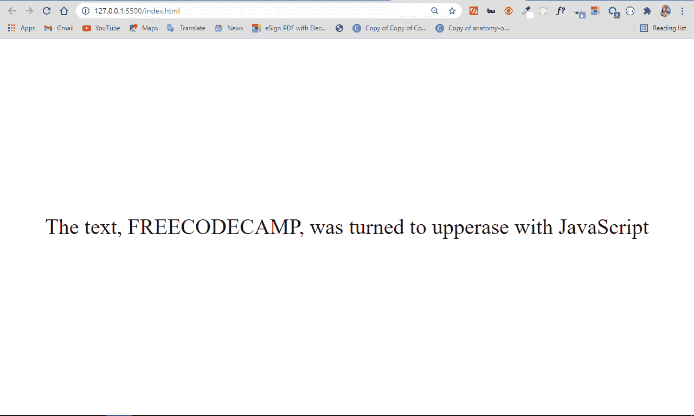

# 如何在 CSS 中使用 Span 标签

> 原文：<https://www.freecodecamp.org/news/span-html-how-to-use-the-span-tag-with-css/>

您可以使用 HTML `span`标签作为容器将内联元素分组在一起，这样您就可以用 JavaScript 来设计或操作它们。

在本文中，我将向您展示如何使用 span 标签来使内容的某一部分与其他部分有所区别。然后，您应该能够开始在您的编码项目中使用它。

## `span`标签是做什么用的？

`span`标签就像一个 div，用来将相似的内容分组，这样就可以一起设计样式。

但是`span`的不同之处在于它是一个内联元素，而`div`是一个块元素。

此外，请记住，`span`本身对其内容没有任何影响，除非您对其进行样式化。

`span`标签有两个主要用途——用 JavaScript 设计和操作特定的文本。

### 如何使用`span`标签设置文本样式

如果您想使某些特定的文本或任何其他内容不同于其他内容，您可以将它包装在一个`span`标签中，给它一个 class 属性，然后用属性值选择它进行样式化。

在下面的例子中，我将一些文本的`color`、`background-color`和`font-style`包装在一个`span`标签中，从而改变了它们。

#### 如何更改文本颜色

```
<p>This a <span class="crimson-text">crimson text</span> within others.</p> 
```

```
.crimson-text {
      color: crimson;
   } 
```

我添加了一些基本的 CSS 来使页面上的所有内容居中:

```
body {
        display: flex;
        align-items: center;
        justify-content: center;
        margin: 0 auto;
        height: 100vh;
      } 
```



#### 如何更改背景颜色

```
<p>
      A <span class="green-background">green background color</span> perfectly
      implies the beauty of nature.
</p> 
```

```
 .green-background {
        background-color: #2ecc71;
      } 
```



#### 如何更改字体样式

```
<p>
   An <span class="font-style">italic</span> font style could be instrumental
   in laying emphasis on a text.
</p> 
```

```
.font-style {
     font-style: italic;
   } 
```



### 如何使用`span`标签操作 JavaScript

正如可以通过在内容周围包装一个`span`标签来设置内容的样式一样，也可以通过将内容包装在一个`span`标签中来操作内容。你给它一个`id`属性，然后用 JavaScript 通过它的 id 选择它，这样你就可以操纵它了。

在下面的例子中，我用 JavaScript 将其他文本中的一些文本改为大写:

```
<p>
   The text, <span id="uppercase"> freecodecamp</span>, was turned to
   upperase with JavaScript
</p> 
```

```
const uppercase = document.querySelector("#uppercase");

uppercase.style.textTransform = "uppercase"; 
```



## 结论

在本教程中，您已经学习了如何用 CSS 和 JavaScript 操作一段特定的文本，方法是将它包装在一个`span`标签中，并赋予它一个唯一的`class`或`id`属性。

请注意，在这种情况下，为了避免混淆，应该使用类进行样式化，使用 id 进行 JavaScript 操作。

感谢阅读，继续编码。