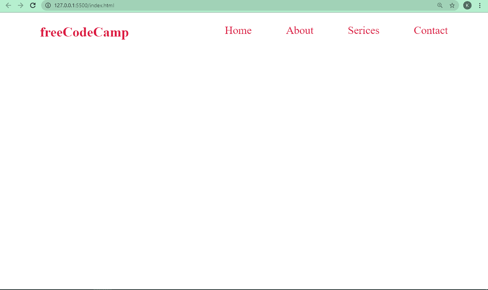

# Span 和 Div HTML 标签的区别是什么？

> 原文：<https://www.freecodecamp.org/news/span-vs-div-html-tags-what-is-the-difference/>

如果你用浏览器的开发工具检查一个网页，你可能会看到一堆嵌套的`div`标签，可能还有一些内容包装在`span`标签中。

相似的内容通常由这两个容器元素组合在一起——`span`和`div`。您可以将它们都用作容器，但它们的工作方式并不完全相同。

在本教程中，我将向您展示 span 和 div 之间的区别，以便您在需要同时使用两者时不会被它们混淆。

## `span`和`div`标签的主要区别

如果你想让网页的某个部分与众不同，并采用不同的样式，你可以将`span`和`div`标签都用作容器。但是，它们的用途并不完全相同。

### HTML div 标签

div 标签是一个通用的块级元素，用于将一个较大的网页块关联和分组在一起——通常是一个部分，如页眉、页脚、主要内容等。

在下面的例子中，我将网页的标题和`div`标签组合在一起，并使用 CSS 对其进行样式化。

```
<div class="header">
      <h2 class="logo">freeCodeCamp</h2>

      <ul class="nav">
        <li><a href="">Home</a></li>
        <li><a href="">About</a></li>
        <li><a href="">Serices</a></li>
        <li><a href="">Contact</a></li>
      </ul>
</div> 
```

在下面的 CSS 中，我用 CSS Flexbox 展示了页眉和导航栏。我还删除了浏览器分配给元素的默认边距和填充。

```
* {
      margin: 0;
      padding: 0;
      box-sizing: border-box;
    }

.header {
      padding: 0 70px;
      display: flex;
      align-content: center;
      justify-content: space-between;
      margin-top: 20px;
      margin-bottom: 20px;
      color: crimson;
    }

.nav {
      display: flex;
      align-content: center;
      justify-content: center;
      gap: 60px;
      list-style-type: none;
    }

.nav li a {
      text-decoration: none;
      font-size: 1.2rem;
      color: crimson;
    } 
```



此外，您可以使用 div 标签将相似的内容分组在一起。这可能是类似的文本、图像、视频等等。因此，您可以在 div 中嵌套 div，并为它们附加唯一的类或 id 属性，这样就不会混淆。

### HTML `span`标签

`span`标签是一个内联元素，用于在 CSS 或 JavaScript 中突出一小部分内容。除非你完全知道你在做什么，否则你不应该嵌套 span——但是你可以在一个块级元素中放置多个 span 标签。

在下面的例子中，我用 span 标签将一些特殊的单词包裹起来，并对它们进行了不同的样式设计。

```
<p>
      This is a <span class="crimson">crimson text</span> within black texts.
      This is an <span class="indigo">indigo text</span> within others, and this
      is an <span class="orange">orange text</span> within other texts.
</p> 
```

```
body {
    display: flex;
    align-items: center;
    justify-content: center;
    max-width: 900px;
    margin: 0 auto;
    height: 100vh;
  }

p {
    font-size: 2.5rem;
  }

.font-style {
    font-style: italic;
  }

.crimson {
    color: crimson;
  }

.indigo {
    color: indigo;
  }

.orange {
    color: orange;
  } 
```


您可以在下表中看到`span`和`div`标签之间最重要的区别:

| `span`标签 | `div`标签 |
| --- | --- |
| 内嵌级元素 | 块级元素 |
| 用于对小文本块进行分组 | 用于将大块文本分组在一起 |
| 不得嵌套以避免混淆 | 通常嵌套 |

## 什么时候应该用`span`或者`div`？

当您想对内容的特定部分进行不同的样式化或者用 JavaScript 操作时，您应该使用`span`。您还可以将它用作内联元素的容器。

另一方面，如果你想把大块的内容组合在一起，或者当你想在网页上布局元素时，你应该使用`div`标签。

## 结论

在本教程中，您已经了解了 span 和 div 标记之间的区别。

这些标签在样式和布局中很有用。请记住，HTML5 引入了语义元素，如`section`、`header`、`nav`、`footer`等。所以一般来说，只有当语义元素不符合你想要做的事情时，你才应该使用`span`或`div`。

感谢阅读，继续编码。