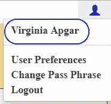
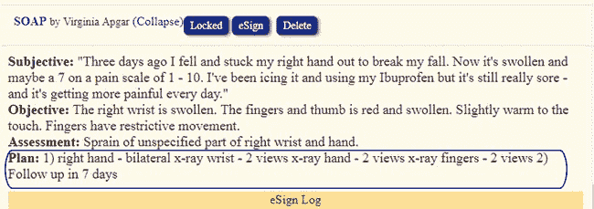
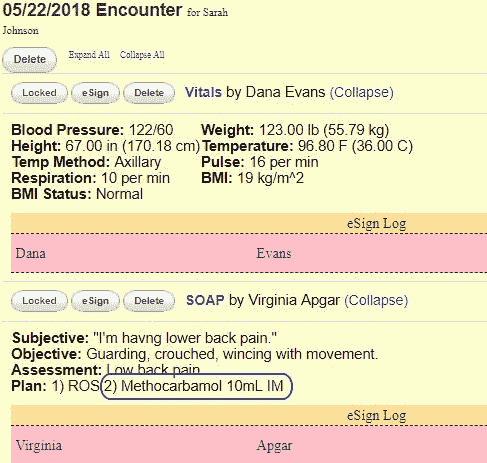

# 我在外展旅程中的特殊时刻

> 原文：<https://www.freecodecamp.org/news/special-moments-on-my-outreachy-journey-78db1ff11ef4/>

托尼·肖特斯维

# 我在外展旅程中的特殊时刻

这几周真是太棒了。对于那些一直关注我的旅程的人，感谢你们在实习进行到一半的时候来看我。

这是一个偏远的职位，和来自世界各地的人一起工作是一次极好的经历。在等待答案的时候，耐心是一种美德，但当我们同时在线并一起工作时，耐心也是非常令人兴奋的。

对于那些没有读完整个故事，或者错过了几篇文章的人，我很乐意给你一个快速的补充…

#### 我是如何来到这里的

在我的第一篇文章中，我分享了我是如何战胜困难，被选为[图书馆](http://librehealth.io/)的两名[外展](https://www.outreachy.org/)实习生之一。我正在提供一些关于图书馆健康电子健康记录系统的英文文档。

阿黛尔是我的实习伙伴。她正在把所有的文件翻译成法语。我喜欢和她一起工作。她很有幽默感，当我感到有点失落的时候，她总是在那里帮助我。

第二篇文章讨论了我开始实际实习前的准备工作。利用 EHR 图书馆健康演示网站，我创建了一个文档，以一个需要 x 射线转诊的病人为例来指导读者。

在第三篇文章中，我谈到了当我试图在我的旧机器上设置 Docker 中的放射模块时遇到的一些技术挑战。？

我的[上一篇](https://medium.freecodecamp.org/every-step-brings-something-new-on-my-outreachy-journey-e7c0f7adf2ea)文章分享了我的一些工作和目标。从那以后，我已经审查了一些文档，得到了很多有趣的反馈。

今天，我一直在利用这些反馈向前迈进，学习更多的课程，并塑造我未来的目标。

#### 证明文件

我喜欢我创建的诊所，尽管阿普加医生已经在那里了。

Dr. Virginia Vapgar is logged into the EHR system

这个实践首先出现在我记录的 LibreHealth 用户指南中。现在我们的员工很棒，他们正在向我们展示一个真正的实践应该如何运行。

当我创建两个不同的文档时，在订单和接触(或访问)之间有一个关系。例如，订单可以是遭遇的一个组成部分。

所以偶尔信息会重叠。但是我必须小心，确保每个文档都准确地接收到所需的信息。

我已获得关于提供者订单的文件的批准，该文件遵循患者和工作人员创建和转录 x 射线订单。为了我的工作，我创造了一个有双胞胎女儿的病人。

X-ray Plan for “Jessica Johnson”

我最近提交了我的第三次修订的遭遇文件。这个有点不一样，因为涉及到药物治疗。除了就诊代码和账单代码之外，还需要学习一个新的代码，以了解处方药物的费用和数量。我还在学习这些，所以可能需要多一点时间才能到位。

Medicine Plan for “Sarah Johnson”

我做了调查，以了解医疗代码是什么，以及如何创建订单。我的 EHR 导师非常擅长回答我的问题并提供积极的建议。任何错误都是我自己造成的。？

#### 费用单

我还在处理收费表。代码必须按正确的顺序放置，用正确的代码对齐，并正确定价。

ICD10 代码是提供者决定在那次遭遇中被治疗的问题的诊断。费用表上有几项内容——在会面中处理的问题的 ICD10 代码，会面中提供的任何服务的 CPT4 和 HCPCS 代码，以及任何其他杂项费用。

#### 哎呀！

我的 EHR 导师对我和我的许多失误一直很有耐心。既然 Provider Orders 文档已经被批准，我必须将它以 wiki 格式放到 Libre wiki 站点上。说起来容易做起来难。

我重写了不该重写的部分。

幸运的是，我的导师在我造成太大伤害之前发现了它。我的实习伙伴阿黛尔帮我解决了这个问题。现在我又在修改维基文档了。

至少我已经先上传了大部分图片，所以不会像上次那样花那么长时间。

#### 外展服务；扩大服务范围

我已经被列为自由代码营的[顶级贡献者之一。接受这个奖项是令人兴奋的——但我真的只是专注于努力保持理智，寻找答案，并帮助那些可能与我遭遇相同障碍的人。](https://medium.freecodecamp.org/announcing-our-freecodecamp-2018-top-contributor-award-winners-861da08a77e1)

我联系了我的外联组织者英雄，塞奇·夏普。她批准了我的旅行津贴，所以我可以支付机票和在纽约住一晚的费用。我期待见到我的自由代码营英雄[昆西·拉森](https://twitter.com/ossia)本人，而不仅仅是 Skype，以及我们编辑团队的成员。我也期待着会见我的其他个人自由代码营的英雄，他们将出席。

我也期待在 LibreHealth 见到我的技术导师。这将是我最后一次机会来回答我可能有的任何其他问题。

我已经答应 Outreachy，我会在旅行结束后提供一篇带有照片的特别文章。

只有一个月了，这提醒了我，我的实习只有 6 个多星期了。

#### 更多即将推出…

到现在为止，我想完成的事情太多了。但是我还有 6 周的时间来实现我的目标。

我将回去完成文档中的 EHR 图书馆健康部分，这样我就可以通过显示图书馆健康放射学方面发生的事情来继续提供者订单。

谢谢你加入我的旅程。