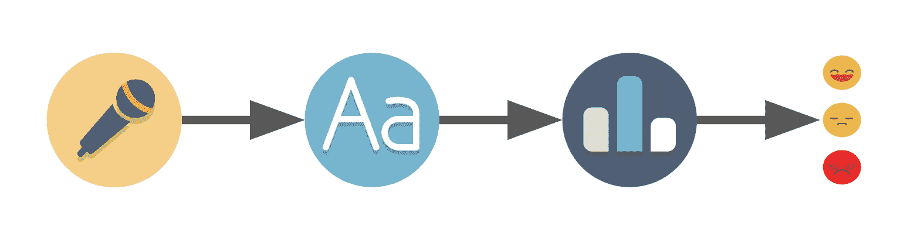
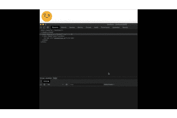

# 如何使用 Web Speech API 和 Node.js 构建语音到情感的转换器

> 原文：<https://www.freecodecamp.org/news/speech-to-sentiment-with-chrome-and-nodejs/>

你有没有想过——我们能不能让 Node.js 检查一下我们说的是正面的还是负面的？

我收到一份讨论音调检测的时事通讯。该程序可以检查我们写的东西，然后告诉我们它是否可能被视为好斗、自信或各种其他感觉。

这让我想知道如何使用浏览器和 Node.js 构建一个简化版本，通过说话来启动。

结果，我完成了一个小项目，检测人们所说的话是积极的、中性的还是消极的。

我是这样做的。

## 这个计划



Voice detection -> Voice to text -> Text scoring -> Result

当你开始一个项目时，你应该勾画出——至少是模糊地——你的目标以及如何实现它。在开始寻找之前，我记下了我需要的:

*   语音记录
*   将录音翻译成文本的方法
*   给文本打分的方法
*   向刚刚说话的用户显示结果的方法

在研究了一段时间后，我发现语音记录和翻译成文本部分已经由谷歌 Chrome 中的 [Web Speech API](https://developer.mozilla.org/en-US/docs/Web/API/Web_Speech_API) 完成了。这正是我们在[演讲识别](https://developer.mozilla.org/en-US/docs/Web/API/SpeechRecognition)界面中所需要的。

至于文本评分，我发现 [AFINN](http://www2.imm.dtu.dk/pubdb/views/publication_details.php?id=6010) 是已经评分的单词列表。它的范围有限，只有 2477 个单词，但对于我们的项目来说已经足够了。

由于我们已经在使用浏览器，我们可以根据结果用 HTML、JavaScript 和 CSS 显示不同的表情符号。这就是我们的最后一步。

既然我们知道了要用什么，我们可以总结一下:

*   浏览器监听用户并使用 Web 语音 API 返回一些文本
*   它向我们的 Node.js 服务器发出一个请求
*   服务器使用 AFINN 列表评估文本并返回分数
*   浏览器会根据分数显示不同的表情符号

**注意:**如果你熟悉项目设置，你可以跳过下面的“项目文件和设置”部分。

## 项目文件和设置

我们的项目文件夹和文件结构如下:

```
src/
  |-public // folder with the content that we will feed to the browser
    |-style // folder for our css and emojis
      |-css // optional folder, we have only one obvious file
        |-emojis.css
      |-images // folder for the emojis
    |-index.html
    |-recognition.js
  package.json
  server.js // our Node.js server
```

在前端方面，我们的*index.html*文件将包括 JS 和 CSS:

```
<html>
  <head>
    <title>
      Speech to emotion
    </title>
	<link rel="stylesheet" href="style/css/emojis.css">
  </head>
  <body>

    nothing for now

    <script src="recognition.js"></script>
  </body>
</html>
```

*recognition.js* 文件将被包装在 *DOMContentLoaded* 事件中，因此我们确保在执行我们的 js:

```
document.addEventListener('DOMContentLoaded', speechToEmotion, false);

function speechToEmotion() {
  // Web Speech API section code will be added here
}
```

我们暂时把我们的*表情符号*清空**。**

*在我们的文件夹中，我们将运行 **npm run init** ，这将创建 *package.json* 。*

*现在，我们将需要安装两个软件包来使我们的生活更轻松。所以只需 *npm 安装*两者:*

*   *[expressjs](https://expressjs.com/) -让 HTTP 服务器快速运行*
*   *[node mon](https://www.npmjs.com/package/nodemon)——所以每当我们在 *server.js 文件*中进行更改时，我们不会不断地键入 **node server.js** 。*

**package.json* 最终看起来会像这样:*

```
*`{
  "name": "speech-to-emotion",
  "version": "1.0.0",
  "description": "We speak and it feels us :o",
  "main": "index.js",
  "scripts": {
    "server": "node server.js",
    "server-debug": "nodemon --inspect server.js"
  },
  "author": "daspinola",
  "license": "MIT",
  "dependencies": {
    "express": "^4.17.1"
  },
  "devDependencies": {
    "nodemon": "^2.0.2"
  }
}`*
```

**server.js* 这样开始:*

```
*`const express = require('express')
const path = require('path')

const port = 3000
const app = express()

app.use(express.static(path.join(__dirname, 'public')))

app.get('/', function(req, res) {
  res.sendFile(path.join(__dirname, 'index.html'))
})

app.get('/emotion', function(req, res) {
  // Valence of emotion section code will be here for not it returns nothing
  res.send({})
})

app.listen(port, function () {
  console.log(`Listening on port ${port}!`)
})`*
```

*这样，我们就可以在命令行中运行 **npm run server-debug** 并在 *localhost:3000 上打开浏览器。*然后我们将看到 HTML 文件中的“暂时没有”消息。*

## *网络语音 API*

*这个 API 是 Chrome 自带的，包含 [SpeechRecognition](https://developer.mozilla.org/en-US/docs/Web/API/SpeechRecognition) 。这将允许我们打开麦克风，说话，并以文本形式返回结果。*

*它处理可以检测的事件，例如，第一次和最后一次采集音频的时间。*

*现在，我们需要 *onresult* 和*on 和* events，这样我们就可以分别检查麦克风捕捉到了什么以及它何时停止工作。*

*为了实现我们的第一个声音到文本的捕获，我们只需要在我们的 *recognition.js* 文件中添加十几行代码。*

```
*`const recognition = new webkitSpeechRecognition()
recognition.lang = 'en-US'

recognition.onresult = function(event) {
  const results = event.results;
  const transcript = results[0][0].transcript

  console.log('text ->', transcript)
}

recognition.onend = function() {
  console.log('disconnected')
}

recognition.start()`*
```

*This will connect the microphone for some seconds to listen for audio. If nothing is found it will disconnect*

*我们可以在谷歌文档中找到可用语言的列表。*

*如果我们希望它保持连接超过几秒钟(或者当我们不止一次说话时)，有一个属性叫做**连续**。它可以像**朗**属性一样被改变，只需要赋予它**真**。这将使麦克风无限期地监听音频。*

```
*`const recognition = new webkitSpeechRecognition()
recognition.lang = 'en-US'
recognition.continuous = true

recognition.onresult = function(event) {
  const results = event.results;
  const transcript = results[results.length-1][0].transcript

  console.log('text ->', transcript)
}

recognition.onend = function() {
  console.log('disconnected')
}

recognition.start()`*
```

*We add the continuous and change the transcript to get only the last result instead of all the results up until now*

*如果我们刷新页面，首先它会询问我们是否允许使用麦克风。回答“是”后，我们就可以说话了，并在 Chrome DevTools 控制台上查看我们说话的结果。*

*亵渎被审查，似乎没有办法消除审查。这意味着，即使 AFINN 未经审查，我们也不能依靠亵渎来得分。*

***注意:**在撰写本文时，该 API 只能在 Chrome 和 Android 中找到，预计在不久的将来会支持 Edge。可能有 polyfills 或其他工具可以提供更好的浏览器兼容性，但我没有测试它们。你可以在[我能用](https://caniuse.com/#feat=speech-recognition)里查看兼容性。*

## *提出请求*

*对于请求，简单的*获取*就足够了。我们将脚本作为查询参数发送，我们称之为**文本**。*

*我们的 *onresult* 函数现在应该是这样的:*

```
 *`recognition.onresult = function(event) {
    const results = event.results;
    const transcript = results[results.length-1][0].transcript

    // making a request to our /emotion endpoint that we defined on the project start and setup section
    fetch(`/emotion?text=${transcript}`)
      .then((response) => response.json())
      .then((result) => {
        console.log('result ->', result) // should be undefined
      })
      .catch((e) => {
        console.error('Request error -> ', e)
      })
  }`*
```

*If we were to use longer texts it would be better to switch /emotion to a POST instead of a GET. For this purpose, though, a GET should be more than enough*

## *情感的效价*

*化合价可以被视为一种衡量我们的情绪是积极还是消极，以及它们是否会产生低唤醒或高唤醒的方法。*

*对于这个项目，我们将使用两种情绪:对于任何高于零的分数，正面的**快乐**，对于低于零的分数，负面的**沮丧**。零分将被视为无关紧要。任何分数为 0 的都将被视为“**什么？！***

*AFINN 列表的得分从-5 到 5，文件包含的单词组织如下:*

```
*`hope 2
hopeful 2
hopefully 2
hopeless -2
hopelessness -2
hopes 2
hoping 2
horrendous -3
horrible -3
horrific -3`*
```

*word <space> score*

*举个例子，假设我们对着麦克风说“我希望这不可怕”。“希望”得 **2** 分，而“骇人听闻”得 **-3** 分，这将使我们的句子为负，得 **-1** 分。所有其他不在列表中的单词我们都会忽略不计。*

*我们可以解析该文件，并将其转换成如下所示的 JSON 文件:*

```
*`{
  <word>: <score>,
  <word1>: <score1>,
  ..
}`*
```

*然后我们可以检查课文中的每个单词，并把分数加起来。但是这是安德鲁·斯利文斯基已经用 T2 的情感做的事情。所以我们将使用它，而不是从头开始编码。*

*为了安装，我们使用**NPM install impression**并打开 *server.js* ，这样我们就可以用以下内容导入库:*

```
*`const Sentiment = require('sentiment');`*
```

*接着将路线“/情感”改为:*

```
*`app.get('/emotion', function(req, res) {
  const sentiment = new Sentiment()
  const text = req.query.text // this returns our request query "text"
  const score = sentiment.analyze(text);

  res.send(score)
})`*
```

**sensation . analyze(<our _ text _ variable>)*执行之前描述的步骤:它根据 AFINN 的列表检查我们文本中的每个单词，并在最后给我们一个分数。*

*变量 **score** 将有一个与此类似的对象:*

```
*`{
  score: 7,
  comparative: 2.3333333333333335,
  calculation: [ { awesome: 4 }, { good: 3 } ],
  tokens: [ 'good', 'awesome', 'film' ],
  words: [ 'awesome', 'good' ],
  positive: [ 'awesome', 'good' ],
  negative: []
}`*
```

*What we want is the score property which in this case would lead to a positive result*

*现在我们已经返回了分数，我们只需要让它显示在我们的浏览器中。*

***注:** AFINN 为英文。虽然我们可以在 Web Speech API 中选择其他语言，但我们必须在我们想要的语言中找到一个类似于 AFINN 的评分列表来进行匹配。*

## *让它微笑*

*最后一步，我们将更新我们的*index.html***来显示一个我们可以展示表情符号的区域。因此，我们将其更改为以下内容:***

```
***`<html>
  <head>
    <title>
      Speech to emotion
    </title>
    <link rel="stylesheet" href="style/css/emojis.css">
  </head>
  <body>
    <!-- We replace the "nothing for now" -->
    <div class="emoji">
      
    </div>
    <!-- And leave the rest alone -->
    <script src="recognition.js"></script>
  </body>
</html>`***
```

***这个项目中使用的表情符号可以免费用于商业用途，可以在这里找到。向艺术家致敬。***

***我们下载我们喜欢的图标，并将它们添加到图像文件夹中。我们将需要表情符号用于:***

*   *****错误** -当错误发生时***
*   *****空闲** -当麦克风不工作时***
*   *****监听** -连接麦克风并等待输入时***
*   *****阴性-** 为阳性分数***
*   *****中立-** 为得分为零时***
*   *****阳性-** 为阴性分数***
*   *****搜索-** 我们的服务器请求何时完成***

***在我们的表情符号中，我们只需添加:***

```
***`.emoji img {
  width: 100px;
  width: 100px;
}

.emoji .error {
  content:url("../images/error.png");
}

.emoji .idle {
  content:url("../images/idle.png");
}

.emoji .listening {
  content:url("../images/listening.png");
}

.emoji .negative {
  content:url("../images/negative.png");
}

.emoji .neutral {
  content:url("../images/neutral.png");
}

.emoji .positive {
  content:url("../images/positive.png");
}

.emoji .searching {
  content:url("../images/searching.png");
}`***
```

***The first selector is to give it a consistent size, the rest is our emojis images***

***当我们在这些改变后重新加载页面时，它将显示空闲表情符号。不过，它永远不会改变，因为我们没有根据场景替换< img >元素中的**空闲**类。***

***为了解决这个问题，我们最后一次访问我们的 *recognition.js* 文件。在这里，我们将添加一个功能来更改表情符号:***

```
***`/**
 * @param {string} type - could be any of the following:
 *   error|idle|listening|negative|positive|searching
 */
function setEmoji(type) {
  const emojiElem = document.querySelector('.emoji img')
  emojiElem.classList = type
}`***
```

***在我们的服务器请求的响应中，我们添加对正、负或中性分数的检查，并相应地调用我们的 *setEmoji* 函数:***

```
***`console.log(transcript) // So we know what it understood when we spoke

setEmoji('searching')

fetch(`/emotion?text=${transcript}`)
  .then((response) => response.json())
  .then((result) => {
    if (result.score > 0) {
      setEmoji('positive')
    } else if (result.score < 0) {
      setEmoji('negative')
    } else {
      setEmoji('listening')
    }
  })
  .catch((e) => {
    console.error('Request error -> ', e)
    recognition.abort()
  })`***
```

***We set the emoji to searching before making the request***

***最后，我们添加事件 *onerror* 和 *onaudiostart* ，并更改事件*on 和*，这样我们就可以用正确的表情符号设置它们。***

```
 ***`recognition.onerror = function(event) {
    console.error('Recognition error -> ', event.error)
    setEmoji('error')
  }

  recognition.onaudiostart = function() {
    setEmoji('listening')
  }

  recognition.onend = function() {
    setEmoji('idle')
  }`***
```

***我们最终的 *recognition.js* 文件应该是这样的:***

```
***`document.addEventListener('DOMContentLoaded', speechToEmotion, false);

function speechToEmotion() {
  const recognition = new webkitSpeechRecognition()
  recognition.lang = 'en-US'
  recognition.continuous = true

  recognition.onresult = function(event) {
    const results = event.results;
    const transcript = results[results.length-1][0].transcript

    console.log(transcript)

    setEmoji('searching')

    fetch(`/emotion?text=${transcript}`)
      .then((response) => response.json())
      .then((result) => {
        if (result.score > 0) {
          setEmoji('positive')
        } else if (result.score < 0) {
          setEmoji('negative')
        } else {
          setEmoji('listening')
        }
      })
      .catch((e) => {
        console.error('Request error -> ', e)
        recognition.abort()
      })
  }

  recognition.onerror = function(event) {
    console.error('Recognition error -> ', event.error)
    setEmoji('error')
  }

  recognition.onaudiostart = function() {
    setEmoji('listening')
  }

  recognition.onend = function() {
    setEmoji('idle')
  }

  recognition.start();

  /**
   * @param {string} type - could be any of the following:
   *   error|idle|listening|negative|positive|searching
   */
  function setEmoji(type) {
    const emojiElem = document.querySelector('.emoji img')
    emojiElem.classList = type
  }
}`***
```

***通过测试我们的项目，我们现在可以看到最终的结果:***

******

*****注意:**代替 *console.log* 来检查识别理解了什么，我们可以在我们的 html 上添加一个元素并替换 *console.log.* 这样我们总是可以访问它理解的内容。***

## ***结束语***

***这个项目有一些地方可以大大改进:***

*   ***它察觉不到讽刺***
*   ***没有办法检查你是否因为语音转文本 API 的审查而愤怒***
*   ***可能有一种方法可以只用语音而不用转换成文本。***

***从我在研究这个项目时看到的情况来看，有一些实现可以检查你的语气和情绪是否会导致呼叫中心的销售。我收到的简讯来自 Grammarly，它用它来检查你写的东西的语气。如你所见，有一些有趣的应用。***

***希望这些内容在某种程度上有所帮助。如果有人使用这个堆栈构建任何东西，请告诉我——看到人们构建的东西总是很有趣。***

 ***[https://www.youtube.com/embed/pd-X2RnVYxc?feature=oembed](https://www.youtube.com/embed/pd-X2RnVYxc?feature=oembed)*** 

***代码可以在我的 github **[这里](https://github.com/daspinola/speech-to-emotion)** 找到。***

***下一集再见，同时，去写代码吧！***