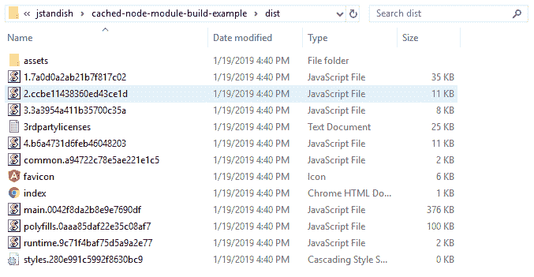

# 如何利用 docker 多阶段构建加快节点重建

> 原文：<https://www.freecodecamp.org/news/speed-up-node-re-builds-leveraging-docker-multi-stage-builds-and-save-money-65189a4ab115/>

约翰·斯坦迪什

# 如何利用 docker 多阶段构建加快节点重建

Photo by [Thanos Pal](https://unsplash.com/@thanospal?utm_source=medium&utm_medium=referral) on [Unsplash](https://unsplash.com?utm_source=medium&utm_medium=referral)

重新安装依赖项会浪费时间和金钱。根据项目的大小，这可能需要几分钟时间。以我个人的经验，我见过`npm install`花费 5 分钟以上。现在，如果您的管道有单独的阶段(Gate、CI、不同的环境分支),等待时间会变得更长。除了下面的图片，所有的笑话，等待是昂贵的！

[https://www.reddit.com/r/ProgrammerHumor/comments/6s0wov/heaviest_objects_in_the_universe/](https://www.reddit.com/r/ProgrammerHumor/comments/6s0wov/heaviest_objects_in_the_universe/)

### 浪费是昂贵的，非常昂贵

#### TL；速度三角形定位法(dead reckoning)

当我们的代码通过管道时，等待依赖项的安装浪费了大量的金钱(～**$ 9，918/年每个开发人员**)和时间(每年 18，792 分钟或每年 13.05 天)。这些数字是平均每天 4 次入住。在低端，等待大门的是**～每个开发者 3132 美元/年**。*见下面的计算，我从哪里得到这些数字。*

让我们快速算一下，看看为什么 5 分钟是个大问题。假设您有一个入口，并为您的两个环境(试运行和生产)构建了一个 CI。每个阶段都要求您开始一个干净的构建。

所以让我们合计一下我们等待`npm install`完成的时间:

建造时间:1 分钟
大门:5 分钟
舞台 CI: 5 分钟
生产 CI: 5 分钟
**NPM 等待时间:15 分钟**
**总建造时间:18 分钟**

好吧，18 分钟看起来没那么糟。那是喝咖啡的休息时间，我们都喜欢喝咖啡。但那 18 分钟是空闲时间，是等待东西出门的时间。

现在让我们扩展一下这个数学，乘以一个小团队(4 个开发人员)，为了好玩，我们将计算出平均签到量和每小时费率。时间就是金钱，对吗？平均签到数量是我在日常工作中看到的，你的数字可能会有所不同。

建造时间:3 分钟
NPM 等待时间:15 分钟
开发者:4
平均。入住:4
小时费用:30 美元(您的小时费用可能会更高)

**登机口等待时间:96 分钟** **(登机口等待时间 X 开发者 X 平均签到数)**
**登机口费用:$48(登机口等待时间小时数 X 小时费率)**
**总时间:288 分钟(构建和 NPM 时间 X 开发者 X 平均签到数)**
**费用:$ 144/天(总时间小时数 X 小时费率)**

因此，我们的空闲时间是每天 144 美元，或者每周 720 美元，或者每年 37584 美元。那就是等待我们的软件出货！在低端，如果我们签入我们的代码并等待大门，那就是 **$12，528/年**。呀！年度成本基于一年 261 个美国工作日([https://HR . uiowa . edu/payroll/2015-财年-工资单-日历](https://hr.uiowa.edu/payroll/2015-fiscal-year-payroll-calendar))

### 让我们缓存并构建这个东西！

#### TL；速度三角形定位法(dead reckoning)

这是我的跑步指导。[https://github . com/jstandish/cached-node-module-build-example/blob/master/DOCKER _ build . MD](https://github.com/jstandish/cached-node-module-build-example/blob/master/DOCKER_BUILD.md)

好吧，我们已经知道等待是昂贵的。因此，我们应该努力减少花在`npm install`步骤上的时间。我们应该只在`package.json`文件改变时重新运行`npm install`。通过有选择地运行它，我们可以显著地减少新的 Gate/CI/CD 构建的时间，从几分钟减少到不到一分钟(取决于您项目的大小)。

#### 阶段 1 —创建缓存阶段

我们的第一步将是创建一个多阶段的`dockerfile`。这将允许我们复制到`package.json`文件中，并且仅在该文件发生更改时运行某个阶段。

#### 阶段 2 —创建一个构建阶段

下一步将是创建下一个阶段，它将通过管道向`npm`发送命令。这是通过使用您的`dockerfile`中的`ENTRYPOINT`语句来完成的。这将在任何参数中执行给定的命令管道。我们使用已经安装了`Chromium`的 docker 镜像；这将允许我们在单元测试中运行 Chrome Headless。

以下是完整的 dockerfile 文件:

#### 阶段 3 —构建映像

现在我们已经设置好了`dockerfile` ，让我们开始构建它。每次文件改变时你都需要这样做，但是复制新文件所需的时间是微不足道的，因为 docker 会跳过没有改变的后续层。呜哇！

这大约花了**2**分钟。但这可能需要更长时间，取决于您的互联网连接、磁盘速度、CPU 等。

在我们的初始`docker build`之后的任何构建将花费更少的时间，因为我们将只在 package.json 文件已经改变的情况下重新运行`npm install`！

#### 阶段 4 —构建代码！

所以现在让我们在节点构建测试映像中构建我们的代码。我们将指定一个挂载点，以便可以将我们的构建输出复制到其中。这将允许我们从 dockerized 环境中提取编译后的代码！我用一个分叉的 angular 项目作为例子，但是你现在可以用它来做任何项目。

构建时间大约需要 45 秒。但那是编译我们的代码，而不是等待`npm install`。是啊！

现在我们有了编译好的文件！

#### 那么，所有后续的构建只需要 45 秒？

是啊！因为完全跳过了`npm install`步骤，因为`package.json`文件没有改变，所以您将获得好处。如果你改变了`package.json`，你将招致和你一样的时间惩罚。

### 那么我们节省了多少时间/金钱呢？

让我们回到之前的计算，现在减去我们的`npm install`等待时间。我们将把构建时间放在那里，因为你无法摆脱它。

构建时间:3 分钟
开发人员:4
平均。签到:4
时薪:30 美元(你的时薪可能会更高)

**入口时间:16 分钟** **(入口等待时间 X 开发人员 X 平均签到数)**
**入口成本:8 美元(入口等待时间小时数 X 小时费率)**
**总时间:48 分钟(构建时间 X 开发人员 X 平均签到数 X 环境)**
**成本:24 美元/天(总时间小时数 X 小时费率)**

让我们看看一天、一周和一年的情况。

**日:$24**
**周:$120**
**年:$ 6264**

#### 我们为我们的 4 名开发人员团队节省了多少？

下面是(**以前金额—新金额**)的格式。是的，这是一年来的大量储蓄！

**日:($144 - $24) = $120**
**周:($720 - $120) =$600**
**年:($ 37584**-**【6264】= $ 31320**

### 结论

我希望您喜欢看到利用 docker 多阶段构建如何为您节省大量时间和金钱。Docker 多阶段构建非常强大，可以让您更快地发货和构建。

如果你想玩这个，请克隆我的 GitHub 库，玩得开心点！

[https://github . com/jstandish/cached-node-module-build-example](https://github.com/jstandish/cached-node-module-build-example)

感谢阅读！

[https://www.instagram.com/john.does.code](https://www.instagram.com/john.does.code)