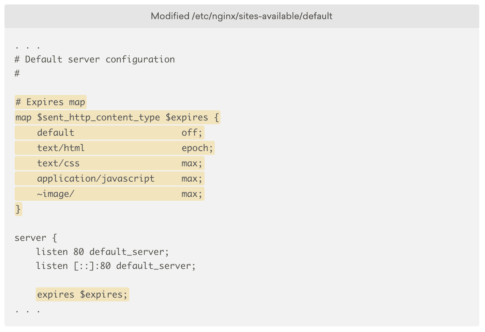
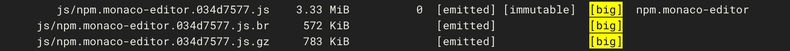

# 如何加速你的网站——5 个终极技巧

> 原文：<https://www.freecodecamp.org/news/speed-up-website/>

网站速度很重要。它直接影响你的用户体验，良好的用户体验对帮助推动销售和让客户和访问者满意是极其重要的。它不仅提高了你的网站的 UX，而且一个正确配置的网站消耗的资源更少，也减轻了主服务器的工作负担。

在这篇文章中，我将讨论我在 [codedamn](https://codedamn.com) 上获得 gt metrix A 级时所学到的东西——这是一个开发人员以新的方式学习编程的平台。开始吧！

## #1:压缩图像

原始图像是高度可压缩的，你会惊讶地发现仅仅通过压缩所有图像就可以节省多少带宽和数据。

对于生产站点，我推荐像 TinyPNG CLI 这样的工具，它可以将您的映像压缩到服务器上的一个目录中。下面是我上传到 TinyPNG 网站的一张高分辨率照片中 tiny png 如何节省超过 2MB 空间的一瞥:

最棒的是 TinyPNG 每月允许 500 张免费图片，所以对于一个中小型网站来说，你几乎可以一直保持在免费限额内！

## #2:代码拆分和捆绑拆分

代码分割意味着您将代码分割成不同的块，并在需要时缓慢地加载它们。在你的网站上你总是需要这个

束分割是指将代码分割生成的单个文件进一步分割成更小的束。这改进了浏览器上的缓存以及浏览器的字节码缓存。

虽然随着 HTTP 请求的增加，束分裂可能会受到反对，但是 HTTP/2 对多个请求几乎没有影响，直到达到并发限制。幸运的是，并发限制在数百个请求的范围内。

因此，如果您没有发出数百个 HTTP 请求(您很可能没有)，那么您应该很擅长束分裂。

对于代码和捆绑包分割，您需要将您的项目与模块捆绑器(如 package 或 webpack)集成。

一旦你正确地配置它们，它们就像魔法一样工作。它们真的可以降低服务器和客户端浏览器的负载。

他们通过缓存资源而不是下载你当前不需要的资源来做到这一点——比如，当我在`/feedback`路线上时，你为什么要发送`/about`路线的 JS 代码。

你也应该缩小你的 JS/CSS 版本。对于 webpack，有像 UglifyJS 这样的插件可用。这有助于通过修剪空白、注释、缩短代码等来减少内容的大小，最终会减少内容的大小。

## #3:不要使用共享主机服务

如果您是一名开发人员或者对如何使用 bash 有一点基本了解的人，那么根本没有理由使用共享托管服务。

几乎在所有情况下，要么你可以在 GitHub pages 这样的网站上免费托管你的静态资产，要么你可以选择更可控的方式，比如云托管。几乎所有像 AWS、Google Cloud 和 DigitalOcean 这样的云托管玩家都提供了如此多的免费积分，以至于你可以长期免费消费他们的大量服务！

在某些情况下，共享主机比 5 美元的数字海洋主机更便宜。但是这些服务器分配给网站的资源非常有限，这降低了网站的整体性能。被禁锢的外壳、共享的 vCPUs 和有限的 RAM 是一些开始的东西。

因为作为开发人员，我们总是希望处于控制之中，使用 IaaS 或 PaaS 总是一种解决方案。

虽然你可以选择任何一家云提供商，但我会推荐 digital ocean——我目前用它来做 [codedamn](https://codedamn.com) 。设置起来非常简单，你可以通过这个链接获得[价值 100 美元的免费云积分。](https://codedamn.com/go/digitalocean)

选择云提供商真的可以给你资源和基础设施，这将自动提升你的服务器性能(和你的网站性能)一点点。

## #4:设置 HTTP 到期头

正如我们上面所讨论的，缓存对于正确设置极其重要。HTTP 到期头通知浏览器缓存什么以及缓存多长时间。缓存的资源不是从远程服务器获取的，所以不要缓存像`index.html`这样的主入口点资源是很重要的，这是您提供的第一个文件。您还必须适当地实现缓存破坏。

同样，对于像 webpack 这样的模块捆绑器，您可以通过在它抛出的包的名称中使用`[contenthash]`来实现缓存破坏。此外，这要求浏览器永远不要缓存你的`index.html`或任何其他 HTML 文件作为你站点的入口点。我们如何实现这一目标？

对于静态文件服务和 HTTP 到期头，使用 NGiNX。NGiNX 可以为您管理所有这些东西。以下是设置 HTTP 到期头的推荐配置示例:

这个配置只是为`text/html`资源设置了缓存。对于其他浏览器，它将其设置为浏览器可以保存缓存的最大可能时间。

请注意，这种配置非常依赖于这样一个事实，即您已经在模块捆绑器中实现了缓存破坏机制(就像我们上面谈到的`[contenthash]`)。

## #5:启用 Brotli 压缩

Brotli 压缩是谷歌设计的一种压缩算法，比众所周知的 GZIP 压缩效率高 20-25%。

Brotli 压缩可以在站点上实现，同样使用 NGiNX。让我们来看一个启用 Brotli 压缩时会发生什么的示例:

第一个文件大小为 3.33 MB，没有压缩。

当使用 Brotli -压缩时，大小下降到 572KB。

当它被压缩使用 GZIP -大小只下降到 783KB。

与 GZIP 相比，Brotli 节省了超过 200KB，与不压缩相比，节省了超过 2.5MB。它甚至没有发挥出它的巅峰状态！超过 82%的压缩率！非常酷。

## 就是这样！

基本就是这样！我们没有深入讨论如何实现这些特定技术的细节，而是讨论了一些在加速站点时需要考虑的最重要的事情。

我没有进入具体的细节，因为您的里程可能会随着您的服务器设置和配置而变化-但总体概念保持不变。

确保你遵循了这些最佳实践，并通过在我的 [twitter 账号](https://twitter.com/mehulmpt)上打招呼让我知道你的想法。

如果你喜欢这篇文章，让我们在社交媒体上见面。这是我的 [Instagram](https://instagram.com/mehulmpt) 和 [Twitter](https://twitter.com/mehulmpt) 。我非常活跃，很想和你聊聊天！我们来连线。