# Spotify 的“这是”播放列表:50 位主流艺术家的终极歌曲分析

> 原文：<https://www.freecodecamp.org/news/spotifys-this-is-playlists-the-ultimate-song-analysis-for-50-mainstream-artists-491882081819/>

詹姆斯·勒

# Spotify 的“这就是”播放列表:50 位主流艺术家的终极歌曲分析


Source: [https://www.talenthouse.com/i/create-a-video-for-spotify/submissions/popular](https://www.talenthouse.com/i/create-a-video-for-spotify/submissions/popular)

每个艺术家都有自己独特的音乐风格。从献身于木吉他的艾德·希兰，到精通说唱艺术的德雷克。从能在流行歌曲中唱一些疯狂高音的阿黛尔，到在 DJ 台上创造 EDM 魔术的 Kygo。音乐是关于创造力、独创性、灵感和感情的，它是跨越差异连接人们的完美门户。

Spotify 是目前最大的音乐流媒体服务。拥有超过 3500 万首歌曲和 1.7 亿月活跃用户，是音乐人接触观众的理想平台。在该应用程序上，可以通过各种参数浏览或搜索音乐，如艺术家、专辑、流派、播放列表或唱片公司。用户可以创建、编辑和共享播放列表，在社交媒体上共享曲目，并与其他用户一起制作播放列表。

此外，Spotify 推出了各种为用户量身定制的有趣播放列表，其中我最欣赏以下三个:

*   **每周发现**:每周生成的播放列表(每周一更新)，为用户带来两个小时的定制音乐推荐，将用户的个人品味与类似听众喜欢的歌曲混合在一起。
*   **Release Radar** :一个个性化的播放列表，允许用户了解他们最常听的艺术家发布的最新音乐。
*   **每日混音**:一系列播放列表，具有“近乎无止境的回放”功能，将用户喜爱的曲目与新的推荐歌曲混合在一起。

我最近发现了 ['This Is"](https://open.spotify.com/search/playlists/this%20is%20) 播放列表系列。Spotify 最好的原创功能之一，“这是”兑现了流媒体革命的一个主要承诺——将伟大艺术家的作品典藏起来，供后代发现和欣赏。

每张专辑都献给一位不同的传奇艺术家，记录了经典专辑的巅峰时刻。“这是:坎耶·韦斯特”。“这是:魔力红”。“这是:埃尔顿·约翰”。Spotify 提供了一条捷径，为我们提供了最伟大艺术家的最佳歌曲精选列表。

### 我们将在这里讨论的内容

这个项目的目的是分析 Spotify 上不同艺术家制作的音乐。重点将放在从广泛的流派中理清 50 位不同艺术家的音乐品味。在整个过程中，我还识别出不同的艺术家群体，他们有着相似的音乐风格。

在研究中，我将访问 [Spotify Web API](https://beta.developer.spotify.com/web-api/) ，它提供来自 Spotify 音乐目录的数据。这可以通过对 API 端点的标准 HTTPS 请求来访问。

Spotify API 提供了每首歌曲的曲目信息，包括音频统计数据，如**可跳舞性**、**乐器性**或**速度**。每个特征测量一首歌曲的一个方面。关于每个功能如何计算的详细信息可以在 Spotify API 网站上找到。本文中的代码片段可能有点难以理解，尤其是对于数据初学者来说，所以请耐心等待。

下面是我的方法的简要总结:

*   从 Spotify API 获取数据。
*   处理数据以提取每个艺术家的音频特征。
*   使用 D3.js 可视化数据。
*   应用 k-means 聚类将艺术家分成不同的组。
*   分析所有艺术家的每个特征。

现在让我们从 Spotify 上 50 位不同艺术家的“这是”播放列表中检索音频特征信息。


Source: [https://blog.prototypr.io/have-you-heard-about-the-spotify-web-api-8e8d1dac9eaf](https://blog.prototypr.io/have-you-heard-about-the-spotify-web-api-8e8d1dac9eaf)

### **获取数据**

第一步是在 [API 网站](https://beta.developer.spotify.com/web-api/)中注册我的应用程序，并为将来的请求获取密钥(客户端 ID 和客户端秘密)。

Spotify Web API 使用不同的 URIs(统一资源标识符)来访问播放列表、艺术家或曲目信息。因此，获取数据的过程必须分为两个关键步骤:

*   获取多个音乐家的“这是”播放列表系列。
*   获取每位艺术家的播放列表曲目的音频功能。

#### **Web API 凭证**

首先，我为`Client ID`和`Client Secret`凭证创建了两个变量。

```
spotifyKey <- "YOUR CLIEND ID"spotifySecret <- "YOUR CLIENT SECRET"
```

之后，我请求一个访问令牌，以便授权我的应用程序检索和管理 Spotify 数据。

```
library(Rspotify)library(httr)library(jsonlite)spotifyEndpoint <- oauth_endpoint(NULL, "https://accounts.spotify.com/authorize","https://accounts.spotify.com/api/token")
```

```
spotifyToken <- spotifyOAuth("Spotify Analysis", spotifyKey, spotifySecret)
```

#### **“这是”播放列表系列**

第一步是拉艺术家们的[“这是”系列](https://open.spotify.com/search/playlists/this%20is%20)是为每一个获得 URIs。以下是我选择的 50 位音乐家，以他们的受欢迎程度、现代感和多样性作为主要标准:

*   **Pop** :泰勒·斯威夫特、爱莉安娜·格兰德、肖恩·蒙德兹、魔力红、阿黛尔、贾斯汀比伯、艾德·希兰、贾斯汀·汀布莱克、查理·普斯、约翰·梅耶、洛德、第五和声、拉娜·德尔·雷、詹姆斯·亚瑟、扎拉·拉尔森、Pentatonix。
*   嘻哈/说唱:肯德里克·拉马尔、波斯特·马龙、德雷克、坎耶·韦斯特、阿姆、未来、50 美分、李尔·韦恩、维兹·卡利法、史努比·道格、麦克摩尔、Jay-Z
*   布鲁诺·马斯，碧昂斯，安立奎·伊格莱希亚斯，斯蒂维·旺德，约翰·传奇，艾丽西亚·凯斯，亚瑟，蕾哈娜。
*   **EDM / House** : Kygo，The Chainsmokers，Avicii，Marshmello，加尔文·哈里斯，马丁·盖瑞斯。
*   摇滚:酷玩乐队，埃尔顿·约翰，一个共和国，剧本，杰森·玛耶兹。
*   爵士乐:弗兰克·辛纳屈，迈克尔·布伯，诺拉·琼斯。


Source: [http://www.thedrum.com/news/2017/11/29/spotify-wraps-up-2017-making-humorous-goals-2018-using-its-data-and-artists](http://www.thedrum.com/news/2017/11/29/spotify-wraps-up-2017-making-humorous-goals-2018-using-its-data-and-artists)

我基本上是转到每个音乐家的个人播放列表，复制 URIs，将每个 URI 存储在一个. csv 文件中，并导入。csv 文件转换成 r。

```
library(readr)
```

```
playlistURI <- read.csv("this-is-playlist-URI.csv", header = T, sep = ";")
```

对于每个播放列表 URI，我应用了“RSpotify”包中的`getPlaylistSongs`,并将播放列表信息存储在一个空的 data.frame 中

```
# Empty dataframePlaylistSongs <- data.frame(PlaylistID = character(),                            Musician = character(),                            tracks = character(),                            id = character(),                            popularity = integer(),                            artist = character(),                            artistId = character(),                            album = character(),                            albumId = character(),                            stringsAsFactors=FALSE)
```

```
# Getting each playlistfor (i in 1:nrow(playlistURI)) {  i <- cbind(PlaylistID = as.factor(playlistURI[i,2]),             Musician = as.factor(playlistURI[i,1]),             getPlaylistSongs("spotify",                              playlistid = as.factor(playlistURI[i,2]),                              token=spotifyToken))  PlaylistSongs <- rbind(PlaylistSongs, i)} 
```

#### **音频特性**

首先，我编写了一个公式(`getFeatures`)，它提取任何特定 ID 的音频特征并存储为一个向量。

```
getFeatures <- function (vector_id, token) {  link <- httr::GET(paste0("https://api.spotify.com/v1/audio-features/?ids=",   vector_id), httr::config(token = token))  list <- httr::content(link)  return(list)}
```

接下来，我在另一个公式(`get_features`)中包含了`getFeatures`。后一个公式提取音轨 ID 向量的音频特征，并在 data.frame 中返回它们

```
get_features <- function (x) {  getFeatures2 <- getFeatures(vector_id = x, token = spotifyToken)  features_output <- do.call(rbind, lapply(getFeatures2$audio_features, data.frame, stringsAsFactors=FALSE))}
```

使用上面创建的公式，我能够提取每个音轨的音频特征。为此，我需要一个包含每个曲目 ID 的向量。Spotify API 的速率限制是 100 首曲目，所以我决定为每位音乐家创建一个带有曲目 id 的向量。

接下来，我将`get_features`公式应用于每个向量，获得每个音乐家的音频特征。

之后我把每个音乐家的音频特征 data.frame 合并成一个新的，`all_features`。它包含每个音乐家的“这是”播放列表中所有曲目的音频功能。

```
library(gdata)
```

```
all_features <- combine(TaylorSwift,ArianaGrande,KendrickLamar,ShawnMendes,Maroon5,PostMalone,Kygo,TheChainsmokers,Adele,Drake,JustinBieber,Coldplay,KanyeWest,BrunoMars,EdSheeran,Eminem,Beyonce,Avicii,Marshmello,CalvinHarris,JustinTimberlake,FrankSinatra,CharliePuth,MichaelBuble,MartinGarrix,EnriqueIglesias,JohnMayer,Future,EltonJohn,FiftyCent,Lorde,LilWayne,WizKhalifa,FifthHarmony,LanaDelRay,NorahJones,JamesArthur,OneRepublic,TheScript,StevieWonder,JasonMraz,JohnLegend,Pentatonix,AliciaKeys,Usher,SnoopDogg,Macklemore,ZaraLarsson,JayZ,Rihanna)
```

最后，我使用`aggregate`函数计算了每个音乐家的音频特征的平均值。所得的数据帧包含每个音乐家的音频特征，表示为他们各自播放列表中音轨的平均值。

```
mean_features <- aggregate(all_features[, c(1:11,17)], list(all_features$source), mean)
```

```
names(mean_features) <- c("Musician", "danceability", "energy", "key", "loudness", "mode", "speechiness", "acousticness", "instrumentalness", "liveness", "valence", "tempo", "duration_ms")
```

下图是`mean_features` data.frame 的一个子集，供大家参考。

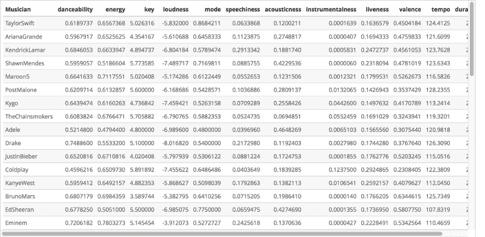

#### **音频特性描述**

从 [Spotify Web API 指南](https://beta.developer.spotify.com/web-api/get-audio-features/)中可以找到每个功能的描述:

*   **可跳舞性**:描述一个曲目是否适合跳舞。这是基于音乐元素的组合，包括速度、节奏稳定性、节拍强度和整体规律性。值 0.0 最不适合跳舞，1.0 最适合跳舞。
*   **能量**:从 0.0 到 1.0 的度量，代表强度和活动的感知度量。通常，高能轨道感觉起来很快，很响，很嘈杂。例如，死亡金属具有高能量，而巴赫前奏曲在音阶上得分较低。对该属性有贡献的感知特征包括动态范围、感知响度、音色、开始速率和一般熵。
*   **调**:音轨所在的调。整数使用标准音高分类符号映射到音高。例如，0 = C，1 = C♯/D♭，2 = D，等等。
*   **响度**:音轨的整体响度，单位为分贝(dB)。响度值是整个轨道的平均值，可用于比较轨道的相对响度。响度是声音的质量，是与体力(振幅)相关的主要心理因素。值的典型范围在-60 和 0 db 之间。
*   **调式**:表示音轨的调式(大调或小调)，音阶的类型，其旋律内容来源于此。大调用 1 表示，小调用 0 表示。
*   **Speechiness** : Speechiness 检测音轨中是否存在口语单词。越是类似语音的录音(例如脱口秀、有声读物、诗歌)，属性值就越接近 1.0。高于 0.66 的值描述可能完全由口语单词组成的轨道。介于 0.33 和 0.66 之间的值描述可能包含音乐和语音的轨道，可以是分段的，也可以是分层的，包括说唱音乐。低于 0.33 的值最有可能代表器乐和其他非语音类曲目。
*   **Acousticness** :从 0.0 到 1.0 的音轨是否声学的置信度度量。1.0 表示音轨是声学的高置信度。
*   **乐器性**:预测音轨是否不包含人声。“Ooh”和“aah”在这种情况下被视为乐器。Rap 或口语词轨道明显是“有声的”。乐器度值越接近 1.0，轨道不包含人声内容的可能性就越大。高于 0.5 的值旨在表示乐器轨道，但随着该值接近 1.0，置信度会更高。
*   **活跃度**:检测录像中是否有观众。较高的活跃度值表示音轨被现场执行的概率增加。高于 0.8 的值表示该轨迹很有可能是实时的。
*   **效价**:从 0.0 到 1.0 的一个量度，描述一首曲目所传达的音乐积极性。高价的音轨听起来更积极(例如快乐、愉快、欣快)，而低价的音轨听起来更消极(例如悲伤、沮丧、生气)。
*   **速度**:轨道的整体估计速度，单位为每分钟节拍数(BPM)。在音乐术语中，速度是给定作品的速度或节奏，直接来源于平均节拍持续时间。
*   **Duration_ms** :以毫秒为单位的音轨持续时间。

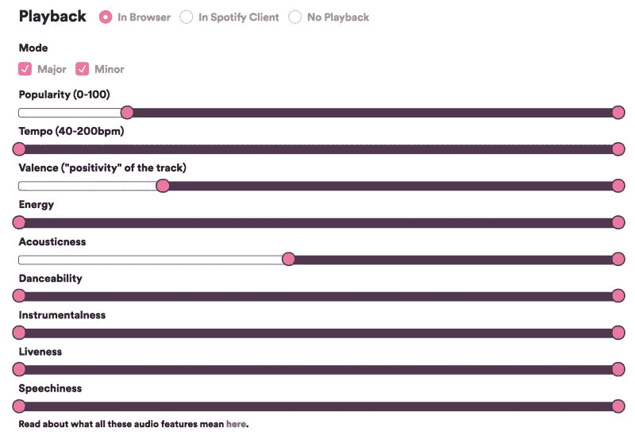

Source: [https://www.engadget.com/2018/02/05/spotify-recommendation-tech-nelson-custom-playlists/](https://www.engadget.com/2018/02/05/spotify-recommendation-tech-nelson-custom-playlists/)

### **数据可视化**

#### **雷达图**

雷达图有助于以更直观的方式比较这些音乐家的音乐氛围。第一个可视化是来自 [chart.js](http://www.chartjs.org/) JavaScript 库的 radar chart 的 R 实现，并评估了 10 名选定音乐家的音频特性。

为了绘图，我将调、响度、速度和持续时间毫秒值标准化为从 0 到 1。这有助于使图表更加清晰易读。

```
mean_features_norm <- cbind(mean_features[1], apply(mean_features[-1],2, function(x){(x-min(x))/diff(range(x))}))
```

好的，让我们以十个音乐家为一批来绘制这些交互式雷达图。当您将鼠标悬停在每条径向线上时，每个图表都会显示数据集标签，显示所选特性的值。下面的代码详细介绍了第一批十位音乐人的雷达图制作过程。其他四个批次的代码已被省略，但雷达图显示。

第一批:泰勒·斯威夫特、爱莉安娜·格兰德、肯德里克·拉马尔、肖恩·蒙德兹、魔力红、波斯特·马龙、基戈、链烟者、阿黛尔、德雷克


第二批:贾斯汀比伯、酷玩乐队、坎耶·韦斯特、布鲁诺·马斯、艾德·希兰、阿姆、碧昂斯、阿维西、马什梅洛、加尔文·哈里斯

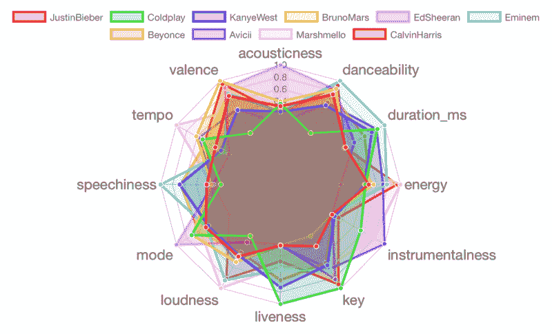

第三批:贾斯汀·汀布莱克、弗兰克·辛纳屈、查理·普斯、迈克尔·布伯、马丁·盖瑞斯、安立奎·伊格莱希亚斯、约翰·梅耶、未来、埃尔顿·约翰、50 美分

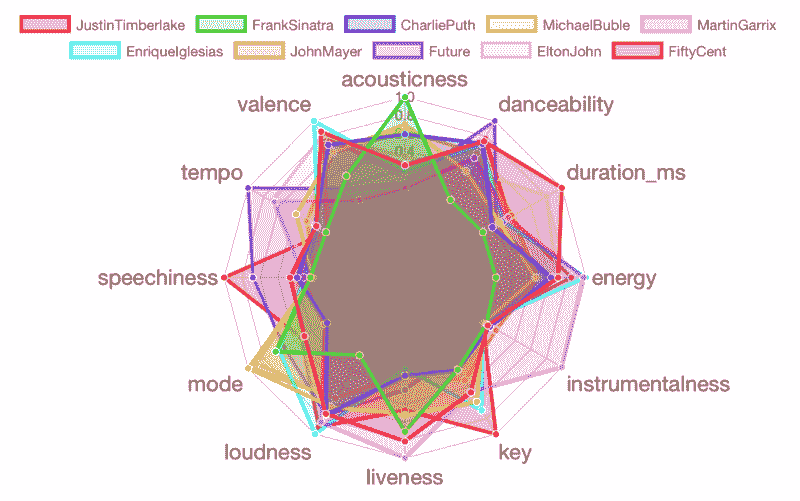

第四批:洛德，李尔·韦恩，维兹·卡利法，第五和声，拉娜·德尔·雷，诺拉·琼斯，詹姆士·亚瑟，一个共和国，剧本，斯蒂维·旺德

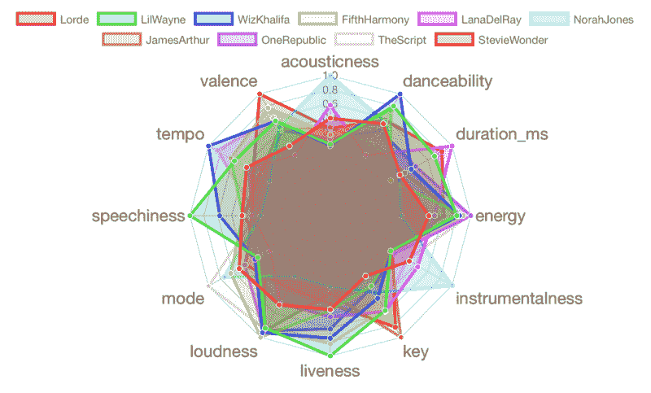

**第五批:杰森·玛耶兹、约翰·传奇、宾得尼克斯、艾丽西亚·凯斯、亚瑟、史努比·道格、麦克摩尔、莎拉·拉尔森、Jay-Z、蕾哈娜**

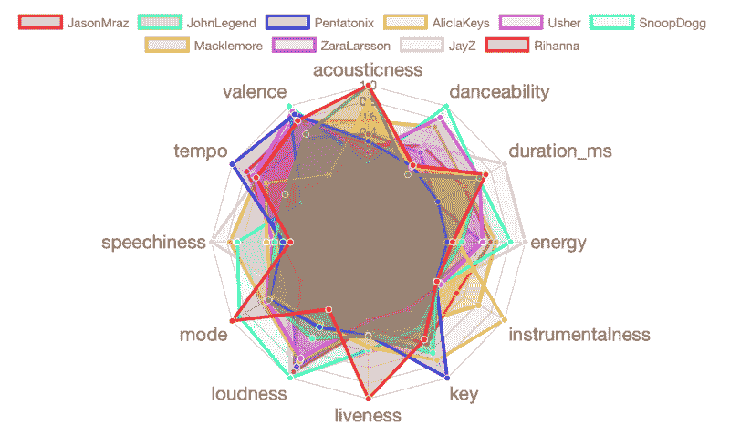

#### **聚类分析**

另一种找出这些音乐家音乐曲目差异的方法是将他们分组。聚类算法的一般思想是根据数据的相似性将给定的数据集分成多个组。

在这种情况下，音乐家将根据他们的音乐偏好被分组到不同的集群中。与在查看数据之前定义群体不同，聚类让我能够找到并分析已经有机形成的音乐家群体。

在对数据进行聚类之前，重新调整数据集的数值变量非常重要。由于我有混合的数字数据，其中每个音频特征都与另一个不同，并且具有不同的测量值，因此运行 scale 函数(也称为 z 标准化)是一个给予它们同等权重的好做法。之后，我将音乐家作为行名，以便能够在情节中作为标签显示它们。

```
scaled.features <- scale(mean_features[-1])rownames(scaled.features) <- mean_features$Musician
```

我应用了 **K-Means 聚类**方法，这是无监督统计学习方法中最流行的技术之一。它用于未标记的数据。该算法在数据中寻找组，组的数量由变量 **K** 表示。该算法反复工作，根据所提供的变量将每个数据点分配给 K 个组中的一个。数据点基于相似性进行聚类。

在这种情况下，我选择了*K = 6*——聚类可以基于我在选择艺术家时使用的六种不同流派(流行、嘻哈、R & B、EDM、摇滚和爵士)来形成。

在我对每个音乐家应用 K-Means 算法后，我可以绘制出数据的二维视图。在第一个图中，x 轴和 y 轴分别对应于第一和第二主成分。特征向量(用红色箭头表示)表示每个变量对主成分的方向影响。

让我们来看看对我的数据集应用 K-Means 算法所得到的聚类。

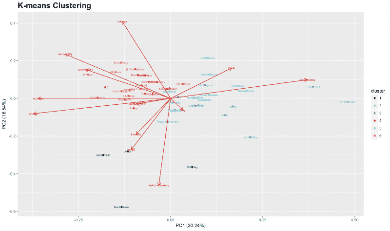

在上图中可以看到，x 轴是 **PC1 (30.24%)** ，y 轴是 **PC2 (16.54%)** 。这是前两个主要部分。PCA 图显示，PC1 根据响度/能量对声音/醇厚度来区分艺术家，而 PC2 似乎根据化合价对音调、速度和乐器性来区分艺术家。

因为我的数据是多元的，所以检查所有的二元散点图是很繁琐的。相反，单个“汇总”散点图更方便。从数据中得出的前两个主要成分的散点图已显示在图表中。同样，百分比是由总体可变性的每个分量解释的方差:第一分量捕获了关于多元数据的 30.24%的信息，第二分量捕获了关于多元数据的 16.54%的信息。

如果你有兴趣了解这个算法背后的数学知识，我建议你温习一下[主成分分析](https://stats.stackexchange.com/questions/2691/making-sense-of-principal-component-analysis-eigenvectors-eigenvalues)。

让我们看看哪些艺术家属于哪些集群:

```
k_means$cluster
```


我还绘制了另一张雷达图，包含每个星团的特征。比较每个聚类创建的歌曲的属性是有用的。

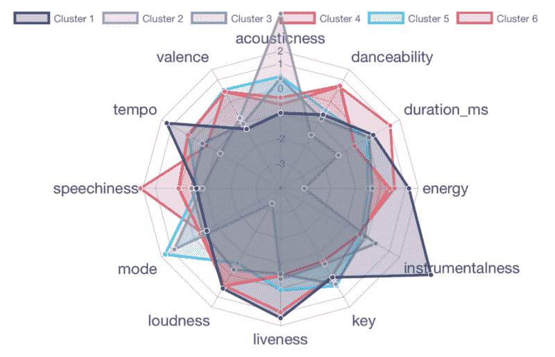

集群 1 包含四个艺术家:酷玩乐队、阿维西、马什梅洛和马丁·盖瑞斯。他们的音乐大多是现场演奏和器乐演奏，通常声音洪亮，充满活力，节奏很快。这并不令人惊讶，因为四位艺术家中有三位表演 EDM / House 音乐，而 Coldplay 以他们的现场音乐会而闻名。

集群 2 包含两位艺术家:弗兰克·辛纳特拉和诺拉·琼斯(有爵士乐粉丝吗？).他们的音乐在声学和大调音阶调式上得分很高。然而，他们在其余所有属性上得分较低。典型的爵士乐。

集群 3 包含十位艺术家:波斯特马龙、凯戈、链烟者、阿黛尔、洛德、拉娜·德尔·雷、詹姆斯亚瑟、一个共和国、约翰·传奇和艾丽西亚·凯斯。该集群在几乎所有属性上得分平均。这表明这一组艺术家在风格和创作上是平衡的和多才多艺的，因此在这一组中呈现了流派的多样性(EDM，Pop，R & B)。

集群 4 包含 15 位艺术家:爱莉安娜·格兰德、魔力红、德雷克、贾斯汀比伯、布鲁诺·马斯、加尔文·哈里斯、查理·普斯、安立奎·伊格莱希亚斯、未来、维兹·卡利法、第五和声、亚瑟、麦克莫尔、扎拉·拉尔森和蕾哈娜。他们的音乐适合跳舞，声音洪亮，节奏快，充满活力。这个团体中有许多流行和嘻哈流派的年轻主流艺术家。

集群 5 包含 10 位艺术家:泰勒·斯威夫特、肖恩·蒙德兹、艾德·希兰、迈克尔·布伯、约翰·梅耶、埃尔顿·约翰、脚本、斯蒂维·旺德、杰森·玛耶兹和彭塔托尼克斯。这是我最喜欢的组合！泰勒·斯威夫特？艾德·希兰？约翰·梅耶？杰森·玛耶兹？埃尔顿·约翰？我想我听了很多创作型歌手的歌。他们的音乐大多是大调音阶，同时在所有其他属性上达到完美的平衡(平均分)。

集群 6 包含九位艺术家:肯德里克·拉马尔、坎耶·韦斯特、阿姆、碧昂斯、贾斯汀·汀布莱克、50 美分、李尔·韦恩、史努比·道格和 Jay-Z。你已经看到了这里的趋势:其中七位是说唱歌手，甚至碧昂斯和 JT 也经常与说唱歌手合作。他们的歌曲有大量的口语单词和类似演讲的部分，持续时间长，并且经常现场表演。对说唱音乐有更好的描述吗？

#### **按特征分析**

下面的图表显示了每个音乐家的每个特性的值。下面的代码详细说明了制作 **danceability** 分叉条形图的过程。其他特征的代码已被省略，但随后会显示每个特征的绘图。

**可跳舞性**

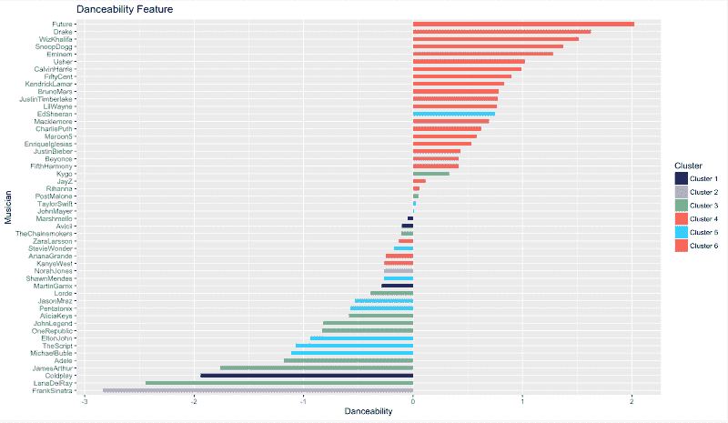

如果你想让你的迷恋者印象深刻，试着多听听未来，德雷克，维兹·卡利法，史努比杜古和阿姆。另一方面，不要试图跟着弗兰克·辛纳屈或拉娜·德尔·雷的曲子跳舞。

**能量**

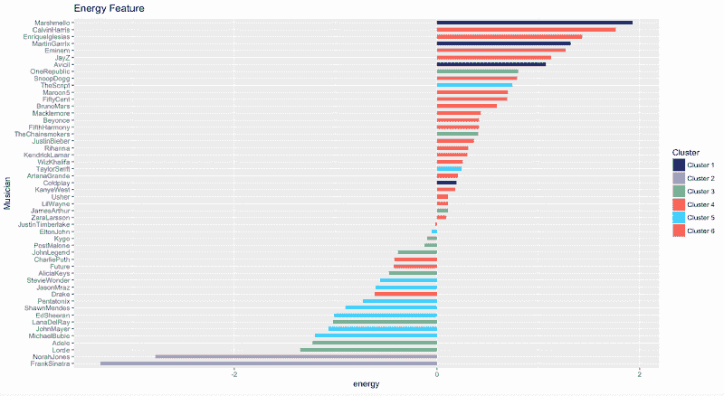

如果你听很多马克斯梅洛、加尔文·哈里斯、安立奎·伊格莱希亚斯、马丁·盖瑞斯、阿姆、Jay-Z 的音乐，你就是一个相当精力充沛的人。如果你是弗兰克·辛纳特拉和诺拉·琼斯的粉丝，情况正好相反。

**响度**

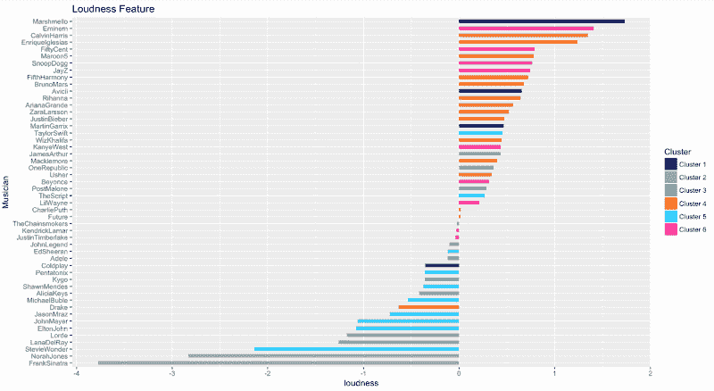

响度排名和能量排名差不多。

**语速**

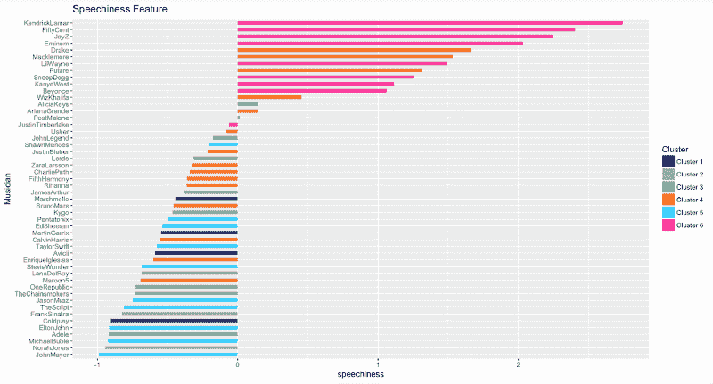

所有说唱乐迷:你最喜欢肯德里克·拉马尔的哪首歌？还是 50 美分？还是 Jay-Z？嗯，我很惊讶阿姆没有排名更高，因为我个人认为他是所有说唱歌手的山羊。

**声音**

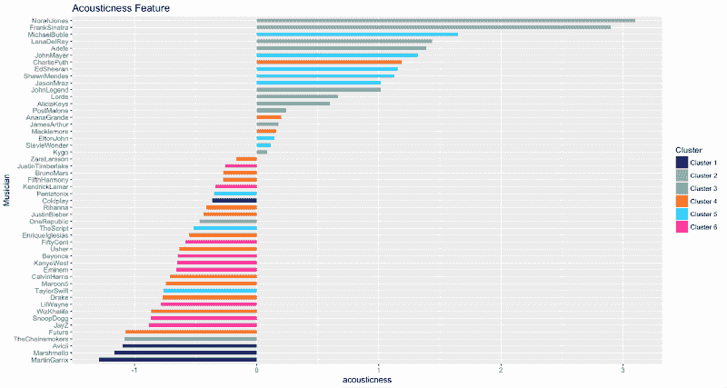

声音与响度和能量正好相反。辛纳特拉先生和琼斯夫人在他们的职业生涯中发布了一些强有力的原声歌曲。

**仪表化**

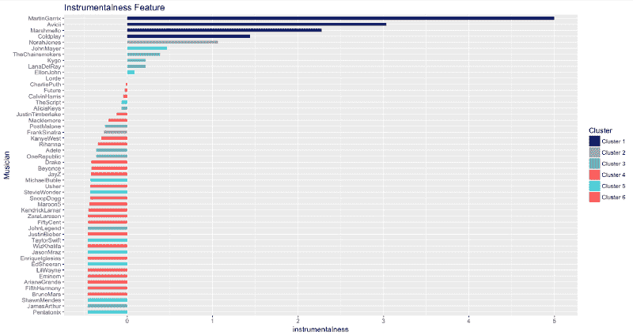

EDM 为了胜利！马丁·盖瑞斯、Avicii 和 Marshmello 制作的歌曲几乎没有人声。

**活性**

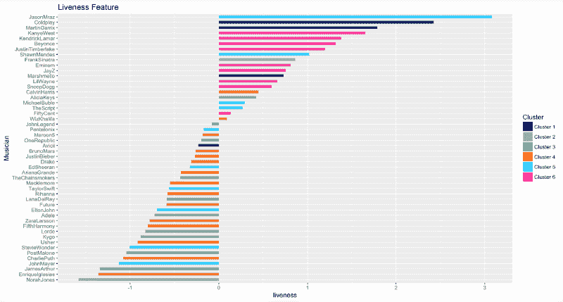

那么表演现场录音最多的 5 位艺术家是谁呢？杰森·玛耶兹、酷玩乐队、马丁·盖瑞斯、坎耶·韦斯特和肯德里克·拉马尔，按此顺序。

巴伦西亚

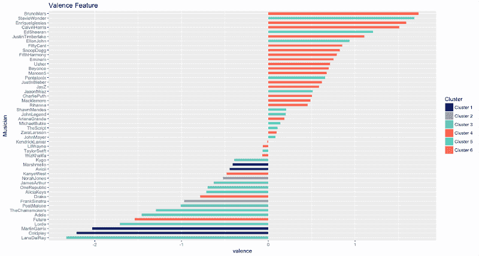

配价是描述音轨所传达的音乐积极性的特征。布鲁诺·马斯、斯蒂维·旺德和安立奎·伊格莱希亚斯的音乐非常积极，而拉娜·德尔·雷、酷玩乐队和马丁·盖瑞斯的音乐听起来相当消极。

**速度**

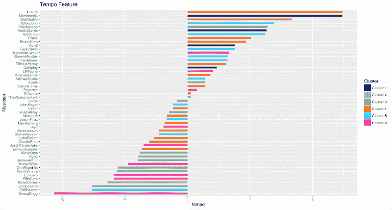

未来、马希梅洛和维兹·卡利法是速度之王。他们制作每分钟节拍数最高的曲目。还有史努比狗狗，lol？他往往需要一些时间来说出他的神奇的话。

**持续时间**

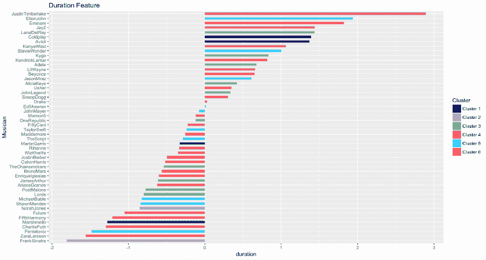

最后但并非最不重要的是，贾斯汀·汀布莱克的歌曲，其次是埃尔顿·约翰和阿姆的歌曲，有时长得令人难以忍受。相比之下，弗兰克·辛纳屈、莎拉·拉尔森和五弦琴喜欢较短的音乐。

### **结论**

哇，我在 Spotify 数据上做这个分析和可视化项目时获得了很多乐趣。谁能想到詹姆斯·亚瑟和波斯特·马龙在一个集群里？还是说肯德里克·拉马尔是游戏里最快的说唱歌手？或者说马希梅洛会在制作充满活力的歌曲方面击败马丁·盖瑞斯？

无论如何，你可以在 [my GitHub repository 这里](https://github.com/khanhnamle1994/spotify-artists-analysis)查看完整的 R Markdown，单独的 R 代码用于处理和可视化数据，以及原始数据集。从我自己的角度来看，R 在数据可视化方面比 Python 好得多，有像 [ggplot](https://www.statmethods.net/advgraphs/ggplot2.html) 和 [plot.ly](https://plot.ly/r/) 这样的库。我强烈建议您尝试一下 R！

— —

如果你喜欢这首曲子，我希望你能按下鼓掌按钮？其他人可能会偶然发现它。你可以在 G [*itHub、*](https://github.com/khanhnamle1994) *上找到我自己的代码，还可以在*h[*ttps://jameskle . com/上找到更多我的写作和项目。*](https://jameskle.com) *你也可以在 T [witter 上关注我，](https://twitter.com/@james_aka_yale) e [直接给我发邮件](mailto:khanhle.1013@gmail.com)或者 f [在 LinkedIn 上找到我。注册我的时事通讯](http://www.linkedin.com/in/khanhnamle94)就在你的收件箱里接收我关于数据科学、机器学习和人工智能的最新想法！*