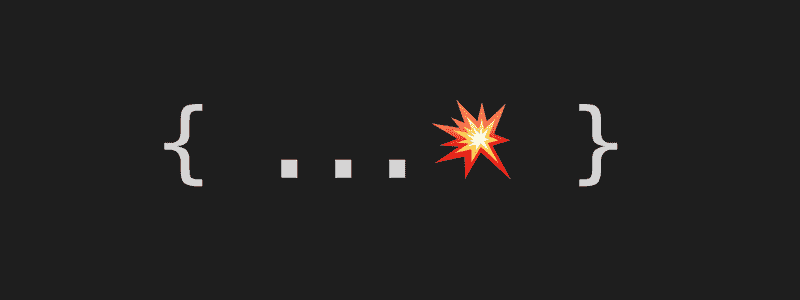

# 如何用 spread 运算符简化代码

> 原文：<https://www.freecodecamp.org/news/spread-expressions-6ad7d5b9b1d4/>

作者马特·格兰多

# 如何用 spread 运算符简化代码

最近，一位正在学着爱上 JavaScript 的同事来找我，问我是否有一种简单的方法来实现这样一个函数:

并在`bar`通过时返回`bar: parseBar(bar)`。但是当`bar`没有通过时，设法防止将`bar`作为`undefined`返回，因为代码库中的一些用法没有通过它。他特别寻找一种不需要任何重构的方法(比如从隐式返回改为完整的函数体，使用 if/else，创建一个单独的函数来过滤某些值，等等)。

在 JavaScript 控制台中进行一些黑客攻击后，我意识到以下情况是可能的:

如果你想的话，这里有一个精简的例子:

这是可能的，原因有两点。首先，尽管 spread 操作符不能作为令牌在任何地方出现，但它可以应用于整个语言中的任何数据类型。

众所周知，`Object`、`Array`、`Set`等类似的都是可迭代的。事实上，所有的*原语*类型也是扩展操作符的有效操作数，这使得我们可以扩展*任何*表达式，因为所有的表达式在执行后都会计算出某个值。

如果你不相信我，在控制台中抛出以下内容:

第二件对我们有帮助的事情是传播一个“空”值会导致无操作。

两个简单的例子可以说明如何使用 JavaScript:

*   守卫表情(à la React 的 JSX，也是用来解决本帖提到的原始问题的):`...(foo && parseFoo(foo))`
*   【默认】表情:`...(someValue || someDefault)`

一种更通用的方式来指代所有这些事情可能是“扩展表达式”然而，我现在想说的“扩展表达”不是一个名词，而是一个建议。带着你能传播所有表情的知识前进！？