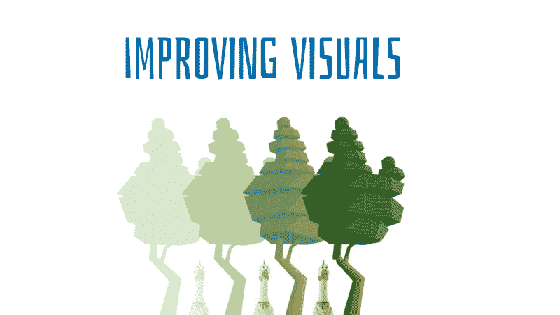
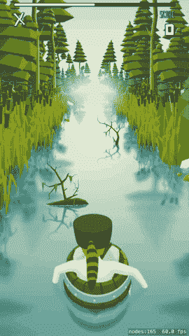
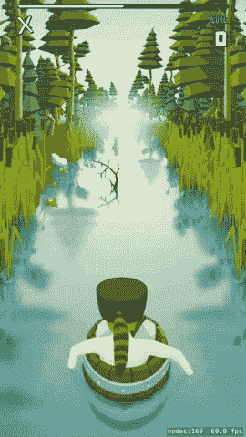
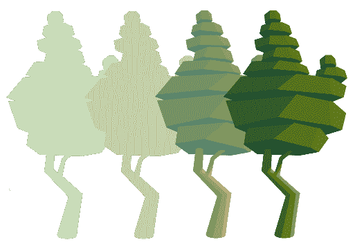
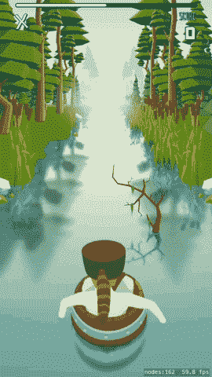
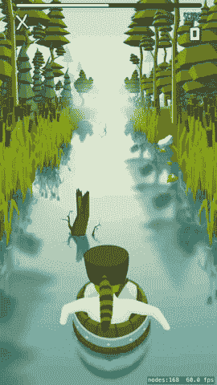
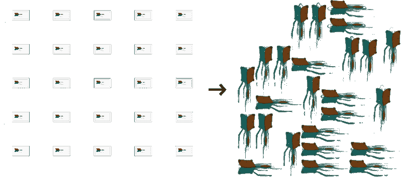

# sprite kit Advanced——如何构建一个 2,5D 游戏(第三部分)

> 原文：<https://www.freecodecamp.org/news/spritekit-advanced-how-to-build-a-2-5d-game-part-iii-e058b99cfbc3/>

卢克·科尼尔

# sprite kit Advanced——如何构建一个 2,5D 游戏(第三部分)



### 介绍

这篇文章是关于通过将 GPU 的着色器应用于静态场景来改善 [Raft Challenge](https://itunes.apple.com/app/apple-store/id1073887270?pt=117756562&ct=Develop%20Articles&mt=8) 的视觉效果。它解释了在 SpriteKit 中使用 GLSL 时的算法和潜在缺陷。

读者应该有编写片段着色器的基本经验。我们在本系列的第一部分和第二部分的[中讨论了这些。](https://medium.freecodecamp.org/spritekit-advanced-how-to-build-a-2-5d-game-part-i-2dc76c7c65e2)

### 问题是



游戏进入 beta 阶段后，我们收到了各种人的反馈。我们经常听说图形很好，但也是静态的，从长远来看，这导致了厌倦。

我的第一反应是:“他们说它是静态的？所以我们要加一些风来移动整个东西！”之后，我们更多的思考了这个问题。

像树这样的巨大物体不能一帧一帧地制作动画，因为这会导致内存问题。我们在考虑添加小的动画物体，比如动物。但是这会使场景图更加复杂。并且它会产生未知的性能影响。

我想到的解决方案是使用碎片着色器来制作整个森林的动画。我想创造风的效果。

这个想法是将水平扭曲应用到精灵的纹理上，其强度与躯干底部的距离成比例。这种力量也一直在随时间变化，并受到场景“深度”的影响。

该解决方案的其他优点:

*   轻松集成
    就像填充现有对象的属性一样简单
*   表演
*   巨大的灵活性

来源如下(GLSL):

```
void main( void ){    float horizonAbsoluteOffset = 0.64; // 1    float distanceFromTrunksBase = abs(v_tex_coord[1] - horizonAbsoluteOffset); // 2    float maxDivergence = mix(0.0,1.0,distanceFromTrunksBase)*0.038; // 3    float factor = sin(u_time*2+(attrDepth * 1.3)); // 4    vec2 deltaUV = vec2(maxDivergence * factor, 0); // 5        gl_FragColor = texture2D(u_texture, v_tex_coord + deltaUV); //6}
```

1.  这个`float`保持所有躯干底部的垂直位置
    ——这个值是我们的纹理特有的
2.  我们计算当前采样点与上述值
    之间的距离—该值小于 1.0，可以是负值
3.  我们计算最大散度
    ——最后的神奇数字是通过反复试验得到的
4.  我们计算不断变化的强度和风向
    —sin 函数是一个很好的基础，因为它返回可预测的值(-1 到 1)
    —它也是一个连续函数
    —后者意味着我们可以将任何垃圾作为参数，它仍然可以工作
    —在这种情况下，“垃圾”是当前时间加上当前精灵的“深度”
    —添加了神奇的数字来塑造动画
5.  创建增量向量
    —最大散度乘以因子进入 X 位置，而 Y 为 0。
6.  该行从纹理中的特定点获取颜色，并将其输出到屏幕
    ——通过用`vtexcoord`将 delta 添加到我们的当前位置，我们改变了采样器从中提取颜色值的点

结果:



注意水面上的倒影也在移动。这是因为树和反射是同一个精灵和纹理的一部分。这里没有魔法。

### 改善雾

我们还能做些什么吗？嗯，如果我们不能发明任何新的东西，我们总是可以改进现有的东西。我们的设计师曾经说过，远处的树木应该是纯色的，以便更好地融入雾中。



上面的图像几乎不言自明。前面，我已经提到过关于“深度”的问题。森林的每一层都有一个属性`attrDepth`。它代表了山脉(0.0)和观察者(6.0)之间的距离。

让我们来调整这雾吧！

```
__constant vec3 colorLightMountains = vec3(0.847, 0.91, 0.8);__constant vec3 colorDarkMountains = vec3(0.729, 0.808, 0.643);
```

```
void main( void ){       //get color    vec4 color = texture2D(u_texture, v_tex_coord);    float alpha = color.a; // 1
```

```
 //fog    vec3 outputColor = vec3(color.rgb);    if (attrDepth < 1.0) {					// 2        outputColor = colorLightMountains;        alpha = min(attrDepth,alpha);    } else if (attrDepth < 2.0) {			// 3        outputColor = mix(colorLightMountains, colorDarkMountains, attrDepth - 1.0);    } else if (attrDepth <= 3.0) {		// 4        outputColor = mix(colorDarkMountains, color.rgb, attrDepth - 2.0);    }        gl_FragColor = vec4(outputColor, 1.0) * alpha; // 5}
```

上面的代码非常简单，所以我将只关注最重要的事情:

1.  从纹理中提取`alpha`。
2.  远处阶段
    当森林最远时，它有`Light Mountains`的颜色和`0 alpha`的 T5，当它靠近时，它通过增加`alpha`到`depth == 1.0`出现
3.  中距离
    随着精灵越来越靠近观察者，颜色向`Dark Mountains`移动。
4.  近距离
    颜色是由`Dark Mountains`和自然纹理颜色
    混合而成，自然，越接近，看起来就越正常
5.  使用开始时提取的 alpha 将最终颜色传递给输出

同样，结果是:



### 结合两种效果

我最喜欢着色器的一点是它们的灵活性。不仅可以在不牺牲任何东西的情况下合并两种效果。甚至建议这么做。

合并着色器减少了绘制调用，从而提高了帧速率。

```
__constant vec3 colorLightMountains = vec3(0.847, 0.91, 0.8);__constant vec3 colorDarkMountains = vec3(0.729, 0.808, 0.643);
```

```
void main( void ){    //wind    float horizonAbsoluteOffset = 0.64;    float distanceFromTrunksBase = abs(v_tex_coord[1] - horizonAbsoluteOffset);    float maxDivergence = mix(0.0,1.0,distanceFromTrunksBase)*0.038;    float factor = sin(u_time*2+(attrDepth * 1.3));    vec2 deltaUV = vec2(maxDivergence * factor, 0);        //get color    vec4 color = texture2D(u_texture, v_tex_coord + deltaUV);    float alpha = color.a;
```

```
 //fog    vec3 outputColor = vec3(color.rgb);    if (attrDepth < 1.0) {        outputColor = colorLightMountains;        alpha = min(attrDepth,alpha);    } else if (attrDepth < 2.0) {        outputColor = mix(colorLightMountains, colorDarkMountains, attrDepth - 1.0);    } else if (attrDepth <= 3.0) {        outputColor = mix(colorDarkMountains, color.rgb, attrDepth - 2.0);    }        //output    gl_FragColor = vec4(outputColor, 1.0) * alpha;}
```

最终结果:



### 陷阱

没有不带刺的玫瑰。

*   在多个带有`alpha`通道的大精灵上使用着色器可能会导致可见的帧速率下降。
*   同样的 GPU 在 iPhone 上可以提供 60fps，但在像素更多的 iPad 上只能提供 20 fps
    在不同的设备上频繁测试你的代码，尤其是配有 retina 显示屏的 iPad
*   没有可靠的方法从代码中估计设备的性能
    在多个物理设备上运行您的游戏并列出那些能够运行具有良好性能的着色器的白名单
    要区分设备，您可以使用 [UIDevice-Hardware.m](https://github.com/erica/uidevice-extension/blob/master/UIDevice-Hardware.m)
*   你的部分透明的纹理失去颜色，变成灰色？Google **预乘 alpha** ！
*   当心使用`SKTextureAtlases`如果你像在风的例子中一样改变坐标
    在图集生成期间，XCode 可能旋转和移动一些纹理。
    不可能从代码中检测出这样的异常，或者至少我不知道如何检测
*   对于一些精灵，你可能会收到一个交换了 X 和 Y 坐标的纹理！
*   你可能会意外扭曲到一个完全不同的子纹理！



### 摘要

我们已经学习了如何使用碎片着色器来创建风和雾。当编写您自己的 GLSL 代码时，您肯定会产生许多显示工件。有些很烦，有些很爆笑。请记住，其中一些可能有潜力成为一个功能！

关于作者:Kamil zitek 是 www.allinmobile.co 的一名 iOS 开发者