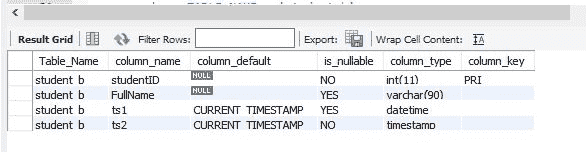
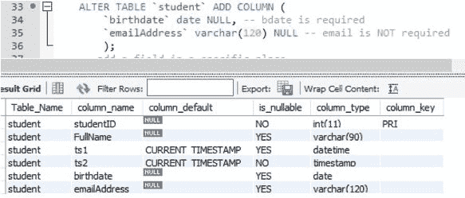
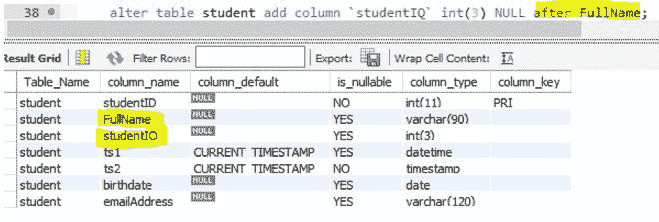

# SQL Alter Table——如何添加、重命名或删除列——用语法示例解释

> 原文：<https://www.freecodecamp.org/news/sql-alter-table-add-column-rename-drop/>

## 这是一个 SQL ALTER TABLE 的指南

本指南将向您介绍并尝试解释关系数据库中 SQL alter table 函数的一些基础知识。重要安全提示:在进行更改之前，请务必备份您的数据！

我们将在本 freeCodeCamp SQL 指南的所有示例中使用 MySQL。选择 MySQL 的原因是 1)它在网站上非常常用于后端数据库，2)它是免费的，有趣且易于使用。

## 本指南涵盖的内容

我们将使用在“创建表”指南中创建的表。如果您对创建表不熟悉，请随意阅读该指南。

*   改变创建的表会以几种不同的方式改变它。
*   我们将更改它的名称并修改列
*   添加列(在添加列的同时，我们还将回顾几种最重要的列类型及其用法)。
*   删除列(意味着删除列)。
*   通过导入 CSV 文件并修改表格来创建表格。
*   使用 MySQL workbench 工具创建和修改表。

大部分工作将使用 MySQL workbench 脚本工具中的 SQL 语句来完成，但是我们也将回顾如何使用 workbench 接口而不是 SQL 语句来修改表。

## 改造前的桌子

添加日期和电子邮件地址列(日期和字符列):

添加一个数字列(注意，它是在表中的特定位置添加的):

重命名一些列:

您也可以使用 alter table workbench 工具。只需右键单击您想要更改的表格，然后随心所欲地进行更改。

还有更多的事情可以做，请查看您的数据库管理软件手册以了解更多信息。