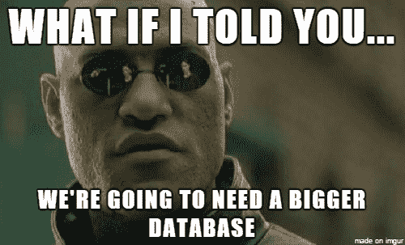

# 什么是 SQL？什么是数据库？用简单的英语解释关系数据库管理系统(RDBMS)。

> 原文：<https://www.freecodecamp.org/news/sql-and-databases-explained-in-plain-english/>

数据库可能很难理解。然而，它们对于全栈编程和构建存储数据的后端服务是必不可少的。

在这篇文章中，我将揭开 SQL、数据库和关系数据库管理系统的神秘面纱。我还会用一些与魔法世界的类比，包括哈利·波特本人和他在霍格沃茨上的一些课。



在深入讨论关键术语之前，让我们先定义一下数据库本身是什么:

数据库是保存在计算机中的一组结构化数据，尤其是可以通过多种方式访问的数据。它本质上是计算机上的一组有组织的数据，可以从计算机系统中以电子方式访问。

## 关键术语

下面是我们将要开始的一些关键术语:

*   **RDMS:** 关系数据库管理系统。这个数据库框架是 MySQL 的基础。
*   **SQL:** 结构化查询语言。
*   **表:**承载数据的数据库对象。表名的一个例子是“学生”、“教师”或“课程”。
*   **字段:**表格的值称为字段。学生的示例字段包括“名字”、“姓氏”和“GPA”。
*   **记录/行:**表格中的单个条目。

将教师和课程添加到数据库后，我们可以拥有学生、教师和课程的表。

在本指南中，我们将仅使用**名学生**的示例作为参考。如果你有幸被霍格沃茨聘为软件工程师，你的数据库可能会很好地利用这些命令，:D

## SQL 语句

### 句法

分号是分隔 SQL 语句的标准方式。它允许在同一个调用中运行多个 SQL 语句。在本指南中，我们将在每个语句的末尾使用分号。

### 最重要的 SQL 命令

**创建**:创建一个新的 SQL 表。

例如，如果我们正在为霍格沃茨学校创建学生数据库，我们将使用 **CREATE** 来创建一个名为“学生”的表。

*   句法

```
CREATE TABLE table_name (
    column1 datatype,
    column2 datatype,
    column3 datatype,
   ....
); 
```

*   例子

```
CREATE TABLE Students
                (first_name VARCHAR(255),
                last_name VARCHAR(255),
                login VARCHAR(255),
                age INTEGER,
                gpa REAL,
                house VARCHAR(255)); 
```

**Drop** :删除一个表格。使用此命令时要非常小心，因为这将删除表中的所有数据！

如果我们想要删除整个学生数据库，我们将使用 **DROP** 来执行该操作。

*   句法

```
DROP TABLE table_name; 
```

*   例子

```
DROP TABLE Students; 
```

**Insert** :向表格中添加新的数据行。

我们将使用 **INSERT** 来添加霍格沃茨的新生。

*   句法

```
INSERT INTO table_name (column1, column2, column3, ...)
VALUES (value1, value2, value3, ...); 
```

*   例子

```
INSERT 
INTO Students(first_name, last_name, login, age, gpa, house)
VALUES 
('Harry',     'Potter', 'theboywholived', 15, 4.0, 'Gryffindor'),
('Hermionie', 'Granger','granger2',       15, 4.5, 'Gryffindor'),
('Ron',       'Weasley','weasley7',       15, 3.7, 'Gryffindor'),
('Draco',     'Malfoy', 'malfoy999',      15, 4.0, 'Slytherin'),
('Cedric',    'Diggory','diggory123',     15, 4.0, 'Hufflepuff'); 
```

**选择**:用于取出数据库中的数据，以表格形式返回。

如果我们想检索格兰芬多学院所有学生的名字，我们可以使用 **SELECT** 命令。下面的示例在 Students 表中查询数据库中每个学生的名字和姓氏，对于我们来说，这只是上述的五行。

*   句法

```
SELECT column1, column2, ...
FROM table_name; 
```

*   例子

```
SELECT first_name, last_name FROM Students; 
```

| 名字 | 姓氏 |
| --- | --- |
| （英、瑞）哈里（人名） | 闲赏 |
| 赫敏！赫敏 | 农民 |
| 留宿（remain overnight 的缩写） | 韦斯莱夫人 |
| 天龙星座 | 马尔福 |
| 李宇航 | 迪戈里 |

或者，如果我们想要选择表中的所有字段，我们的命令将使用“*”语法，这表示选择所有字段:

```
SELECT * FROM Students; 
```

| 名字 | 姓氏 | 注册 | 年龄 | 平均分数 | 房子 |
| --- | --- | --- | --- | --- | --- |
| （英、瑞）哈里（人名） | 闲赏 | 男孩活了下来 | Fifteen | four | 格兰芬多 |
| 赫敏！赫敏 | 农民 | 格兰吉尔 2 | Fifteen | Four point five | 格兰芬多 |
| 留宿（remain overnight 的缩写） | 韦斯莱夫人 | 韦斯莱 7 号 | Fifteen | Three point seven | 格兰芬多 |
| 天龙星座 | 马尔福 | 马尔福 999 | Fifteen | four | 斯莱特林 |
| 李宇航 | 迪戈里 | diggory123 | Fifteen | four | Hufflepuff |

### 条款

一个**子句**是一个 SQL 语句的逻辑块，它(理论上)是一个可选字段。

在上面的语句中，我们简单地返回了学生数据库中的所有字段。我们没有指定返回值的条件。

如果我们不是想询问所有的学生，而是只询问那些住在格兰芬多的学生，会怎么样呢？如何查询名字以“H”开头的学生，或者赫奇帕奇和斯莱特林的学生？这些更复杂的情况由 SQL 子句解决。

下面是最常见子句的概述，但是 SQL 语言中还有几个子句。如果你想了解更多信息，这里有一个很好的概述。

### 条款示例

**其中:**用于从数据库中取数时的状态。回到使用 Select 的例子，我们必须使用 **WHERE** 来指定房子为格兰芬多。

*   句法

```
SELECT column1, column2, ...
FROM table_name
WHERE condition; 
```

*   例子

```
SELECT * FROM Students
WHERE house='Gryffindor'; 
```

| 名字 | 姓氏 | 注册 | 年龄 | 平均分数 | 房子 |
| --- | --- | --- | --- | --- | --- |
| （英、瑞）哈里（人名） | 闲赏 | 男孩活了下来 | Fifteen | four | 格兰芬多 |
| 赫敏！赫敏 | 农民 | 格兰吉尔 2 | Fifteen | Four point five | 格兰芬多 |
| 留宿（remain overnight 的缩写） | 韦斯莱夫人 | 韦斯莱 7 号 | Fifteen | Three point seven | 格兰芬多 |

**和**用于在 SQL 语句中组合多个子句，其中由 And 分隔的所有条件都为真。我们会用 AND 来让格兰芬多的学生有 3.8 以上的 GPA。

*   句法

```
SELECT column1, column2, ...
FROM table_name
WHERE condition1 AND condition2 AND condition3 ...; 
```

*   例子

```
SELECT * FROM Students
WHERE house='Gryffindor' AND gpa>3.8; 
```

| 名字 | 姓氏 | 注册 | 年龄 | 平均分数 | 房子 |
| --- | --- | --- | --- | --- | --- |
| （英、瑞）哈里（人名） | 闲赏 | 男孩活了下来 | Fifteen | four | 格兰芬多 |
| 赫敏！赫敏 | 农民 | 格兰吉尔 2 | Fifteen | Four point five | 格兰芬多 |

**或**:类似于 AND，但只返回由 Or 分隔的条件中只有一个为真的数据。如果我们想检索赫奇帕奇和斯莱特林的学生，但不是两个，我们会使用 OR 命令。

*   句法

```
SELECT column1, column2, ...
FROM table_name
WHERE condition1 OR condition2 OR condition3 ...; 
```

*   例子

```
SELECT * FROM Students
WHERE house='Slytherin' OR house='Hufflepuff'; 
```

| 名字 | 姓氏 | 注册 | 年龄 | 平均分数 | 房子 |
| --- | --- | --- | --- | --- | --- |
| 天龙星座 | 马尔福 | 马尔福 999 | Fifteen | four | 斯莱特林 |
| 李宇航 | 迪戈里 | diggory123 | Fifteen | four | Hufflepuff |

**Like:** 与 WHERE 一起使用，搜索特定的模式。如果我们只需要名字以“H”开头的巫师的名和姓，我们可以使用 Like 命令。

*   句法

```
SELECT column1, column2, ...
FROM table_name
WHERE columnN LIKE pattern; 
```

*   例子

```
SELECT first_name, last_name FROM Students
WHERE first_name LIKE 'H%'; 
```

| 名字 | 姓氏 |
| --- | --- |
| （英、瑞）哈里（人名） | 闲赏 |
| 赫敏！赫敏 | 农民 |

**计数:**用于查找表格中一列(或多列)的计数。

*   句法

```
SELECT COUNT(column_name)
FROM table_name
WHERE condition; 
```

*   例子

```
SELECT COUNT(first_name) FROM Students; 
```

| 伯爵(名字) |
| --- |
| five |

使用相同语法的另外两个命令是 AVG 和 SUM。AVG 将计算所有值的平均值，sum 将计算所有值的总和。

**选择限制:**用于切断特定数量的响应。选择顶部响应的方式是按照首先插入数据库的时间顺序。

*   句法

```
SELECT column_name(s)
FROM table_name
WHERE condition
LIMIT number; 
```

*   例子

```
SELECT * FROM Students LIMIT 3; 
```

| 名字 | 姓氏 | 注册 | 年龄 | 平均分数 | 房子 |
| --- | --- | --- | --- | --- | --- |
| （英、瑞）哈里（人名） | 闲赏 | 男孩活了下来 | Fifteen | four | 格兰芬多 |
| 赫敏！赫敏 | 农民 | 格兰吉尔 2 | Fifteen | Four point five | 格兰芬多 |
| 留宿（remain overnight 的缩写） | 韦斯莱夫人 | 韦斯莱 7 号 | Fifteen | Three point seven | 格兰芬多 |

### 其他有用的命令

**排序依据:**按升序或降序对结果进行排序。

*   句法

```
SELECT column1, column2, ...
FROM table_name
ORDER BY column1, column2, ... ASC|DESC; 
```

*   例子

```
SELECT * FROM Students ORDER BY first_name; 
```

| 名字 | 姓氏 | 注册 | 年龄 | 平均分数 | 房子 |
| --- | --- | --- | --- | --- | --- |
| 李宇航 | 迪戈里 | diggory123 | Fifteen | four | Hufflepuff |
| 天龙星座 | 马尔福 | 马尔福 999 | Fifteen | four | 斯莱特林 |
| （英、瑞）哈里（人名） | 闲赏 | 男孩活了下来 | Fifteen | four | 格兰芬多 |
| 赫敏！赫敏 | 农民 | 格兰吉尔 2 | Fifteen | Four point five | 格兰芬多 |
| 留宿（remain overnight 的缩写） | 韦斯莱夫人 | 韦斯莱 7 号 | Fifteen | Three point seven | 格兰芬多 |

**分组依据:**将具有相同值的类别分组到行中。如果你想知道每栋房子里的学生人数(例如格兰芬多的 3 名)，你可以通过命令来利用这个组。

*   句法

```
SELECT column_name(s)
FROM table_name
WHERE condition
GROUP BY column_name(s)
ORDER BY column_name(s); 
```

*   例子

```
SELECT COUNT(first_name), house FROM Students GROUP BY house; 
```

| 伯爵(名字) | 房子 |
| --- | --- |
| three | 格兰芬多 |
| one | Hufflepuff |
| one | 斯莱特林 |

最后，[这里的](https://www.db-fiddle.com/f/9Jq8KfBPtcYRh84PnPUQWi/61)是一个 DB 提琴，显示了上面所有命令的运行情况！

## 规范化与非规范化数据库

设计数据库时，有两种主要的设计模式可以遵循，每种模式都有各自的优缺点。

**规格化:**优化**最小化冗余，**不优化读取时间。

假设我们有一个课程表，其中有教授该课程的教师的教师 ID。我们还有一个教师数据库，里面有教师的名字。

当我们想获得教授某门课程的教师的姓名时，我们必须查询 Courses 和 teachers 表，因为 course 表没有教师姓名(有效但多余)。

**反规格化:**针对**读取时间**进行优化，而不是为了最小化冗余。

假设我们有一个包含教师 ID 和教师姓名的课程表。我们有一个教师数据库，其中也有教师姓名。当我们想知道课程中老师的名字时，我们可以使用课程表(冗余但有效)。

## 数据完整性

对于用户来说，与他们交互的数据是安全、正确和合理的，这一点至关重要。例如确保年龄不是负数，或者没有两个学生有相同的信息。我们称之为**数据完整性。**

数据完整性有多种形式，可分为四类:

*   **实体完整性**:表中没有重复的行。例如，我们不能在数据库中插入罗恩·韦斯莱两次。
*   **域完整性**:限制可以插入的值的类型，以便强制执行正确的值。比如一所房子只能是格兰芬多，拉文克劳，斯莱特林，或者赫奇帕奇。
*   **参照完整性**:被其他记录使用的记录不能删除。如果教师目前正在授课，则不能删除他们。
*   **用户定义的完整性:**一个“其他”类别，包括与业务相关的逻辑和数据库规则。

## 通用 SQL 数据库

*   甲骨文公司:非常稳定和成熟，但成本高昂
*   MySQL :轻量级，安装快速，但不如 Oracle 成熟
*   PostgreSQL :适用于某些用例，但速度不是很快

## 资源

*   [SWEPrep -面试问题直接发送到您的收件箱](https://sweprep.substack.com/)
*   [freeCodeCamp 的 SQL 和数据库](https://www.freecodecamp.org/news/sql-and-databases-full-course/)
*   [清理代码](https://www.amazon.com/Clean-Code-Handbook-Software-Craftsmanship/dp/0132350882)
*   [有效 Java](https://www.amazon.com/Effective-Java-2nd-Joshua-Bloch/dp/0321356683)
*   [甲骨文文档](https://www.oracle.com/uk/database/index.html)
*   [MySql 文档](https://www.mysql.com/)
*   [PostgreSQL 文档](https://www.postgresql.org/)

## 保持最新状态

*   Reddit 线程:关于数据库、SQL 和新技术的伟大线程
*   **[黑客新闻](https://news.ycombinator.com/) :** 了解科技行业最新发展的绝佳资源
*   **[CodePen](https://codepen.io/) :** 发现良好 SQL 实践的优秀资源。