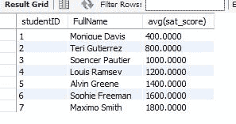

# SQL AVG -用语法例子解释的 SQL 平均函数

> 原文：<https://www.freecodecamp.org/news/sql-avg-average-function/>

## 什么是 SQL 平均(AVG)函数？

“平均”是一个聚合(分组)函数。它用于从 SQL 语句返回的一组行中计算一个数值列的平均值。

下面是使用该函数的语法:

```
select groupingField, avg(num_field)
from table1
group by groupingField 
```

下面是一个使用学生表的示例:

```
select studentID, FullName, avg(sat_score) 
from student 
group by studentID, FullName; 
```

