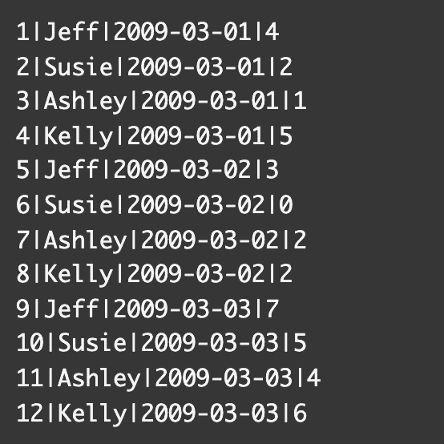
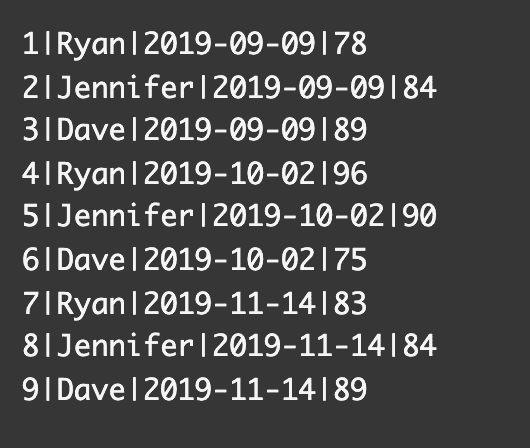
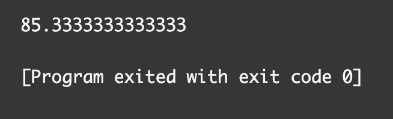
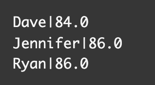

# SQL 计数–如何在 SQL 中选择、合计和平均行

> 原文：<https://www.freecodecamp.org/news/sql-count-how-to-select-sum-and-average-rows-in-sql/>

在 SQL 中，有两个内置函数可以对表中的数据求和或求平均值。

在本文中，我将通过代码示例向您展示如何在 SQL 中使用 **`SUM`** 和 **`AVG`** 函数。

## 如何在 SQL 中使用 SUM 函数

如果需要在表中添加一组数字，可以使用 SQL 中的`SUM`函数。

这是基本语法:

```
SELECT SUM(column_name) FROM table_name;
```

SQL 中的`SELECT`语句告诉计算机从表中获取数据。

SQL 中的`FROM`子句指定了我们想要列出哪个表。

在这个例子中，我们有一个名为`students`的表，其中包含列`id`、`name`、`date`和`total`。我们想把所有学生卖出的糖果条总数加起来。



我们可以使用以下语法获得售出的糖果条总数:

```
SELECT SUM(total) FROM students; 
```

结果将是 41。


我们还可以使用`GROUP BY`子句得到每个学生的总数。

第一部分是为售出的糖果条总数选择名称和总和，如下所示:

```
SELECT name, SUM(total)
```

第二部分是按名称对总和进行分组:

```
FROM students GROUP BY name;
```

下面是按学生姓名对售出的糖果条总数进行分组的完整代码。

```
SELECT name, SUM(total) FROM students GROUP BY name; 
```

这是我们表格中的结果:


现在，结果是按学生姓名的字母顺序分组的。

我们可以修改代码，使用`ORDER BY`子句将结果列表从最大到最小排序。

```
SELECT name, SUM(total) FROM students GROUP BY name ORDER BY total DESC;
```

关键字`DESC`告诉计算机从最大到最小的总数排序。


如果我们想将总数从最小到最大排序，那么我们可以省略`DESC`关键字。

```
SELECT name, SUM(total) FROM students GROUP BY name ORDER BY total; 
```


## 如何在 SQL 中使用 AVG 函数

`AVG`函数查找 SQL 表中一组记录的算术平均值。平均值或算术平均值是一组数字的总和除以该组的计数。

例如，2+4+4+6+6+8 等于 30 除以 6，得出的平均值为 5。

这是`AVG`函数的基本语法:

```
SELECT AVG(column_name) FROM table_name; 
```

在这个例子中，我们有一个名为`students`的表，其中有`id`、`name`、`date`和`scores`列。我们想找出表格中所有学生考试成绩的平均值。



我们必须使用以下语法来获得测试分数的平均值:

```
SELECT AVG(scores) FROM students; 
```

平均值是 85.333。



我们还可以使用`ROUND`函数将结果四舍五入到最接近的整数。

```
SELECT ROUND(AVG(scores)) FROM students; 
```


我们还可以使用`GROUP BY`子句获得每个学生的平均值。

第一部分是选择分数的名称和平均值，如下所示:

```
SELECT name, ROUND(AVG(scores))
```

第二部分是按名称对平均分数进行分组:

```
FROM students GROUP BY name;
```

这是所有代码的外观:

```
SELECT name, ROUND(AVG(scores)) FROM students GROUP BY name;
```

结果如下表所示:



## 结论

有时您可能需要计算表中记录的总和或平均值。

如果需要在表中添加一组数字，可以使用 SQL 中的`SUM`函数。

这是基本语法:

```
SELECT SUM(column_name) FROM table_name;
```

如果需要将数据分组，那么可以使用`GROUP BY`子句。

`AVG`函数查找 SQL 表中一组记录的算术平均值。平均值或算术平均值是一组数字的总和除以该组的计数。

这是基本语法。

```
SELECT AVG(column_name) FROM table_name; 
```

我希望你喜欢这篇教程，并祝你的 SQL 之旅好运。