# SQL 日期–函数、查询、时间戳示例格式

> 原文：<https://www.freecodecamp.org/news/sql-date-function-query-timestamp-example-format/>

日期是任何编程语言不可或缺的一部分，SQL 也不例外。向 SQL 数据库中插入数据时，可以添加日期并根据该日期查询数据库。

在本文中，您将了解 SQL 中的日期函数以及如何用日期查询数据库。我们还会看看一些时间函数。

## 我们将涵盖的内容

*   [SQL 中的日期函数](#datefunctionsinsql)
    *   add date()
    *   [当前日期()](#current_date)
    *   [CURRENT _ TIME()；](#current_time)
    *   [当前 _ 时间戳()；](#current_timestamp)
    *   [现在()](#now)
    *   [日期](#date)
    *   [日期 _ 订阅](#date_sub)
    *   [日期差异](#datediff)
    *   [日](#day)
    *   [月](#month)
    *   [年](#year)
*   [如何基于日期查询数据库](#howtoqueryadatabasebasedondates)
*   [结论](#conclusion)

## SQL 中的日期函数

### `ADDDATE()`

ADDDATE()函数顾名思义就是给`date`或`datetime`添加一个间隔。

可以使用`ADDDATE()`函数，格式如下:`ADDDATE(date, INTERVAL value addunit)`。

*   是您正在处理的日期。对于 MySQL，日期格式是 YYY-MM-DD，并且是必需的。
*   `INTERVAL`是必需的关键字
*   `value`是一个整数，代表要添加的区间
*   `addunit`是区间应该代表的。即年、月、日、小时、分钟、秒和其他相关单位。

例如，运行下面的查询将返回“2022-10-22”。这意味着“2022-10-12”增加了 10 天。

```
SELECT ADDDATE("2022-10-12", INTERVAL 10 DAY); 
```

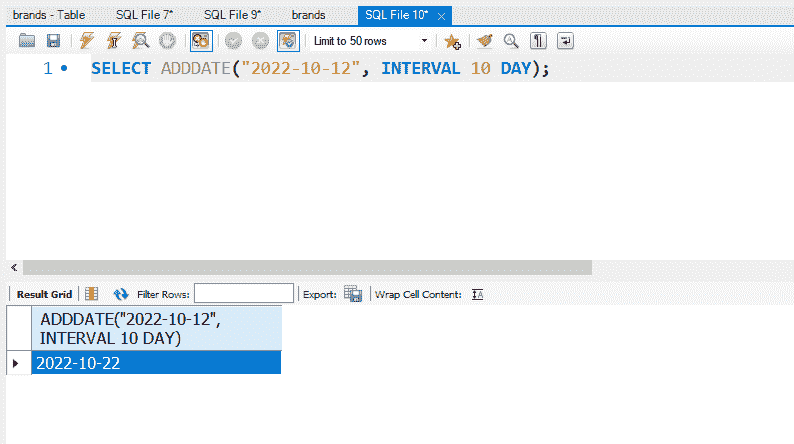

如果您愿意，您可以将它与月份或年份一起使用:


### `CURRENT_DATE()`

CURRENT_DATE()函数准确地显示了它所说的内容——当前日期。它以 YYYY-MM-DD 格式返回日期。

例如，`SELECT CURRENT_DATE()`返回我开始写这篇文章的日期:
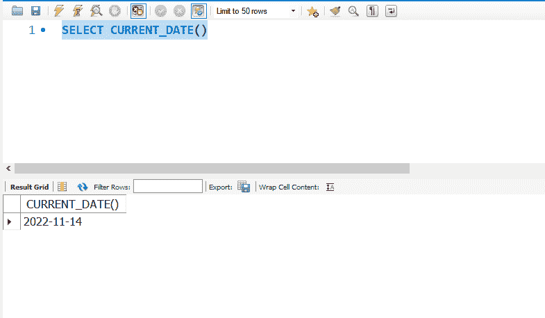

### `CURRENT_TIME();`

CURRENT_TIME 函数显示当前时间。

```
SELECT CURRENT_TIME(); 
```

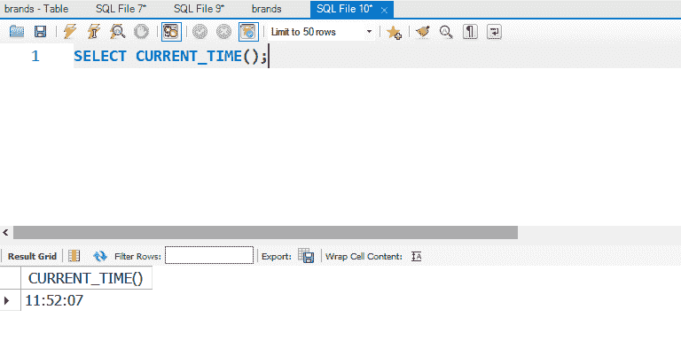

### `CURRENT_TIMESTAMP();`

当前时间戳函数返回当前日期和时间。它是当前日期()和当前时间()的组合。

```
SELECT CURRENT_TIMESTAMP(); 
```

### `NOW()`

NOW()函数返回当前日期和时间。

```
SELECT NOW(); 
```

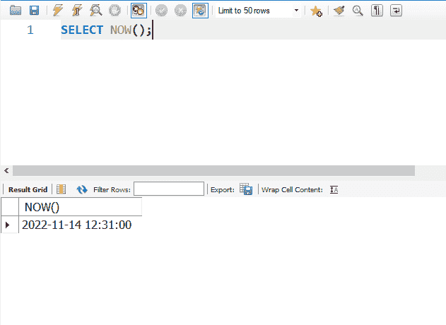

### `DATE`

您可以使用 DATE 函数提取时间戳的日期部分。

```
SELECT DATE("2022-11-14 12:00:00"); 
```

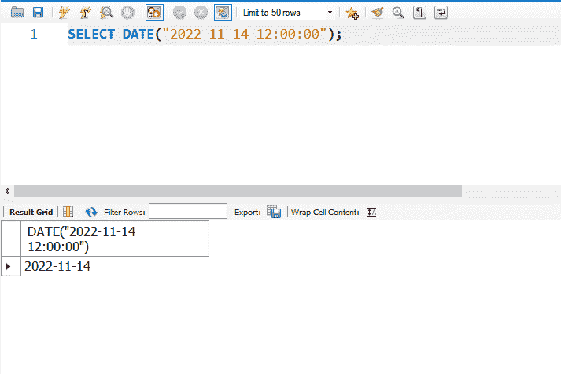

### `DATE_SUB`

函数的作用是:从一个日期中减去一天、一个月或一年。在下面的查询中，我从开始写这篇文章的日期减去了 10 天:

```
SELECT DATE_SUB("2022-11-14", INTERVAL 10 DAY); 
```

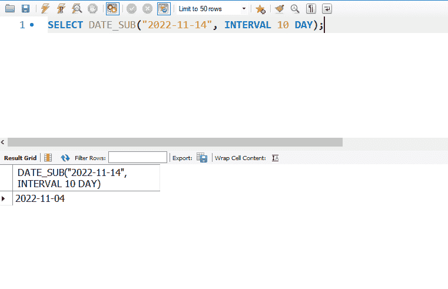

### `DATEDIFF`

DATEDIFF()函数返回两个日期之间的天数。

```
SELECT DATEDIFF("2023-11-14", "2022-11-14"); 
```

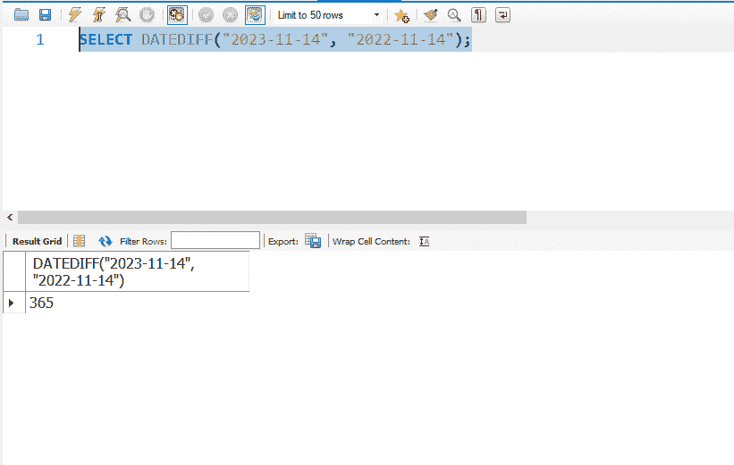

### `DAY`

该函数返回指定日期内的一天。

```
SELECT DAY("2022-11-14"); 
```

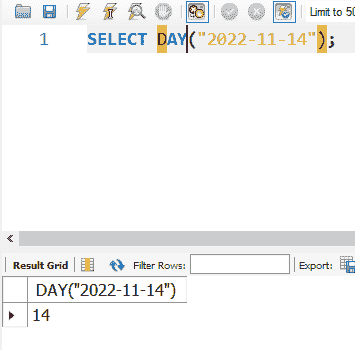

### `MONTH`

MONTH 函数返回指定日期中的月份。

```
SELECT MONTH("2022-11-14"); 
```

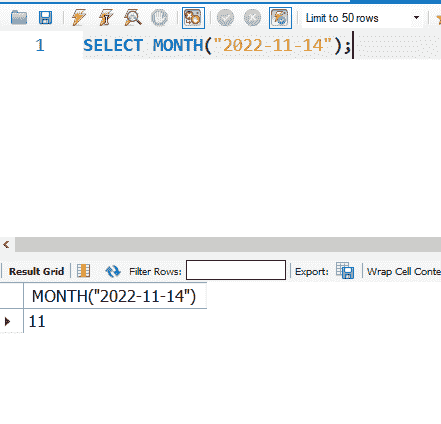

### `YEAR`

YEAR 函数返回指定日期中的年份。

```
SELECT YEAR("2022-11-14"); 
```

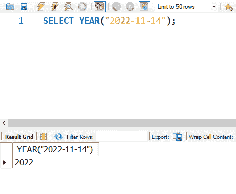

## 如何基于日期查询数据库

为了向您展示如何使用日期查询数据库，我将使用下表:

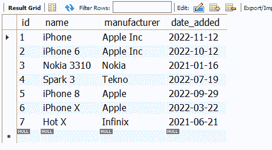

要在一个日期和另一个日期之间选择某个特定日期，您可以在指定日期时使用`BETWEEN`和`AND`关键字。

在下面的查询中，我选择了 2021 年添加到数据库中的所有项目:

```
SELECT *
FROM brands
WHERE date_added BETWEEN "2021-01-01" AND "2021-12-31"; 
```

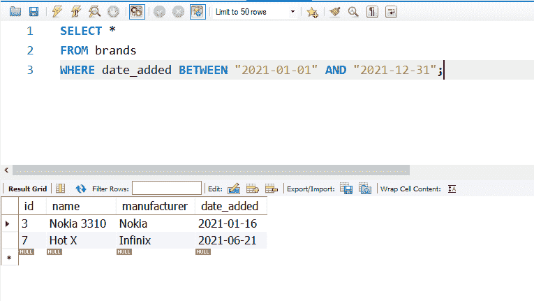

结合`DATE_SUB()`和`NOW()`函数，我能够获得最近 3 个月添加到数据库中的项目:

```
SELECT *
FROM brands
WHERE date_added > DATE_SUB(NOW(), INTERVAL 3 MONTH); 
```

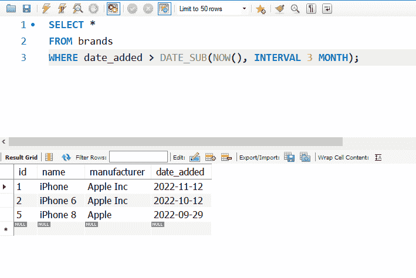

## 结论

本文向您展示了一些重要的函数，您可以使用这些函数在 SQL 中处理日期和查询数据库。

如果你觉得这篇文章有用，不要犹豫，与朋友和家人分享。

感谢阅读。