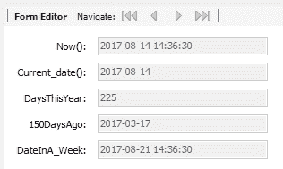

# SQL 日期函数和 GETDATE 用语法示例解释

> 原文：<https://www.freecodecamp.org/news/sql-date-functions-getdate/>

MySQL 中定义了 61 个日期函数。别急，这里就不一一回顾了。本指南将向您介绍一些常见的，并有足够的曝光率让您自己舒适地探索。

我们将涵盖:

*   获取当前日期
*   日期数学
*   where 或 having 子句中的日期

### 获取当前日期

从系统中获取数据对于使用 SQL 处理数据非常方便。

```
-- current date
select now(), sysdate(), current_date(), current_time(), -- date and time from the system on execution
dayofyear(now()) as NumDaysSoFarThisYr,
EXTRACT(YEAR FROM now()) as theYearPart,
EXTRACT(YEAR_MONTH FROM now()) as theYrMonPart, 
date_format(now(), '%W %M %Y') as oneOfManyFormats; 
; 
```

在 SQL 查询中，我们看到以下内容:

*   结果中的前两列是获得相同信息的两种方式:执行 SQL 时系统上的日期。
*   接下来的两列只截取了系统日期的日期和时间部分。
*   下一个表示今年系统日期的“天数”。您会注意到，这比下一个示例中显示的数学时间多了一天。
*   接下来的两个只提取年份，然后提取年份和月份
*   最后，但同样重要的是，这里有一个例子可以说明格式化日期的多种方法之一。

还可以使用 GETDATE()获取当前日期。

### 日期数学

```
select now(), current_date(), 
datediff(now(),'2017-01-01') as daysThisYear, 
subdate(current_date(), interval 150 day) as '150DaysAgo', 
adddate(now(), interval 7 day) as dateInA_Week -- date in a week
; 
```



这里我们看到:

*   前两列只是系统日期和时间，以供参考。
*   第二列是 2017 年 1 月 1 日和系统日期之间的日期差(datediff)。
*   最后两列是减去和加上日期的例子。

### 在 where 或 having 子句中

以下是在 where 子句中使用日期数学的两个示例:

```
select * from student; - to show the current data being used for the example
select * from student where recordCreated < '2017-01-01';
select * from student where recordCreated < subdate(current_date(), interval 225 day); 
```

关于 HAVING 部分:请记住，大多数 WHERE 子句逻辑也适用于 GROUP BY 的 HAVING 子句。两者的区别在于，WHERE 子句针对完整数据运行，而 HAVING 子句针对 GROUP BY 子句聚合的数据运行。

与所有这些事情一样，它们比本入门指南中的内容要多得多。我希望这至少能给你足够的时间开始。请参阅数据库管理器的手册，并亲自尝试不同的选项。