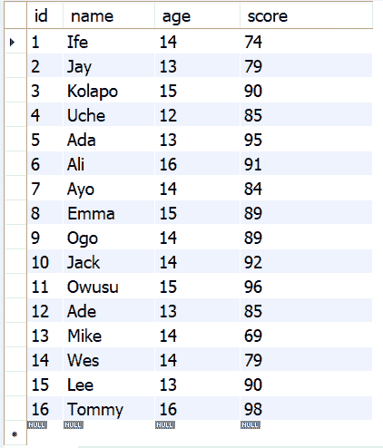
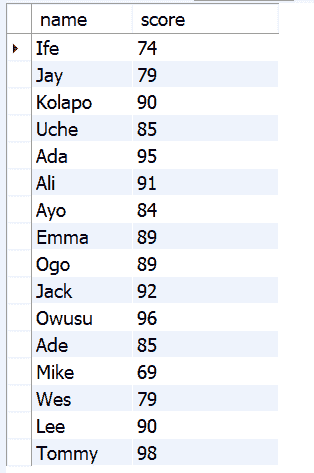
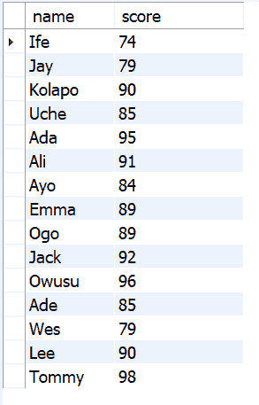
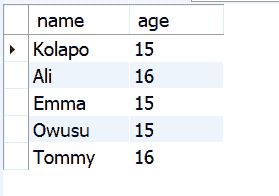
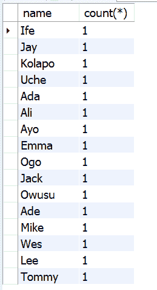
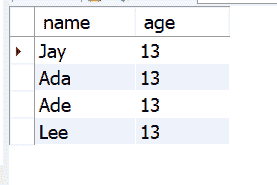
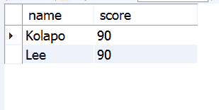
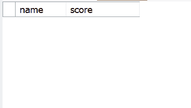
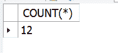

# SQL HAVING–如何使用 HAVING 语句进行分组和计数

> 原文：<https://www.freecodecamp.org/news/sql-having-how-to-group-and-count-with-a-having-statement/>

在 SQL 中，您可以在`GROUP BY`之后使用`HAVING`关键字，根据指定的条件查询数据库。像其他关键字一样，它返回符合条件的数据，并过滤掉其余的数据。

引入`HAVING`关键字是因为`WHERE`子句在与聚合函数一起使用时会失败。因此，您必须使用带有聚合函数的`HAVING`子句，而不是`WHERE`。

有了`HAVING`子句，当使用`GROUP BY`关键字时，可以将数据库中的数据分成许多组。因此，您可以在大型数据库中使用它。

## 如何使用`HAVING`关键字？

假设我在一个`student_scores`数据库中有一个名为`students`的表。
`SELECT * FROM students`返回如下:


运行`SELECT name, score FROM students`只能得到名字和分数。


然后，您可以使用`HAVING`关键字根据条件过滤掉一些学生。比如那些分数大于 70 的。

但在此之前，你必须像这样使用`GROUP BY`子句:

```
GROUP BY name, score 
```

这不会返回任何东西。所以你需要引入`HAVING`关键字:

```
HAVING score > 70 
```

现在，我可以得到分数高于 70 分的学生:


完整的查询如下所示:

```
SELECT name, score 
FROM students 
GROUP BY name, score
HAVING score > 70 
```

我也能让那些得分超过 90 分的学生这样做:

```
SELECT name, score 
FROM students 
GROUP BY name, score 
HAVING score > 90 
```

这个表格还有一个年龄栏，所以我可以这样得到 14 岁以上的学生:

```
SELECT name, age 
FROM students 
GROUP BY name, age 
HAVING age > 14 
```



### 如果将`WHERE`与聚合函数一起使用，将会出现错误

```
SELECT name, count(*)
FROM students
GROUP BY name
WHERE COUNT(*) > 0 
```


如果使用`HAVING`，错误会消失:

```
SELECT name, count(*)
FROM students
GROUP BY name
HAVING COUNT(*) > 0 
```



### 你可以使用任何你想要的运算符！

运算符不排斥比较。因此，我可以通过将 HAVING 语句改为`HAVING age = 13` :
得到 13 岁的学生

我是这样得到 90 分的学生的:

```
SELECT name, score 
FROM students 
GROUP BY name, score 
HAVING score = 90 
```



### 如果不满足 HAVING 语句中的条件，将不会返回任何行:

```
SELECT name, score 
FROM students 
GROUP BY name, score 
HAVING score = 100 
```



### 如果使用`HAVING`而不使用`GROUP BY`会出错

```
SELECT COUNT(*)
FROM students 
HAVING score > 80 
```


在这种情况下，您必须使用`WHERE`子句:

```
SELECT COUNT(*)
FROM students 
WHERE score > 80 
```



## 包扎

在本文中，您学习了如何使用`HAVING`关键字查询数据库。

请记住，您必须将`HAVING`子句与`GROUP BY`一起使用，这样您就可以获得想要的数据，就像您在本文中看到的那样。

在不能使用`HAVING`子句的情况下，您可能需要使用`WHERE`。

感谢您的阅读。