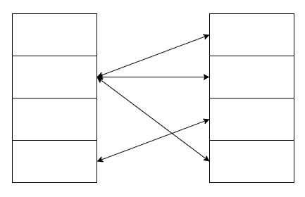
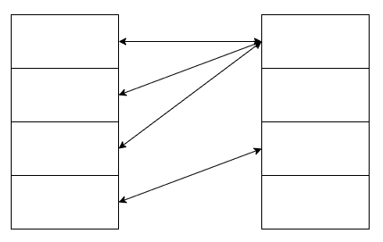
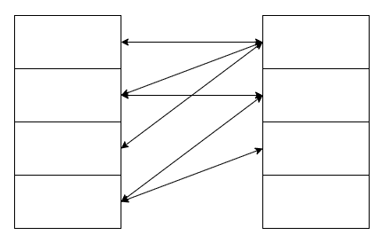
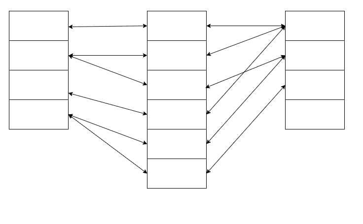

# SQL 内部连接——如何在 SQL 和 MySQL 中连接 3 个表

> 原文：<https://www.freecodecamp.org/news/sql-inner-join-how-to-join-3-tables-in-sql-and-mysql/>

当您使用数据库时，可能需要将几个不同表中的数据放在一起。这篇文章将告诉你如何做。

我已经在这里写了 SQL 连接[这里写了](https://www.freecodecamp.org/news/sql-join-types-inner-join-vs-outer-join-example/)和[这里写了](https://www.freecodecamp.org/news/sql-left-join-example-join-statement-syntax/)，但是让我们先花点时间回顾一下连接是如何工作的，特别是 MySQL 特有的语法。

## SQL Join 语句

Join 是一个语句，它让您将两个表放在一起，匹配彼此相关的行，并只保留可以匹配的行，而不保留不匹配的行。

```
SELECT * FROM table1 
  INNER JOIN table2
  ON table1.id = table2.id;
```

Generic INNER JOIN statement between two tables

`SELECT ... FROM`语句指出哪一个是第一个表，然后第二个表名就写在`INNER JOIN`关键字之后。

两个表应该如何连接写在`ON`语句中。在这种情况下，两个表使用关系`table1.id = table2.id`连接。

可以同时使用多个 join 语句来连接多个表。

```
SELECT *
  FROM table1
  INNER JOIN table2
  ON table1.id = table2.id
  INNER JOIN table3
  ON table2.id = table3.id;
```

Generic INNER JOIN statement between three tables

为此，添加第二个`INNER JOIN`语句和第二个`ON`语句来指示第三个表和第二个关系。

让我们花点时间讨论一下表之间的关系，以及为什么要将三个表连接在一起。

## SQL 中表之间的关系

当您拥有彼此相关的表时，它们的关系可以是各种类型之一。

### 一对多

在一对多关系中，第一个表中的一行可以与第二个表中的多行相关。

在关系数据库中，这可以用第二个表来实现，第二个表有一个`first_table_id`列，表示该行与第一个表的哪一行相关。



### 多对一

在多对一关系中，第一个表的一行可以与第二个表的一行相关，第二个表的一行可以与第一个表的多行相关。

在关系数据库中，这可以用第一个表来实现，第一个表有一个`second_table_id`列，表示该行与第二个表的哪一行相关。



Many-to-one

### 多对多

在这种情况下，多行与多行相关。



Many-to-many

这种关系不能用 SQL 表来表示——您需要在两个表之间添加一个耦合表，这样表之间就只存在多对一和一对多的关系。

中间表中的每一行都代表左表中的行和右表中的行之间的一种关系。



在 MySQL 的实践中，中间的表将有一个用于`first_table_id`的列和一个用于`second_table_id`的列，每个组合都是唯一的。

## 在实践中连接 SQL 表

假设我们有一个组织的数据库，其中有一个包含团队(他们的名字，和其他识别信息)的表，和一个包含项目(名字，进度，等等)的表。

| 身份证明（identification） | 团队名称 | 专攻 |
| --- | --- | --- |
| one | 扔香蕉的人 | 香蕉 |
| Two | 木材啃噬者 | 啃木头 |
| three | 粉红色的大象 | 在地上跺脚 |
| four | 松软的土豆 | 工作和睡觉 |

| 身份证明（identification） | 项目名称 | 进步 |
| --- | --- | --- |
| one | 筑坝 | 需要更多的木材啃咬和地面踩踏 |
| Two | 香蕉蛋糕 | 有人正在吃所有的香蕉 |
| three | 睡眠研究 | 睡得太多，研究不够 |

由于一个团队可以处理多个项目，并且一个项目可以由多个团队处理，所以还有第三个表来跟踪团队-项目匹配。

| 项目标识 | group_id |
| --- | --- |
| one | Two |
| one | three |
| Two | one |
| three | one |
| three | Two |
| three | three |
| three | four |

当我们需要以人类可读的方式查看表中的信息时，我们可以使用`JOIN`语句将所有内容放在一起，如下所示:

```
SELECT
  teams.team_name AS team_name,
  projects.project_name AS project_name
FROM TABLE teams
INNER JOIN matches
  ON teams.id = matches.team_id
INNER JOIN matches
  ON matches.project_id = projects.id
ORDER BY teams.id;
```

我们从每个带有`SELECT`语句的表中选择要显示的列。

我们指定如何用一个`ON`语句将表格的行组合起来。

我们用一个`ORDER BY`语句按照我们喜欢的方式对行进行排序。

`ON`语句`teams.id = matches.team_id`和`matches.projects_id = projects.id`意味着使用`matches`表的行来组合行。使用`matches`表中的项目 id 和团队 id 对，输出表的每一行都包含项目名称和团队名称。

输出表如下所示。

| 团队名称 | 项目名称 |
| --- | --- |
| 扔香蕉的人 | 香蕉蛋糕 |
| 扔香蕉的人 | 睡眠研究 |
| 木材啃噬者 | Dam Bulding |
| 木材啃噬者 | 睡眠研究 |
| 粉红色的大象 | 筑坝 |
| 粉红色的大象 | 筑坝 |
| 松软的土豆 | 睡眠研究 |

没有直接来自`matches`表的列。输出中没有显示`matches`表，但是它被用作如何组合`teams`和`projects`表的行的指令。

## 结论

`JOIN`语句允许您将一个或多个表连接在一起。它必须与`ON`语句结合使用，以确定一个表的行和另一个表的行之间的关系。

在本文中，您已经学习了如何使用`JOIN`语句将三个不同的表连接在一起。