# SQL INSERT 语句–如何在 SQL 中将数据插入表中

> 原文：<https://www.freecodecamp.org/news/sql-insert-statement/>

在本教程中，您将学习如何使用 SQL INSERT 语句。

我们将讨论 INSERT 的语法，然后我们将使用一个示例来展示使用 INSERT 的所有不同方式。我们还将把它与其他有用的子句结合起来执行更复杂的操作。

## 先决条件

*   对 SQL 有基本的了解

## SQL `INSERT`语句的语法

使用 SQL INSERT INTO 语句在表中插入新记录。SQL INSERT INTO 语句的语法是:

```
INSERT INTO table_name (column1, column2, column3, ...)
VALUES (value1, value2, value3, ...); 
```

## SQL 示例`INSERT`

假设我们有一个名为`Persons`的表，包含以下几列:

*   `PersonID`
*   `LastName`
*   `FirstName`
*   `Address`
*   `City`

让我们首先创建表格:

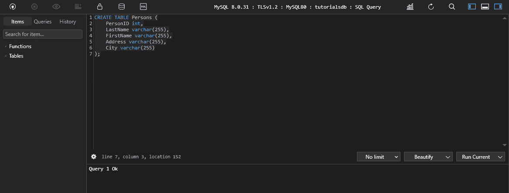

我使用这个查询来创建表:

```
CREATE TABLE Persons (
    PersonID int,
    LastName varchar(255),
    FirstName varchar(255),
    Address varchar(255),
    City varchar(255)
); 
```

运行时，查询将创建表。

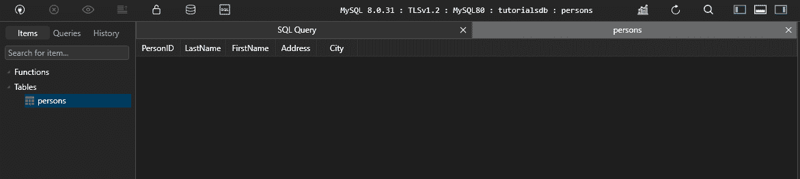

我们可以使用下面的 SQL 语句在`Persons`表中插入一条新记录:

```
INSERT INTO Persons (PersonID, LastName, FirstName, Address, City) 
VALUES (1, 'Wilson', 'John', '123 Main St.', 'Anytown'); 
```

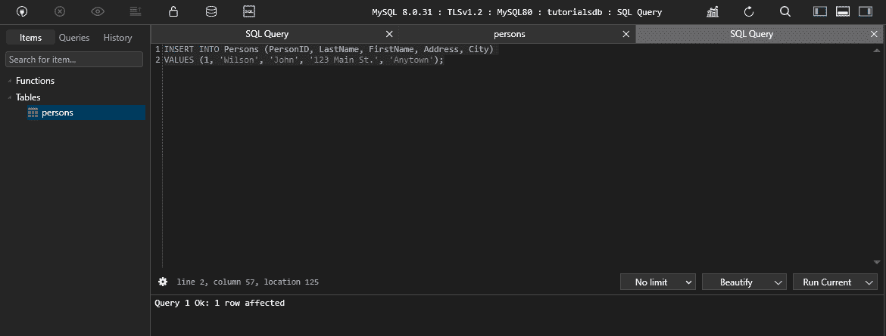

以下是插入了数据的表格:

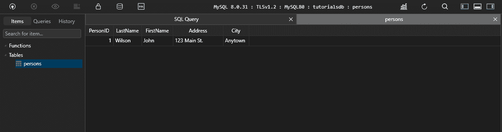

## 如何用`INSERT`语句插入多条记录

我们可以使用一条 SQL 语句将多条记录插入到一个表中。以下 SQL 语句将三条新记录插入到`Persons`表中:

```
INSERT INTO Persons (PersonID, LastName, FirstName, Address, City)
VALUES (1, 'Wilson', 'John', '123 Main St.', 'Anytown'),
       (2, 'Smith', 'Mary', '456 Maple St.', 'Anytown'),
       (3, 'Jones', 'David', '789 Elm St.', 'Anytown'),
       (4, 'John', 'David', '789 Elm St.', 'Meru'); 
```

在 TablePlus 上运行查询时，它看起来像这样:

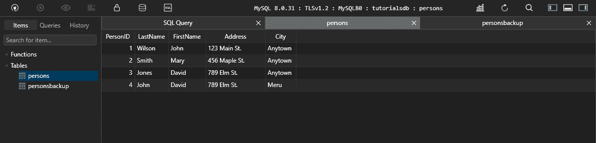

以下是插入了数据的表格:

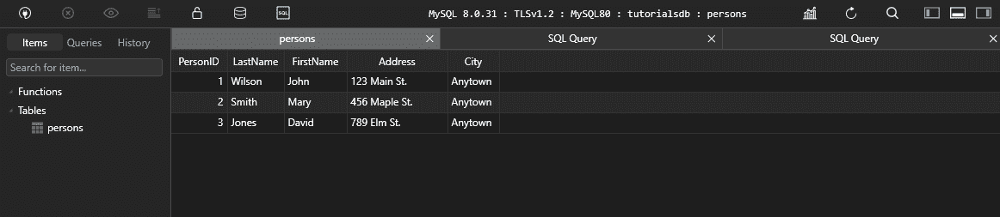

## 如何从另一个表中插入记录

我们可以使用 SQL INSERT INTO SELECT 语句将另一个表中的记录插入到一个表中。

以下 SQL 语句将所有记录从`Persons`表插入到`PersonsBackup`表中:

```
INSERT INTO PersonsBackup
SELECT * FROM Persons; 
```

为了运行这个查询，我们需要创建一个名为`PersonsBackup`的新表:

```
CREATE TABLE PersonsBackup (
    PersonID int,
    LastName varchar(255),
    FirstName varchar(255),
    Address varchar(255),
    City varchar(255),
    PRIMARY KEY (PersonID)
); 
```

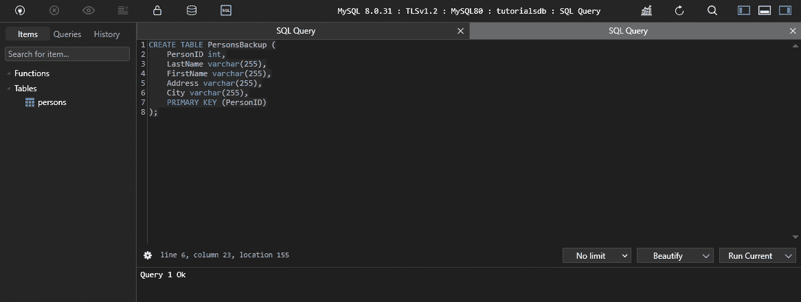

现在我们可以运行查询，将`Persons`表中的记录插入到`PersonsBackup`表中:

```
INSERT INTO PersonsBackup
SELECT * FROM Persons; 
```

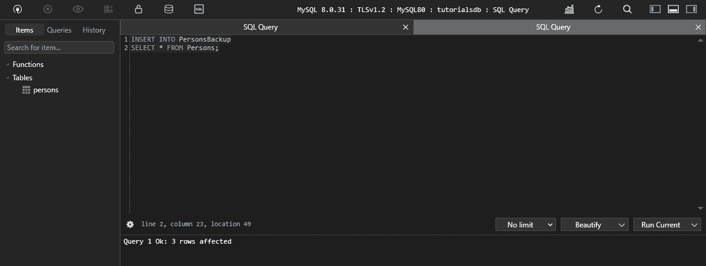

以下是插入了数据的表格:

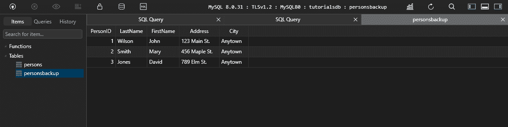

## 如何从 SELECT 语句中插入记录

我们可以使用 SQL INSERT INTO SELECT 语句将 SELECT 语句中的记录插入到表中。以下 SQL 语句将所有记录从`Persons`表插入到`PersonsBackup`表中:

```
INSERT INTO PersonsBackup
SELECT * FROM Persons; 
```


以下是插入了数据的表格:


## 如何使用 WHERE 子句插入 SELECT 语句中的记录

通过使用 SQL INSERT INTO SELECT 语句，我们可以从带有 WHERE 子句的 SELECT 语句向表中插入记录。

以下 SQL 语句将`Persons`表中的所有记录插入到`PersonsBackup`表中，其中`City`为`Anytown`:

让我们首先从`PersonsBackup`表中删除记录:

```
DELETE FROM PersonsBackup; 
```


现在记录已经被删除，我们可以将记录从`Persons`表插入到`PersonsBackup`表中，其中`City`是`Anytown`:

```
INSERT INTO PersonsBackup
SELECT * FROM Persons WHERE City = 'Anytown'; 
```

将`Persons`表中的记录插入到`PersonsBackup`表中，其中`City`为`Anytown`:

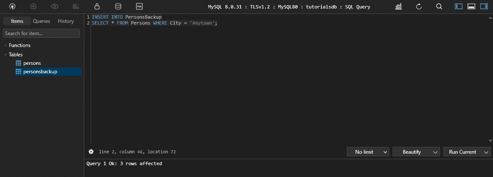

以下是插入了数据的表格:


## 如何从带有 WHERE 子句和 LIMIT 子句的 SELECT 语句中插入记录

通过使用 SQL INSERT INTO SELECT 语句，我们可以从带有 WHERE 子句和 LIMIT 子句的 SELECT 语句向表中插入记录。

以下 SQL 语句将`Persons`表中的前 10 条记录插入到`PersonsBackup`表中，其中`City`为`Anytown`:

让我们首先在`Persons`表中创建至少 10 条记录，其中`City`是`Anytown`:

```
INSERT INTO Persons(PersonID, LastName, FirstName, Address, City) 
VALUES (5, 'Wilson', 'John', '123 Main St.', 'Anytown'),
       (6, 'Smith', 'Mary', '456 Maple St.', 'Anytown'),
       (7, 'Jones', 'David', '789 Elm St.', 'Anytown'),
       (8, 'John', 'David', '789 Elm St.', 'Anytown'),
       (9, 'Wilson', 'John', '123 Main St.', 'Anytown'),
       (10, 'Smith', 'Mary', '456 Maple St.', 'Anytown'),
       (11, 'Jones', 'David', '789 Elm St.', 'Anytown'),
       (12, 'John', 'David', '789 Elm St.', 'Anytown'),
       (13, 'Wilson', 'John', '123 Main St.', 'Anytown'),
       (14, 'Smith', 'Mary', '456 Maple St.', 'Anytown'); 
```

这些值已被插入到`Persons`表中:

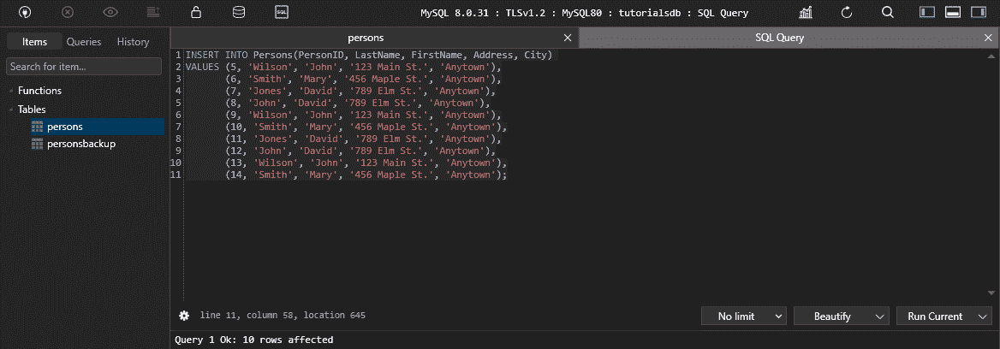

该表现在有 14 条记录:

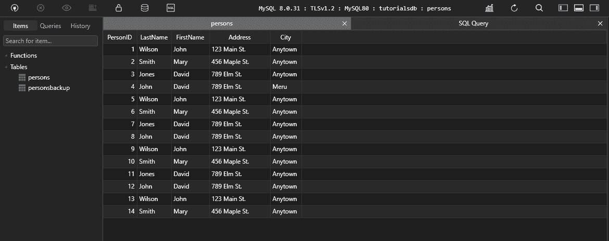

我们还可以添加城市名不是`Anytown`的记录:

```
INSERT INTO Persons(PersonID, LastName, FirstName, Address, City)
VALUES (15, 'Jones', 'David', '789 Elm St.', 'New York'),
       (16, 'John', 'David', '789 Elm St.', 'New York'),
       (17, 'Wilson', 'John', '123 Main St.', 'New York'),
       (18, 'Smith', 'Mary', '456 Maple St.', 'New York'); 
```

这些值已被插入到`Persons`表中:

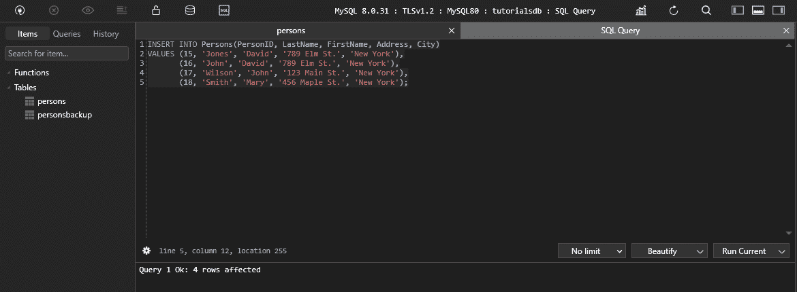

不同城市的数据已经插入到`Persons`表中:

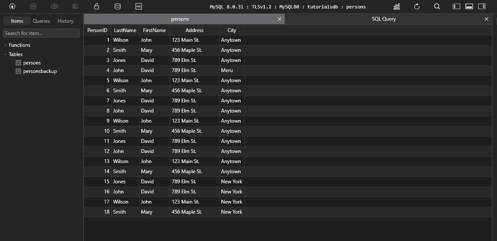

现在我们在`Persons`表中至少有 10 条记录，其中`City`是`Anytown`，我们可以将`Persons`表中的前 10 条记录插入到`PersonsBackup`表中，其中`City`是`Anytown`:

我们将首先从`PersonsBackup`表中删除记录:

```
DELETE FROM PersonsBackup; 
```

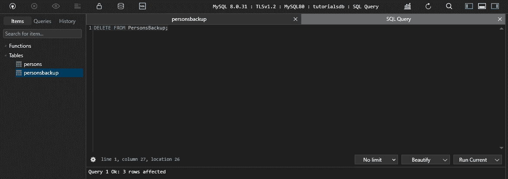

`PersonsBackup`表现在是空的:

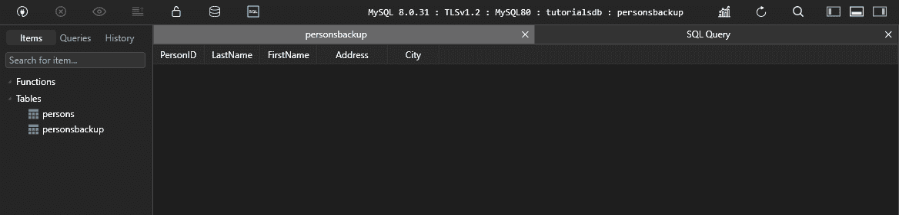

我们现在可以将前 10 条记录从`Persons`表插入到`PersonsBackup`表中，其中`City`是`Anytown`:

```
INSERT INTO PersonsBackup
SELECT * FROM Persons WHERE City = 'Anytown' LIMIT 10; 
```

您使用 limit 子句来限制插入到`PersonsBackup`表中的记录数量。在这种情况下，我们将把前 10 条记录从`Persons`表插入到`PersonsBackup`表中，其中`City`是`Anytown`。

您使用 where 子句来指定将记录插入到`PersonsBackup`表时必须满足的条件。在这种情况下，`City`必须是`Anytown`，才能将记录插入到`PersonsBackup`表中。

当我们运行上面的查询时，e `Persons`表中的前 10 条记录将被插入到`PersonsBackup`表中，其中`City`是`Anytown`:

运行上面的查询:

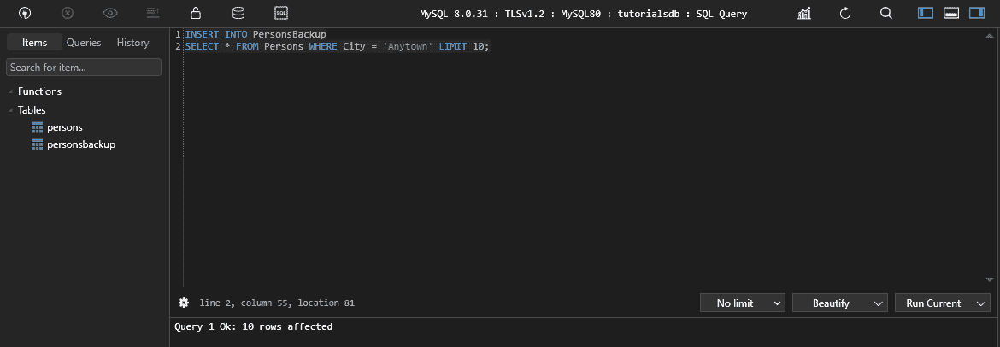

记录已被插入到`PersonsBackup`表中:

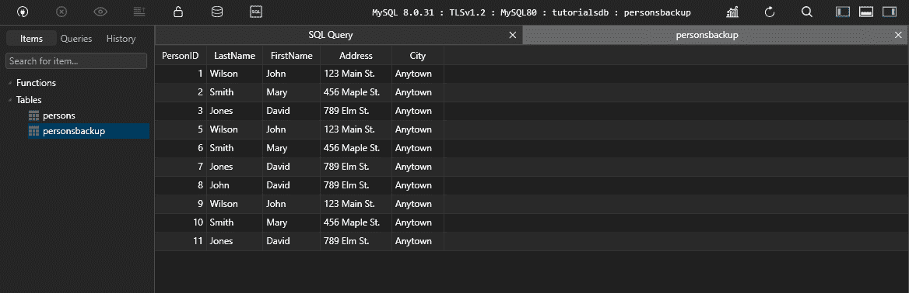

## 如何从带有 WHERE 子句和 ORDER BY 子句的 SELECT 语句中插入记录

我们可以使用 SQL INSERT INTO SELECT 语句将带有 WHERE 子句和 ORDER BY 子句的 SELECT 语句中的记录插入到表中。

下面的 SQL 语句将`Persons`表中的所有记录插入到`PersonsBackup`表中，其中`City`是`Anytown`，并按`LastName`对记录进行排序。

让我们首先删除`PersonsBackup`表中的记录:

```
DELETE FROM PersonsBackup; 
```

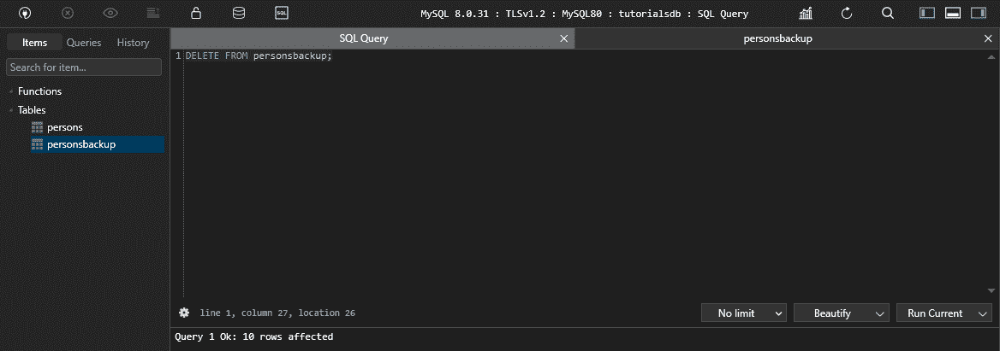

`PersonsBackup`表现在是空的。

现在，我们可以将`Persons`表中的所有记录插入到`PersonsBackup`表中，其中`City`为`Anytown`，并按`LastName`对记录进行排序:

```
INSERT INTO PersonsBackup
SELECT * FROM Persons WHERE City = 'Anytown' ORDER BY LastName; 
```

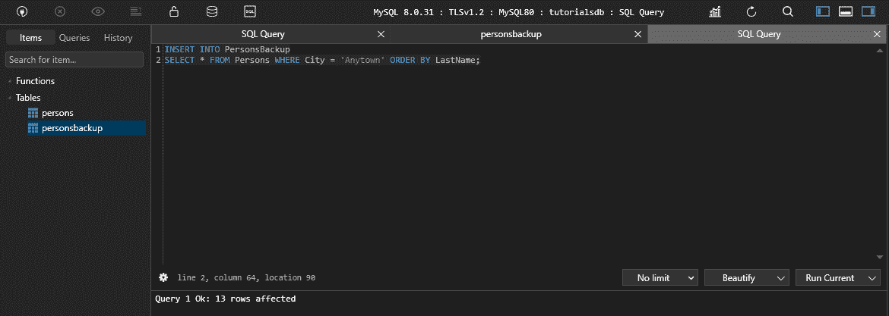

以下是运行查询之前的`Persons`表:

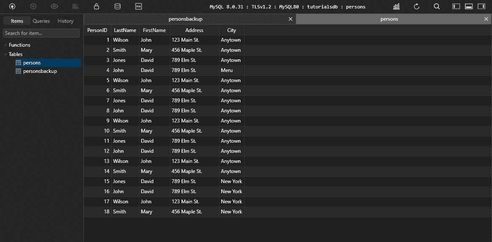

以下是插入记录后的`PersonsBackup`表:

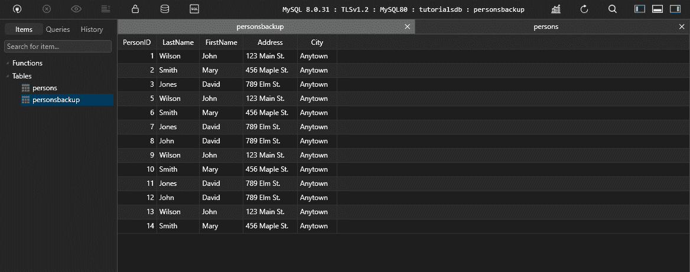

## 如何从带有 WHERE 子句、ORDER BY 子句和 LIMIT 子句的 SELECT 语句中插入记录

通过使用 SQL INSERT INTO SELECT 语句，我们可以从带有 WHERE 子句、ORDER BY 子句和 LIMIT 子句的 SELECT 语句向表中插入记录。

下面的 SQL 语句将`Persons`表中的前 10 条记录插入到`PersonsBackup`表中，其中`City`是`Anytown`，并按`LastName`对记录进行排序。

首先，让我们从`PersonsBackup`表中删除记录:

```
DELETE FROM PersonsBackup; 
```

在您的数据库管理工具上运行上面的查询。我用的是 TablePlus。

运行删除查询后，结果如下:

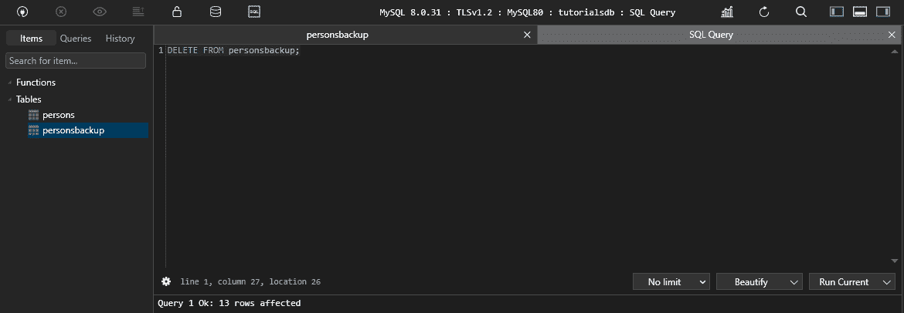

`PersonsBackup`表现在是空的。

```
INSERT INTO PersonsBackup
SELECT * FROM Persons WHERE City = 'Anytown' ORDER BY LastName LIMIT 10; 
```

在 TablePlus 上运行上述查询:

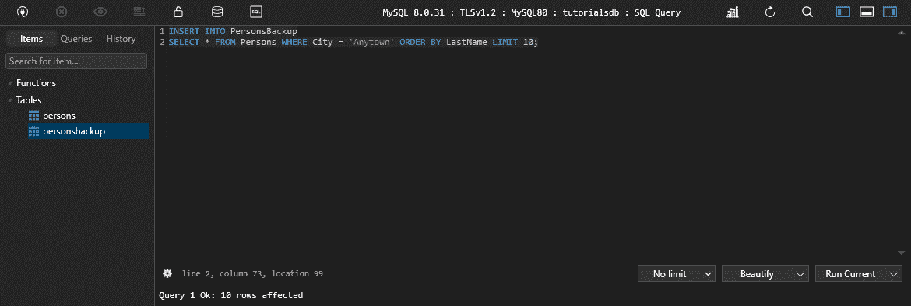

以下是插入记录后的`PersonsBackup`表:

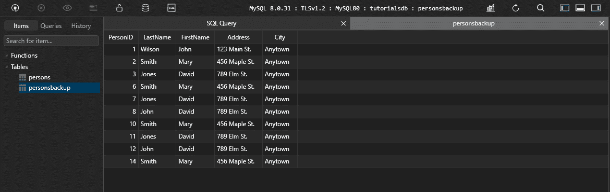

## 如何从带有 WHERE 子句、ORDER BY 子句、LIMIT 子句和 OFFSET 子句的 SELECT 语句中插入记录

通过使用 SQL INSERT INTO SELECT 语句，我们可以从带有 WHERE 子句、ORDER BY 子句、LIMIT 子句和 OFFSET 子句的 SELECT 语句中插入记录。

下面的 SQL 语句将`Persons`表中的记录插入到`PersonsBackup`表中，其中`City`为`Anytown`。它按照`LastName`对记录进行排序，将记录限制为 10 条，并跳过前 5 条记录。

我们将从`OFFSET`子句开始。`OFFSET`子句用于跳过第一个`n`记录。在这种情况下，我们将跳过前 5 条记录。

首先，让我们从`PersonsBackup`表中删除记录:

```
DELETE FROM PersonsBackup; 
```

在您的数据库管理工具上运行上面的查询。

运行删除查询后，结果如下。


```
INSERT INTO PersonsBackup
SELECT * FROM Persons WHERE City = 'Anytown' ORDER BY LastName LIMIT 10 OFFSET 5; 
```

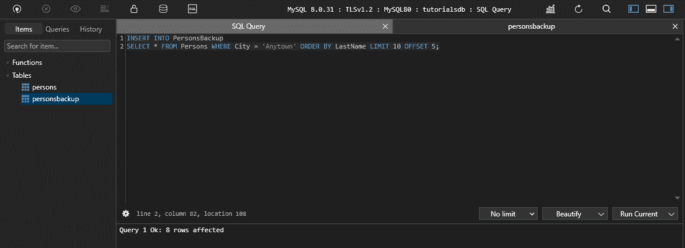

由于我们已经跳过了前 5 条记录，`Persons`表中的前 5 条记录没有插入到`PersonsBackup`表中。这意味着 13 条记录中只有 8 条被插入到`PersonsBackup`表中，其中城市等于任何城镇。

## 结论

在本教程中，您已经学习了如何使用 SQL INSERT INTO 语句向表中插入记录。

您还学习了如何通过使用 SQL INSERT INTO SELECT 语句，使用 SELECT 语句将记录插入到表中。

如果你想了解更多关于 SQL 的知识，可以看看这个课程: [SQL 教程——初学者全数据库课程](https://www.youtube.com/watch?v=HXV3zeQKqGY&t=5s)。在 freeCodeCamp 的 YouTube 频道上是免费的。