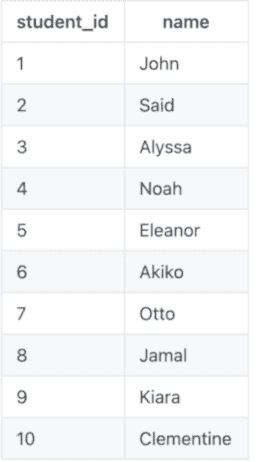
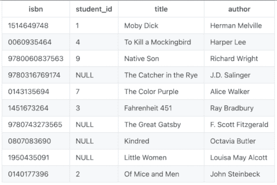
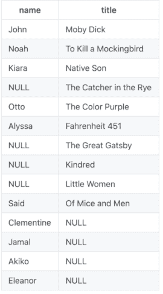

# SQL 外部连接教程–语法示例

> 原文：<https://www.freecodecamp.org/news/sql-outer-join-tutorial-with-example-syntax/>

## 什么是 SQL 连接？

在 SQL 中，联接用于根据两个或多个表之间共享的列来联合它们的行。

有四种不同类型的连接:`INNER JOIN`、`LEFT JOIN`、`RIGHT JOIN`和`FULL OUTER JOIN`。在这篇文章中，我们将讨论`FULL OUTER JOIN`。

## 什么是 SQL 中的完全外连接？

`FULL OUTER JOIN`(又名`OUTER JOIN`)用于返回在左*或右*表中有值的所有记录。

例如，客户表和订单表的完全外部联接可能返回所有客户，包括没有任何订单的客户，以及所有订单。已经下订单的客户将使用他们的客户 id 号与他们的订单结合在一起。

完整的外部联接可能会返回大量数据，因此在使用它之前，请考虑一种更保守的方法是否能满足您的需要。

## 样本数据集

想象一下，你正在教一门美国文学课。你有十个学生，你想让他们每个人从预先批准的经典美国小说列表中选择一本不同的书。一些学生已经选择了他们将要读的书，而另一些学生还没有这样做。

您已经创建了一个表，其中列出了学生及其学号，另一个表中列出了书籍及其标题、作者、ISBN 和将要阅读该书的学生的 ID(如果有人选择了该书)。



Students table



Books table

## 如何在 SQL 中进行外部连接

要对样本数据进行外部连接，我们可以使用以下查询:

```
SELECT students.name, books.title
FROM students
FULL OUTER JOIN books ON students.student_id=books.student_id;
```

在这个例子中，我们从`students`表中选择名字，从`books`表中选择书名。使用两个表中的`student_id`列来匹配记录。

结果看起来像这样:



使用完整的外部连接，我们能够看到所有的学生，包括那些还没有选择书的学生。我们还可以看到所有的书，包括那些还没有被选中的书。

在我们的示例中，您可以使用这些数据来查看谁仍然需要决定购买一本书，以及哪些书仍然可供他们选择。

## 结论

在 SQL 中使用完整的外部连接可以帮助您获得多个相关表中数据的完整视图。

但是，请记住，对于大型数据集，该查询可能会返回大量难以处理的信息，因此请明智地使用这种能力！