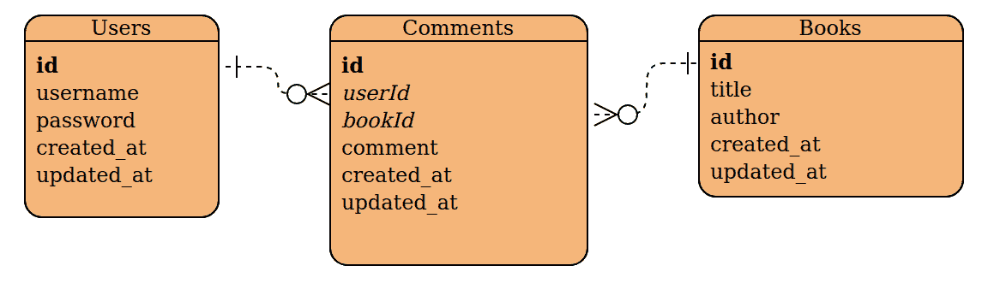

# 用这 5 个简单的食谱学习 SQL

> 原文：<https://www.freecodecamp.org/news/sql-recipes/>

SQL(结构化查询语言)是一种用于处理关系数据库中的数据的强大而富有表现力的语言。但对于外行人来说，这似乎令人望而生畏。

我今天要和你分享的“食谱”是来自一个简单数据库的一些基本例子。但是您将在这里学到的模式可以帮助您编写精确的查询。这些会让你立刻感觉自己就像一个数据大厨。

关于语法的一个注意事项:下面的大多数查询是以 psql 命令行中 PostgreSQL 所使用的风格编写的。不同的 SQL 引擎可以使用稍微不同的命令。

尽管一些引擎或 GUI 工具可能需要省略表名和列名的引号，但下面的大多数查询应该可以在大多数引擎中运行，无需调整。

## 第 1 道菜:返回在特定日期范围内创建的所有用户

### 佐料

*   挑选
*   从
*   在哪里
*   和

### 方法

```
SELECT *
FROM "Users"
WHERE "created_at" > "2020-01-01"
AND "created_at" < "2020-02-01";
```

这道简单的菜是一种多用途的主食。这里我们通过用一个`AND`语句链接`WHERE`条件来返回满足两个特定条件的用户。我们可以用更多的`AND`语句进一步扩展这一点。

虽然这里的示例针对特定的日期范围，但是大多数查询都需要某种条件来有效地过滤数据。

## 第二道菜:找到一本书的所有评论，包括发表评论的用户

### (新)成分

*   加入

### 方法

```
SELECT "Comments"."comment", "Users"."username"
FROM "Comments"
JOIN "Users"
ON "Comments"."userId" = "Users"."id"
WHERE "Comments"."bookId" = 1;
```

该查询假定了以下表结构:



ERD showing Users that can have many Comments, and Books that can also have many Comments

使用连接从关联表中查找数据可能会让 SQL 新手感到困惑。

上面的 ERD(实体关系图)显示了三个表，用户、书籍和评论，以及它们之间的关联。

每个表都有一个`id`，在图中用**粗体**表示它是表的主键。该主键始终是唯一的值，用于区分表中的记录。

Comments 表中的*斜体*列名`userId`和`bookId`是外键，这意味着它们是其他表中的主键，在这里用于引用这些表。

上面 ERD 中的连接器还显示了 3 个表之间的关系的性质。

连接器上的单点端表示“一”，连接器上的拆分端表示“多”，因此用户表与注释表具有“一对多”的关系。

例如，一个用户可以有许多评论，但是一个评论只能属于一个用户。书和评论在上图中有相同的关系。

基于我们现在所知道的，SQL 查询应该是有意义的。我们只返回指定的列，即 Comments 表中的 comment 列和关联 Users 表中的 username(基于引用的外键)。在上面的例子中，我们将搜索限制在一本书上，同样基于 Comments 表中的外键。

## 第三道菜:统计每个用户添加的评论数量

### (新)成分

*   数数
*   如同
*   分组依据

### 方法

```
SELECT "Users"."username", COUNT("Comments"."id") AS "CommentCount"
FROM "Comments"
JOIN "Users"
ON "Comments"."userId" = "Users"."id"
GROUP BY "Users"."id";
```

这个小查询做了一些有趣的事情。最容易理解的是`AS`语句。这允许我们任意地、临时地重命名返回的数据中的列。这里我们重命名派生的列，但是当您有多个`id`列时也很有用，因为您可以将它们重命名为`userId`或`commentId`等等。

`COUNT`语句是一个 SQL 函数，如您所料，它对事物进行计数。这里我们计算与用户相关的评论数量。它是如何工作的？嗯，`GROUP BY`是重要的最终成分。

让我们简单地想象一个稍微不同的查询:

```
SELECT "Users"."username", "Comments"."comment"
FROM "Comments"
JOIN "Users"
ON "Comments"."userId" = "Users"."id";
```

注意，没有计数或分组。我们只想要每个评论和谁做的。

输出可能如下所示:

```
|----------|-----------------------------|
| username | comment                     |
|----------|-----------------------------|
| jackson  | it's good, I liked it       |
| jackson  | this was ok, not the best   |
| quincy   | excellent read, recommended |
| quincy   | not worth reading           |
| quincy   | I haven't read this yet     |
------------------------------------------
```

现在，假设我们想要统计杰克逊和昆西的评论——这很容易看出来，但是如果数据集更大，就更难了。

`GROUP BY`语句实际上告诉查询将所有的`jackson`记录作为一个组，将所有的`quincy`记录作为另一个组。然后，`COUNT`函数对该组中的记录进行计数，并返回该值:

```
|----------|--------------|
| username | CommentCount |
|----------|--------------|
| jackson  | 2            |
| quincy   | 3            |
---------------------------
```

## 第四道菜:找到没有发表评论的用户

### (新)成分

*   左连接
*   为空

### 方法

```
SELECT "Users"."username"
FROM "Users"
LEFT JOIN "Comments"
ON "Users"."id" = "Comments"."userId"
WHERE "Comments"."id" IS NULL;
```

各种连接可能会变得非常混乱，所以我不会在这里展开它们。这里有一个很好的分类:[SQL 连接的可视化表示](https://www.codeproject.com/Articles/33052/Visual-Representation-of-SQL-Joins)，这也解释了各种风格或 SQL 之间的一些语法差异。

让我们快速想象一下这个查询的另一个版本:

```
SELECT "Users"."username", "Comments"."id" AS "commentId"
FROM "Users"
LEFT JOIN "Comments"
ON "Users"."id" = "Comments"."userId";
```

我们仍然有`LEFT JOIN`,但是我们添加了一列并删除了`WHERE`子句。

返回的数据可能如下所示:

```
|----------|-----------|
| username | commentId |
|----------|-----------|
| jackson  | 1         |
| jackson  | 2         |
| quincy   | NULL      |
| abbey    | 3         |
------------------------
```

所以杰克逊负责评论 1 和 2，阿比负责评论 3，昆西没有评论。

一个`LEFT JOIN`和一个`INNER JOIN`(到目前为止我们一直称之为`JOIN`，这是有效的)之间的区别在于，内部连接只显示两个表都有值的记录。另一方面，左连接返回第一个或左表(即`FROM`表)中的所有内容，即使右表中没有任何内容。因此，内部联接将只显示 Jackson 和 Abbey 的记录。

既然我们可以可视化`LEFT JOIN`返回的内容，那么就更容易推断出`WHERE...IS NULL`部分做了什么。我们只返回那些 commentId 为空值的用户，我们实际上不需要在输出中包含空值列，因此最初省略了它。

## 第 5 道菜:在一个字段中列出每个用户添加的所有评论，用竖线隔开

### (新)成分

*   GROUP_CONCAT 或 STRING_AGG

### 方法(MySQL)

```
SELECT "Users"."username", GROUP_CONCAT("Comments"."comment" SEPARATOR " | ") AS "comments"
FROM "Users"
JOIN "Comments"
ON "Users"."id" = "Comments"."userId"
GROUP BY "Users"."id";
```

### 方法(Postgresql)

```
SELECT "Users"."username", STRING_AGG("Comments"."comment", " | ") AS "comments"
FROM "Users"
JOIN "Comments"
ON "Users"."id" = "Comments"."userId"
GROUP BY "Users"."id";
```

这个最终的配方展示了两个最流行的 SQL 引擎中类似函数的语法差异。

下面是我们可能期望的输出示例:

```
|----------|---------------------------------------------------|
| username | comments                                          |
|----------|---------------------------------------------------|
| jackson  | it's good, I liked it | this was ok, not the best |
| quincy   | excellent read, recommended | not worth reading   |
----------------------------------------------------------------
```

我们在这里可以看到，评论已经被分组和连接/聚合，即在单个记录字段中连接在一起。

## **好** **胃口**

既然您有一些 SQL 食谱可以依靠，发挥创造力，提供您自己的数据菜肴吧！

我喜欢把`WHERE`、`JOIN`、`COUNT`、`GROUP_CONCAT`想象成数据库烹饪的*盐、脂肪、酸、热*。一旦你知道你在用这些核心元素做什么，你就在通往精通的路上。

如果这是一个有用的收集，或者你有其他喜欢的食谱分享，给我留言或者在 Twitter 上关注: [@JacksonBates](https://twitter.com/jacksonbates) 。