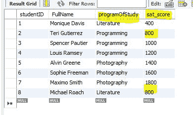
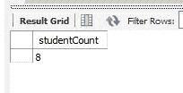
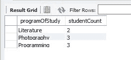
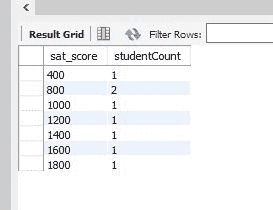
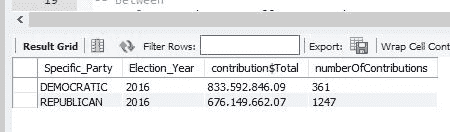

# SQL 选择计数聚合函数——用语法示例解释

> 原文：<https://www.freecodecamp.org/news/sql-select-count-aggregate-function-explained-example/>

计数运算符通常与 GROUP BY 子句结合使用。它是 SQL“聚合”函数之一，包括 AVG(平均值)和求和。

该函数将计算行数，并将该计数作为结果集中的一列返回。

以下是您可以使用 COUNT 的示例:

*   对表中的所有行进行计数(不需要 group by)
*   计算数据子集的总数(需要语句的 Group By 部分)

作为参考，下面是我们的示例学生数据库中所有行的当前数据。

```
select studentID, FullName, programOfStudy, sat_score from student; -- all records with fields of interest 
```



此 SQL 语句提供所有行的计数。请注意，您可以使用“AS”为结果计数列命名。

```
select count(*) AS studentCount from student; -- count of all records 
```



这里我们得到了每个研究领域的学生人数。

```
 select studentID, FullName, count(*) AS studentCount from the student table with a group by programOfStudy; 
```



这里我们得到了 SAT 分数相同的学生人数。

```
select studentID, FullName, count(*) AS studentCount from the student table with a group by sat_score; 
```



下面是一个使用活动资金表的示例。这是 2016 年美国总统竞选期间，每笔交易的美元和每个政党的捐款数量的总和。

```
select Specific_Party, Election_Year, format(sum(Total_$),2) AS contribution$Total, count(*) AS numberOfContributions 
from combined_party_data
group by Specific_Party,Election_Year
having Election_Year = 2016; 
```



与所有这些事情一样，还有更多事情要做，所以请查看数据库管理员的手册，并享受自己尝试不同测试的乐趣。