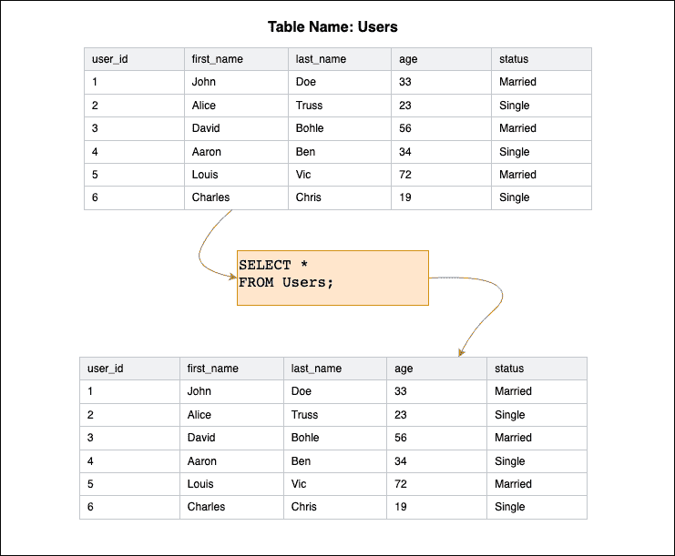
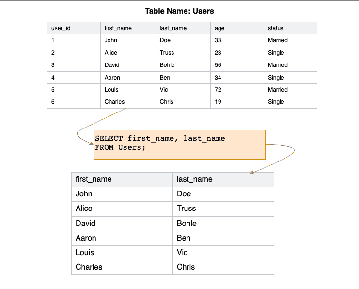
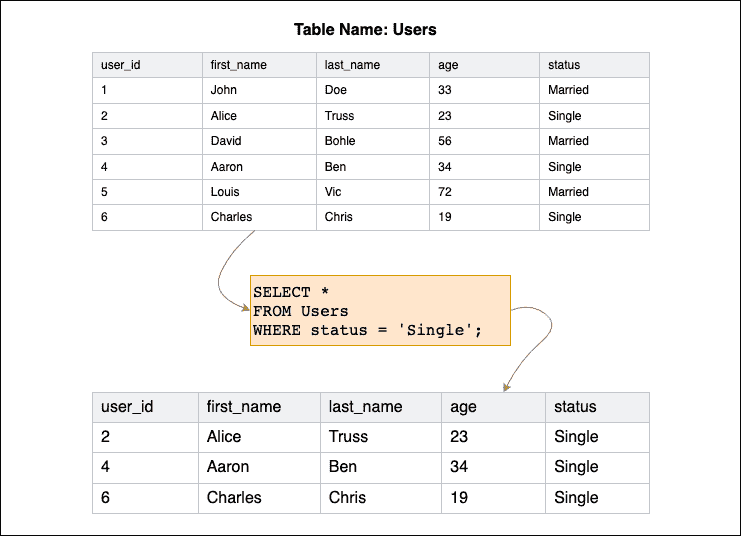
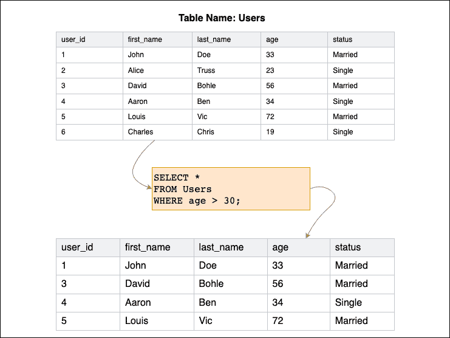
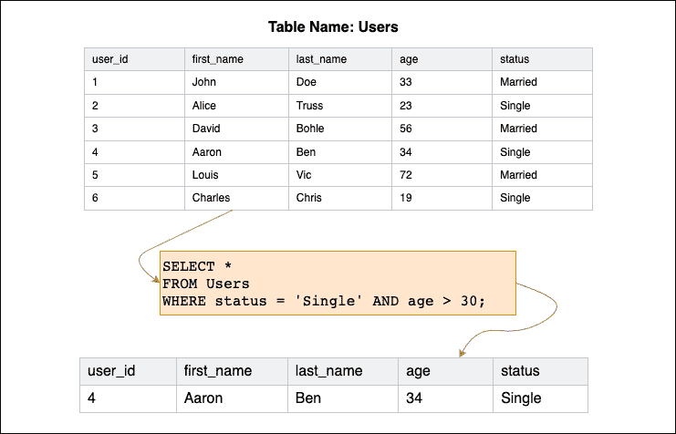
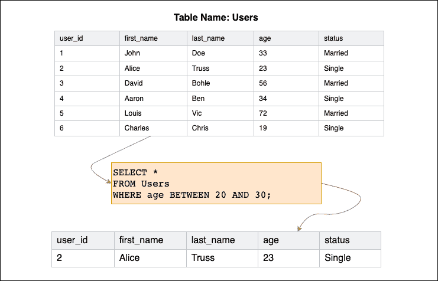
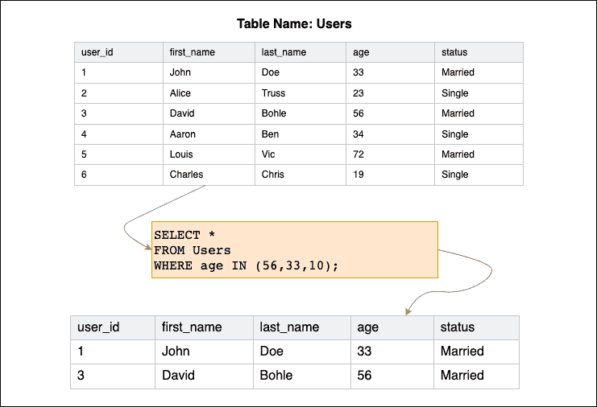
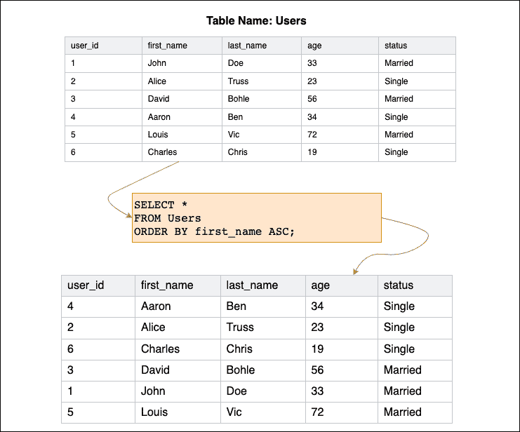

# SQL Select–语句和查询示例

> 原文：<https://www.freecodecamp.org/news/sql-select-statement-and-query-examples/>

结构化查询语言(SQL)是一种编程语言，用于管理关系数据库中的数据。您可以使用 SQL 在关系数据库中创建、读取、更新和删除(CRUD)数据。

您可以编写 SQL 查询，用 insert 插入数据，用 SELECT 读取数据，用 update 更新数据，用 delete 删除数据。

本文将教你如何编写 SQL 选择查询。您将学习编写这些查询的各种方法，以及预期的结果应该是什么。

## 如何使用 SQL SELECT 语句

您可以使用 SQL SELECT 语句从指定的数据库表中检索数据。

您可以用各种方式编写语句，以获得您想要的确切数据。这些数据是从数据库表中提取的，并以表格的形式返回。

```
// Syntax

SELECT expression(s)
FROM table(s)
[WHERE condition(s)]
[ORDER BY expression(s) [ ASC | DESC ]]; 
```

前面的代码是一个非常详细的语法，包含了很多信息，我将用例子来解释。

让我们从检查参数和自变量开始:

*   **表达式**:使用星号(`*`)表示要检索其数据的列或整个表的列。
*   **table(s)** :要从中检索记录的表的名称。FROM 子句必须至少包括一个表。
*   **WHERE 条件**:可选字段。这允许您指定一个条件，该条件将指导为指定的列检索数据。如果没有指定条件，将选择所有记录。
*   **ORDER BY expression(s)** :可选字段。这允许您声明一个列，其数据将用于对结果进行排序。如果您提供了多个表达式，则应该用逗号分隔这些值。
*   **ASC** :可选表达式值。ASC 按表达式以升序对结果集进行排序。如果未指定，这是默认行为。
*   **DESC** :可选的表达式值。DESC 按表达式对结果集进行降序排序。

## SQL 选择查询

假设您有一个名为“Users”的数据库，其中包含以下数据:

| 用户标识 | 名字 | 姓氏 | 年龄 | 状态 |
| --- | --- | --- | --- | --- |
| one | 约翰 | 母鹿 | Thirty-three | 已婚的 |
| Two | 爱丽丝 | 构架 | Twenty-three | 单一的 |
| three | 大卫 | 波希米亚人 | fifty-six | 已婚的 |
| four | ２８：１）　（圣经）亚伦（摩西之兄 | 本(男子名) | Thirty-four | 单一的 |
| five | 路易斯（号外乐团成员） | 维多利亚省（Victoria 的缩写） | seventy-two | 已婚的 |
| six | 查尔斯 | 克莉丝 | Nineteen | 单一的 |

现在让我们探索各种查询，看看它们是如何工作的。

### SQL 全选

您可能需要从数据库中选择所有列。您可以使用星号(`*`)字符，而不是列出每一列。

```
SELECT *
FROM Users; 
```

当您在用户的表上使用这个命令时，您的输出看起来会是这样的:



### SQL 选择指定的列

您也可以提取指定的列，而不是所有的列，方法是列出列并用逗号分隔它们:

```
SELECT first_name, last_name
FROM Users; 
```

当您在用户的表上使用这个命令时，您的输出看起来会是这样的:



### SQL Select WHERE 子句

您可能希望只返回满足特定条件的行。这个条件可以使用可选的`WHERE`子句来指定。`WHERE`子句允许您从数据库表中检索符合给定条件的记录。

例如，假设您只想获取状态为“单身”的用户:

```
SELECT *
FROM Users
WHERE status = 'Single'; 
```

当您在用户的表上使用这个命令时，您的输出看起来会是这样的:



通常，WHERE 子句用于过滤结果。您也可以使用常见的运算符，如您使用的`=`，以及其他运算符，如`<`、`>`、`<=`、`>=`、`AND`、`BETWEEN`和`IN`。

### 使用等式运算符选择

假设您只想获取年龄大于 30 岁的用户。那么您的查询将是:

```
SELECT *
FROM Users
WHERE age > 30; 
```

当您在用户的表上使用这个命令时，您的输出看起来会是这样的:



你也可以使用其他的等式操作符，比如`<`、`<=`和`>=`。

### 使用 AND 运算符进行选择

您可能经常想要使用多个条件来过滤表的内容。您可以使用 AND 运算符来实现这一点。

```
SELECT *
FROM Users
WHERE status = 'Single' AND age > 30; 
```

当您在用户的表上使用这个命令时，您的输出看起来会是这样的:



### 使用 BETWEEN 运算符进行选择

您可以使用 BETWEEN 运算符来获取要筛选的数据范围。您可以决定使用等号和 and 运算符，但是 BETWEEN 提供了更好的语法。

```
SELECT *
FROM Users
WHERE age BETWEEN 20 AND 30; 
```

当您在用户的表上使用这个命令时，您的输出看起来会是这样的:



### 使用 IN 运算符进行选择

另外，`IN`操作符允许您为过滤每一行设置多个精确的基础。例如，您只能提取值在定义的括号内的行:

```
SELECT *
FROM Users
WHERE age IN (56,33,10); 
```

当您在用户的表上使用这个命令时，您的输出看起来会是这样的:



### SQL Select ORDER BY 子句

到目前为止，您已经学习了如何使用 SQL 从表中提取数据，但是您会注意到这些数据总是遵循原始顺序。您可以使用 ORDER BY 子句调整提取数据的顺序。

两个主要选项是升序(`ASC`)和降序(`DESC`)。例如，您可能希望表格的行根据`first_name`以升序排列:

```
SELECT *
FROM Users
ORDER BY first_name ASC; 
```

当您在用户的表上使用这个命令时，您的输出看起来会是这样的:



> **注意:**您可以在一个查询中组合这些选项和子句，以获取您想要的内容。

## 结束了！

在本文中，您了解了如何使用 SQL SELECT 查询从关系数据库中检索数据。其他选项也是可用的，但这些是您最有可能经常使用的选项。

祝编码愉快！