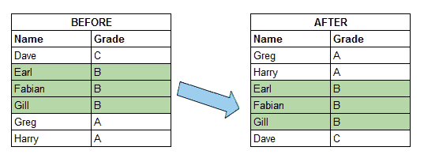
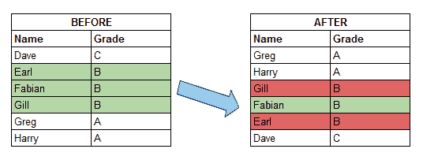

# 排序算法的稳定性——平等待遇

> 原文：<https://www.freecodecamp.org/news/stability-in-sorting-algorithms-a-treatment-of-equality-fa3140a5a539/>

Onel Harrison 著

# 排序算法的稳定性——平等待遇

算法是计算机科学的核心。用于排序的算法是最基本、最有用的，因此也是最普遍的。

> 算法——解决特定问题的一组有限的明确步骤。

我们经常无意识地排序，并依赖于分组对象的顺序。例如，我们根据优先级对列表中的任务进行排序。我们把书按高度堆放在书架上。我们对电子表格或数据库中的行进行排序，或者依靠字典中单词的字母顺序。有时，我们甚至在有序的排列中感知到某种美。


Photo by [Mikael Kristenson](https://unsplash.com/photos/6GjHwABuci4?utm_source=unsplash&utm_medium=referral&utm_content=creditCopyText) on [Unsplash](https://unsplash.com/search/photos/order-placement?utm_source=unsplash&utm_medium=referral&utm_content=creditCopyText)

作为程序员，知道**我们如何**排序是很重要的，因为它会影响排序后的排列看起来是什么样子。并不是所有的排序方式都一样！因此，排序操作的结果会因使用的算法而异。如果这不被承认，我们可能会让我们自己或使用我们软件的人感到惊讶。

排序算法的稳定性是其中的一个显著特征。它处理算法如何处理具有相同排序关键字的可比较项目。

> 分类关键字——用于确定集合中项目顺序的关键字，例如年龄、身高、在字母表中的位置等。

**稳定的排序算法**保持排序关键字相等的项目的相对顺序。不稳定的排序算法不会。换句话说，当使用稳定的排序算法对集合进行排序时，具有相同排序键的项在集合排序后会保持它们的顺序。

### 示例、代码和演示



Image showing the effect of stable sorting

上图展示了稳定排序的效果。在左边，数据按名字的字母顺序排列。按等级对数据进行排序后，您可以看到具有相同等级的每一行都保持了名称的字母顺序。



Image showing the effect of unstable sorting

如果排序不稳定，就不能保证按字母顺序排序，如上图所示。

#### 你并不总是需要一个稳定的排序

知道你使用的排序是否稳定是特别重要的。尤其是当您的数据已经有了一定的顺序，而您希望在用另一个排序关键字对其进行排序时保持这种顺序时。例如，在包含学生数据的电子表格中有一些行，默认情况下，这些行按姓名排序。您还希望在保持姓名排序顺序的同时，按等级对其进行排序。

另一方面，当集合中对象的排序键是对象本身时，排序的稳定性并不重要——例如，整数或字符串的数组——因为我们无法区分重复键之间的区别。

```
// JavaScript
```

```
// $5 bucks if you can correctly tell which 4 in the sorted// array was the first 4 when the array was unsorted.
```

```
var numbers = [5, 4, 3, 4, 9];numbers.sort(); // [3, 4, 4, 5, 9]
```

```
// A one second trip around the world, courtesy of the Flash, to// whomever correctly tells me which 'harry' in the sorted array was// the second 'harry' in the unsorted array.
```

```
var names = ['harry', 'barry', 'harry', 'cisco'];names.sort(); // ['barry', 'cisco', 'harry', 'harry']
```

#### 分类无处不在——了解你的分类

很容易发现编程语言或库中的默认排序是否稳定。文档应包含此信息。比如[默认排序在 Python 中是稳定的](https://wiki.python.org/moin/HowTo/Sorting)，[在 Ruby 中是不稳定的](https://ruby-doc.org/core-2.0.0/Enumerable.html#method-i-sort)，[未定义](http://www.ecma-international.org/ecma-262/7.0/index.html#sec-array.prototype.sort)？[在 JavaScript 中](http://www.ecma-international.org/ecma-262/7.0/index.html#sec-array.prototype.sort)(取决于浏览器的实现)。

以下是一些常见的排序算法及其稳定性:

*   插入排序—稳定
*   选择排序—不稳定
*   冒泡排序—稳定
*   合并排序—稳定
*   外壳排序—不稳定
*   Timsort —稳定

参见[维基百科](https://en.wikipedia.org/wiki/Sorting_algorithm#Stability)获得更详尽的列表。

#### 演示时间到了？‍?

[这个演示](https://onelharrison.com/sort-stability-demo/)展示了使用稳定(插入排序)和不稳定排序(选择排序)算法对一个小数据表进行排序的效果。我有一点乐趣，并几乎逆向工程反应，而建立这个。看一下[来源](https://github.com/onelharrison/sort-stability-demo)。

### 下一步是什么？

如果你渴望了解更多关于其他排序算法稳定性的知识，维基百科有一个很好的对照表和关于众所周知的排序算法的附加信息。

下次再见，和平。

#### 学到了新东西或者喜欢阅读这篇文章？拍手叫好？，分享它，以便其他人也可以阅读，并跟进更多。也可以随意发表评论。