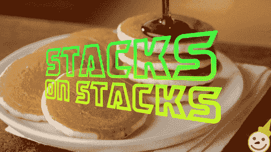

# 如何使用堆栈数据结构解决编码难题

> 原文：<https://www.freecodecamp.org/news/stack-data-structure-solve-coding-challenges/>

堆栈数据结构经常在编程中使用，有时在幕后使用。而涉及栈数据结构的问题在编码面试中非常常见。

我们刚刚在 freeCodeCamp.org YouTube 频道上发布了一门课程，将教你如何使用堆栈数据结构来解决许多技术性工作面试中出现的编码挑战。

堆栈是一种数据结构，只允许从一端(称为顶部)添加或删除项目。这种结构通常用于以后进先出(LIFO)的顺序存储项目。

在本课程中，您将学习如何掌握数据结构。课程从 LeetCode 和 InterviewBit 上的简单问题开始，慢慢建立你的直觉，这样你就能使用堆栈解决难题。而且所有的问题都是 Google，Meta，微软等等的热门面试问题！

Tanishq Chaudhary 开发了这个课程。Tanishq 已经帮助数千人准备编码面试。

该课程分为三个主要部分，每个部分都充满了编码面试问题。以下是课程大纲:

### 第 0 部分-简介

*   堆栈数据结构课程介绍
*   Python3 和 C++中的堆栈实现直觉+代码
*   简化路径| InterviewBit | LeetCode
*   最小堆栈| InterviewBit | LeetCode

### 第 1 部分–括号

*   括号问题介绍
*   有效括号| InterviewBit | LeetCode
*   多余的大括号| InterviewBit
*   生成有效括号的最小移除量| LeetCode
*   最长有效括号| LeetCode

### 第 2 部分–计算器

*   计算器问题介绍
*   将中缀转换为后缀
*   评估反向波兰符号| InterviewBit | LeetCode
*   基本计算器 I、II、III | LeetCode

Not this type of stack.

观看 freeCodeCamp.org YouTube 频道的全部课程(2 小时观看)。

[https://www.youtube.com/embed/O1KeXo8lE8A?feature=oembed](https://www.youtube.com/embed/O1KeXo8lE8A?feature=oembed)