# 2020 年堆栈溢出开发者调查——65，000 名开发者分享他们的薪水、顶级编程语言等

> 原文：<https://www.freecodecamp.org/news/stack-overflow-developer-survey-2020-programming-language-framework-salary-data/>

Stack Overflow 刚刚发布了他们 2020 年对超过 65，000 名开发者的调查结果。

就像 Stack Overflow 过去的调查一样，我梳理了他们的结果，并为您总结了这些结果，以及我作为开发人员和教师的个人分析。

这篇文章将给你一个 2020 年软件开发职业的快照。

请注意，在本文中，我将只关注专业开发人员的调查结果，而不是学生和其他尚未开始从事开发工作的人。

如果你想了解刚刚进入软件开发领域的人，我建议你也看看 [freeCodeCamp 最近对 31，000 名开发人员的新程序员调查](https://www.freecodecamp.org/news/the-2018-new-coder-survey-31-000-people-told-us-how-theyre-learning-to-code-and-getting-dev-jobs-e10feb9ed419/)。

还要注意，我正在等待 Stack Overflow 来公开整个调查响应数据集(他们通常在发布结果摘要几周后这样做)。一旦他们做到这一点，我将链接到这里，我可能会有一些额外的数据可视化。

在这篇文章中，我分享了 Stack Overflow 的官方数据可视化，以及我自己对它们及其意义的分析。

首先，本文将首先涵盖人口统计数据:年龄、教育背景和人们编码多久了。

其次，我将介绍开发人员最常用的工具，以及他们最感兴趣的工具。

最后，我将讨论开发人员的工资和工作满意度。

## 专业软件开发人员的平均年龄是多少？

大多数职业开发人员都是 20 多岁或 30 出头。但正如我们将看到的，印度开发商(有很多)将平均年龄拉低了不少。

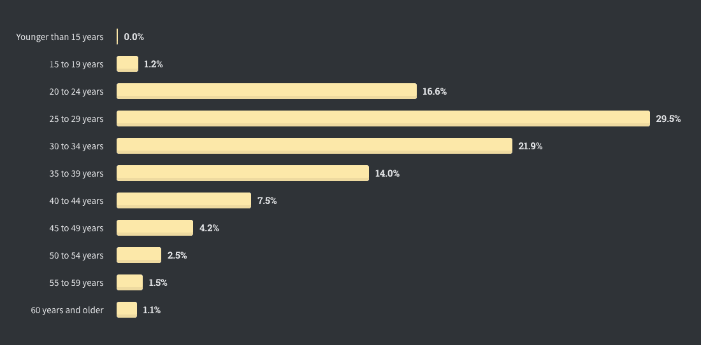

Developers do tend to be younger, with around 46% of them being in their 20s.

但是与流行的观念相反，编码不仅仅是年轻人的游戏。([我一直在竭尽全力消除这个神话](https://www.freecodecamp.org/news/stories-from-300-developers-who-got-their-first-tech-job-in-their-30s-40s-and-50s-64306eb6bb27/))。每 20 名开发人员中就有 1 名年龄在 50 岁或以上。

美国的开发者往往比其他国家的开发者年龄更大，平均年龄接近 34 岁。

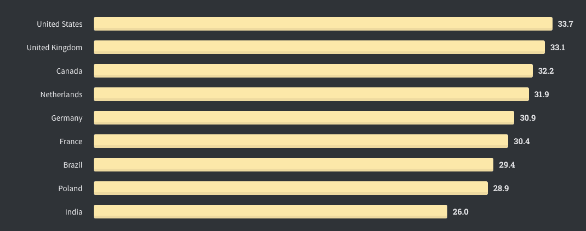

American developers are on average oldest, followed by developers in the UK and Canada. Indian developers are, on average, only 26 years old.

美国人似乎比其他国家的人更晚开始编码，平均只编码了大约 16 年——这意味着他们中的大多数人直到高中后才开始编码。

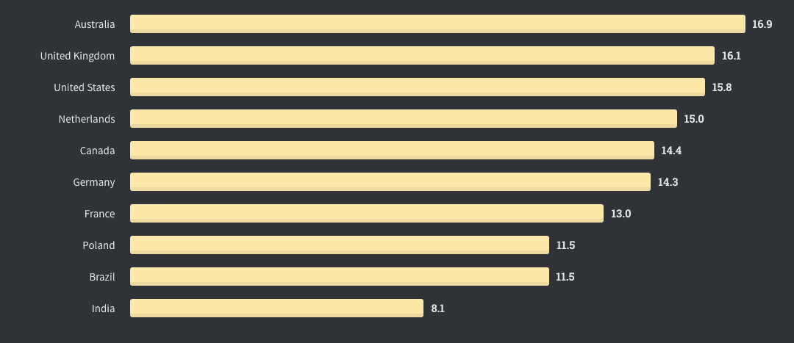

Australians have the most years of coding experience, at nearly 17 years on average.

当涉及到你的职业生涯时，额外的编码经验会带来很大的不同。

经理和主管往往有 14 年或更长的编码经验。

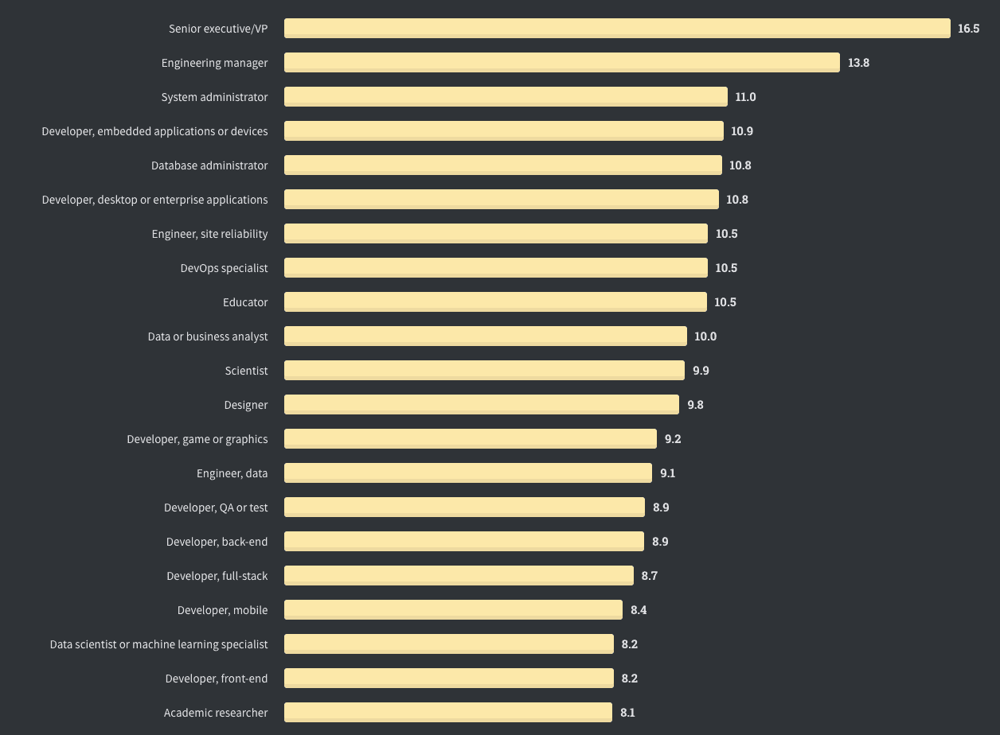

The number of years of professional coding experience, by job description.

即使对于前端开发人员和全栈开发人员——新开发人员最常见的第一份工作——人们平均也有 8 年以上的编码经验。

请记住，许多人在这些角色中非常快乐，并在其中呆上数年。因此，这并不意味着普通开发人员在获得第一份完整的开发工作时，已经有了 8 年的编码经验。

大多数专业开发人员实际上在 5 到 14 年前就开始学习编码了:

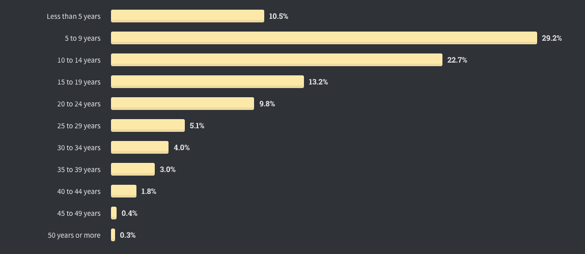

Number of years since professional developers first learned to code.

## 大多数职业开发者的学历是什么样的？

大约 75%的开发人员完成了大学本科学位，其中许多人还继续获得了研究生学位。

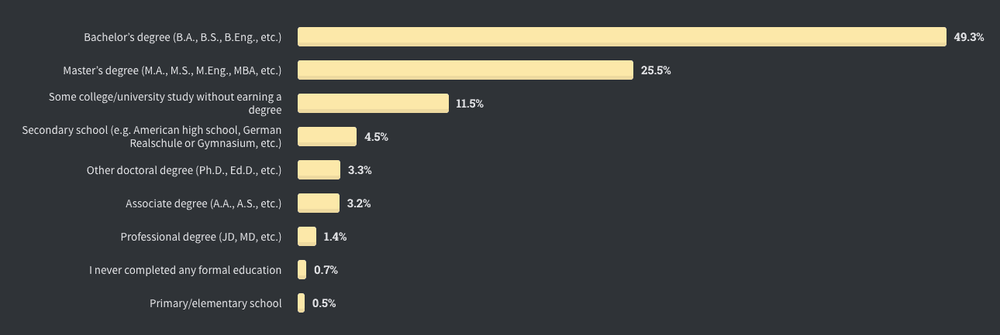

3%的专业开发人员在完成两年的助理学位后停止了学业，大约 17%的开发人员根本没有获得任何大学学位。

这使我想到两个要点:

1.  如果你没有上过大学，你并不孤单。很多专业开发人员没有上过大学。
2.  但是大多数专业开发人员确实上过大学。所以，在你试图效仿比尔·盖茨(Bill Gates)退出创业之前，或许要三思而行。

如果你正在上大学，你几乎肯定想主修计算机科学。这是目前为止美国薪酬最高的专业，也是专业开发人员中最常见的专业。

今年，Stack Overflow 决定将软件工程和计算机工程专业与计算机科学合并。但在过去的 8 年里，CS 一直是迄今为止最常见的专业。

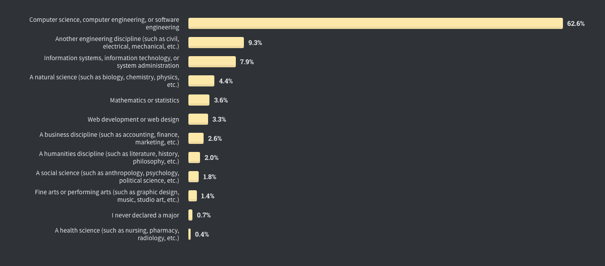

Statistically speaking, a computer science major is the surest path to a software developer career.

尽管如此，看到这里有这么多其他专业的代表还是令人兴奋的。4.4%的开发者来自自然科学，3.6%来自数学，大约 5%来自文科和美术，甚至还有健康科学专业的学生。

### 受访者来自哪些地区？

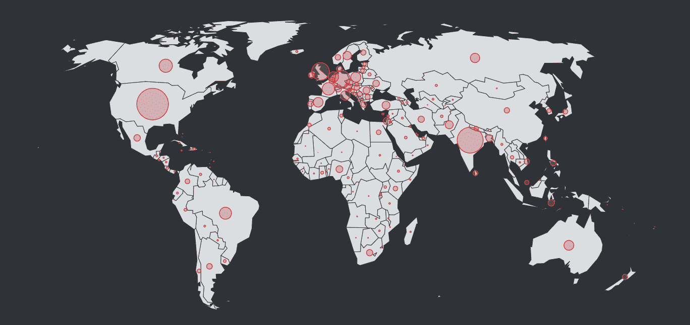

A map of survey respondents. The bigger the circle, the more respondents.

根据堆栈溢出，受访者的地区细分如下:

```
+-------------------+-----------+
|      Region       | Responses |
+-------------------+-----------+
| Europe            |    24,688 |
| North America     |    15,570 |
| Asia              |    16,400 |
| South America     |     3,070 |
| Africa            |     2,709 |
| Australia/Oceania |     1,570 |
+-------------------+-----------+
```

### 有多少受访者是女性？

只有 7.7%的职业开发人员认为自己是女性。但从积极的方面来看，这一数字高于 2019 年的 7.5%。

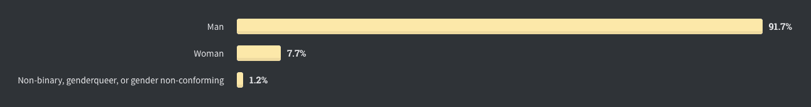

91.7% of the respondents who were professional developers identified as male.

## 有百分之多少的开发人员生活在身体或精神差异中？

相当多的开发人员视力受损或完全失明。我知道 freeCodeCamp 社区中有几个人使用屏幕阅读器工具编写代码。似乎堆栈溢出社区中的许多人也是如此。

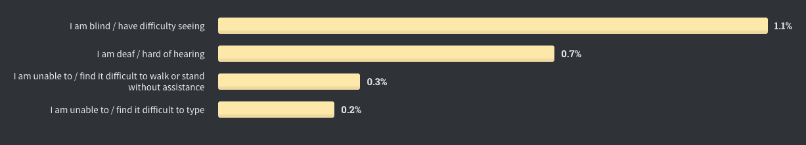

1.1% of respondents were blind or have difficulty seeing.

大约五分之一的受访者有心理健康或其他问题:

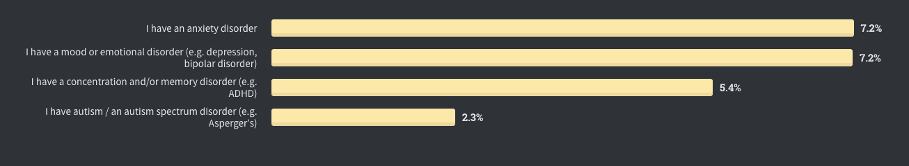

Anxiety and mood disorders are common among developers. Also, 2.3% have autism or are on the autism spectrum.

## 工具和技术:最常用的编程语言是 JavaScript

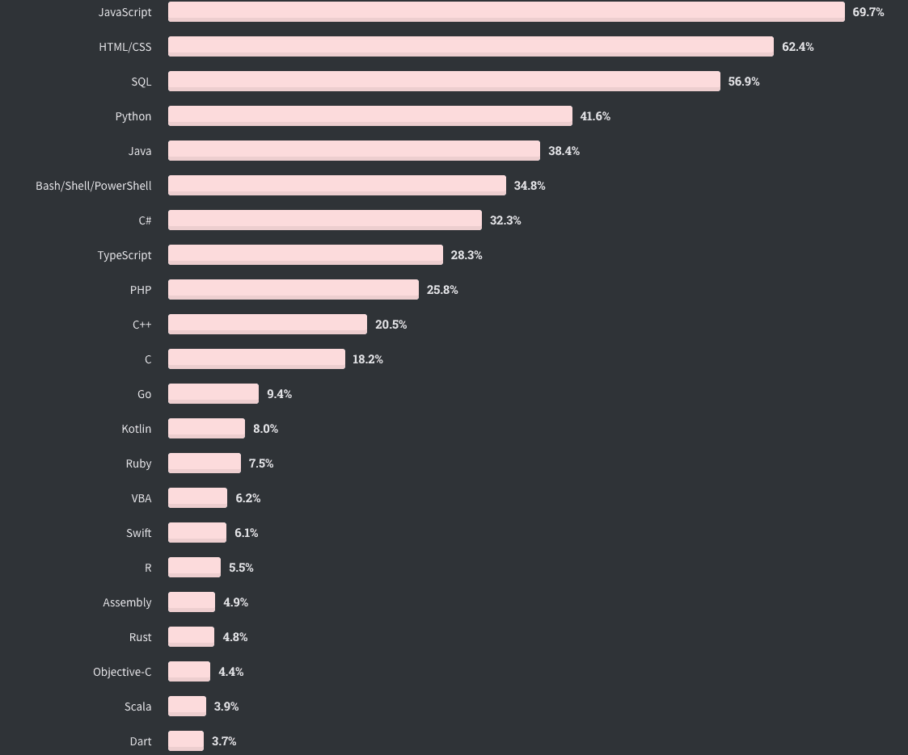

Nearly 70% of professional developers who responded to the 2020 Stack Overflow survey coded in JavaScript.

自 Stack Overflow 开始进行年度调查以来，JavaScript 一直是使用最多的技术。所以这个结果并不令人惊讶。

这就是说，有一些有趣的变化。Dart 似乎随着针对移动应用开发的 Flutter 的引入而增长。

Kotlin 作为 Java 开发的一种选择发展得相当快。

Python 似乎和以前一样健康，稍后我们会看到。

## 开发者最喜爱的编程语言

在过去的 4 年里，Rust 一直是开发者最喜爱的编程语言。这种高性能语言本月[刚满 5 岁](https://blog.rust-lang.org/2020/05/15/five-years-of-rust.html)，被 Mozilla Firefox 团队大量使用。

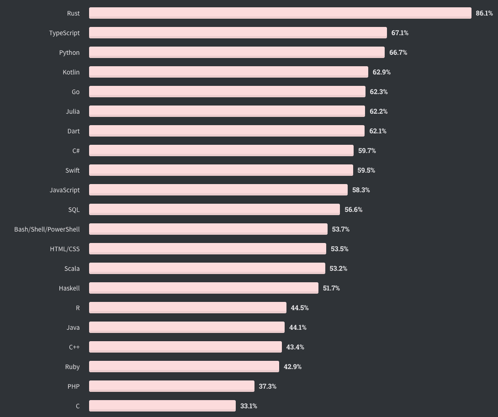

86% of developers have either started experimenting with Rust, or want to use it in the future.

TypeScript——JavaScript 的静态类型版本——也有热情的支持者，是第二受欢迎的语言。

## 开发人员接下来想要学习的编程语言

已经在使用其他编程语言的开发人员对学习 Python、JavaScript、Go 和 TypeScript 最感兴趣。

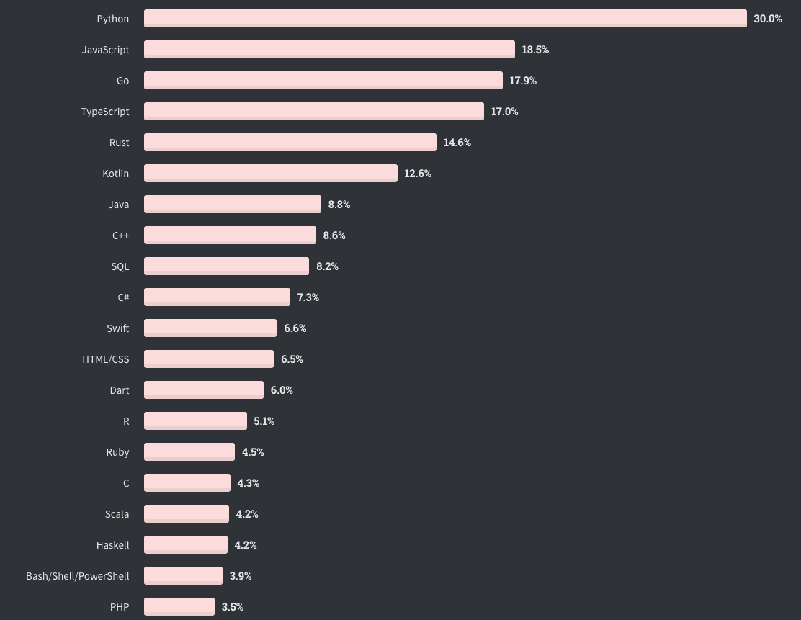

30% of developers haven't used Python yet, but want to, followed by 18.5% of developers who want to get started with JavaScript.

## 按开发者偏好排列的顶级数据库

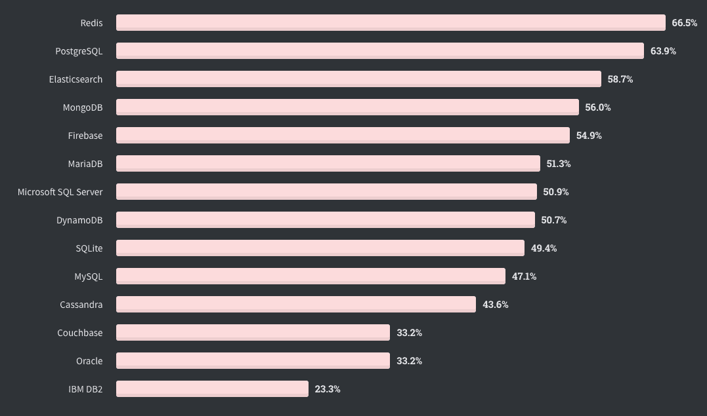

Redis, the in-memory database structure for storing key-value pairs, is the most-loved database. 66.5% of developers have either used it or want to use it on a future project. PostgreSQL – the popular relational database – is a close second.

就开发人员最想学习的数据库而言:

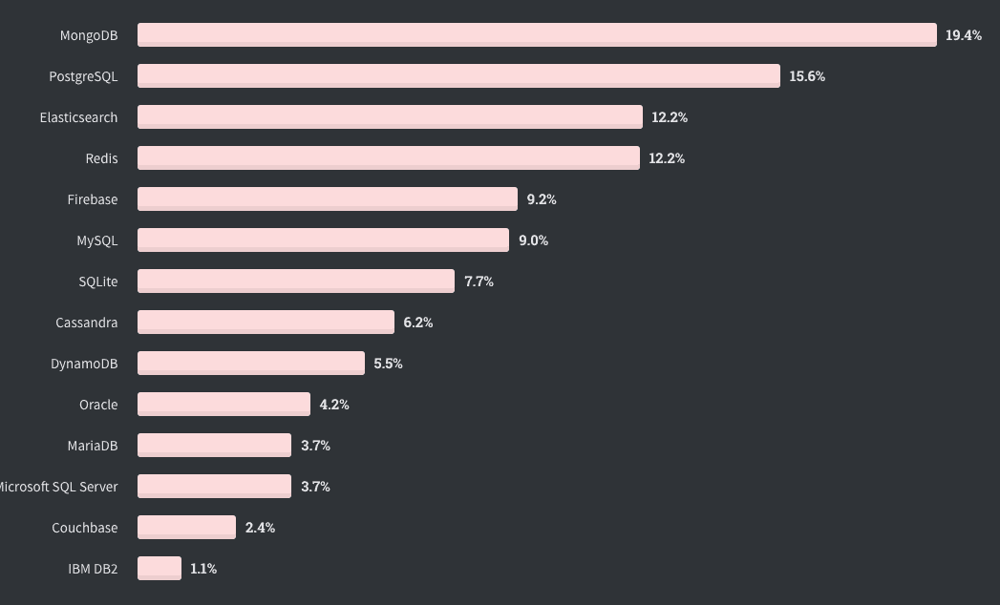

MongoDB is the "Most Wanted" database, with 19% of developers expressing interest in using it on their next project. PostgreSQL is a close second, at 15.6%.

## 开发者的顶级平台

Linux 是最受欢迎的平台，76.9%的开发者正在使用它，或者表示有兴趣在将来使用它。

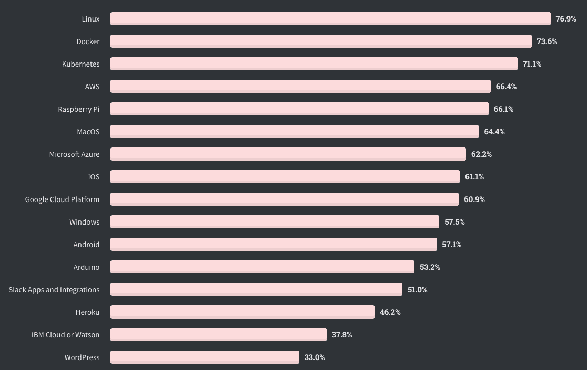

Linux wins with a healthy 77%.

Docker 和 Kubernetes 虽然不是操作系统，但也是构建应用程序的流行平台。在云平台方面，AWS 比 Azure 更受欢迎，Azure 比 Google 云平台和 IBM Cloud 更受欢迎。

就开发人员对平台感到兴奋而言，Docker 名列榜首，有 24.5%的开发人员希望在未来的项目中使用它。人们对 AWS 的兴趣也很高:

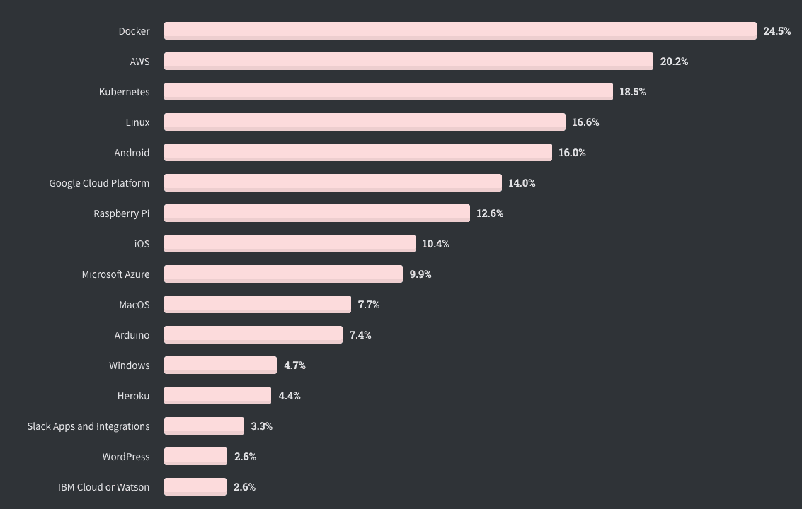

Nearly a quarter of all developers want to learn Docker.

## 大多数开发者用的是什么操作系统？

截至 2020 年，近一半(46%)的开发者仍然使用 Windows 作为他们的主要桌面操作系统。

MacOS 和 Linux 几乎并列第二。

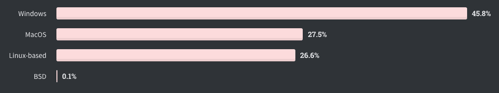

Nearly half of all developers use Windows as their primary desktop/laptop operating system.

有一小部分特立独行的人使用 BSD。如果你想了解更多，这里有一个 BSD 及其好处的快速概述。

## 顶级框架、库和开发工具

Node.js 再次成为最广泛使用的非语言、非操作系统、非数据库工具。

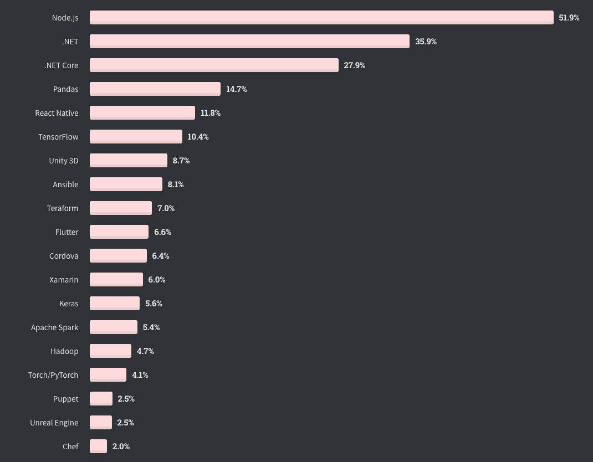

More than half of respondents use Node.js. About 1/3rd use the Microsoft .NET stack.

机器学习工具今年也变得越来越广泛使用。相当多的开发者在用 TensorFlow，Pandas，PyTorch。

这可能会让一些人感到惊讶，但 2020 年使用最广泛的 web 框架/库仍然是 jQuery。

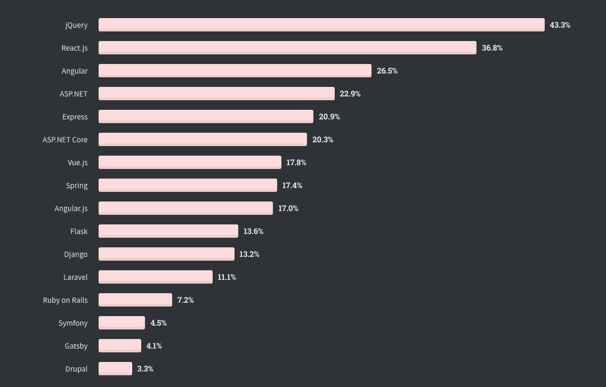

jQuery leads, followed closely by React. Angular isn't too far behind.

有相当多的老网站仍然在使用 jQuery，尽管许多开发者很想把它从他们的网站上去掉。

如果你正试图将你的网站脱离 jQuery，这个网站将向你展示如何使用普通的 JavaScript 复制 jQuery 功能。

这张图表的另一大要点是:

*   React 一直在稳步增长。
*   Vue.js 和 Angular 不会很快消失。它们仍然是广泛使用的前端框架。

## 开发者如何选择自己的工具？

这是今年堆栈溢出调查中的一个新问题:开发人员如何研究新工具并决定是否使用它们？

最流行的方法:如果它有免费试用版，就试一试。

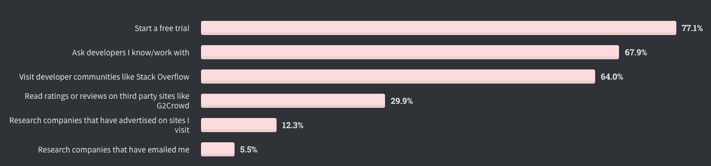

77% of developers will try a tool if it has a free trial. 68% will ask their fellow developers for their opinion of a tool. And only 30% of devs rely on review websites.

也就是说，大多数开发人员在决定他们的团队最终将使用哪些工具时并没有感觉到很大的权力。


57% of developers said they have at least some influence over tool decisions, and 43% of developers said they have little or no influence over the tools their team will ultimately adopt.

我怀疑其中的一个原因可能是大公司通常有首席信息官(CIO ),他们在机构层面做出企业软件许可购买决策。

也就是说，18%的开发者觉得他们有“很大的影响力”这一事实令人振奋。这个数字可能比 10 年前要高得多。

## 开发人员如何协同使用不同的技术

今年堆栈溢出调查中最酷的部分之一是数据可视化，它显示了开发人员最常与其他工具配对的工具。

这是集群。每个圆圈的大小对应于使用该工具的调查受访者的比例:

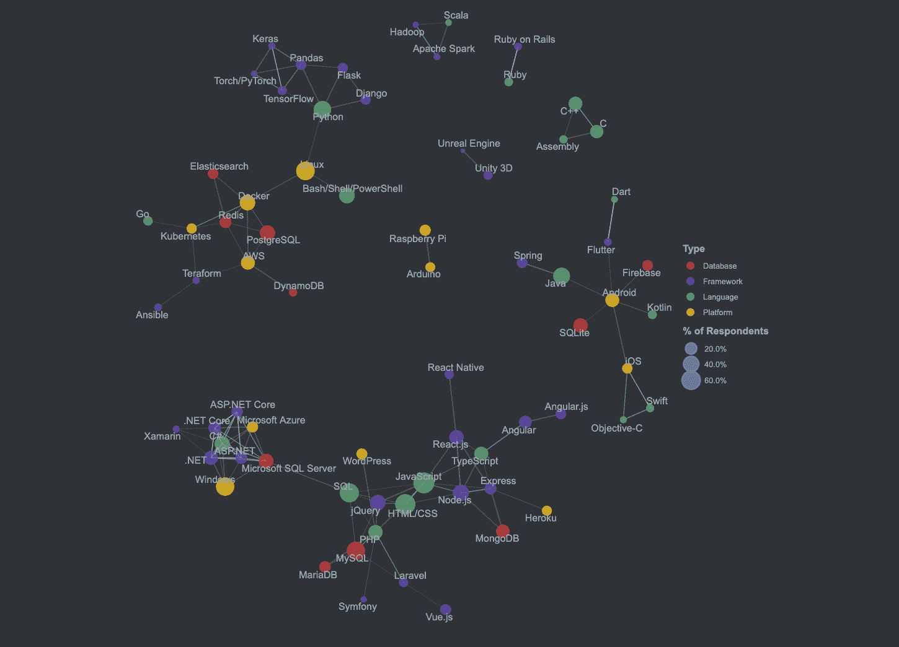

This network graph shows the relationships between usage of different tools. You can see several distinct ecosystems emerging.

Ruby 和 Rails 倾向于一起使用也就不足为奇了。NET 开发者倾向于在 Windows 机器和 Azure Cloud 上开发。

但是在这里我们也可以做一些有趣的观察。例如，MySQL 与 PHP 的联系更加紧密，这一事实提醒我们 LAMP 栈(Linux、Apache、MySQL、PHP)仍然是一个广泛使用的工具链。

相比之下，MongoDB 似乎是最广泛用于 JavaScript 生态系统工具的。

Angular 早在 2015 年就接受了 TypeScript，现在它更常与 TypeScript 联系在一起，而不是 JavaScript。

Dart 最初是谷歌的一个网络开发工具。由于 Flutter 框架的流行，它现在更常与移动应用程序开发联系在一起，而不是被并入 Angular。

在左上角，我们还可以看到一些 DevOps 和站点可靠性工程师最常用的工具。我们甚至可以看到与整个数据科学和机器学习领域的重叠。

我从这张图表中得出的结论可能过于宽泛。一旦他们发布了 Stack Overflow 的完整数据集，我很兴奋地去挖掘它，看看数据是否证实了这些观察。

## 开发人员多久学习一次新技术？

专业开发人员经常使用新工具。几乎他们中的大多数人似乎每年至少学习一项新技术。

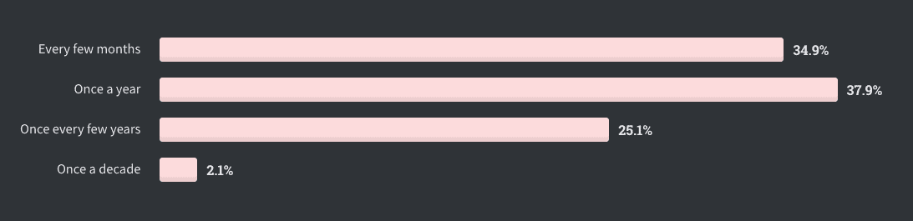

35% of developers learn a new technology every few months. That's much faster than in most professions, where Continuing Professional Education may constitute just a few days worth of learning each year.

## 工作生活:多大比例的开发人员是自雇的？

绝大多数职业开发人员为雇主工作。在 2020 年 2 月的调查中，只有不到 10%的人是自由职业者或合同工。

还要注意的是，每 8 个回答者中就有 1 个是学生，但即使是这些学生中的一些人也被认为是专业开发人员。这些学生可能已经在完成学业的同时获得了实习甚至全职开发人员的工作。

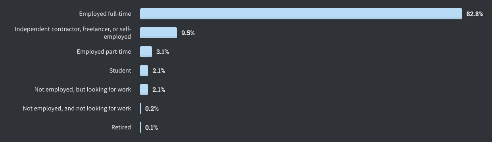

83% of professional developers work at an organization.

大多数开发人员在中小型企业(SMB)工作。只有大约 35%的人在员工超过 500 人的公司工作。

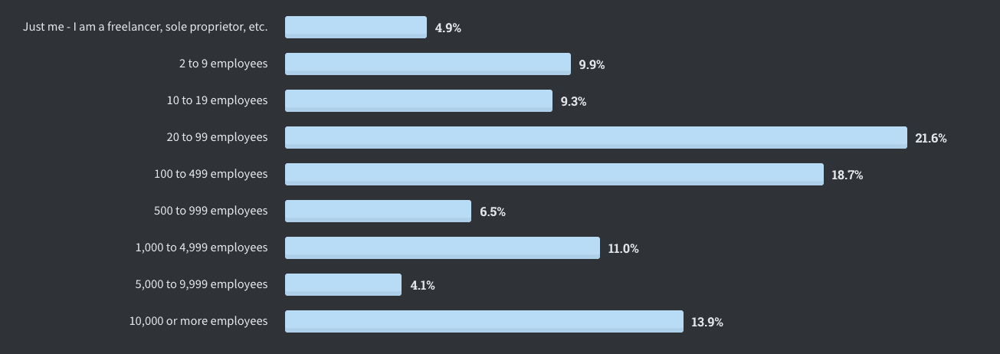

Nearly 2/3rds of developers work at companies with fewer than 500 employees, and only 13.9% work at large companies.

从某种角度来看，在 FAANG 软件公司中，谷歌、脸书、亚马逊和苹果都拥有超过 10，000 名员工。2019 年，网飞的员工不到 1 万人，现在可能不止这一数字。微软，由于某种原因没有包括在 FAANG 中(也许它会使首字母缩略词难以发音？)也有一万多名员工。

我的观点是，所有这些“名牌”软件公司和他们的同行只雇佣了大约 14%的开发人员。大多数开发人员都在你没听说过的公司工作。他们中的许多人甚至不在科技公司工作，而是在银行、医院和地方政府工作。截至 2020 年，几乎每个财富 1000 强公司都有软件工程师。

不到一半的受访者认为他们公司的新开发人员入职流程“良好”。

但其中约 65%的人对自己的工作感到满意。


Nearly 1/3rd were "very satisfied."

促使开发者开始寻找新工作的主要考虑因素？钱。这并不奇怪。

但令人惊讶的是，使用新技术的愿望排在第二位，高于增长和领导机会以及工作/生活平衡。

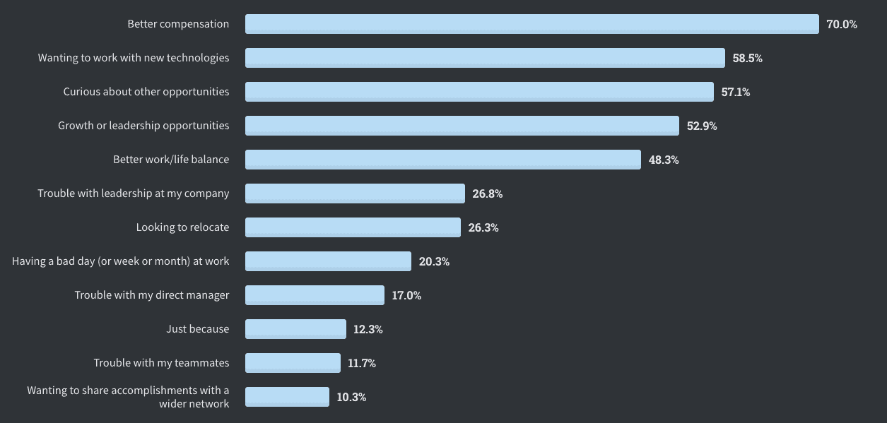

"Trouble with teammates" and "trouble with leadership at my company" were relatively uncommon reasons for people to want to leave. This would seem to suggest that most developers are chasing opportunity rather than fleeing unhappy workplaces.

当谈到工作满意度时，“语言、框架和其他我将使用的技术”是大多数开发人员的主要考虑因素。但是...只对男人。


对于参与调查的 3694 名女性来说，“办公室环境和公司文化”是最重要的考虑因素。他们将使用的技术是第三个考虑因素。

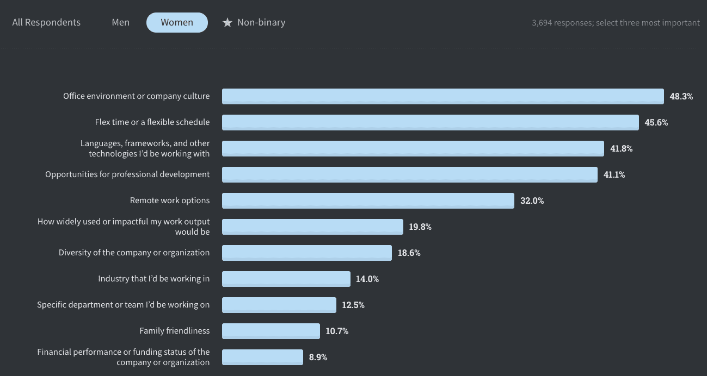

还有其他一些不同之处。对妇女来说，多样性是更重要的考虑因素。

## 2020 年开发者平均薪资是多少？

这是报告中一个非常酷的数据可视化。Y 轴是工资中位数，X 轴是编程经验年数。研究一下这个:

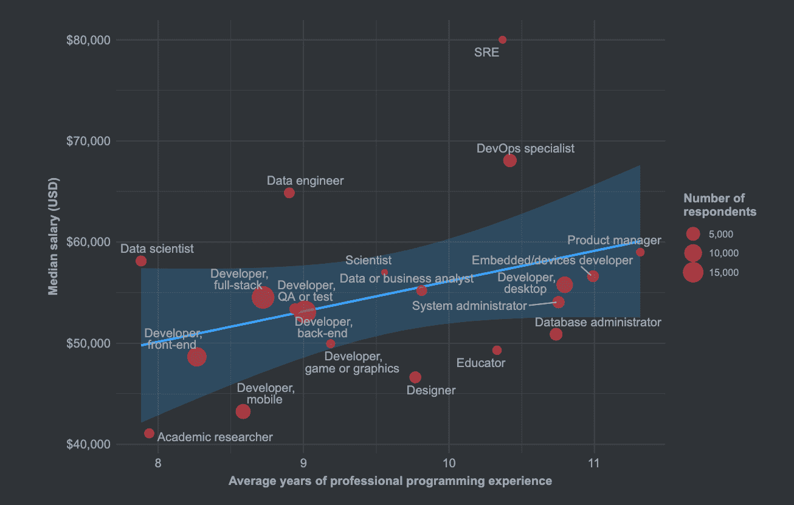

如果你想在职业生涯的早期获得高工资，DevOps 和站点可靠性工程似乎是你的金奖券。

但是在你匆忙开始阅读 Linux 页面之前，我必须指出:这里所有的工作都需要 7 到 12 年的专业编程经验。

我经常看到人们犯的一个错误是过早地专门化。你的第一份开发工作不太可能是 DevOps 工程师。最有可能的是，作为一个全栈开发者。根据老板分配给你的工作，你将从那里开始专攻工作。

但是这个图表是一个有用的指南，因为大量的回复和由此产生的统计意义。它可能会给你一些关于你应该向你的老板要求什么类型的开发团队责任的想法。

还要记住，这些数字是全球性的。这是全球薪资与美国薪资的差距，美国历来是全球薪资最高的开发者市场。

首先，不同职位的全球薪酬，基于 34，279 份调查反馈(以美元计):

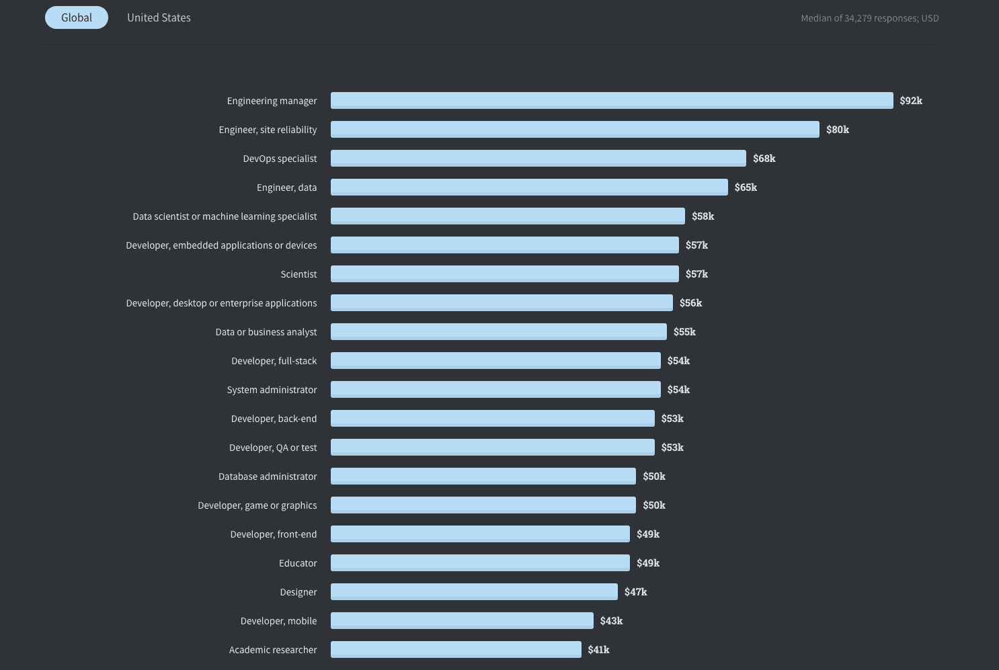

Management is still the best-paying job description represented here, with SRE coming in second.

以下是美国不同角色的工资，基于 8006 份回复:

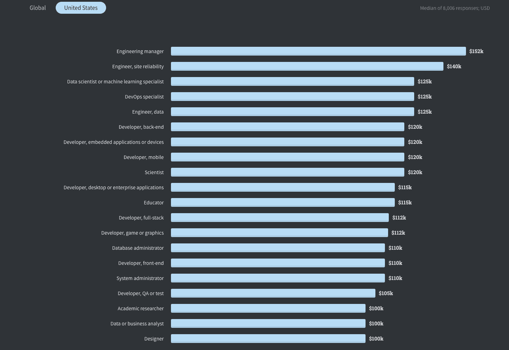

Management and SRE are still the highest paid jobs in the US.

美国开发商的收入比非美国同行高出 6 万美元。

从这些图表中你会注意到一件事:美国的后端开发人员似乎比全栈开发人员平均多挣 8000 美元，但全栈开发人员在美国以外挣得略多。

我不确定这是为什么，但我推测这是因为美国的软件业比其他大多数国家都要老。因此它具有更高的工作专业化程度。由于全栈开发是后端开发的一个超集，许多今天的全栈开发人员将专门从事这项工作，并成为明天的后端开发人员。

## 这些都是我在 Stack Overflow 的 2020 年开发者调查中的亮点

感谢阅读。有时间可以通读一下[全调查结果](https://insights.stackoverflow.com/survey/2020)。

在过去，Stack Overflow 已经公开了他们的调查数据集，所以当这种情况发生时，人们会发现更多的见解。

你对这些调查结果有什么看法？我错过了什么大发现吗？如果是这样的话，[一定要发微博给我](https://twitter.com/intent/tweet?text=Thank%20you%20@ossia%20for%20writing%20this%20helpful%20article%2e%0A%0AThe%202020%20Stack%20Overflow%20Developer%20Survey%20%E2%80%93%2065%2C000%20Devs%20Share%20Their%20Salaries%2C%20Top%20Programming%20Languages%2C%20and%20More%0A%0Ahttps%3A%2F%2Fwww.freecodecamp.org%2Fnews%2Fstack-overflow-developer-survey-2020-programming-language-framework-salary-data%2F)。