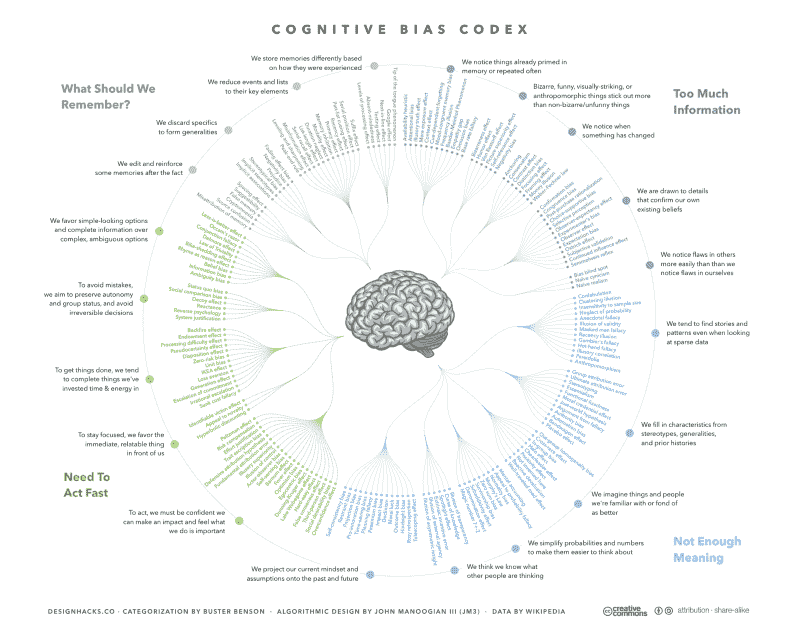

# 从零开始:在科技领域获得成功所需的隐藏习惯

> 原文：<https://www.freecodecamp.org/news/start-from-square-zero-hidden-habits-you-need-for-a-successful-career-in-tech-3e4b86636d6/>

安德烈·古莱特

# 从零开始:在科技领域获得成功所需的隐藏习惯

快速提问。假设你的朋友给了你一份水果清单:苹果、橘子、香蕉和草莓。她让你给她带清单上标记为第三的物品，你会选哪个？

香蕉？这是合乎逻辑的，对吗？当我们用自然语言计算项目时，我们从 1 开始列出项目。所以很自然你会数出每一件物品。第一，苹果。第二，橘子。第三，香蕉。啊！我们走吧。拿一束就走。

然而令你惊讶的是，当你把你的亮黄色水果带给她时，她看起来很失望。你显然没有给她带来她期待的东西。那么，你错在哪里呢？

这是我们没告诉你的。像许多编程语言一样，你的朋友使用所谓的零基索引。这意味着她从零开始计数，而不是一。所以她希望你给她带草莓。

在她的世界里，苹果= 0，橘子= 1，香蕉= 2，草莓= 3。她在一个不同于你一生所学的框架下运作。知道这条不成文的规则会非常有用，对吗？

在技术领域建立职业生涯也是如此。虽然有一条经过实践检验的成功之路，但它通常与我们许多人在学校里学到的大不相同。有一些无形的力量在起作用，一旦你发现它们，它们就显而易见了。然而，如果你在职业生涯中没有理解这个隐藏的框架，你通常会得出错误的答案，就像上面的情况一样。

让我们来看一看这些隐藏的习惯，它们可能会阻碍你的发展。我花了好几年才揭开其中的一些。希望现在就看到它们，你会省去很多烦恼和沮丧。

### 不要再称自己为“非技术人员”

“你是技术型的还是非技术型的？”我吗？我两者都是。为了找到答案，我开始了漫长的灵魂探索之旅。说你“不懂技术”意味着你完全不知道如何与技术互动。事实并非如此，对吗？很有可能，你的技术技能是相对的，而不是二元的。

你也可以在广泛的话题中获得难以置信的技术。在最近的一次播客中，主持人惊讶于我对认知同理心的了解。你深有体会的话题是什么？

在我发展科技职业的旅程中，这种单一的语言技巧对我来说是最深刻的。这里有一个例子来说明它是如何工作的。

一个网络活动中的随机人物:“你是技术人员还是非技术人员？”

你:“都有。我喜欢帮助我们的工程师更好地理解我们的用户。我可以真正了解用户体验和内容建模的技术。这些是我的一些爱好。你呢？”

### 选择内疚的语言，而不是羞愧的语言

对我职业生涯影响最深远的一本书是布琳·布朗博士的**。在这篇文章中，布朗博士展示了她对羞耻、脆弱和移情的研究。她描述了我们大多数人是如何交替使用羞耻和内疚这两个词的，但实际上这两者之间有很大的区别。**

**内疚=我做了蠢事。**

**丢人=我傻。**

**根据布朗博士的说法，“内疚和羞耻一样强大，但它的影响是积极的，而羞耻的影响是破坏性的。事实上，在我的研究中，我发现羞耻感侵蚀了我们相信自己可以改变并做得更好的那一部分。”**

**这个行业发展如此之快，总有一些时候你会觉得有些事情你不明白。秘密？当你被难住时，不要让羞耻的语言溜进来。**

### **坦然面对不适**

**说到被难倒，习惯吧。你不可能什么都懂。这个行业如此之大，发展如此之快，很难跟上，但这正是乐趣所在！学会享受这个过程，将挑战视为拓展大脑和成长的一种方式。该课题的研究员卡罗尔·德韦克博士提出了以下建议:**

> **“拓展自己并坚持下去的热情，即使(或尤其)不顺利，也是成长心态的标志。这种心态让人们能够在人生中最具挑战性的时候茁壮成长。”**

**固定的思维模式说:“我不是技术人员。我永远也学不会这个。”然后他们关掉电脑，不再尝试。一种成长心态说，“哇！这是一个非常有趣的挑战。我怎样才能找到资源来帮助我？”**

### **小心信心差距**

**几年前，我参加了一个商界女性午餐会，了解到一项研究发现，女性不会申请一份工作，除非她们完全符合工作描述中的标准。没错。我想，那感觉是对的。**

**然后我了解到，如果他们达到 60%的标准，一般人都会申请。我们中的几个人发现自己盯着屏幕，嘴巴张得大大的，眼睛睁得大大的，难以置信。当我身后的一位女士说出我们都在想的话时，紧张情绪得到了释放:“你能做到吗？!"**

**凯蒂·凯和克莱尔·希普曼对这个话题进行了长时间的探讨。“事实证明，成功与自信的关系就像与能力的关系一样密切……不合格和准备不足的人会毫不犹豫地加入进来。大材小用，准备过度，太多女人还是憋着。女人只有在完美的时候才会感到自信。或者几乎完美。”**

**知道男人在没有所有信息的情况下冒险，对我的工作方式产生了巨大的影响。我现在可能不了解某项特定技术的一切，但我相信我的技能、态度和能力。我知道只要我下定决心，我就能学会任何东西。这种对自己的信任增强了我的信心，并带来了一些惊人的机会。**

### **承认你的偏见**

**在我的第一次软件会议上，我是三百名与会者中的两位女性之一。当你觉得自己明显不属于这个世界时，很难自信地站起来。幸运的是，从我做市场营销的日子里，我知道大脑依赖于窍门和捷径来做决定。了解这些偏见帮助我不把事情看得太个人化。**

**例如，那个第一次见到我时就认为我是招聘人员的人？这与我没有太大的关系，而是与[确认偏差](https://en.wikipedia.org/wiki/Confirmation_bias)有关。那个人认为女人不是技术型的，所以当他们遇到新的输入(我)时，他们试图确认他们现有的世界观。**

****

**另一个派上用场的是了解一下[邓宁-克鲁格效应](https://psmag.com/social-justice/confident-idiots-92793)，在这种情况下，人们“不称职的人经常被不恰当的自信所祝福，被*某种对他们来说感觉像知识的东西*所鼓舞。”**

**在软件领域，我发现很多人在我提问时会嗤之以鼻，或者试图使用大量术语让自己看起来更聪明。最初，我怀疑是不是我不够聪明，不属于这里。我不再问问题，并注意到我被其他人的“技术”吓到了。我停止了尝试。事实证明，这是另一种潜移默化的偏见——[冒名顶替综合症](https://en.wikipedia.org/wiki/Impostor_syndrome)。**

**意识到这些无意识的装腔作势的技巧，对于走上漫长而艰难的学习编码之路有着巨大的影响。**

**这只是众所周知的冰山一角。当你决定成为技术人员时，有很多“零起点”的陷阱。你找到了哪些？你是如何克服它们的？**

**如果你喜欢这篇文章，我正在写一本关于这个主题的书。跟随在[https://thebecomingtechnicalbook.com。](https://becomingtechnicalbook.com/)**

**你可以在 [Corgibytes](http://corgibytes.com) 博客上阅读更多我的文章。**