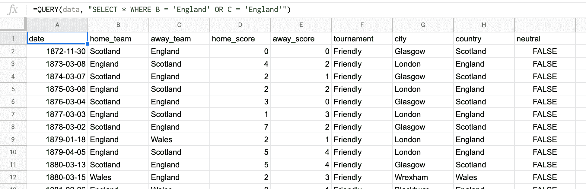
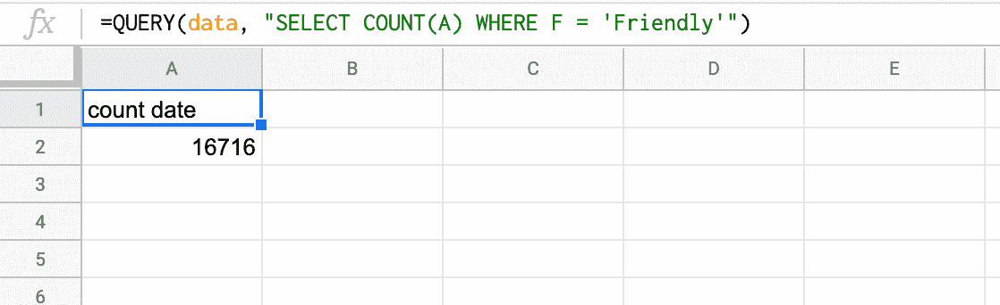
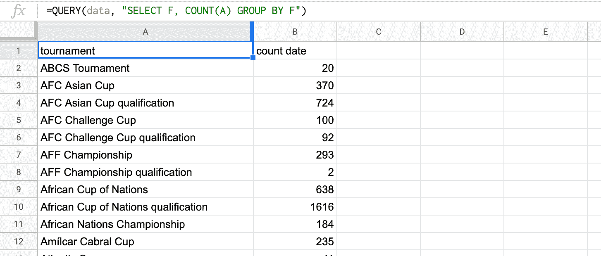
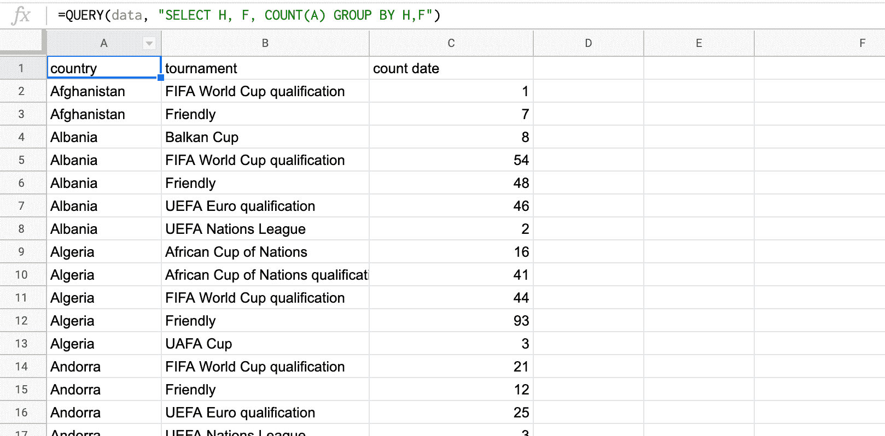
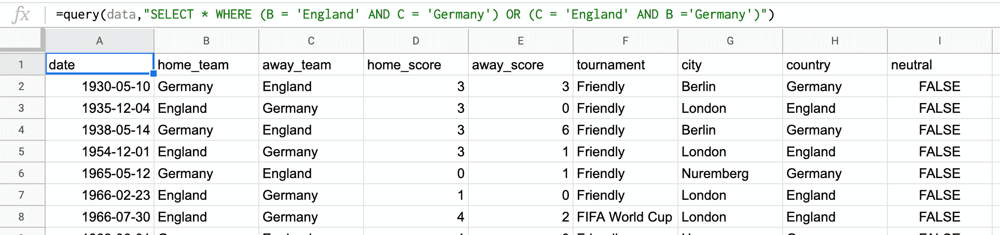
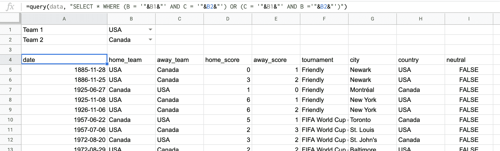
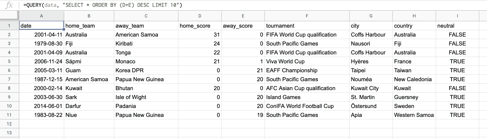
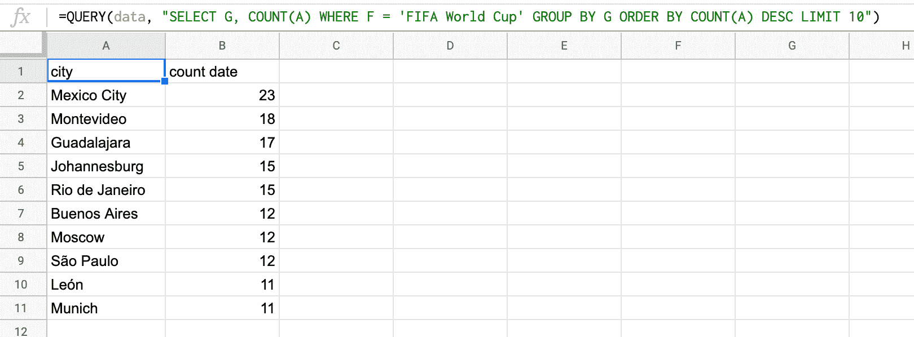

# 用这种简单的查询语言开始查询数据

> 原文：<https://www.freecodecamp.org/news/start-querying-data-with-google-query-language/>

在现代工作场所，处理数据正成为一项越来越重要的技能。

数据不再是分析师和软件工程师的领域。凭借当今的技术，任何人都可以利用数据来分析趋势并为决策提供信息。

处理数据时的一个基本概念是“查询”数据集。这就是字面上对一组数据提问。查询语言是一种软件语言，它提供了询问这类问题的语法。

如果你没有任何编写查询的经验，它们会显得有点吓人。但是，只要稍加练习，就能掌握基础。

以下是你如何开始使用 [Google Sheets](https://www.google.com/sheets/about/) 。

### 谷歌可视化 API 查询语言

你可能已经在日常工作中使用谷歌表单了。也许您熟悉使用它来生成图表和图形。

Google Visualization API 查询语言是幕后使这成为可能的魔法。

但是你知道你可以通过`QUERY()`功能使用这种语言吗？它是处理大量数据的强大工具。

查询语言和 SQL 有很多相似之处。

在这两种情况下，您都要定义一个包含列和行的数据集，并通过指定各种标准和条件来选择不同的列和行。

在本文中，示例数据将来自一个包含 1872 年至 2019 年间国际足球比赛结果的大型 CSV 文件。您可以[从 Kaggle](https://www.kaggle.com/martj42/international-football-results-from-1872-to-2017) 下载数据。

在新的 Google 表单中，上传 CSV 文件。可以用 Ctrl+A(或者 Mac 上的 Cmd+A)选择所有数据。

从菜单功能区中，选择数据>命名区域...并将选定的范围称为“数据”之类的东西。这将使它更容易工作。

现在，您可以开始查询数据了。在电子表格中创建新的选项卡，并在单元格 A1 中创建新的`QUERY()`公式。

### 获取所有英格兰比赛

第一个查询查找数据集中英格兰队是主队还是客队的所有行。

`QUERY()`公式至少有两个参数。第一个是命名范围，这将是查询的数据集。第二个是包含实际查询的字符串。

```
=QUERY(data, "SELECT * WHERE B = 'England' OR C = 'England'")
```



我们来分析一下。

`SELECT *`要求返回数据集中的所有列。如果你只想要 A、B 和 C 列，你应该写`SELECT A, B, C`。

接下来，添加一个过滤器，只查找 B 列或 C 列包含团队`'England'`的行。确保在查询中对字符串使用单引号。双引号用于打开和关闭查询本身。

这个公式返回所有英格兰参加过比赛的行。如果您想搜索另一个团队，只需更改过滤器中的条件。

### 统计所有友谊赛

接下来，我们来统计一下数据集中有多少场友谊赛。

```
=QUERY(data, "SELECT COUNT(A) WHERE F = 'Friendly'")
```

这利用了查询语言的`COUNT()`功能。这是一个集合函数的例子。聚合函数将许多行汇总成一行。

例如，在这个数据集中有 16，716 行，其中 F 列等于`'Friendly'`。该查询不是返回所有这些行，而是返回一行——它对这些行进行计数。



集合函数的其他例子包括`MAX()`、`MIN()`和`AVG()`。它不是返回与查询匹配的所有行，而是查找它们的最大值、最小值和平均值。

### 按锦标赛分组

如果在聚合函数旁边使用一个`GROUP BY`语句，它可以做更多的事情。该查询找出每种锦标赛类型已经进行了多少场比赛。

```
=QUERY(data, "SELECT F, COUNT(A) GROUP BY F")
```

该查询根据 f 列中的每个值对数据集进行分组，然后计算每组中有多少行。



您可以在多个列上使用`GROUP BY`。例如，要按锦标赛查找每个国家进行了多少场比赛，请使用以下查询:

```
=QUERY(data, "SELECT H, F, COUNT(A) GROUP BY H, F")
```



让我们尝试一些更高级的过滤。

### 获取所有英格兰对德国的比赛

您可以使用`AND`和`OR`关键字指定更复杂的过滤逻辑。为了提高可读性，在过滤器的每个部分使用括号会有所帮助。

例如，要查找英格兰和德国之间的所有比赛:

```
=QUERY(data, "SELECT * WHERE (B = 'England' AND C = 'Germany') OR (C = 'England' AND B ='Germany')")
```

这个过滤器有两个标准——一个是英格兰是主队，德国是客场，另一个则相反。



使用数据验证可以很容易地在数据集中选择任意两个团队。

然后，您可以编写一个查询，在其筛选器中使用不同单元格的值。记住使用单引号来标识查询中的字符串，使用双引号来打开和关闭查询的不同部分。

```
=QUERY(data, "SELECT * WHERE (B = '"&B1&"' AND C = '"&B2&"') OR (C = '"&B1&"' AND B ='"&B2&"')")
```



### 寻找趋势

集合函数和过滤器结合使用时是强大的工具。一旦您对它们的工作方式感到满意，您就可以开始在您的数据集中搜索各种有趣的趋势。

例如，下面的查询查找自 1900 年以来每年每场比赛的平均进球。

```
=QUERY(data, "SELECT YEAR(A), AVG(D) + AVG(E) WHERE YEAR(A) >= 1900 GROUP BY YEAR(A)")
```

![+suWWW8qjjz7qXP+DDk+ZMkWGDh0qHTp0MIvhb7DBBs6OhY4jgAACCCDgmwAFLN8izngRQAABBBBAoKACK1asMGtH6ULsLm+6OPq8efPMEwZd3XQB+A8++EAOO+wwV4dAvxFAAAEEEPBWgAKWt6Fn4AgggAACCCCAAAIIIIAAAggggIAbAhSw3IgTvUQAAQQQQAABBBBAAAEEEEAAAQS8FaCA5W3oGTgCCCCAAAIIIIAAAggggAACCCDghgAFLDfiRC8RQAABBBBAAAEEEEAAAQQQQAABbwUoYHkbegaOAAIIIIAAAggggAACCCCAAAIIuCFAAcuNONFLBBBAAAEEEEAAAQQQQAABBBBAwFsBCljehp6BI4AAAggggAACCCCAAAIIIIAAAm4IUMByI070EgEEEEAAAQQQQAABBBBAAAEEEPBWgAKWt6Fn4AgggAACCCCAAAIIIIAAAggggIAbAhSw3IgTvUQAAQQQQAABBBBAAAEEEEAAAQS8FaCA5W3oGTgCCCCAAAIIIIAAAggggAACCCDghgAFLDfiRC8RQAABBBBAAAEEEEAAAQQQQAABbwUoYHkbegaOAAIIIIAAAggggAACCCCAAAIIuCFAAcuNONFLBBBAAAEEEEAAAQQQQAABBBBAwFsBCljehp6BI4AAAggggAACCCCAAAIIIIAAAm4IUMByI070EgEEEEAAAQQQQAABBBBAAAEEEPBWgAKWt6Fn4AgggAACCCCAAAIIIIAAAggggIAbAhSw3IgTvUQAAQQQQAABBBBAAAEEEEAAAQS8FaCA5W3oGTgCCCCAAAIIIIAAAggggAACCCDghgAFLDfiRC8RQAABBBBAAAEEEEAAAQQQQAABbwUoYHkbegaOAAIIIIAAAggggAACCCCAAAIIuCFAAcuNONFLBBBAAAEEEEAAAQQQQAABBBBAwFsBCljehp6BI4AAAggggAACCCCAAAIIIIAAAm4IUMByI070EgEEEEAAAQQQQAABBBBAAAEEEPBWgAKWt6Fn4AgggAACCCCAAAIIIIAAAggggIAbAhSw3IgTvUQAAQQQQAABBBBAAAEEEEAAAQS8FaCA5W3oGTgCCCCAAAIIIIAAAggggAACCCDghgAFLDfiRC8RQAABBBBAAAEEEEAAAQQQQAABbwUoYHkbegaOAAIIIIAAAggggAACCCCAAAIIuCFAAcuNONFLBBBAAAEEEEAAAQQQQAABBBBAwFsBCljehp6BI4AAAggggAACCCCAAAIIIIAAAm4IUMByI070EgEEEEAAAQQQQAABBBBAAAEEEPBWgAKWt6Fn4AgggAACCCCAAAIIIIAAAggggIAbAhSw3IgTvUQAAQQQQAABBBBAAAEEEEAAAQS8FaCA5W3oGTgCCCCAAAIIIIAAAggggAACCCDghgAFLDfiRC8RQAABBBBAAAEEEEAAAQQQQAABbwX+H7r2LI9olsoEAAAAAElFTkSuQmCC](img/f2ebeec75cc6d79c2fd2a17c77da0dbf.png)

如果将查询结果绘制成线形图，您可以立即看到一段时间内的趋势。

### 排序结果

有时，您对在数据集中找到所有匹配的行并不感兴趣。通常，您会希望根据一些标准对它们进行排序。也许你只想找到前十名的记录。

该查询查找数据集中得分最高的前十个匹配项。

```
=QUERY(data, "SELECT * ORDER BY (D+E) DESC LIMIT 10")
```



请注意`ORDER BY`语句。这将根据指定的列对行进行排序。这里，查询按照游戏中的进球数对输出进行排序。

`DESC`关键字表示按降序排序(`ASC`关键字本来是按升序排序的)。

最后，`LIMIT`关键字将输出限制为给定的行数(在本例中是 10 行)。

看来大洋洲出现了一些相当一边倒的比赛！

### 哪些城市举办过最多的世界杯比赛？

现在是最后一个例子，把所有的东西放在一起，激发你的想象力。

该查询查找举办过最多 FIFA 世界杯比赛的前十个城市。

```
=QUERY(data, "SELECT G, COUNT(A) WHERE F = 'FIFA World Cup' GROUP BY G ORDER BY COUNT(A) DESC LIMIT 10")
```



### 现在轮到你了

希望这篇文章对你有用。如果您对每个示例中的逻辑都感到满意，那么您就可以尝试真正的 SQL 了。

这将引入连接、嵌套查询和窗口函数等概念。当你掌握了这些，你处理数据的能力将会突飞猛进。

学习 SQL 可以从很多地方开始。在 w3schools 尝试[互动示例！](https://www.w3schools.com/sql/default.asp)