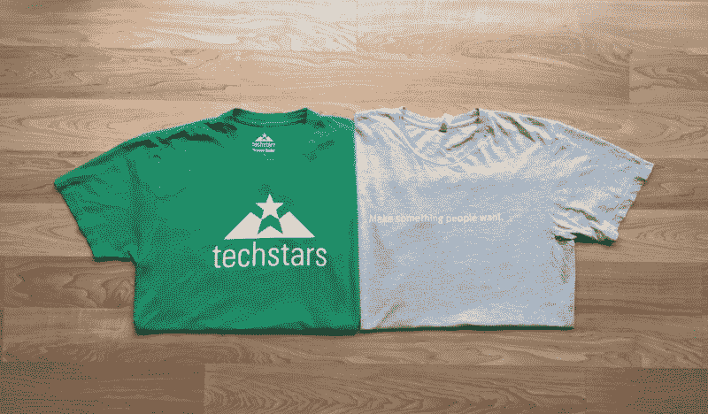
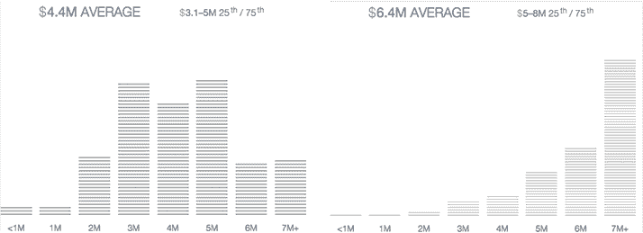

# 创业加速器比较:Y Combinator 与 Techstars

> 原文：<https://www.freecodecamp.org/news/startup-accelerator-comparison-y-combinator-vs-techstars-b4080d0c93c8/>

作者:刘伟婷

# 创业加速器比较:Y Combinator 与 Techstars

Not too many people have these t-shirts together

#### 做出人们想要的东西，更快地做更多。

作为同时是 Y Combinator 和 Techstars 校友的少数创始人之一，我有幸经历了两个世界上最顶尖的加速器。与 YC 和 500 家初创公司似乎有更多共同之处不同，很少有创始人同时参加了 YC 和 Techstars 项目。

这些年来，我无数次被问到参加这些项目的经历，这些网络对我的创业有多大帮助，以及我会如何建议其他创业者选择加入哪个项目。

我非常尊重保罗·格拉厄姆、山姆·奥特曼、大卫·科恩、布拉德·菲尔德、所有 YC 合伙人和 Techstars 董事。YC 和 Techstars 是有史以来最早创建的两个加速器，然而它们现在正以非常不同的愿景和理念运行。根据你的目标，你可能会发现其中一个更适合你和你的创业。

### 计划条款

10 年前，当宝洁和 YC 的最初创始人创建这种类型时，交易价格是 11，000 美元+3000 美元* n 2%-10%。经过几次迭代(包括 15 万美元的 Start 基金和 8 万美元的 YCVC)，YC 的条款现在是 12 万美元 7%。Techstars 条款现在是 118，000 美元换 7–10%的股权。

所有条款都是可比的——隐含估值将在 120 万美元至 170 万美元之间，如果你从纯货币价值的角度来看，这肯定是当今时代的低端。然而，估值有些武断，根据你的背景，作为加速器小组的一部分，你在下一轮融资中获得的估值通常会高于你自己筹集的估值。

经验丰富的创始人或有吸引力的初创公司多次问我，把 7%的收益捐给 YC 或 Techstars 这样的加速器有什么好处。我的回答一直是——这是 100%值得的，如果你被录取了，除非你手里已经有一份顶级风投的 A 轮投资意向书，否则你要么是愚蠢的，要么是 PayPal 黑手党的一员，不会接受它。在大多数情况下，通过网络的帮助，你会得到更高的估价，这是值得的(PG (in)称之为[智商测试](http://www.paulgraham.com/frinterview.html) )。最重要的是，在校友网络中的价值超越了你当前的创业，并在你的创业旅程中永远陪伴着你。

### 在节目中

YC 非常自由。这里没有办公室(而且现在很可能没有一种简单的方法能让 85 个团队呆在一个屋檐下)。每周有一次晚宴，我们可以每周一次和马克·扎克伯格和彼得·泰尔这样的超级球员一起吃辣椒饭。还有与 YC 合伙人的办公时间和与批量伙伴的集体办公时间，我们可以根据自己的意愿随时预订。

每周的晚餐和办公时间是自我设定的每周里程碑的重要检查点。当你看到其他优秀的队友取得进步时，这创造了一个非常健康的竞争环境，驱使你更加努力。

*A typical YC dinner — I actually quite liked it.*

加速就是在短时间内完成很多事情。用它自己的话说，YC 的目标是“创造一个环境，让你可以专注于获得一个初始版本的建立。”他们说这话时不是在开玩笑。对于一家初创公司来说，增长就是一切，宝洁公司曾要求初创公司专注于一个单一指标，并尽一切努力让它上升到正确的位置。为了证明这一点，在我们第一次每周二的晚餐上，PG 告诉我们在 YC 期间只做三件事:

*   写代码
*   与用户交谈
*   锻炼

在 YC 期间，如果你考虑在这三个月里做什么事情，问问自己:“这是在写代码吗？这是在和用户对话吗？这是演习吗？”如果以上都不是，你可能就不应该这么做。

另一方面，Techstars 是非常结构化的。每一批通常有 10 个左右的团队，并且有一个共同工作的空间，我们每天都要来这里和我们批中的所有其他团队一起工作。几乎每天都有涵盖各种主题的课程、研讨会和讲习班:客户开发、营销、公关等等。

史蒂夫·布兰克(Steve Blank)的说教和埃里克·里斯(Eric Ries)的精益创业方法受到了强烈关注，我们也经常使用商业模式画布。在第一个月，我们被迫深入了解我们的客户。我们被要求停止编写代码，并“走出大楼”与人们交谈，以确保我们确实在构建人们想要的东西。我们还学到了宝贵的实践技巧，如客户开发、用户调查等。对于像我这样内向的创业者来说，我们一直想做的就是埋头写代码。写代码很容易；与人交谈是困难的。然而，我可以说，通过推动我们自己花时间做客户开发，它已经为我们的初创公司建立了一个强大的基础，因为我们现在对我们初创公司的目标受众有了深刻的理解。

Techstars 的计划结构如下:

*   第 1 个月—客户开发
*   第 2 个月—产品开发和获得牵引力
*   第 3 个月——磨练你对投资者的推销技巧，并为演示日进行练习

Techstars 对区域生态系统的关注也使我们能够与许多优秀的本地导师合作。如何管理你和这些导师的关系并充分利用这种关系取决于你自己。

### 与 Batchmates 和校友的互动

众所周知，加入加速器的最有价值的驱动因素之一是访问校友网络，我很荣幸能够同时在 ycfounders 和 founders@techstars 名单上。YC 和 Techstars 现在都有大约 1600 多名校友。所有校友之间有一种强烈的相互尊重感，也为成为终身专属网络的一部分而自豪。创始人确实会互相帮助，随着校友人数的增加，你可能会与整个技术社区中的任何人相差 1-2 度。

Techstars 分布在全球 9 个以上的城市。在项目期间，Techstars 公司在同一个合作空间工作，批量更小(10 v.s. YC 的 85)，你肯定有机会与你的批量伙伴更频繁地互动。

Techstars 在奥斯汀、柏林、波士顿、博尔德、芝加哥、圣安东尼奥、伦敦、纽约和西雅图等主要科技城市都有业务。最棒的是，在一个主要的科技城市几乎总是有一个 Techstars 计划，如果你需要特定地区的支持，校友网络将会非常有帮助。例如，去年年底，我去欧洲与用户见面，并为 Codementor 探索市场机会。我立即被介绍给伦敦和柏林的 Techstars 的优秀员工，在伦敦的华纳中心露营，并获得了欧洲创业社区的精彩介绍。

稍有不足的是，尽管我们都是 Techstars 大家庭的一员，但在不同的城市相距数英里，并且没有机会经常见面，这使得在不同的 Techstars 计划之间发展更密切的关系变得更加困难。认识到这一点，Techstars 举办了一年一度的创始人大会，这是家族中每个人聚集在一起建立关系的绝佳机会。

另一方面，YC 非常专注于硅谷，大多数校友也在这里工作。在 YC 期间，你将有机会从一开始就与 YC 校友互动——早在你的 YC 面试日。此外，由于许多 YC 公司已经[成为](http://www.dropbox.com/) [广为](http://www.airbnb.com/) [成功](http://www.stripe.com/)，我们将荣幸地邀请成功的 YC 创始人作为同行参加我们每周二的晚宴。我记得当 Airbnb 的创始人告诉我们“你和我们之间唯一的区别是 4 年”时，我是多么激动说说伟大的励志演讲吧！定期与他们见面不仅让我们从他们身上学到了很多东西，更重要的是，这让我们相信我们与这些伟大的创始人是同一阵营的，伟大是现实可以实现的。

对 YC 来说，批量生产的不利之处在于，你无法很好地了解你的批量生产伙伴。我记得我最后一次去 YC 的时候，我还在演示日第一次和我的队友打招呼！

### 演示日

YC、Techstars 和 500 Startups 对待演示日的方式也截然不同。与普遍的看法相反，YC 实际上并不太重视演示日的练习。事实上，我们一直专注于我们的产品，直到加速器计划的最后阶段，并在演示日之前不到一周的时间开始练习推介。另一方面，Techstars 将项目的最后一个月用来练习和完善音调。部分原因可能是典型的 YC 演示日活动时长约为 2 分钟，而我们的 Techstars 演示日活动时长是它的三倍，为 6 分钟。

YC 的展示日本身绝对是一个事件。我们会走过创业现场的名人录。100%的与会者要么是 YC 的创始人，邀请投资者，或媒体成员。这是一个不允许外人参加的独家活动，每个人都在那里忙碌着，做着真正的生意。对许多 YC 初创公司来说，这真的是一场亮相派对，也是融资的开始。

对于 Techstars 来说，演示日在筹资方面的作用不那么直接。创业公司被鼓励在整个项目中向投资者推销，所以对于许多投资者来说，他们不会在演示日第一次看到创业公司。Techstars 演示日也是当地技术领域的一次庆典。从设计上来说，这是一个包容性的活动，当地企业家社区相互支持的氛围很强。

### 筹款

多年来，YC 已经从一个为大学生设计的暑期项目发展成为一个具有广泛创业经验的变革型全球强国。除了传统的年轻聪明的黑客之外，我们现在看到成功的重复创业者和拥有真实、可观收入的成熟公司申请该项目。YC 的品牌和项目结构使其成为一个有吸引力的筹资平台，即使对有经验的企业家来说也是如此。随着 YC 公司在上市日之后持续以超过 1000 万美元的估值融资，你给 YC 的股权几乎可以用你作为一家 YC 公司获得的估值溢价收回。

*Techstars v.s. Y Combinator Valuations — via [AngelList](https://angel.co/valuations)*

在筹资方面，Techstars 也不差。毕竟，这些年来，不少公司在 Techstars 网络中脱颖而出:仅举几个例子: [SendGrid](http://www.sendgrid.com/) 、 [Digital Ocean](http://www.digitalocean.com/) 和 [GrabCAD](http://techcrunch.com/2014/09/16/3d-printing-company-stratasys-is-buying-grabcad-for-around-100m) 。对于 Techstars 来说，演示日之后的现行估价通常从 300 万美元开始，每批中的顶级公司可以达到 600 万美元以上。对许多本地投资者来说，这些估值似乎没有那么泡沫，比 YC 公司更容易消化。Techstars 现在也有自己的 1.5 亿美元基金，专门为 Techstars 生态系统中的公司提供资金。

### 节目结束后

程序结束后会发生什么？

如果你要搬到一个新的城市加入 Techstars 计划，我强烈建议你考虑不要离开，继续在那里创业。对于 Codementor 的我们来说，我们加入 Techstars Seattle 主要是因为总经理 Andy Sack 在我们这个领域的个人经历。在我们逗留的三个月里，我们在这座城市遇到了许多伟大的导师和令人敬畏的人。然而，我们在演示日一周后搬出了西雅图，并逐渐发现自己与社区的互动少了很多。由于没有连续性，可悲的是，我们变得与西雅图当地社区完全脱节。由于 Techstars 如此关注当地生态系统的建设，这可能并不令人惊讶。

对于 YC，我们仍然欢迎您在计划结束后与合作伙伴一起注册办公时间。事实上，即使你不再参与 YC 的一家初创公司，你通常仍然可以注册办公时间。我已经离开上一家 YC 公司好几年了，但我仍然是 YC 大学的终身校友，YC 合伙人也一如既往地乐于助人。

### 哲学差异

在我看来，Techstars 和 YC 最大的不同在于它的基本理念。

YC 的核心信念是，硅谷是创业宇宙的引力中心。你应该考虑在这里创业，或者至少在这里呆上三个月。

要理解 Techstars 的愿景和信念，你所要做的就是看看 Brad Feld 的“[博尔德论文](http://www.feld.com/archives/2014/04/empirical-support-boulder-thesis.html)和他的书“[创业社区:在你的城市建立创业生态系统](http://www.amazon.com/Startup-Communities-Building-Entrepreneurial-Ecosystem/dp/1480563854)”。Techstars 的主题是培育不同城市的生态系统。从本质上讲，Techstars 认为，你不应该非得去硅谷才能建立一家公司。多年来，Techstars 一直利用其网络和资源帮助世界各地的本地创业生态系统蓬勃发展。

### 你应该选择哪一个？

如果你处于一个独特的位置，被两个项目都录取了——恭喜你！不管怎样，你都不会做出错误的选择。

如果你的初创公司正处于需要解决很多问题的阶段，Techstars 的结构和指导对你来说会更有价值。如果你已经实现了产品与市场的完美契合，而你的下一个里程碑就是融资，那么 YC 的品牌名称将能够帮助你以最高的估值融资。

如果你的目标是以圈内人士的身份加入硅谷科技社区，并以尽可能高的估值从硅谷投资者那里筹集资金，那么 YC 将是不可否认的选择。如果你是一名希望打入硅谷的国际创始人，YC 也将是你的一个不错的选择。

如果你在 Techstars 的一个城市(比如博尔德、西雅图、纽约或伦敦)，并且计划在那里发展你的公司，选择 Techstars。Techstars 在旧金山湾区以外的科技城市拥有更强大的网络，你将与那些支持你的城市的导师和投资者合作。如果你有在当地社区建立一个可持续发展的公司并在那里产生持久影响的长期愿景，那么 Techstars 可能是你更好的选择。

选择创业加速器类似于选择大学或 MBA 项目。你当然不一定要成为斯坦福的毕业生才能有成功的职业生涯，通过 Y Combinator 或 Techstars 也不能保证任何形式的创业成功。

所以，勇往直前，努力工作，[做出人们想要的东西](http://startupquotes.startupvitamins.com/post/60094679048/make-something-people-want-y-combinator-motto)和[做得更快](http://www.domorefasterbook.com/)！

*这篇文章是由刘伟婷写的，他是开发者在线帮助平台[共同导师](https://www.codementor.io/)的创始人&兼首席执行官。魏婷是一位连续创业者，也是 Y Combinator(YC 2007 年[、SocialPicks](http://venturebeat.com/2009/05/01/financialcontent-acquires-social-investing-site-socialpicks/) 、2012 年)和 Techstars(西雅图 2013 年[共同导师](https://www.codementor.io/))的校友。*

*这篇文章最初发表在 Codementor 的博客* 上。