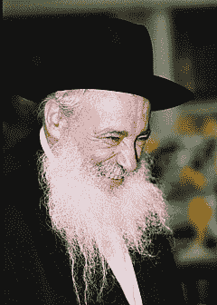

# 启动倦怠

> 原文：<https://www.freecodecamp.org/news/startup-shabbat-c0706dec6ace/>

埃利·斯坦博克

# 启动倦怠

安息日是一周的第七天。它从星期五晚上开始，到第二天晚上，星期六结束。(对犹太人来说，一天从晚上开始。)也是犹太人的休息日——安息日。

许多犹太人守安息日，因为这是上帝的命令。我这样做是出于习惯，也是因为我的朋友和犹太人社区遵守它。我也很喜欢。

安息日是犹太人不工作的一天。对于正统的犹太人来说，他们在安息日也不用电或开车。这一天包括祈祷仪式，与家人和朋友一起坐下来吃饭，对许多人来说，还有一个好觉。

对我来说，这是我感激的一天，因为我不允许检查我的电子邮件或无休止地滚动我的推特、脸书或媒体账户。此外，我从手机上没有收到任何通知。是时候把这些都关掉了。这是我玩游戏、读书、去海滩、见家人、和朋友聊天的一天。

我用一些种子(和种子前)资金经营一家早期创业公司。我的工作压力很大。我很想在周六写代码，但是我决定不写了。我从未在安息日写过一行代码，在可预见的将来也不打算写。

我写这篇文章是因为 Twitter 上发生的讨论。

[布莱克·罗宾斯](https://www.freecodecamp.org/news/startup-shabbat-c0706dec6ace/undefined)用这些推文开始了讨论:

这些推文收到了一些强烈的反应。

这些信息收到了许多赞和转发，但也有许多人反对它。我把自己放在“反对阵营”我同意，筋疲力尽并不酷。你必须照顾好自己。但话虽如此，我确实相信，如果你比你的竞争对手更努力，你就比你的竞争对手更有可能成功。然而，努力并不能保证成功。但是缺乏努力也不能保证失败。什么都不能保证。努力工作只会增加你成功的机会。

我相信，如果你想成就伟大，努力是唯一的途径。

这场讨论中有两个引人注目的人物，DHH 和 T2，基思·拉布瓦。

DHH 是 Ruby on Rails 的创造者，Basecamp 的创始人，阿乐芒赛车，以及独一无二的 Pagani Zonda HH 的专员。

DHH cannot be faulted for his taste in cars.

根据[的推特简介](https://twitter.com/rabois?ref_src=twsrc%5Egoogle%7Ctwcamp%5Eserp%7Ctwgr%5Eauthor)，基思·拉布瓦是贝宝黑手党的一员，是一名“企业家、投资者、反向投资者”。据[维基百科](https://en.wikipedia.org/wiki/Keith_Rabois)介绍，他因 [Paypal](https://en.wikipedia.org/wiki/PayPal) 、 [LinkedIn](https://en.wikipedia.org/wiki/LinkedIn) 、 [Square](https://en.wikipedia.org/wiki/Square_inc) 、 [Yelp](https://en.wikipedia.org/wiki/Yelp) 、 [Xoom](https://en.wikipedia.org/wiki/Xoom_(web_hosting)) 、 [YouTube](https://en.wikipedia.org/wiki/YouTube) 、 [Yammer](https://en.wikipedia.org/wiki/Yammer) 、 [Palantir](https://en.wikipedia.org/wiki/Palant%C3%ADr) 、 [Lyft](https://en.wikipedia.org/wiki/Lyft) 、 [Airbnb](https://en.wikipedia.org/wiki/Airbnb) 、

两个不可思议的成功人士。

这两个对作息的看法大相径庭。他们在推特上就这个话题展开了激烈的争论。不确定谁对谁错。

拉布瓦为努力工作提出了强有力的论据:

如前所述，拉布瓦是贝宝黑手党的一员，其中包括埃隆·马斯克和 T2·彼得·泰尔等人。

马斯克似乎对职业道德也有类似的看法:

每周工作 100 小时，你将在四个月内完成别人一年才能完成的事情。

以下是一些支持拉布瓦的推文:

如果你通读一遍，你可能会发现 100 多个来自成功人士的支持努力工作的观点。

争论的另一方是 DHH 和他的阵营。DHH 也努力工作来获得他所拥有的。

筋疲力尽是不好的。如果你连续 5 年每周工作 40 小时，你会比仅仅一年每周工作 100 小时获得更多。如果你选择后者，你很可能会精疲力尽，再也不会享受或渴望工作。好吧，这有点夸张了。但我希望我的观点是明确的:你需要照顾好自己。这是显而易见的。你不会跑马拉松。

生活中还有其他重要的事情。例如，家庭，朋友，社区服务，放松，以及其他任何能给你目标的东西。我不知道拉布瓦或 DHH 的个人生活是什么样的，但只要你努力工作，你仍然可以拥有这些东西。例如，马斯克已经结婚并有了孩子。他找到时间离开工作，包括特斯拉和 SpaceX，建立一个家庭。

尊重人们的决定很重要。如果人们想努力实现真正伟大的事情，那就让他们去做吧。但是如果他们的首要任务是花时间和家人在一起或者建立一个家，那就随他们去吧。如果他们两者都想做，那就让他们也做吧。

我以谈论安息日开始这篇文章。我将以谈论异常勤奋的拉比来结束这篇文章，他们的工作是研究犹太律法、犹太法典和圣经。

这些拉比几乎把他们醒着的每一个小时都投入到他们的研究中。我见过 80 岁的拉比手里拿着一本犹太法典在街上走来走去，学习。这是他们通常做的。他们像这样从一个地方旅行到另一个地方，这样他们就不会浪费时间。

Rav Nevbenzahl — never stops smiling

当我在一所犹太学校(一所专注于研究传统宗教文献的 T2 犹太学校)学习时，我坐在上图中的男子 Rav Nevbenzahl 旁边。他是一个非常快乐的人。他有家人和孙子。他的学习赋予了他生活的意义。他甚至没有想到休息一下。

令人难以置信的是，他已经这样做了 70 年。他教了很多年书，现在还在教。他每天祈祷三次，以前每晚只睡两个小时。(虽然我听说他现在很后悔，而且你现在可以抓到他白天打盹。)

他已经完成了多次犹太法典。我不记得有多少次了，但我肯定超过了 100 次。这真是令人印象深刻。与此同时，99%的正统犹太人甚至一次都没有完成，因为它太长了，很有挑战性。

这就是那些相信一个人的最终目的是研究宗教文献的人的生活方式。他相信通过学习和教授这些课文，他在帮助这个世界变得更美好。每次他读这些文章，他也成为一个更好的人。

所以我想明确表示，我不同意这种生活方式。我不同意他的信仰体系。我认为它建立在错误的前提上，已经过时了。

但是这个人非常快乐，是一个有爱心和谦逊的人，很有幽默感。他过着非凡的生活，完全致力于研究古代文本，这赋予了他的生活意义，给他带来了难以置信的快乐。

那是这个人的工作。他从不休假。或者休息一下。他也不需要。有些人不想要，也不需要。有些人宁愿工作也不愿在沙滩上坐一周。然而，你不应该仅仅因为你不想全天候工作就告诉人们如何生活。

就我自己而言，我热爱我所做的事情，它从来都不像是工作。我可以编码到午夜或凌晨 3 点，有时甚至是早上 8 点。我喜欢它。我也在荒谬的时间醒来，大多数晚上睡 8 到 10 个小时，在上午 11 点到下午 2 点之间出现在工作中。当然，我周六休息。补读的好时机。