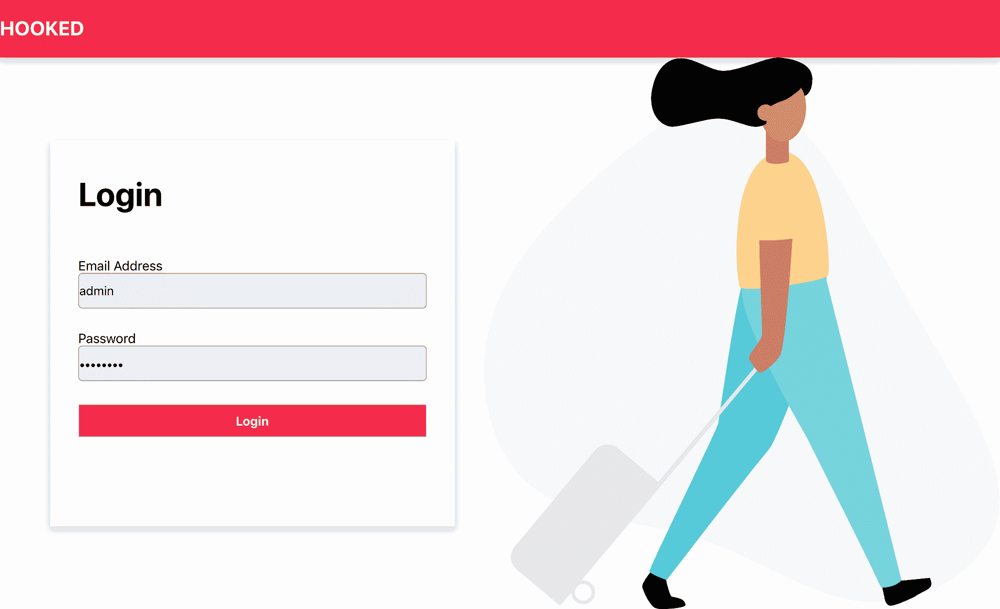

# 如何在只有上下文和钩子的 React 应用中管理状态

> 原文：<https://www.freecodecamp.org/news/state-management-with-react-hooks/>

自从 React Hooks 发布以来，已经发布了成百上千的关于它们的文章、库和视频课程。如果您仔细研究资源的海洋，您会发现我不久前写的一篇文章，其中涉及到使用钩子构建一个示例应用程序。你可以在这里找到那篇文章。

基于那篇文章，很多人(实际上是两个人)问了关于如何在 React 应用程序中只使用上下文和钩子来管理状态的问题，这促使我对这个主题做了一些研究。

因此，在本文中，我们将使用两个非常重要的钩子 useContext 和 useReducer 来构建一个简单的 music gallery 应用程序。该应用程序将只有两个视图:一个用于登录，另一个用于列出该画廊中的歌曲。

登录页面的主要目的是展示如何在应用程序间共享 Auth 状态，这是使用 Redux 等库的应用程序的常见用例。

当我们完成时，我们应该有一个类似下图的应用程序:



Login Page


Home Page (I used the “hooked” name again, smart right?)

对于后端服务器，我设置了一个简单的 Express 应用程序，并将其托管在 Heroku 上。它有两个主要端点:

*   `/login` —用于认证。成功登录后，它会返回一个 JWT 令牌和用户详细信息。
*   `/songs` —返回歌曲列表。

如果您想添加额外的功能，可以在[这里](https://github.com/samie820/hooks-state-management-backend)找到后端应用程序的存储库。

### 概述

在我们开始构建应用程序之前，让我们看看我们将使用的一些钩子:

*   `useState` —这个钩子允许我们在函数组件中使用状态(相当于类组件中的`this.state`和`this.setState`)
*   `useContext` —这个钩子接受一个上下文对象，并返回在`MyContext.Provider`中作为值属性传入的任何内容。如果您不了解上下文，这是一种将状态从父组件传递到树中任何其他组件(无论有多深)的方式，而不必通过不需要它的其他组件传递(这个问题被恰当地命名为 prop drilling)。你可以在这里阅读更多关于[的内容。](https://reactjs.org/docs/context.html)
*   `useReducer` —这是`useState`的替代方案，可用于复杂状态逻辑。这是我最喜欢的钩子，因为它就像 Redux 库一样工作。它接受以下类型的减速器:

```
(state, action) => newState
```

以及返回新状态之前的初始状态对象。

### 入门指南

首先，我们将使用 [create-react-app](https://github.com/facebook/create-react-app) 库来引导项目。但在此之前，以下是需要遵循的一些要求:

*   节点(≥ 6)
*   文本编辑器

在您的终端中，输入命令:

```
npx create-react-app hooked
```

如果您没有`npx`可用，您可以在您的系统上全局安装 create-react-app:

```
npm install -g create-react-app
create-react-app hooked
```

到本文结束时，您将创建五个组件:

*   header . js——该组件将包含应用程序的标题(很明显),还会显示一个包含用户名字的注销按钮。该按钮仅在用户通过身份验证时显示。
*   app . js——这是我们将在其中创建身份验证上下文的顶级组件(我稍后会谈到这一点)。如果用户没有登录，该组件还将有条件地呈现登录组件，如果用户已经过身份验证，则呈现主页组件。
*   home . js——该组件将从服务器获取一个歌曲列表，并将其呈现在页面上。
*   Login.js —该组件将包含用户的登录表单。它还负责向登录端点发出 POST 请求，并使用来自服务器的响应更新身份验证上下文。
*   card . js——这是一个呈现组件(UI ),呈现传递给它的歌曲的细节。

现在让我们创建空组件，稍后我们将向其添加逻辑。在`src`文件夹中，创建一个文件夹，命名为`components`，然后创建四个文件，分别是`Header.js`、`Home.js`、`Login.js`和`Card.js`:

#### 
Header.js

```
import React from "react";
export const Header = () => {
  return (
    <nav id="navigation">
      <h1 href="#" className="logo">
        HOOKED
      </h1>
    </nav>
  );
};
export default Header;
```

[**home . js**](https://www.freecodecamp.org/news/state-management-with-react-hooks/Home.js)

```
import React from "react";
export const Home = () => {
return (
    <div className="home">
    </div>
  );
};
export default Home;
```

#### Login.js

```
import React from "react";
import logo from "../logo.svg";
import { AuthContext } from "../App";
export const Login = () => {
return (
    <div className="login-container">
      <div className="card">
        <div className="container">
        </div>
      </div>
    </div>
  );
};
export default Login;
```

并且`App.js`文件应该是这样的:

```
import React from "react";
import "./App.css";
function App() {
return (
      <div className="App"></div>
  );
}
export default App;
```

在`App.js`文件中，我们将创建 auth 上下文，它将把 Auth 状态从这个组件传递给任何其他需要它的组件。创建如下所示的身份验证上下文:

```
import React from "react";
import "./App.css";
import Login from "./components/Login";
import Home from "./components/Home";
import Header from "./components/Header";
export const AuthContext = React.createContext(); // added this
function App() {
return (
    <AuthContext.Provider>
      <div className="App"></div>
    </AuthContext.Provider>
  );
}
export default App;
```

然后我们添加`useReducer`钩子来处理我们的认证状态，并有条件地呈现**登录**组件或**主页**组件。

请记住，`useReducer`钩子有两个参数，一个是缩减器(它只是一个函数，将状态和动作作为参数，并基于动作返回一个新状态),另一个是初始状态，它将被传递到缩减器中。然后，让我们将钩子添加到我们的`App`组件中，如下所示:

```
import React from "react";
import "./App.css";
import Login from "./components/Login";
import Home from "./components/Home";
import Header from "./components/Header";
export const AuthContext = React.createContext();
const initialState = {
  isAuthenticated: false,
  user: null,
  token: null,
};
const reducer = (state, action) => {
  switch (action.type) {
    case "LOGIN":
      localStorage.setItem("user", JSON.stringify(action.payload.user));
      localStorage.setItem("token", JSON.stringify(action.payload.token));
      return {
        ...state,
        isAuthenticated: true,
        user: action.payload.user,
        token: action.payload.token
      };
    case "LOGOUT":
      localStorage.clear();
      return {
        ...state,
        isAuthenticated: false,
        user: null
      };
    default:
      return state;
  }
};
function App() {
  const [state, dispatch] = React.useReducer(reducer, initialState);
return (
    <AuthContext.Provider
      value={{
        state,
        dispatch
      }}
    >
      <Header />
      <div className="App">{!state.isAuthenticated ? <Login /> : <Home />}</div>
    </AuthContext.Provider>
  );
}
export default App;
```

上面的片段中有很多内容，但让我解释一下每一部分:

```
const initialState = {
  isAuthenticated: false,
  user: null,
  token: null,
};
```

上面的代码片段是我们的初始状态对象，将在我们的 reducer 中使用。该对象中的值主要取决于您的用例。在我们的例子中，我们需要检查用户是否经过身份验证，是否包含`user`数据，以及登录后是否从服务器发回了`token`。

```
const reducer = (state, action) => {
  switch (action.type) {
    case "LOGIN":
      localStorage.setItem("user", JSON.stringify(action.payload.user));
      localStorage.setItem("token", JSON.stringify(action.payload.token));
      return {
        ...state,
        isAuthenticated: true,
        user: action.payload.user,
        token: action.payload.token
      };
    case "LOGOUT":
      localStorage.clear();
      return {
        ...state,
        isAuthenticated: false,
        user: null,
        token: null,
      };
    default:
      return state;
  }
};
```

reducer 函数包含一个 case-switch 语句，该语句基于某些操作返回一个新状态。减速器中的动作有:

*   `LOGIN` —当这种类型的动作被调度时，它也将与一个有效载荷(包含`user`和`token`)一起被调度。它将用户和令牌保存到 localStorage，然后返回一个新状态，将`isAuthenticated`设置为`true`，并根据动作的有效负载将`user`和`token`键设置为各自的值。
*   `LOGOUT` —当该动作被调度时，我们清除所有数据的本地存储，并将`user`和`token`设置为`null`。

如果没有调度任何操作，它将返回初始状态。

```
const [state, dispatch] = React.useReducer(reducer, initialState);
```

`useReducer`钩子返回两个参数，`state`和`dispatch`。`state`包含组件中使用的状态，并根据调度的动作进行更新。`Dispatch`是应用程序中使用的一个函数，用于调用/调度转换或改变状态的动作。

```
<AuthContext.Provider
      value={{
        state,
        dispatch
      }}
    >
      <Header />
      <div className="App">{!state.isAuthenticated ? <Login /> : <Home />}</div>
 </AuthContext.Provider>
```

在这里的`Context.Provider`组件中，我们将一个对象传递到`value`道具中。该对象包含了`state`和`dispatch`函数，因此它可以被任何其他需要该上下文的组件使用。然后，我们有条件地呈现组件——如果用户被认证，我们呈现`Home`组件，否则我们呈现`Login`组件。

#### 登录组件

在登录组件中，让我们为表单添加必要的元素，如下所示:

```
import React from "react";
export const Login = () => {
return (
    <div className="login-container">
      <div className="card">
        <div className="container">
          <form>
            <h1>Login</h1>

    		<label htmlFor="email">
              Email Address
              <input
                type="text"
                name="email"
                id="email"
              />
            </label>

    		<label htmlFor="password">
              Password
              <input
                type="password"
                name="password"
                id="password"
              />
            </label>

    		<button>
                "Login"
            </button>

    	  </form>
        </div>
      </div>
    </div>
  );
};
export default Login;
```

在上面的代码中，我们添加了显示表单的 JSX，接下来我们将添加`useState`钩子来处理表单状态。一旦我们添加了钩子，我们的代码应该是这样的:

```
import React from "react";
export const Login = () => {
  const initialState = {
    email: "",
    password: "",
    isSubmitting: false,
    errorMessage: null
  };
const [data, setData] = React.useState(initialState);
const handleInputChange = event => {
    setData({
      ...data,
      [event.target.name]: event.target.value
    });
  };
return (
    <div className="login-container">
      <div className="card">
        <div className="container">
          <form>
            <h1>Login</h1>

    		<label htmlFor="email">
              Email Address
              <input
                type="text"
                value={data.email}
                onChange={handleInputChange}
                name="email"
                id="email"
              />
            </label>

			<label htmlFor="password">
              Password
              <input
                type="password"
                value={data.password}
                onChange={handleInputChange}
                name="password"
                id="password"
              />
            </label>

		{data.errorMessage && (
              <span className="form-error">{data.errorMessage}</span>
            )}

            <button disabled={data.isSubmitting}>
              {data.isSubmitting ? (
                "Loading..."
              ) : (
                "Login"
              )}
            </button>
          </form>
        </div>
      </div>
    </div>
  );
};
export default Login;
```

在上面的代码中，我们将一个`initialState`对象传递给了`useState`钩子。在这个对象中，我们处理电子邮件状态、密码状态、用于检查表单是否被发送到服务器的状态，以及处理来自服务器的错误的`errorMessage`值。

接下来，我们将添加一个处理表单提交到后端 API 的函数。在这个函数中，我们将使用`fetch` API 将有效载荷发送到服务器。如果响应成功，我们将调度一个`LOGIN`动作，并将来自服务器的响应作为有效负载传递给调度的动作。如果服务器出错(如果登录凭证无效)，我们调用`setData`并从服务器传递`errorMessage`，这将显示在表单上。为了调用 dispatch，我们需要将`App`组件中的`AuthContext`导入到我们的`Login`组件中，然后使用应用程序中的`dispatch`功能。您最终的`Login`组件应该如下所示:

```
import React from "react";
import { AuthContext } from "../App";
export const Login = () => {
  const { dispatch } = React.useContext(AuthContext);
  const initialState = {
    email: "",
    password: "",
    isSubmitting: false,
    errorMessage: null
  };
const [data, setData] = React.useState(initialState);
const handleInputChange = event => {
    setData({
      ...data,
      [event.target.name]: event.target.value
    });
  };
const handleFormSubmit = event => {
    event.preventDefault();
    setData({
      ...data,
      isSubmitting: true,
      errorMessage: null
    });
    fetch("https://hookedbe.herokuapp.com/api/login", {
      method: "post",
      headers: {
        "Content-Type": "application/json"
      },
      body: JSON.stringify({
        username: data.email,
        password: data.password
      })
    })
      .then(res => {
        if (res.ok) {
          return res.json();
        }
        throw res;
      })
      .then(resJson => {
        dispatch({
            type: "LOGIN",
            payload: resJson
        })
      })
      .catch(error => {
        setData({
          ...data,
          isSubmitting: false,
          errorMessage: error.message || error.statusText
        });
      });
  };
return (
    <div className="login-container">
      <div className="card">
        <div className="container">
          <form onSubmit={handleFormSubmit}>
            <h1>Login</h1>

			<label htmlFor="email">
              Email Address
              <input
                type="text"
                value={data.email}
                onChange={handleInputChange}
                name="email"
                id="email"
              />
            </label>

			<label htmlFor="password">
              Password
              <input
                type="password"
                value={data.password}
                onChange={handleInputChange}
                name="password"
                id="password"
              />
            </label>

			{data.errorMessage && (
              <span className="form-error">{data.errorMessage}</span>
            )}

           <button disabled={data.isSubmitting}>
              {data.isSubmitting ? (
                "Loading..."
              ) : (
                "Login"
              )}
            </button>
          </form>
        </div>
      </div>
    </div>
  );
};
export default Login;
```

#### 家用部件

组件将处理从服务器获取歌曲并显示它们。由于 API 端点要求我们发送认证令牌，我们需要找到一种方法从存储它的`App`组件中获取它。

让我们为这个组件构建标记。我们希望获取歌曲并映射返回的歌曲列表，然后为每首歌曲呈现一个`Card`组件。组件`Card`是一个简单的功能性组件，通过一些`props`来呈现。在`components`文件夹中创建一个`Card.js`文件，并在该文件中添加以下代码:

```
import React from "react";
export const Card = ({ song }) => {

  return (
    <div className="card">
      
      <div className="content">
        <h2>{song.name}</h2>
        <span>BY: {song.artist}</span>
      </div>
    </div>
  );
};
export default Card;
```

因为它不处理任何定制逻辑，而是呈现传递给它的属性，所以我们称它为**表示组件。**

回到我们的`Home`组件，当在大多数应用程序中处理网络请求时，我们试图可视化三种主要状态。首先，当请求正在处理时(通过使用某种加载器)，然后当请求成功时(通过呈现有效负载或显示成功通知)，最后，当请求失败时(通过显示错误通知)。为了在组件安装时发出请求并处理这三种状态，我们将使用`useEffect`和`useReducer`钩子。

对于我们的`useReducer`钩子，我们将首先创建一个对象来保存我们的 reducer 的初始状态，初始状态对象看起来像下面的代码片段:

```
const initialState = {
  songs: [],
  isFetching: false,
  hasError: false,
};
```

`songs`将保存从服务器检索到的歌曲列表，它最初是空的。`isFetching`用于表示加载状态，初始设置为`false`。`hasError`用于表示错误状态，并且初始设置为`false`。

我们现在可以为这个组件创建缩减器，它看起来像下面的代码片段:

```
const reducer = (state, action) => {
  switch (action.type) {
    case "FETCH_SONGS_REQUEST":
      return {
        ...state,
        isFetching: true,
        hasError: false
      };
    case "FETCH_SONGS_SUCCESS":
      return {
        ...state,
        isFetching: false,
        songs: action.payload
      };
    case "FETCH_SONGS_FAILURE":
      return {
        ...state,
        hasError: true,
        isFetching: false
      };
    default:
      return state;
  }
};
```

我们来分解一下。如果我们在应用程序中调度一个`FETCH_SONGS_REQUEST`动作，我们返回一个新的状态，其中`isFetching`的值被设置为`true`。如果我们在应用程序中调度一个`FETCH_SONGS_SUCCESS`动作，我们返回一个新状态，其中`isFetching`的值被设置为`false`，然后`songs`被设置为从服务器发回的有效负载。最后，如果我们在应用程序中调度一个`FETCH_SONGS_FAILURE`动作，我们将返回一个新状态，其中`isFetching`的值设置为`false`，而`hasError`的值设置为`false`。

现在我们有了 useReducer 钩子，我们的`Home`组件应该看起来像这样:

```
import React from "react";
import { AuthContext } from "../App";
import Card from "./Card";
const initialState = {
  songs: [],
  isFetching: false,
  hasError: false,
};
const reducer = (state, action) => {
  switch (action.type) {
    case "FETCH_SONGS_REQUEST":
      return {
        ...state,
        isFetching: true,
        hasError: false
      };
    case "FETCH_SONGS_SUCCESS":
      return {
        ...state,
        isFetching: false,
        songs: action.payload
      };
    case "FETCH_SONGS_FAILURE":
      return {
        ...state,
        hasError: true,
        isFetching: false
      };
    default:
      return state;
  }
};
export const Home = () => {
  const [state, dispatch] = React.useReducer(reducer, initialState);
return (
    <div className="home">
      {state.isFetching ? (
        <span className="loader">LOADING...</span>
      ) : state.hasError ? (
        <span className="error">AN ERROR HAS OCCURED</span>
      ) : (
        <>
          {state.songs.length > 0 &&
            state.songs.map(song => (
              <Card key={song.id.toString()} song={song} />
            ))}
        </>
      )}
    </div>
  );
};
export default Home;
```

为了快速运行正在发生的事情，我们在`Home`函数中添加了`useReducer`钩子，并传入了`reducer`和`initialState`，这又返回了两个变量，即`state`和`dispatch`。

然后在我们的渲染函数中，如果`state.isFetching = true`，我们有条件地渲染带有“加载…”文本的`span`，或者如果`state.hasError = true`，我们渲染带有错误消息的`span`。否则，我们将遍历歌曲列表，并将每首歌曲呈现为一个`Card`组件，传入必要的`props`。

为了将一切联系起来，我们将添加处理网络调用的`useEffect`函数，并根据服务器响应分派必要的`ACTION`。添加挂钩应该会使我们的`Home`组件看起来像下面的代码片段:

```
import React from "react";
import { AuthContext } from "../App";
import Card from "./Card";
const initialState = {
  songs: [],
  isFetching: false,
  hasError: false,
};
const reducer = (state, action) => {
  switch (action.type) {
    case "FETCH_SONGS_REQUEST":
      return {
        ...state,
        isFetching: true,
        hasError: false
      };
    case "FETCH_SONGS_SUCCESS":
      return {
        ...state,
        isFetching: false,
        songs: action.payload
      };
    case "FETCH_SONGS_FAILURE":
      return {
        ...state,
        hasError: true,
        isFetching: false
      };
    default:
      return state;
  }
};
export const Home = () => {
  const { state: authState } = React.useContext(AuthContext);
  const [state, dispatch] = React.useReducer(reducer, initialState);
React.useEffect(() => {
    dispatch({
      type: "FETCH_SONGS_REQUEST"
    });
    fetch("https://hookedbe.herokuapp.com/api/songs", {
      headers: {
        Authorization: `Bearer ${authState.token}`
      }
    })
      .then(res => {
        if (res.ok) {
          return res.json();
        } else {
          throw res;
        }
      })
      .then(resJson => {
        console.log(resJson);
        dispatch({
          type: "FETCH_SONGS_SUCCESS",
          payload: resJson
        });
      })
      .catch(error => {
        console.log(error);
        dispatch({
          type: "FETCH_SONGS_FAILURE"
        });
      });
  }, [authState.token]);

  return (
    <React.Fragment>
    <div className="home">
      {state.isFetching ? (
        <span className="loader">LOADING...</span>
      ) : state.hasError ? (
        <span className="error">AN ERROR HAS OCCURED</span>
      ) : (
        <>
          {state.songs.length > 0 &&
            state.songs.map(song => (
              <Card key={song.id.toString()} song={song} />
            ))}
        </>
      )}
    </div>
    </React.Fragment>
  );
};
export default Home;
```

如果你注意到，在上面的代码中，我们使用了另一个钩子，即`useContext`钩子。原因是，为了从服务器获取歌曲，我们还必须传递登录页面上给我们的令牌。但是由于这是另一个组件，我们将令牌存储在`AuthContext`中，并使用`useContext`钩子来获取上下文值，并在我们自己的组件中使用它。

在`useEffect`函数中，我们首先调度`FETCH_SONGS_REQUEST`以便显示加载跨度，然后我们使用`fetch` API 发出网络请求，并将从`AuthContext`获得的令牌作为头进行传递。如果响应成功，我们将调度`FETCH_SONGS_SUCCESS`动作，并将从服务器获取的歌曲列表作为有效载荷传递给动作。如果服务器出现错误，我们会调度`FETCH_SONGS_FAILURE`操作，以便在屏幕上显示错误范围。

在我们的`useEffect`钩子中需要注意的最后一件事是，我们在钩子的依赖数组中传递令牌(在这里阅读更多关于`useEffect` [)。这意味着只有当令牌改变时，我们的钩子才会被调用，只有当令牌过期，我们需要获取一个新的令牌或者我们作为新用户登录时，才会发生这种情况。所以对于这个用户，钩子只被调用一次。](https://reactjs.org/docs/hooks-effect.html)

好了，我们完成了逻辑。剩下的就是 CSS 了。由于深入应用程序样式的细节超出了本文的范围，您可以复制下面的 CSS 片段并将其粘贴到`App.css`文件中:

```
/******  LOGIN PAGE  ******/
.login-container{
  display: flex;
  align-items: center;
  background-image: url("./assets/carry-on-colour.svg");
  height: calc(100vh - 70px);
  background-repeat: no-repeat;
  background-position: right;
  padding-left: 5%;
  padding-right: 5%;
  margin-top: 70px;
}
.card {
  /* Add shadows to create the "card" effect */
  box-shadow: 0 4px 8px 0 rgba(0,0,0,0.2);
  transition: 0.3s;
  height: 70%;
  width: 45%;
}
/* On mouse-over, add a deeper shadow */
.card:hover {
  box-shadow: 0 8px 16px 0 rgba(0,0,0,0.2);
}
/* Add some padding inside the card container */
.login-container .container {
  padding-left: 7%;
  padding-right: 7%;
  height: 100%;
}
.login-container .container h1{
  font-size: 2.5rem;
}
.login-container .container form{
  display: flex;
  height: 80%;
  flex-direction: column;
  justify-content: space-around;
  align-self: center;
}
input[type="text"], input[type="password"]{
  padding-left: 1px;
  padding-right: 1px;
  height: 40px;
  border-radius: 5px;
  border: .5px solid rgb(143, 143, 143);
  font-size: 15px;
}
label{
  display: flex;
  flex-direction: column;
}
.login-container button{
  height: 40px;
  font-weight: bold;
  font-size: 15px;
  background-color: #F42B4B;
  color: rgb(255, 255, 255);
}
.login-container button:hover{
  background-color: rgb(151, 25, 46);
  cursor: pointer;
}
.login-container button:focus{
  outline: none !important;
}

.spinner {
  animation: spinner infinite .9s linear;
  height: 90%;
}
.spinner:focus{
  border:none;
}
@keyframes spinner {
  from {
    transform: rotate(0deg);
  }
  to {
    transform: rotate(360deg);
  }
}
.form-error{
  color: #F42B4B;
  text-align: center;
}
@media screen and (max-width: 700px){
  .login-container{
    justify-content: center;
    background-image: none;
  }
  .card {
    width: 80%;
    align-self: center;
  }

}
@media screen and (max-width: 350px){
  .card {
    width: 100%;
  }

}
/******  LOGIN PAGE  ******/

/******  HEADER  ******/
#navigation{
  width: 100%;
  position: fixed;
  z-index: 10;
  display: flex;
  flex-wrap: wrap;
  justify-content: space-between;
  background-color: #F42B4B;
  box-shadow: 0 4px 8px 0 rgba(0,0,0,0.2);
  height: 70px;
  top: 0;
  padding-right: 5px;
  padding-left: 5px;
}
#navigation h1{
  color: white;
}
#navigation button{
  background-color: transparent;
  border: none;
  align-self: center;
}
#navigation button:hover{
  cursor: pointer;
}
#navigation button:focus{
  outline: none !important;
}
/******  HEADER  ******/

/******  HOME PAGE  ******/
.home {
  margin-top: 100px;
  margin-left: 2%;
  margin-right: 2%;
  display: flex;
  flex-wrap: wrap;
  justify-content: space-between;
}
.home .loader{
  align-self: center;
  width: 100%;
  text-align: center;
}
.home .error{
  width: 100%;
  align-self: center;
  color: #F42B4B;
  font-size: 30px;
  font-weight: bold;
  text-align: center;
}
.home>.card {
  /* Add shadows to create the "card" effect */
  box-shadow: 0 4px 8px 0 rgba(0,0,0,0.2);
  transition: 0.3s;
  height: 400px;
  width: 30%;
  position: relative;
  margin-bottom: 2%;
}
/* On mouse-over, add a deeper shadow */
.home .card:hover {
  box-shadow: 0 8px 16px 0 rgba(0,0,0,0.2);
}
.home .card>img{
  width: 100%;
  height: 100%;
}
.home .content{
  bottom: 0;
  z-index: 9;
  position: absolute;
  background-color: rgba(255, 255, 255, 0.7);
  display: flex;
  flex-direction: column;
  width: 100%;
  align-items: center;
  height: 35%;
  padding-bottom: 5px;
  transition: 0.5s;
}
.home .content:hover{
  background-color: rgba(255, 255, 255, 1);
  height: 50%;
  cursor: pointer;
}
.content>h2{
  text-align: center;
  font-size: 2rem;
}
@media screen and (max-width: 780px){
.home{
    justify-content: space-around;
  }
  .home .card {
    width: 45%;
  }
}
@media screen and (max-width: 500px){
  .home .card {
    width: 90%;
  }
}
@media screen and (min-width: 1400px){
  .home {
    margin: auto;
    width: 1400px;
  }
  .toggle-button{
    margin-bottom: 10px;
  }
}
/******  HOME PAGE  ******/
```

这篇文章有点长，但我希望它涵盖了在应用程序中使用钩子管理状态的一个常见用例。

您可以通过点击此[链接](https://github.com/samie820/hooks-state-management)访问 GitHub repo。请注意，回购有一些额外的功能，如创建一首新歌。