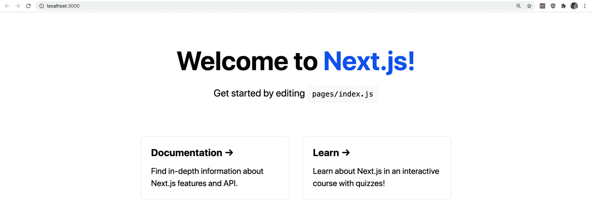
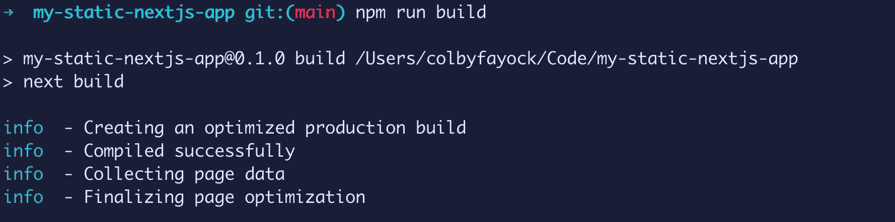
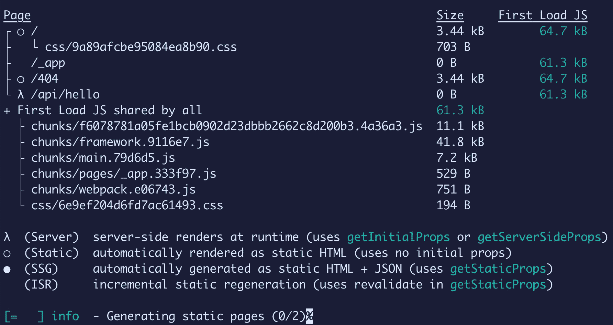
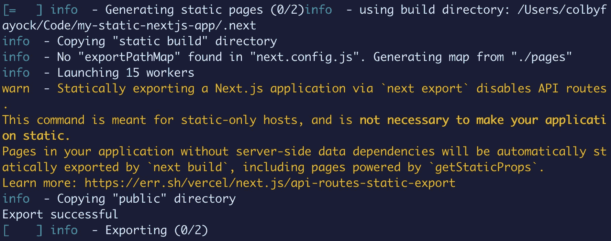
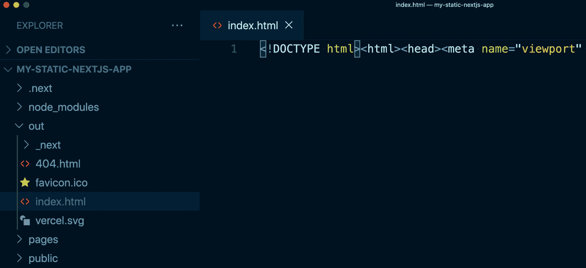

# 什么是静态站点生成？Next.js 如何将 SSG 用于动态 Web 应用

> 原文：<https://www.freecodecamp.org/news/static-site-generation-with-nextjs/>

静态网站和网络一样古老。但是 JavaScript 的兴起为那些静态网站变得更加动态打开了大门。

虽然这可能包括手工构建 HTML 文件，但我们如何利用静态生成来用现代工具构建应用程序呢？

*   [什么是静代？](#what-is-static-generation)
*   [静态生成期间会发生什么？](#what-happens-during-static-generation)
*   [next . js 如何使用静态生成？](#how-does-next-js-use-static-generation)
*   [用 Next.js 静态生成 app](#statically-generating-an-app-with-next-js)

[https://www.youtube.com/embed/6ElI2ZJ4Uro?feature=oembed](https://www.youtube.com/embed/6ElI2ZJ4Uro?feature=oembed)

## 什么是静态生成？

静态生成描述了在构建时编译和呈现网站或应用程序的过程。输出是一堆静态文件，包括 HTML 文件本身以及 JavaScript 和 CSS 等资产。

如果你没有听说过静态生成，但这个概念听起来很熟悉，你可能听说过它的更长的名字静态站点生成或其缩写 SSG。

## 静态生成过程中会发生什么？

我们传统上所知的基于 JavaScript 的 web 应用程序是通过在运行时在浏览器中运行 React 或脚本等库来工作的。

当浏览器收到页面时，通常是简单的 HTML，没有很多内容。然后加载脚本，将内容拉入页面，这个过程也称为水合。

使用静态生成，像 Next.js 这样的工具会尝试像在浏览器中一样呈现页面，但是是在编译时。这使我们能够在第一次加载时提供全部内容。在此过程中，脚本仍然会对页面进行补充，但理想情况下只有很少的更改或者根本没有更改。

## Next.js 如何使用静态生成？

开箱即用，Next.js 将尝试静态地生成它能生成的任何页面。它通过检测应用程序如何获取数据来做到这一点。

Next.js 提供了一个[几个不同的 API 来获取数据](https://nextjs.org/docs/basic-features/data-fetching)，包括`getStaticProps`和`getServerSideProps`，根据它们的使用方式，这些 API 决定了 Next.js 将如何构建你的应用。

如果只使用`getStaticProps`获取数据，Next.js 将在构建时获取数据，留给您一个完全静态的页面。

如果你使用`getServerSideProps`，Next.js 就会知道这个应用需要一个服务器来渲染那些页面。

除了像 Vercel 这样的部署解决方案[将自动处理服务器](https://vercel.com/solutions/nextjs)的配置，Next.js 将在有人向服务器请求页面时加载任何数据。

虽然默认情况下不会这样做，但 Next.js 还提供了在应用程序构建完成后将应用程序导出到单独目录下的静态文件中的能力。

首先，您将运行`next build`命令来构建应用程序，然后您将运行`next export`，默认情况下，这使得应用程序可以作为静态文件在`out`目录中使用。

## 如何用 Next.js 静态生成 app

为了了解这是如何工作的，我们可以快速创建一个新的 Next.js 应用程序。

对此的唯一要求是，您已经安装了 npm 的[节点](https://nodejs.org/en/),并且能够使用终端运行命令。

### 如何创建 Next.js 应用程序

入门就像在终端中运行一行代码一样简单。

打开您想要创建项目的目录并运行:

```
npx create-next-app my-static-nextjs-app 
```

安装完成后，您可以导航到新的项目目录:

```
cd my-static-nextjs-app 
```

在那里，启动您的开发服务器:

```
npm run dev 
```

一旦服务器准备就绪，你就可以在浏览器中打开 [http://localhost:3000](http://localhost:3000) ，在这里你可以看到你的新 Next.js 应用程序！



New Next.js app

### 如何构建 Next.js 应用程序

现在我们已经有了自己的应用程序，让我们试着构建它。

在同一目录中，运行命令:

```
npm run build 
```

如果您查看终端内部的输出，我们会看到一些重要的事情发生。

首先，Next.js 让我们知道它正在运行它的构建过程，包括优化应用程序的性能、编译应用程序和收集数据。



Building with Next.js

接下来，我们看到 Next.js 向我们展示了它是如何构建每个页面的。

默认的 Next.js 起始模板包括几个静态页面和一个示例 API 路由。

使用底部的图例，我们可以看到所有的页面和资产都是用一个标记为需要服务器的路由静态生成的，这就是我们的 API 路由。



Next.js generating pages

*注意:出于本演练的目的，我们可以忽略 API 途径，但是 Next.js 和 Vercel 提供了构建 lambda 函数作为 Next.js API 一部分的能力。*

### 如何构建静态 Next.js 应用程序

通过我们的 Next.js 构建输出，我们知道我们只是构建了一些静态页面，但是我们可能很难找到它们。如果我们查看项目中的文件夹和文件，并不能马上清楚这些文件在哪里。

当 Next.js 构建一个应用时，默认情况下，它只输出在`.next`目录中的那个应用。这包括像 Vercel 这样的工具可以使用和理解的配置文件来部署应用程序。

从技术上来说，这个目录包括了我们的整个应用程序，但这不是我们可以轻松部署到静态托管的东西。

Next.js 还提供了导出应用程序的功能。这将采用我们构建的应用程序，并生成一组静态文件，然后我们可以使用这些文件来部署我们的应用程序。

在`package.json`文件中，更新`build`脚本以包含`next export`:

```
"build": "next build && next export", 
```

更新后，在项目目录中再次运行构建命令:

```
npm run build 
```

现在我们可以看到，我们不仅像上一步那样构建了应用程序，Next.js 还让我们知道，我们还将构建的应用程序导出到静态文件中。



Exporting static Next.js app

如果我们查看我们的项目文件夹，我们现在应该看到一个名为`out`的新目录。

如果我们查看该文件夹，我们现在可以看到我们的整个应用程序静态编译，包括`index.html`文件以及使用该应用程序所需的所有 CSS 和 JS！



## 我们能从这里去哪里？

我们了解到，我们可以使用 Next.js 和静态生成的概念来静态编译应用程序。

像 Next.js 这样的工具可以通过编译我们的代码来做到这一点，就像我们在浏览器中看到的那样，这样当我们的应用程序进入浏览器时，它就已经准备好了。

通过一个简单的命令，我们还可以构建和编译我们的应用程序，并将其导出到静态文件中。我们可以将这些静态文件部署到任何静态存储服务，如 Vercel 或 AWS S3。这为我们提供了一种简单的方法来制作快速而廉价的动态 web 应用程序。

通过[访问 Next.js 文档](https://nextjs.org/docs/basic-features/data-fetching)，了解 Next.js 如何利用其不同的 API 来提供静态和动态体验。

[](https://jamstackhandbook.com/)

[](https://twitter.com/colbyfayock)

*   [🐦在 Twitter 上关注我](https://twitter.com/colbyfayock)
*   [📺订阅我的 Youtube](https://youtube.com/colbyfayock)
*   [📫注册我的简讯](https://www.colbyfayock.com/newsletter/)
*   [💝赞助我](https://github.com/sponsors/colbyfayock)