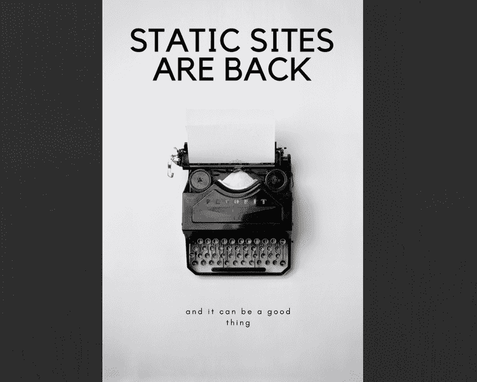

# 最好的静态网站生成器，以及何时应该选择它们而不是 CMS

> 原文：<https://www.freecodecamp.org/news/static-sites-are-back-24d01a01f11a/>

斯特凡诺斯·瓦达洛斯

# 最好的静态网站生成器，以及何时应该选择它们而不是 CMS

过去，网页是静态网站，只有 HTML 和 CSS(后来还有一些 JavaScript)。试着回忆一下那到底是什么意思。

没有服务器代码或数据库。您的浏览器下载并显示了某处托管的 HTML 文件。开发是直接在文本文件中完成的，或者通过像 Dreamweaver 这样的程序。

Web 开发最终加快了速度，并且到目前为止，它还没有停止加速。在某个时候，内容管理系统(CMS)的概念出现了。然后，开发门户网站、博客和营销网站的新方法成长并繁荣起来。他们仍然这样做，WordPress 现在是 CMS 的首选。

从开发人员或管理员的角度来看，CMS 可以解决许多问题。但是有一些理由*不*使用其中一个，回到一个老朋友身边。

为特定项目选择 CMS 需要严格的规范和依赖关系。一个典型的 WordPress 安装需要一个 web 服务器，比如 Apache、带有各种扩展的 PHP 和 MySQL 数据库。所有这些都必须更新和维护。但是，在某些情况下，这些程序甚至会导致更多的问题。

今天，web 开发最重要的因素之一是安全性。不幸的是，这是 CMS 最大的缺点之一。使用 CMS 就像让自己容易受到网络攻击。随着你安装和使用的插件的增加，你暴露的漏洞数量也会增加。(插件是使用 CMS 的真正原因。)

除了安全性，现代项目的另一个重要因素是性能。CMS 从头开始生成用户请求的页面，或者使用内置或可安装的插件。缓存系统确保尽可能重用预先生成的页面。使用某种类型的缓存系统会有很大帮助，但它可能会增加相当多的开销。

A screenshot of the nice graphic user interface that CMS tools offer nontechnical users.

因此，通过创建一个静态网站，这些问题变得过时。顾名思义，静态站点只包含静态文件。比如一些 HTML 和 CSS 文件，还有一点 JavaScript。

对托管页面的机器类型没有具体要求，没有后端语言限制，也不需要数据库。由于静态文件被提供给浏览器，所以不存在实际的漏洞。

实际的页面已经生成，可能会缩小。从性能角度来看，它们似乎比任何 CMS 缓存的解决方案都要好。

更有甚者，现代静态站点生成器通常从平面类型的文件中读取，比如 Markdown。文章内容驻留在文件中，而不是数据库中，所以您可以将它们放在 Git 工作流中。

但是静态网站也有一些缺点。你基本上抛弃了网络的后端。最重要的是，你失去了与用户的交互性——比如用户资料、收藏夹和推荐阅读。有很多方法可以添加这些功能，比如通过 Disqus 平台评论，但是这些都不是最佳的。

这些生成器缺少的最大特性是缺少管理 UI。(尽管很可能在某个时候会有一个解决方案。)一些技术人员可能不会觉得在适当的文件夹中创建新文件和将资产链接为图像那么困难。但是在大多数情况下，非技术内容创建者可能会发现缺少管理用户界面是一个活地狱。

这主要是基于其需求的项目规划决策。对于许多网站来说，CMS 绝对是大材小用。

考虑到以上几点，你应该可以回答一个静态网站对于一个具体的项目是否足够了。但是另一个问题是需要大量的选择和相应的初始设置时间。

在 CMS 的世界里，有无数的选择，也有赢家。作为一种选择，WordPress 将为任何项目做这项工作。在静态站点生成器的世界里，有太多的选项——准确地说是 459 个选项。

但没有明确的赢家或某种方式来区分它们。似乎从现在开始可能会有所改变，但还有待观察。其中一些获得了广泛的知名度，值得注意。

Stats through [StackShare](https://stackshare.io/stackups/gatsby-vs-wintersmith-vs-hugo-vs-hexo-vs-jekyll)

[**杰基尔**](https://jekyllrb.com/)**是迄今为止最受欢迎的那些发电机之一。它是用 Ruby 构建的，并集成到 GitHub 页面中。因此，它在个人项目和/或文档中非常流行。它拥有庞大的用户群和大量的插件目录。**

**[**雨果**](https://gohugo.io/) 挺像哲基尔。它是建立在 Go 上的，它与 Jekyll 的主要区别在于它极快的速度。当实际的站点生成时，Jekyll 可能会非常慢，尤其是当帖子/页面的数量增加时。
但是雨果在几秒钟内就创建了这个网站。还有其他一些抽象使得 Hugo 更加用户友好，更容易上手。从头开始创建东西不需要太多的配置。**

**[**Hexo**](https://hexo.io/) 是一个较新的加法，用 NodeJS 创建。宣传，而且大多用作博客平台，它结合了 Jekyll 的可扩展性和 Hugo 的速度。(其实比雨果还快)**

**[**温特史密斯**](http://wintersmith.io/) 是另一个建立在 NodeJS 之上的。这个不同，因为它非常简约。它基本上是一个平台，你可以通过一些插件来定制你的需求。它肯定需要一些调整来使其工作，但留下了更多的定制空间。**

**最后一个选项是最新的，也是最有趣的。**

**Gatsby 是当今将静态页面引入堆栈的一个框架。它使用 React.js 和 Webpack 为您的内容创建一个 SPA(单页应用程序)。它承诺删除这种应用程序所需的大部分配置。这样做，它为开发人员提供了一个易于使用的解决方案，最终将产生一个现代的高端应用程序。
事实是，《盖茨比》不仅可以用来写博客，还可以用于许多其他用途。它的真正极限还没有被发现。(因为它在本月早些时候才发布了第一个稳定版本。)**

**它使用 React 的事实很有帮助，因为越来越多的开发人员现在正在使用 React 或计划很快使用。**

### **摘要**

**

Downloads in the past 6 Months** 

**查看过去六个月的下载量，我们可以看到盖茨比可能会成为赢家。这些数字可能不是 100%真实的。Gatsby 还可以用于比 markdown 到 HTML 转换更复杂的事情。但是，随着它的用户群迅速扩大，我们可能已经找到了静态站点生成器的 WordPress。**