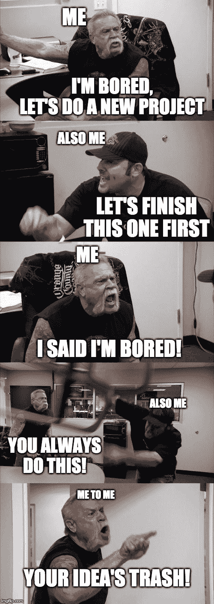
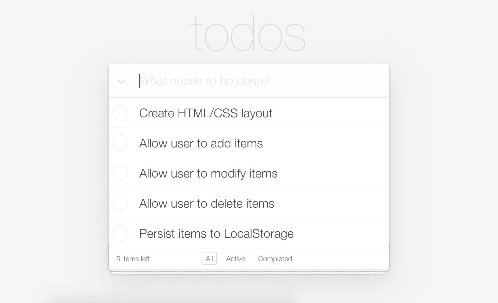

# 如何保持动力，用三个步骤完成你的项目

> 原文：<https://www.freecodecamp.org/news/stay-moviated-and-finish-your-projects/>

目标、结构、责任。

许多人和我分享了他们在做项目时的动机斗争。开始当然容易，但完成几乎是不可能的。

我当然认同这一点。保持动力是我经常对自己提出的挑战，有时我会失败。

尽管如此，我还是取得了进步。希望我分享的内容能让阅读这篇文章的人受益。

## 1.目标

不挑项目，那就不做项目。

寻找你舒适区之外的东西，但不要太多。我建议从头开始重建一个现有的项目。正如我在[中解释的，无限项目创意的秘密](https://www.yazeedb.com/posts/the-secret-to-unlimited-project-ideas)，复制——直到你能够创造。

如果你真的想，你可以加入自己的创意，但不要在设计和商业逻辑上浪费太多时间(除非你想做网页设计)。找一些已经有这些方面的东西，然后专注于编码。如果你还没有尝试过，也许可以尝试一下？

## 2.结构

一旦你设定了目标，你将如何去实现它？迎面？

你的精神令人钦佩，但是不行。

我们通常放弃事情，因为我们不知道下一步是什么。“正面”处理一个项目通常意味着“不经思考就跑向代码编辑器”你不妨现在就放弃这个项目，为自己节省时间。

### 分开它

使用笔记本，日历，待办事项，项目板，任何东西！将项目分解成任务，确保你总是知道下一步是什么。否则你会看不到目标，原地打转，最终失去动力。

例如，如果我正在制作 TodoMVC 应用程序，我希望有一个这样的列表。

您的详细程度可能会有所不同，但这可以完成工作！我随时都知道该做什么。

## 3.有责任

这一步可能是可选的。有些人足够自我导向，他们只需要一个明确的目标和坚实的攻击计划。然而，对于我们其他人来说，这里有一些让我们对自己负责的想法。

这些建议是非常个人的，所以这完全取决于你觉得做什么舒服。

*   付钱(书籍、课程、班级、训练营等)。现在如果你退出，你会感到双倍的浪费。
*   告诉别人这件事。现在你需要一个好的答案，当他们稍后问你，“那个项目进展如何？”
*   在社交媒体上分享，这样很多人会问你这个问题。
*   关于它的博客。你会觉得创作内容很棒，而且作为奖励，教别人是巩固你的新知识的好方法！
*   记住你为什么要这么做。你已经投入了一去不复返的时间。

## 摘要

1.  目标 -选择一些有挑战性的，但不是压倒性的事情。
2.  **结构** -创建一个有组织的攻击计划。
3.  **责任** -为没有坚持到底创造一个后果。

## 感谢阅读

更多类似的内容，请查看[https://yazeedb.com](https://yazeedb.com)。请告诉我你还想看什么！[我的 DM 在 Twitter 上是公开的。](https://twitter.com/yazeedBee)

下次见！