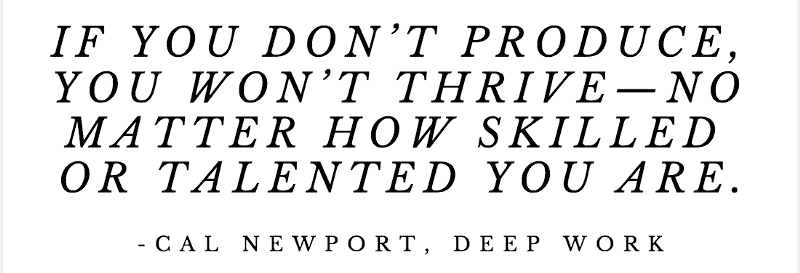
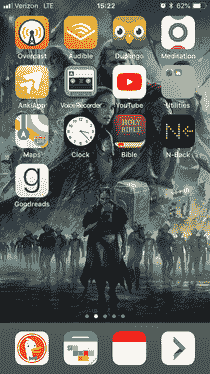

# 如何保持专注——在一个互联世界中不受干扰的编程

> 原文：<https://www.freecodecamp.org/news/staying-focused-distraction-free-programming-943f10335c56/>

我和许多程序员一样(我想)，努力集中精力，专注于任务。每一天的每一个小时，我似乎都被短信、电子邮件、信息、推特和面对面的干扰轰炸着。更不用说我喜欢查看的所有博客网站和我最喜欢的 YouTubers 上的新视频了。

随着我频繁地咨询、旅行和远程工作，这已经成为一个更大的挑战。以下是我能够最大限度地提高产出和时间效率以及最大限度地减少干扰的一些方法。

### 应用程序/网站拦截器

在电脑上工作时保持专注从来都不容易，但通过使用应用程序和网站拦截程序，我变得“更容易”了。现在，我大部分工作都用苹果电脑，我也带着它旅行。因此，这里的一些应用程序特定信息是针对 Mac 用户的。我还想在这里指出，桌面应用程序比浏览器插件更好，因为它们可以阻止所有浏览器和桌面应用程序(另外，如果你是一名应用程序开发人员，你的浏览器中可能已经有足够多的插件了)。？

这里有几个应用程序可以帮助你集中注意力:

*   [**Focus**](https://heyfocus.com/)(Mac)——这是我目前唯一使用的 Mac 版应用，可以让我屏蔽任何网站(在任何浏览器上)以及桌面应用。我也可以选择在应用程序内部编写脚本来定制它。我喜欢这个应用程序的另一个原因是，它是少数几个有相当好的隐私政策的应用程序之一。
*   [**冷火鸡**](https://getcoldturkey.com/privacy/)(Windows)——我没有亲自使用过这个，但它是推荐的，他们似乎有一个很好的隐私政策——他们使用 Matomo 而不是谷歌进行分析，他们非常清楚数据是如何存储和使用的。
*   [**自由**](https://freedom.to/privacy) (跨平台)——请不要在没有阅读他们的[隐私政策](https://freedom.to/privacy)的情况下使用自由！他们在“分享一般用途”一节中承认，他们为了个人利益向广告商出售个人信息。然而，如此多的人推荐和使用这项服务。嗯，不用了，谢谢。
*   浏览器插件 -如果你正在使用 Chrome，有很多好的选项，比如[保持专注](https://chrome.google.com/webstore/detail/stayfocusd/laankejkbhbdhmipfmgcngdelahlfoji?hl=en)，这是我在切换到 Firefox 作为我的主要浏览器之前使用的。Firefox 似乎没有任何类似的东西( [Leech Block](https://addons.mozilla.org/en-US/firefox/addon/leechblock/) 对我不起作用，但有些人喜欢它)，尽管我在使用我的桌面应用程序时并不真的需要这种插件。不过，我确实在 Linux 上专门使用基于浏览器的插件，所以我会在将来再找一个更好的火狐插件。

我使用这些类型的工具为自己制定时间表，并在一天的大部分时间里屏蔽所有新闻、社交媒体、体育和科技博客网站。Focus 应用程序(上面提到的)很好，因为我可以指出某些休息时间——有时我真的需要看看社交网站来快速获取一些信息，所以这给了我灵活性。

### 电话

我以前手机上有那么多社交应用。我几年前就摆脱它们了——脸书、推特和所有的一切。现在我只有教育类的 app，地图之类有用的东西，还有打电话/短信/聊天的 app。

因为聊天和短信也会分散注意力，所以我关闭了它们的通知。我还关闭了从锁定屏幕查看它们的功能。这意味着我必须非常谨慎地解锁手机来查看信息。

我甚至更进一步，把所有的信息和电话应用从我的主屏幕上移走。我把它们放在文件夹里，我必须滑动到一个新的屏幕，然后打开文件夹找到应用程序。这为我节省了太多的时间，我过去常常花在无意识地打开应用程序上。我还阻止了任何应用程序/工具出现在锁定屏幕上。我只能输入密码或使用相机。

my home screen; yes, I like Thor :)

### 其他提示

*   计时器-对于特别困难的任务或者我不想做的事情，我会启动计时器。一旦我已经做了至少 5 或 10 分钟，然后通常我会继续做一个小时或更长时间，只是完成它。出于某种原因，计时器改变了我的思维模式，让我开始做一些本来会推迟到以后做的事情。
*   我每月、每周、每天都安排事情。如果我知道我在做什么，我需要完成什么，我会更加注意……我也会安排时间专门查看社交媒体。
*   网址 -我不在搜索栏中使用自动完成功能。我发现，如果我必须打出完整的网址，我就不太可能漫不经心地访问社交媒体页面。

我发现自己在博客或社交网站上输入两三个字母，然后它就弹出来了。这太容易了。如果你必须打出完整的网址，就很难用它来分散注意力。另外，你给自己足够的时间来有意识地改变你的想法。

### 相关阅读

前两本书是非凡的书籍，它们改变了我的生活，让我更加专注和高效。

*   [把事情做完](https://www.amazon.com/Getting-Things-Done-Stress-Free-Productivity/dp/0143126563)——这本书轻而易举地改变了我的生活。在我读这篇文章之前，我对自己的工作效率感到非常沮丧。我怎么推荐都不为过。说句题外话:我使用 [Nirvanahq](https://www.nirvanahq.com/) 来管理我的项目和行动，就像书中推荐的那样。
*   《深度工作》 -一本关于如何和为什么保持深度专注的优秀书籍。
*   在这本书中，我还得到了一些关于外包和委派任务的想法。使用这些方法帮助我在重要的任务上花费更多的时间。

### 结论

我不是完美的，我的方法也不是。这些只是对我有帮助的事情。如果你有任何其他建议，请告诉我。

感谢阅读我的文章，祝你有美好的一天:)