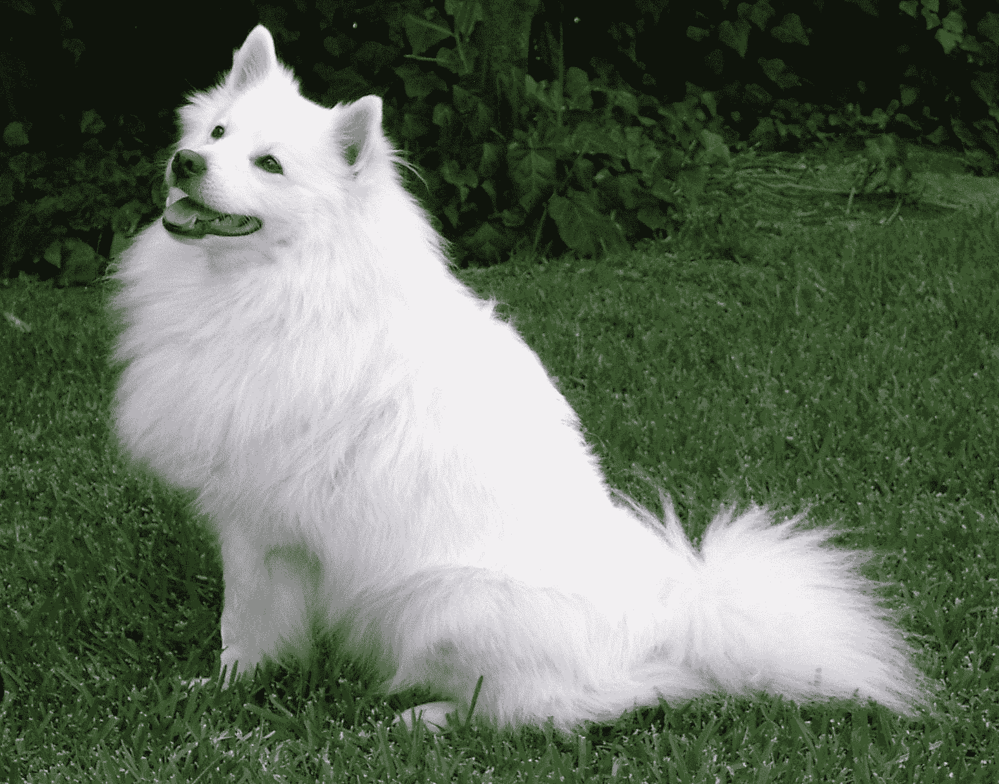

# 用简单的英语解释隐写术

> 原文：<https://www.freecodecamp.org/news/steganography-explained-in-plain-english/>

隐写术是将文本、图像、文件或视频隐藏在其他文本、图像、文件或视频中的概念。这方面的一个离线例子是使用“隐形墨水”在一封信的字里行间隐藏信息。柠檬汁是隐形墨水的热门候选:[柠檬汁隐形墨水](https://www.youtube.com/embed/poCnU_crpjQ)

下面是一个非常基本的隐写过程公式:

> cover_medium+hidden_data+stego_key = stego _ medium
> 
> *在这个上下文中，cover _ medium 是我们将隐藏 hidden _ data 的文件，它也可以使用 stego _ key 加密。生成的文件是 stego_medium(当然，它将是与 cover_medium 相同类型的文件)。
> 
> 来源:[隐写术及其在安全方面的应用](http://www.ijmer.com/papers/Vol2_Issue6/EN2646344638.pdf)*

## 图像隐写术

在计算机上，图像存储为二进制文件。它们包含组成图像的每个图片元素(像素)的颜色或光强度的二进制表示。例如，这张狗的图片:



可能以这样的方式开始:

```
10010101   00001101   11001001
10010110   00001111   11001010
10011111   00010000   11001011
...
```

在文件中隐藏数据的最简单方法称为最低有效位(LSB)插入。有了它，你可以获得图像的二进制表示，并覆盖每个字节的 LSB，使变化最小到人眼看不到的程度。

虽然 JPEG 可用于隐写应用，但更常见的是在 GIF 或 BMP 文件中嵌入数据。GIF 和 8 位 BMP 文件采用所谓的无损压缩，这种方案允许软件精确地重建原始图像。另一方面，JPEG 使用有损压缩，这意味着扩展的图像与原始图像非常接近，但不是精确的副本。