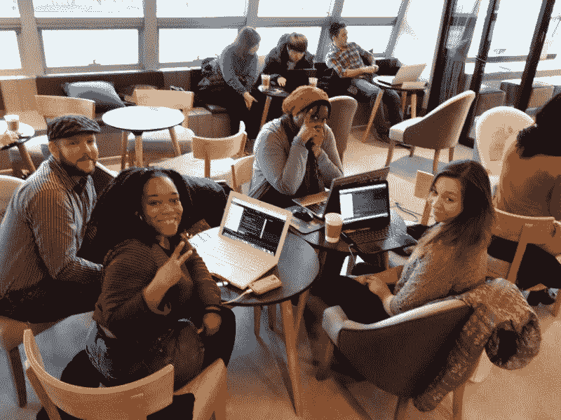
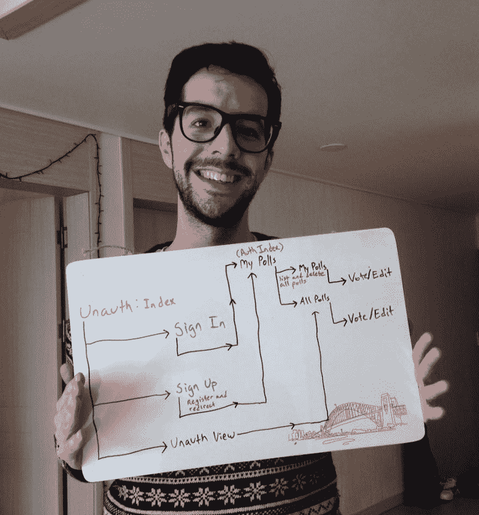

# 这是 9 个月自学编码的样子

> 原文：<https://www.freecodecamp.org/news/stephen-mayeux-shows-you-what-9-months-of-self-taught-coding-looks-like-50f4e6c3598f/>

作者斯蒂芬·马约

# 这是 9 个月自学编码的样子

I’m currently wrapping up my final teaching gig in Busan, South Korea. I’ve been teaching myself full stack web development over the last 9 months.

#### 仅仅触及表面

今天标志着我开始自学程序员的旅程已经 9 个月了，我感觉棒极了！

一开始，在所有新手都经历的牵手阶段后不久，我一次次碰壁，试图理解高阶函数、Node.js 中的异步回调以及非常神秘的 Heroku 错误日志。

一路上有很多疑虑，但我已经克服了那些消极的想法，学到了很多很酷的东西！

自从我去年夏天开始学习编码，我已经构建了几个 MEAN stack 应用程序，并通过[免费代码营](http://freecodecamp.com)帮助其他人这么做。但我只是触及了表面！

I have accelerated my learning by teaching others at Free Code Camp Busan.

我目前正在完成我在韩国的最后一份教学合同，我将于 2016 年 9 月回到美国。这给了我大约 5 个多月的时间来建立、学习、合作和准备，以便我可以在德克萨斯州或加利福尼亚州找到一个全职的开发职位。

与此同时，我想反思一下到目前为止我所学到的东西，并告诉你我是如何做到的。

#### 我学到了什么

现在，JavaScript 和 MEAN stack 炙手可热。如果你正在考虑进入 web 开发，即使你想学习 Ruby on Rails，那么 JavaScript 和一些基本的 Node.js 是必不可少的。这是我开始学习编码以来一直使用的方法，所以你可能想根据你自己的学习路径修改这个列表。

此外，重要的是要提到，我在项目和任务中至少使用过一次这些技术，但我绝不是您在这里看到的所有东西的专家！例如，我的普通 JavaScript 技能非常扎实，但我只会认为自己“精通”Angular。我是一个 Git 忍者，但我的设计和 CSS 技能仍然很烂。

1.  HTML5、CSS3 和 Twitter 引导
2.  萨斯(SCSS)
3.  JavaScript (ES6…还没有！)
4.  jQuery 和 AJAX 请求
5.  安圭拉 1.x
6.  MongoDB
7.  一种数据库系统
8.  Node.js 和 Express
9.  流星报
10.  模板:灰尘、EJS 和玉石
11.  Git 和 GitHub
12.  命令行
13.  Heroku
14.  红宝石

#### 证书

如果你不准备花很多钱参加训练营，在线证书是一个负担得起的选择。其中许多都是免费的，包括你可以添加到你的投资组合中的真实项目。

我已经完成了 4 个证书，我希望在这个夏天结束的时候能拿到更多的证书。

1.  [**自由代码营的前端开发计划**](http://freecodecamp.com/stephenmayeux/front-end-certification) —使用 JavaScript 完成 50+个算法挑战，用 HTML、CSS、jQuery、Angular 构建 10 个项目。
2.  [**Coursera**](https://www.coursera.org/account/accomplishments/verify/UPF9ECWSCFBZ)响应式网站基础——观看视频讲座并完成随后的小测验，复习同学的作业，使用 HTML、CSS、JavaScript 制作响应式网站。
3.  [**自由代码营的后端开发项目**](http://www.freecodecamp.com/stephenmayeux/back-end-certification)——到目前为止，这是我旅程中最困难和最具挑战性的部分，但完全值得！使用 MEAN stack 构建 10 个 API 微服务和动态 web 应用。
4.  [**M101JS:MongoDB for node . js 开发者**](http://university.mongodb.com/course_completion/8631e11add4f43fab5106235ac610b44)—Mongo 大学提供的免费认证。观看视频讲座，完成测验和一个期末项目。

Sketching out my first Full Stack application for Free Code Camp: a voting app!

#### 下一步

找工作的压力越来越大，我不得不进入超光速。为了帮助我从严肃的业余爱好者过渡到专业的开发人员，我决定投入大量的时间和金钱，参加一个编码训练营来帮助我完成最终的转变。我申请了几个编码训练营，包括 Hack Reactor、App Academy、MakerSquare、Coding House 和 Viking Code School。

每所学校都有不同的优势，但我最终决定成为一名维京战士！VCS 强化课程(以及兼职弹性课程)是 100%在线的，非常适合那些在没有任何收入的情况下无法在大城市生活 3 到 4 个月的人。

当我在韩国教书的时候，我实际上可以在兼职的基础上完成这个项目，当我九月份回国的时候，我将差不多完成这个项目。

VCS 最好的部分是我将会接触到一个完全不同的编程和网络开发范例。在这个项目中，我将使用 Ruby on Rails 和一个 SQL 数据库来开发全栈 web 应用程序。到目前为止，我唯一知道的编程语言是 JavaScript，我很兴奋终于可以学习一些新的东西了！

#### 那都是乡亲们！

总的来说，我对我学到的东西印象深刻，我期待着构建许多很酷的东西！如果你对向编码过渡感兴趣，或者你也是一个自学成才的程序员，我很乐意收到你的来信！请在下面的评论中给我留言，让我们交换意见。

感谢阅读和快乐编码！