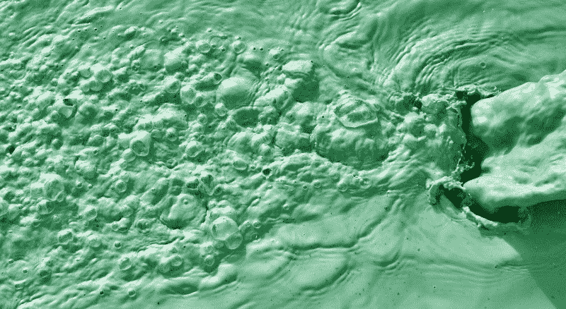
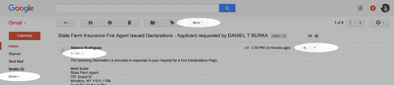
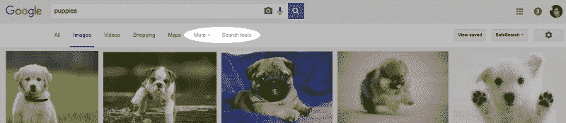
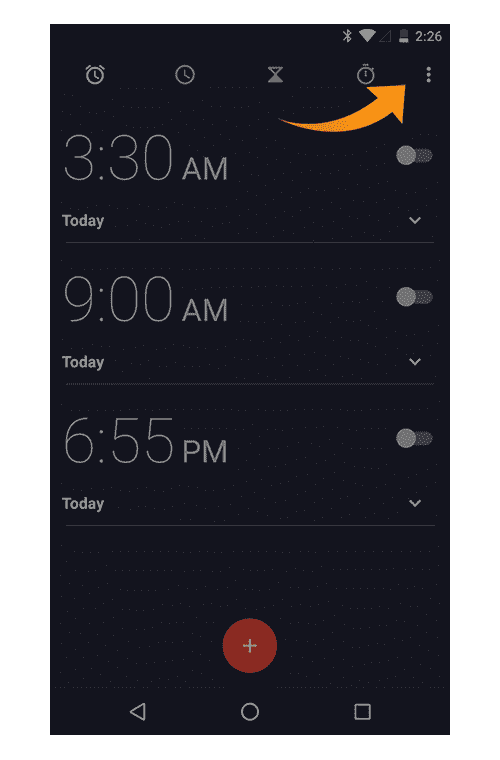
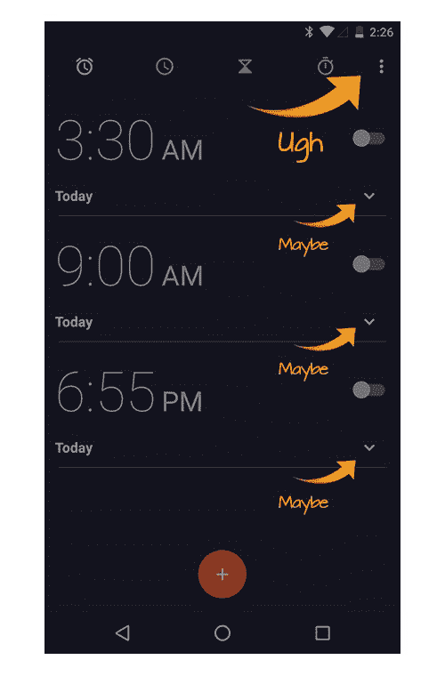

# 停止过度使用溢出菜单

> 原文：<https://www.freecodecamp.org/news/stop-the-overuse-of-overflow-menus-5caa4b54e843/>

丹尼尔·伯克

Your overflow menu doesn’t look any better than this overflow of toxic sludge… disgusting.

# 停止过度使用溢出菜单

你知道那些在应用程序和网站上显示更多菜单选项的模糊菜单按钮吗？它们通常会有一个省略号“ **… 【T1””或一个箭头▼图标，有时它们甚至会有一个**多**的标签。或者，更好的是，一个**多一个**加一个▼！这些被称为溢出菜单。泛滥的菜单是一个祸害，应该被根除，踩在脚下，淹没在有毒污泥的海洋中。**

Gmail has no fewer than 4 overflow menus when viewing an email!!!! You’re damned right I used a bunch of exclamation marks!!!!!!

溢出菜单对用户界面设计者来说非常有吸引力。多年来，设计师们一直认为成就的顶峰是一个“干净”的用户界面。设计师们盲目地相互绊倒，以遵从一句古老的格言:

> …最终达到完美不是因为不再有任何东西可以添加，而是因为不再有任何东西可以拿走。— *安东尼·德圣埃克苏佩里*

溢出菜单似乎是完美的解决方案。设计师可以“去掉”复杂性，只留下真正重要的部分。您可以快速轻松地创建一个外观整洁的用户界面。溢出菜单的问题在于，你实际上并没有拿走任何东西，你只是令人讨厌地混淆了它。

问题的关键在于过多的菜单让设计师、工程师和产品人员摆脱了做出艰难选择的困境。我们没有区分优先次序，而是把复杂性藏在地毯下面，假装它不存在。带有溢出菜单的软件通常仍然难以使用，即使其复杂性已经隐藏在表面之下。事实上，因为用户不能辨别所有可用的选项，溢出菜单经常使界面更加难以使用。

Google Image search is crushing it with side-by-side overflow menus. The poor puppy on the right wants off this train wreck.

看看谷歌图片搜索就知道了。该团队没有选择是拥有一个非常简单的界面，还是拥有一套强大的工具，而是进行了折中。你可以想象有人提出令人信服的论点:

> 伙计们，我有终极解决方案。通过使用名为 ***搜索工具*** 的溢出菜单隐藏高级选项，谷歌图片搜索将变得强大且易于使用！此外，人们会对我们所有的搜索选项感到不知所措，所以我们会智能地将书籍、航班和应用程序隐藏在 ***More*** ▼菜单下。完美的妥协。

听起来不错。在现实中，经过多年的日常使用，我仍然不能可靠地选择正确的选项。我只是想过滤我的大文件大小的图像，我知道有一个菜单隐藏在这里的某个地方，但我经常点击**更多的**，当我想我应该点击**搜索工具**。啊啊啊！

Android 对溢出菜单的接受如此之深，以至于它成了动作栏中的默认用户界面元素。在应用程序的任何给定屏幕上，你都可能会看到不同的菜单选项。关于的一些事情比如**设置**或者**可能会出现在一个 app 的每个屏幕的*的溢出菜单中。另外，其他的像**删除帖子**将会与你正在看的屏幕相关联。它们都混合在一个有毒的大杂烩中:一片混乱。***

我主要是在搜索谷歌的溢出菜单实现，因为我在公司的一个分支机构工作。我知道谷歌的许多设计师都很优秀，挑你朋友的毛病比诋毁陌生人更安全。当然，溢出菜单像瘟疫一样在各种团队设计的应用程序中传播，不仅仅是在谷歌。而且，我也不是没有做出过后来会后悔的妥协决定，但有时候往玻璃房子里扔石头是个好主意。此外，很明显，Android 上的一些默认应用程序最近已经不再使用溢出菜单。例如，Play Store 曾经有数不清的溢出，我最近打开应用程序时才注意到，溢出已经被禁止，取而代之的是更直观、更精简的界面。很好。

所以，如果谷歌有一些天才的设计师，为什么溢出菜单仍然经常在这里横行无忌？让我们看看好的团队是如何遭遇不幸的，以及如何避免这种事情发生在你的团队身上:

混淆≠简化
设计师经常混淆混淆和简化。简单地隐藏功能看起来就像你在创建一个“更干净”和更易于使用的界面。当然，你的新用户界面可能通过简单性的*斜视测试*，但是你没有处理你的应用程序的核心复杂性。

作为设计师，我们的工作不是使用混淆或花招，而是将复杂性结构化，使其易于理解。过多菜单的问题是没有信息气味——从多汁的牛排到恶心的甘草都可能隐藏在菜单下。不要添加溢出，考虑以下选项:

1.  删除该功能。如果 0.001%的人会在溢出中找到它，那你真的需要它吗？
2.  添加真正的功能。不要犹豫。把它放在页面上。滚动是最简单的导航方式。
3.  将复杂性结构化，不要只是隐藏它。使用有意义的图标或清晰的标签来表示一组功能可用。不过说真的，“更多”或“菜单”或“…”都不是清晰的标签。

承认你在使用拐杖
承认你有问题是解决问题的第一步。许多团队不承认使用溢出是一种拐杖，一种避免做出艰难选择的方法。我敢肯定，有时你会有意识地选择使用溢出菜单(我甚至会勉强承认以前使用过)，但不要让这种选择成为一个简单的出路。

迫使你自己和你的团队做出艰难的选择
这才是重点。不要假装让你的产品更简单，实际上要做出包括或不包括菜单选项的艰难决定。如果某样东西很重要，需要包括在内，就展示给客户看。设计 mobile-first 最棒的一点是，你经常被迫做出艰难的选择，决定要包含什么，要省略什么(在 iOS 上尤其如此，因为它的工具包中没有内置的溢出菜单)。把这当成一个挑战，而不是一个阻碍。

当缺乏上下文时，溢出菜单是最令人震惊的。例如，在 Gmail 中，**打印**功能可以位于两个溢出菜单中的任何一个之下。在 Android 中，操作栏右上角的持久溢出菜单可以包含全局或局部菜单选项。在 Google Images 中，两个并排的、不相关的溢出菜单相互冲突。溢出菜单*在真正的语境下使用*才能发挥作用。考虑 Android 闹钟应用程序的例子，左边。右上角的溢出菜单缺乏上下文(它可以是任何内容)，但每一行的溢出菜单都给出了一些指示，说明您可能会在表面下找到什么，因为它与特定的警报相关。

研究让你诚实
阻止菜单泛滥的一个好方法就是做用户研究。在我们设计工作室的范围内，像溢出菜单这样的解决方案似乎是完美的。把你的产品放在普通人的手中，看着他们在你设计的界面中挣扎，这是一次终极的清醒检查。你“干净”的用户界面可能会让你的用户感到困惑。除非你和你的团队是一群冷酷的抽泣者，否则同情你的用户的挣扎应该会说服你找到更好的解决方案。

考虑信息搜寻
如果我上面的夸夸其谈让你反感，考虑一下为什么过多的菜单不是最佳选择的更学术的观点。有一个流行的理论叫做信息搜寻，它经常被用来描述为什么一些接口比其他的好。你可以在信息设计组织[这里](https://www.interaction-design.org/literature/book/the-glossary-of-human-computer-interaction/information-foraging-theory)阅读到关于信息搜寻的详尽而有用的解释，但基本要点是:

> 信息觅食理论是基于动物决定吃什么，在哪里可以找到它，获得它的最佳方式以及一餐将提供多少“能量”(如何填饱)的类比……想象一个捕食者，如猛禽，面临着决定吃什么的经常性问题，我们假设就繁殖成功而言，它的适应性取决于能量摄入。能量流入环境，并以不同的形式储存起来。对于猛禽来说，如果包括在饮食中，不同类型的栖息地和猎物将产生不同数量的净能量(能量收益)。[*http://bit.ly/InformationForaging*](http://bit.ly/InformationForaging)

*根据这种信息搜寻理论，在一个严重的过度简化中，如果某样东西很难找到，那么它要么是非常值得努力寻找的(高价值)。或者，如果东西的价值较低，它必须放在一个便于定位的环境中。*

*在一个具体的例子中，考虑 Google 图片搜索中的隐藏选项。多年来，我一直使用这个界面来过滤搜索结果中的“大”图像，但我既没有学会这个界面，也没有放弃使用不同的图像搜索。挫折和我继续使用谷歌图片搜索都可以用信息搜寻理论来解释。一方面，**搜索工具**链接没有任何真实的上下文，所以我觉得很难定位和混淆——见鬼，它就在服务于完全不同目的的**更多**链接旁边！另一方面，我并没有因为复杂到放弃的程度而沮丧。我回来时，一次又一次地被门夹伤了脚趾。那是因为食物太好吃了。这是一个很好的搜索工具，过滤“大”图像对我的工作非常有用。我希望它尝起来不那么好，或者更好的是，我希望美味的食物就在表面。*

***你说*从不*使用溢出菜单？从来没有过吗？**
就像任何事情一样，泛滥的菜单有一个时间和一个地方，它们并不完全令人讨厌。但是，溢出菜单的合适位置可能不是您的项目，也可能不是您正在考虑的位置。所以，在你使用它之前，要深思熟虑。*