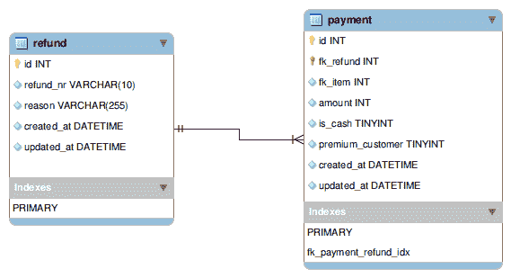
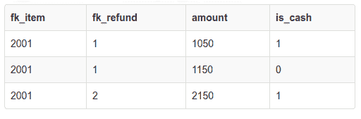
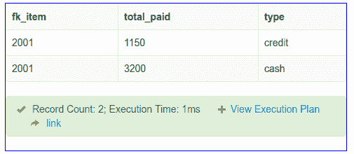
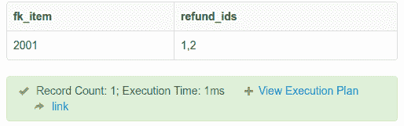
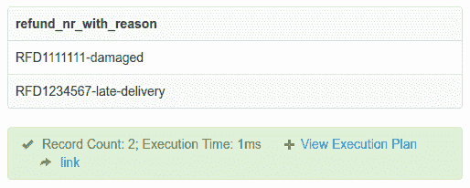
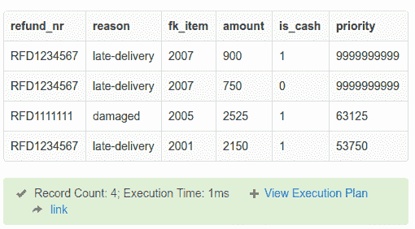

# 停止编写额外的代码——您可以用 SQL 来代替

> 原文：<https://www.freecodecamp.org/news/stop-writing-extra-code-you-can-do-it-in-sql-instead-61883bfcf16d/>

> SQL、Lisp 和 Haskell 是我见过的唯一一种花更多时间思考而不是打字的编程语言 —菲利普·格林斯本

即使思考比输入 SQL(结构化查询语言)更多，我们软件工程师也只是把它作为一种提取数据的方式。

> 我们通常不会利用 SQL 的数据处理能力来对代码进行必要的修改。

这在从事 web 应用的软件工程师中很常见。我们忽略的另一件事是，如果我们直接在 SQL 中进行操作，提取的数据对于任何编程语言都是相同的格式。这篇文章旨在让你了解你可能知道但通常不使用的 SQL 的强大功能。

Tea Lights image from [Pixabay](https://pixabay.com/en/tea-lights-candles-light-prayer-2223898/)

### TL；速度三角形定位法(dead reckoning)

以下是亮点:

*   使用 SQL 做数学，如总和，平均等。
*   利用它对一个或多个关系值进行分组，比如获取产品类别。
*   利用 SQL 进行字符串操作，比如使用 CONCAT_WS 连接名字和姓氏。
*   利用 SQL 按自定义优先级公式排序。

下面的例子…

### 一些假设

以下是这篇文章的一些假设:

1.  仅仅因为你可以在 SQL 中做，并不意味着你需要在 SQL 中做并且使用数据库资源。总是先描述你的解决方案，然后决定哪里最适合使用它。有人认为，扩展数据库比应用程序代码更困难，成本也更高。
2.  明智而优化地使用 SQL。始终考虑必要的资源，如处理器和内存。`EXPLAIN`是你查询优化的朋友。
3.  这篇文章并不提倡将所有逻辑都放在数据库中，比如以触发器、存储过程或视图的形式。数据库中的代码通常不能放入版本控制系统，测试数据库代码也很困难。
4.  SQL 通常不区分大小写，所以在执行像`CONCAT`或任何其他字符串操作时要小心。
5.  在分布式系统中，这是一个权衡的平衡。这同样适用于决定用 SQL 或编程语言做某事。评估您的选项，并根据使用案例选择最佳选项。
6.  下面的例子使用 MYSQL，所以其他风格的 SQL 的语法和实现会有所不同。

### 这个例子

通过一个例子来说明 SQL 的强大功能会更容易。以下是退款微服务的 MYSQL 中的两个表的基本模式:

有 2 笔退款和 7 笔相关付款作为示例[数据](http://sqlfiddle.com/#!9/b242d/5)。

### 一些假设

对于退款微服务示例模式和应用程序，进行了以下假设:

1.  退款微服务和数据结构存储的是 fk_item(订购/交付物品的 id)，但不是硬外键。
2.  物品可以现金或信用的方式获得退款。
3.  只要余额足以支付每笔现金和信用点数的退款金额，就可以多次退款。例如，假设该商品以 50 英镑现金和 50 英镑信用卡支付。2 退款 20 现金 20 信用都可以。因此，在这些交易之后，该项目的余额将是 10 现金和 10 信用(50–20–20)。
4.  每笔退款可以有多项付款。每笔付款可以是现金或信用卡。
5.  所有金额都以美分存储，因此它们是整数。

现在让我们使用一些 SQL 功能。您可以找到在这个[SQL diddle](http://sqlfiddle.com/#!9/b242d/5)上运行相关查询的例子。

### 用 SQL 做数学运算

作为软件工程师，假设我们需要找到某个项目的总现金和退款金额，我们会怎么做？我们将运行类似于:

`SELECT fk_item, fk_refund, amount, is_cash FROM payment WHERE fk_item=2001;`

对于当前数据，它将给出如下 3 行:

对于这三行，我们将对它们进行循环。如果是现金，将它累加到 cashBalance 变量，如果不是，将它累加到 creditBalace 变量。但是，相反，在 SQL 中这样做会更容易(可能更快):

`SELECT fk_item, SUM(amount) AS total_paid, IF(is_cash = 1, 'cash', 'credit') as type FROM payment WHERE fk_item = 2001 GROUP BY fk_item, is_cash;`

这导致了:

结果现在很容易达到。如果您需要该项目的总退款，只需将 GROUP BY 更改为 fk_item 即可。对于 2 个和 3 个记录来说，这没有什么意义。如果该商品有 20 次退款，那么第一个循环解决方案就是编写更多的代码而没有收益。像 sum 一样，也可以使用其他 SQL 函数。简单的数学运算，如[求和](https://www.w3schools.com/sql/func_mysql_sum.asp)、相乘、[求平均值](https://www.w3schools.com/sql/func_mysql_avg.asp)等都可以用 SQL 轻松实现。这意味着不再有循环。

### 使用 GROUP_CONCAT 获取相关的 1:m 关系值

[Group concat](http://www.mysqltutorial.org/mysql-group_concat/) 是 SQL 数据库中一个健壮的操作。当您需要从一对多关系中获取数据时，这很有用。

例如，假设您想要获取一篇博客文章的所有标签，或者想要获取一个产品的所有类别。关于这个退款示例，一个项目可以退款多次。因此，我们将获得与项目 id 相关的所有退款。为此，我们将只运行一个查询，并且在代码中没有任何循环的情况下获得它，如下所示:

`SELECT fk_item, GROUP_CONCAT(DISTINCT fk_refund) refund_ids FROM payment WHERE fk_item = 2001;`

这导致:

现在我们知道项目 2001 已经退了两次 2 退款。使用`,`可以很容易地分解退款 id，并进行任何相关操作。要知道 MYSQL 中 GROUP_CONCAT 的最大长度是 1024 个字符。

### 字处理

许多[字符串操作](https://dev.mysql.com/doc/refman/8.0/en/string-functions.html)任务，比如子串、连接、改变大小写和字符串比较都可以在 SQL 中完成。通过这个例子，我将展示`CONCAT_WS`的用法。它用分隔符连接。例如，它还可以用来选择名字和姓氏，中间要有一个空格。

> *在有可选中间名的情况下，`COALESCE`可与`CONCAT_WS`连用。那是你要探索的东西:)。*

在本例中，我将选择退款 _nr 及其相关原因:

`SELECT CONCAT_WS("-", refund_nr, reason) AS refund_nr_with_reason FROM refund;`

导致:

例如，如果需要在贷方票据文档上显示，则不需要额外的代码来再次连接这些值。SQL 又让它变得简单了一步。再次注意，SQL 是一种不区分大小写的语言。

### 使用自定义公式排序

所有的软件工程师都知道你可以根据一列进行排序。但是如果给你一个自定义的优先级公式来排序，你会怎么做？很可能再次求助于代码和循环来排序。因此，让我们为上面的示例设置优先级公式规则:

1.  高级客户退款获得最高优先级(我们将它的优先级设为 9999999999)
2.  除了高级客户，现金退款的优先级为金额* 25，而信用退款的优先级为金额* 20。

根据上述规则，决定优先处理 50000(美分)以上的高级客户和优先级。然后会处理其他退款。让我们优先退款如下:

`SELECT r.refund_nr, r.reason, p.fk_item, p.amount, p.is_cash, IF(p.premium_customer = 1, 9999999999, p.amount * (IF(is_cash = 1, 25, 20))) AS priority FROM refund AS r INNER JOIN payment AS p ON r.id = p.fk_refund HAVING priority > 50000 ORDER BY priority D` ESC

结果如下:

通过在 SQL 中正确使用 IF，按照定制的优先级公式进行排序比试图在代码中使用循环进行排序要容易得多。请注意，更小的金额，如 7.5 (750 美分)和 9.0 (900 美分)具有最高优先级，因为这些退款金额与高级客户相关。

> 使用 SQL 的强大功能，让软件工程师的生活变得更加轻松。

您可以尝试这个例子，并在 [SQL fiddle](http://sqlfiddle.com/#!9/b242d/5) 上运行您的查询。

### 结论

作为一名软件工程师，SQL 还有其他一些技巧可以帮助你。比如，`UPDATE`用`INSERT`用`ON DUPLICATE KEY UPDATE`。每当您想用循环代码对从数据库中提取的数据进行一些操作时，请三思。像任何其他语言或工具一样，SQL 功能强大，但要明智地使用它。这个故事的主要观点是:

> *优化并明智地利用 SQL **的能力**编写更少的代码，因为“最好的代码是从未编写过的代码”。如果没有写下来，就没有必要维护它。*

你可以在 geshan.com.np 阅读更多我的博客文章。