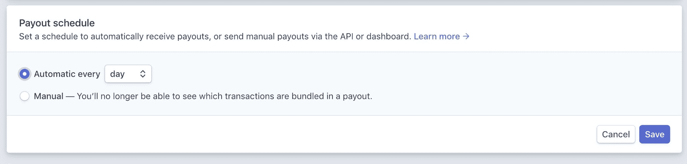
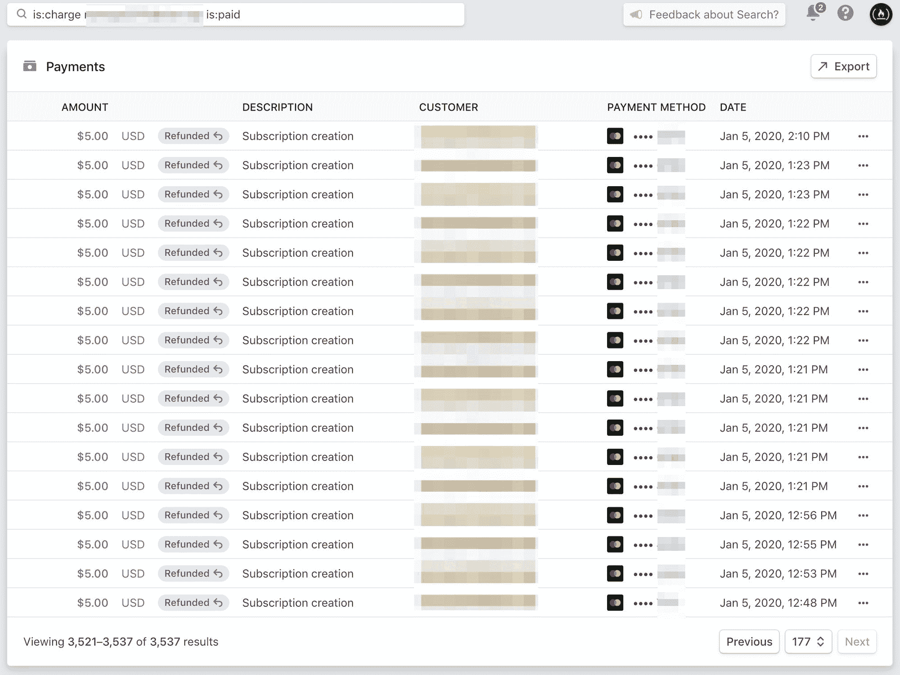

# 我如何阻止一名信用卡窃贼盗取 3537 人的信用卡，并在此过程中拯救了我们的非营利组织

> 原文：<https://www.freecodecamp.org/news/stopping-credit-card-fraud-and-saving-our-nonprofit/>

我 2 岁的儿子把我从床头板上摔下来摔到脸上，把我吵醒了。我呻吟着，剥离我的眼罩。我的手机显示，今天是 2020 年 1 月 8 日，星期三，这是个大日子。

我把儿子夹在腋下，慢跑到我的办公桌前。我一直熬夜到凌晨 2 点，为我们新的#AWSCertified Challenge 发布公告。

到目前为止，发射进展顺利。我们的新推特机器人在推特上发帖，我们的不和聊天室里挤满了雄心勃勃的开发者，他们渴望获得 AWS 认证。

我正准备去见我的团队，这时我注意到了两封奇怪的电子邮件——两封邮件都是在几分钟之内到达的。

其中一封电子邮件用充满错别字的英语写道:“你是个骗子”。“这正是我所想的，因为我看到你对我的金融机构提出指控，而且我从未听说过你。是的，你需要解决这个问题。”

另一封邮件是...好吧，我们就说这也是一封愤怒的信，就这样吧。

freeCodeCamp 是一个由捐助者支持的非营利组织，我们在世界各地有成千上万的人每月向我们捐款。偶尔会有误解——通常是一个家庭成员在没有告诉另一个人的情况下捐赠。但这次感觉不一样。

所以我选择了 Stripe，这是我们非营利组织用于捐赠的信用卡处理服务。通常一天，我们会有 20 或 30 个新的捐赠者。但我看到的是:

Stripe's dashboard showing 11,000 new customers and $60,000 in revenue for a single 24 hour period.

我花了一点时间来处理正在发生的事情。我们的非营利组织——其年度预算不到 40 万美元——刚刚在 24 小时内收到了超过 6 万美元的捐款——来自数千名捐赠者。

我的心开始下沉。这些不可能是真的捐赠。主要报纸上的文章给我们带来的捐款激增。见鬼——我甚至被《早安美国》采访过。但这些峰值都没有导致捐款如此激增。

不。只有一件事能引起像这样的捐款激增。欺诈。广泛的计划性信用卡欺诈。

我以前听说过这种技术。这叫做“卡片测试”它是这样工作的:

1.  欺诈者找到一个具有相对简单的信用卡表单的网站。
2.  然后，他们运行脚本，快速连续测试数千个被盗信用卡号。这样，他们可以看到哪些卡仍然有效，哪些卡已被取消。
3.  然后他们转身在黑网上出售那些有效的卡号。

在这种情况下，我比许多其他网站更快地发现了欺诈行为。所以我有了一扇窗。

如果我迅速行动，报告所有这些信用卡被盗，我就可以让世界各地的受害者免于许多后续的——也是更多的——信用卡费用。我可以阻止数千个压力过大的银行电话。

# 勘察残骸

我在 Stripe 中运行了一些查询。a 发现一个诈骗犯用 20，000 张不同的偷来的信用卡进行了捐赠。

好消息是，Stripe 发现除了 3537 笔交易外，其他交易都是被盗卡，并拒绝了这些交易。

但坏消息是:仍有 3537 人收到银行通知，称他们刚刚向我们的非营利组织捐款。

更糟糕的是，我不知道受害者是谁，也没有办法联系他们解释发生了什么。

我瘫坐在椅子上。我的头脑在飞速运转。

欺诈者是如何通过我们捐赠表格的验证的？

他们是如何让 3，537 笔交易通过 Stripe 的欺诈检测的？

他们究竟是如何得到 20，000 个被盗信用卡号码的呢？

但是现在这些都不重要了。我只知道我需要立即退还每一笔交易。

但是等等。

哦不。

这不仅仅是把钱还给那些人的问题。

这件事比那件事严重得多。

# 欢迎来到退款地狱

每当有人打电话给银行对信用卡交易提出异议时，银行就会启动一个叫做“拒付”的程序。这是一种强制退款。

在这些案件中，信用卡持有人得到了好处。因此，商家总是承担这些退款的责任。

银行不仅从商家那里收回资金，还会收取退款费用。对于 Stripe，此费用为 15 美元。

这意味着我们的非营利组织可能每笔交易要支付 15 美元。

我迅速在绘图纸上潦草地写下一些数字。

15 美元乘以 3537 笔交易等于...

$53,000.

我的心开始怦怦直跳。我口干舌燥。

$53,000?那会彻底摧毁我们非营利组织的应急基金。

有那么一会儿，我拼命地在脑子里寻找行动方案。

然后我跳到我的键盘上。我找到了一种让 Stripe 支持我打电话的方法。

在我等待他们回电的时候，我想出了一个可以在 Stripe 上使用的查询，以便在一份 177 页的报告中找出所有的欺诈交易。

我召集了我们的团队来集思广益。

他们很快发现欺诈者使用了 freeCodeCamp.org 的哪个 API 端点，并安装了一个修复程序来禁用它。

我们的一个开发人员说，“我可以写一个脚本，直接遍历并删除所有这些事务。”

“没那么容易，”我说。“我们需要保留所有这些交易的记录。不仅仅是为了审计，也是为了防止联邦调查局或国际刑警组织的人联系我们。此外，我们需要退还这些交易。立刻。过去的每一分钟都是一分钟，成千上万的人可能会打电话给他们的银行，对我们的非营利组织提出退款。”

“好吧，我想我明白了，”另一个开发者说。“我正在查看 Stripe 的 API 文档，我认为我找到了正确的 API 端点。我可以拼凑出一个剧本。”

我的电话开始响起一个我不认识的号码。所以我说，“听起来像个计划，伙计们。让我们实现它。”我离开会议去接电话。

在我解释了所发生的事情后，我交谈的第一个 Stripe 支持人员立即将我升级。他们让我等着。

但时间是最重要的，我可以退款的每一笔交易——无论是手动退款——都不会导致退款。

一个接一个，我开始点击“退款交易”，然后“报告交易欺诈。”两次点击，几秒钟的加载，然后我就可以继续下一个交易了。

我一边浏览页面，一边计算时间，漫不经心地一遍又一遍点击“退款交易”和“举报交易欺诈”。

然后，我伸手拿起我的绘图纸，计算着数字。

通过继续做我正在做的事情——像机器人一样点击这个列表——我有望在 4 个多小时内退还所有 3，537 笔交易。

无论如何，我的团队可能无法及时完成剧本。所以我就一直做下去。

点击。等等。点击。等等。“交易退款！”向下滚动。冲洗并重复。

最终 Stripe 支持又回到了手机上。他们有一些善意但相当明显的建议。

接下来的一个小时，我尽可能快地浏览手动退款页面。我又打了两个支持 Stripe 的电话。我尽我所能与每一个支持技术人员交谈，看我是否能获得某种突破，可能会加快这些交易的退款过程。

但是大约 1200 个退款进入流程后，“交易退款！”消息不再显示。取而代之的是一条不祥的信息:“退款待定。”

我又试着退款。"退款待定。"

哦天啊。

# 他们不会让我好过的，对吧。

我立即返回 Stripe 的支持页面，请求再次回拨。他们向我解释说，我不能再退款了，因为我们的 Stripe 账户里没有钱了。

“不可能，”我说。“我们刚刚收到了 6 万美元的捐款。”

“是的，”支持者说。"但是其中的 40，000 美元正在转到你的银行."

我看了一眼条纹的仪表板。支持者是对的。

两年前，当我建立非营利组织的 Stripe 账户时，我将支付时间表设置为“每天自动支付”

Stripe lets you set up automatic payouts to your bank account. I made the mistake of doing this, and it came back to haunt me.

尽管那天我们的 Stripe 账户收到的捐款是平时的 40 倍，Stripe 还是把钱转到了我们的银行。

所以我查了我们的银行账户。但是那 4 万美元不在那里。这笔贷款仍未兑现。

那 40，000 美元既不在我们的 Stripe 账户里也不在我们的银行账户里。它介于两者之间。在它着陆之前，我们无法接近它。

所以现在我甚至不能手动退款。只要这些交易处于“待退款”状态，我们就面临退款风险。

我又和 Stripe 通了电话。他们告诉我:“你的 Stripe 账户有负余额，不能再退款了。”

我问:“我如何使我的条纹余额再次为正，以便我可以发出剩余的 2300 退款？”

“你可以给我们发一份银行电汇，”支持者建议道。过了一会儿，Stripe 的电汇信息出现在我的电子邮箱里。“一旦你把钱汇给我们，就给我们发确认信。在 24 到 48 小时内，我们可以解冻您的帐户，以便您可以再次开始退款。”

"你是说我必须等两天才能完成退款？"我生气地问。

我的团队已经准备好了一个脚本，他们已经用 Stripe 的沙盒测试过了。“但如果捐款处于待定状态，我们就不应该运行它，”他们告诉我。“这可能会把事情搞砸。我们找不到任何关于这方面的文件。”

这时候外面已经黑了。我的孩子们已经上床睡觉了。我一整天都在和 Stripe 打电话。

我在办公桌前坐下，盯着银行电汇信息。我仔细检查了电子邮件，看是否有任何欺骗的迹象——任何骗局的迹象——但没有发现任何迹象。

我正要把 4 万美元——我们非营利组织的全部应急基金——汇给一家价值数十亿美元的公司。这样我们就可以完成对一群不幸的人的退款，他们的信用卡号码被盗了——可能是在其他一些价值数十亿美元的公司的数据泄露期间。

当然，这些电报信息会在 Stripe 的网站上公开发布。但是我把这个号码输入谷歌，没有任何结果。

没有办法确定 Stripe 支持人员给我的是正确的电汇信息，而不是他们自己的银行账户信息。是的，这不太可能。

但是，如果我冒险将价值 40，000 美元的捐款投入黑洞，那将是对我作为非营利组织财务主管的责任的放弃。

所以我又给 Stripe 打了一次电话。在这一点上，我想管它呢。我会一直让他们给我升级，直到我联系到科利森兄弟(Stripe 的创始人)——或者至少是欺诈防范部门的人。已近午夜，但我觉得值得一试。

最后，我联系到了一位级别稍高的技术支持人员，他似乎与众不同。我特别努力，特别礼貌地推。我告诉她什么是最重要的。

她沉默了一会儿。然后她说:“我可能知道另一种方法。”

就好像有人突然把一支维生素 B12 注射器塞进了我的胳膊。我马上振作起来，说:“真的吗？”

“有可能。但是我不得不让你等很长时间，”她说。

但在她让我等电话之前，我确认了一下——一旦我们的 Stripe 账户中的资金可用，处于待处理状态的退款会立即通过吗？

她说他们会的。

她还向我保证，如果----------------------------------------------------如果--------------------------------------------如果----------------------------------------------------------------------当人民银行联系 Stripe 时，Stripe 只会告诉银行“费用已经退还。”

就这样，我看到了隧道尽头的一丝曙光。

如果我能说服 Stripe 以某种方式解冻我们的帐户，所有“待退款”交易将级联到已退款状态。这将消除悬在我头上的价值 53，000 美元的退款。

就这样，更多的保留音乐。

我调出了我们团队创建的脚本，以编程方式向所有欺诈受害者退款。

“该死，”我想。“如果这个脚本不能完全像它应该的那样工作，就不知道会发生什么。”

所以，为了保险起见，我决定犯一个程序员所能犯的最大的罪。我手动做的。

通过几个小时的等待音乐、回拨和 Stripe 不同人的更新，我坐在电脑前磨着清单。

点击。等等。点击。等等。"退款待定。"向下滚动。冲洗并重复。

然后另一个支持人员打来电话，问我总共还需要退多少钱。

意识到我只剩下几页退款了，我让她等我点进去。当我看到最后一页时，这就像一场马拉松，终点线终于在现场。我们一起庆祝最后的退款。

总而言之，我们非营利组织的 Stripe 账户余额为负 53，060 美元。

她把号码转给了诈骗部门，并告诉我今晚可以睡觉了。但我告诉她，我坚持熬夜直到最后一笔交易全部退款，并让她给我回电话，让我随时了解最新情况。

我抓起夹克，在温和的一月午夜出去散步。

在几个小时没有盯着显示器之后，我回到房间，点击刷新。

我已经报告了每一笔交易都是欺诈性的。现在，所有 3537 名信用卡诈骗受害者的每一笔捐款都被全额退还。

A screenshot of Stripe after I had successfully refunded all 3,537 transactions.

当我如释重负地叹了口气时，我想象着诈骗犯在地球的另一端。我想象着他们坐在烟雾弥漫的网吧里沸腾着，用手敲着桌子大喊:“我昨天才测试了这些信用卡号码。他们为什么不工作？”

I'll get you next tiiiiiiiiiime, Gadget!

我给我的团队发了最后的更新，说一切都解决了。由于他们的迅速行动，以及在处理 Stripe 支持时的一点点勇气，所有退款将在接下来的几天内打到受害者的账户上。

大多数受害者不知道发生了什么，甚至可能不会注意到指控后的否认。

他们只需从银行邮寄一张新的信用卡，然后切断他们旧的、受损的信用卡，继续他们的生活。

我筋疲力尽地爬上楼梯。#AWSCertified challenge 的启动似乎没有我也很顺利。不管怎样，都可以等等。

现在，我只有一个优先事项:在我 2 岁的儿子早上再次跳到我头上之前，尽可能多睡几个小时。

# 经验教训

### 第 1 课:关闭条纹自动支出

如果您使用条纹，关闭自动支出。

我只是很幸运，我们与他们有长期的工作关系，我们的支票账户里有足够的钱，以防我们需要给他们汇钱。

### 第二课:有时手动操作是可以的

不要害怕放下自尊，用传统的方式做事。

有时候，手动方式虽然繁琐，却是防止更多灾难的最安全方式。

正如老宇航员所说，“没有问题是如此糟糕，你不能让它变得更糟。”

你聪明的脚本可能会节省你的时间。或者，它可能会造成一片混乱，需要花更多的时间来清理。在运行之前考虑所有结果。

### 第三课:在处理支持时要坚持不懈

如果我没有继续敦促 Stripe 提供一个比给他们汇一大笔钱更好的解决方案，我们的非营利组织可能会在未来几天内面临退款，这可能会让我们损失数千美元。

礼貌但坚持是有好处的。

### 第四课:外面有一些真正的混蛋。

> “IT 中的安全性就像锁上你的房子或汽车，它不会阻止坏人，但如果足够好，他们可能会转向更容易的目标。”保罗·赫布卡

freeCodeCamp 是开源的，有成千上万的安全研究人员通过负责任的披露来通知我们潜在的漏洞。我们锁上了众所周知的大门。

但是尽管我们做了所有的努力，攻击者仍然认为我们比一些大型电子商务网站更容易成为目标。他们足够老练，能够在我们的代码库中找到他们自己的零日漏洞。他们也可能为您的组织做同样的事情。

永远不要忘记，你和我与那些愿意给成千上万的人带来不便的恶棍共享一个星球，这样他们自己就可以赚快钱。

保持警惕，朋友们。