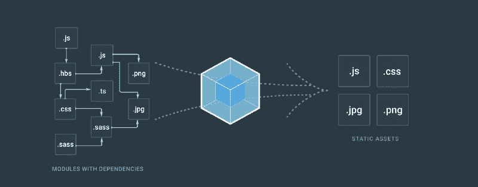
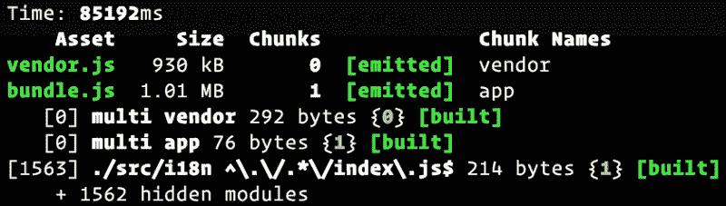
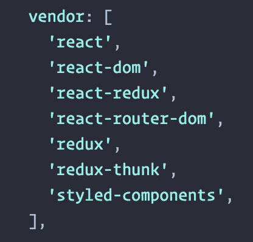
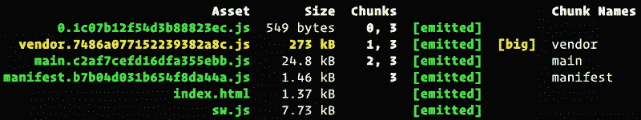
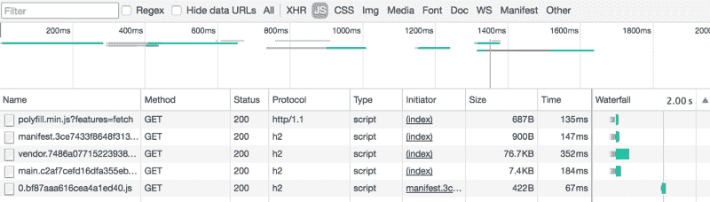

# React 和 webpack 的简单代码分割

> 原文：<https://www.freecodecamp.org/news/straightforward-code-splitting-with-react-and-webpack-4b94c28f6c3f/>

迪迪埃·法郎

# React 和 webpack 的简单代码分割

#### 一切看起来都很完美，直到你的应用程序规模增长过快…

### 介绍

你是 React 的忠实粉丝，更是现代 JavaScript 开发栈的忠实粉丝。React，Redux，ES6，Babel，webpack 都是你最喜欢的玩具，难道他们就没有什么秘密给你吗？他们当然有——在你读完下面的内容后，你就会明白了。

这篇文章的目的不是详尽无遗，而是描述一种简单而现代的方法来解决与我们喜欢的编码方式相关的问题。

### 问题是

这里有一个很好的例子。可以看到，webpack 创建了两个 JavaScript 文件: ***bundle.js*** 和 ***vendor.js*** 。这是代码拆分的第一步，将您的供应商从您自己的代码中分离出来。这在[新的 webpack 文档中有很好的记录。](https://webpack.js.org/guides/code-splitting-libraries/)

Type **yarn build** and you’ll see the tragedy …

这是下一步的先决条件。与所有组件共享 React 和 Redux 等供应商是必不可少的。但是正如你所看到的，我们的应用程序大小接近 2MB，不包括它的图像、字体和其他资产。我们的应用程序需要几秒钟才能加载，如果手机连接不好，加载时间会更长。为什么不把它拆分成多个块，只在需要的时候加载呢？说起来容易做起来难。

### 从哪里开始？

当你关心速度和性能时，有许多方法:其中之一是服务器端渲染，但这不是今天的主题？。

在本文中，我们正在探索用 webpack、**、T3 进行代码拆分，最好的起点是[web pack 回购本身](https://github.com/webpack/webpack/tree/master/examples)。还有其他的解决方案。也就是说，我们必须做出选择..而获胜者是… `import()` (原名`System.import()` ) ***。*** 我称之为“现代方式”。**

[**System.import 已被弃用。**](https://medium.com/@cerny.mrtn/system-import-has-been-deprecated-6806b2f506d)
[【medium.com】](https://medium.com/@cerny.mrtn/system-import-has-been-deprecated-6806b2f506d)

#### 1.聪明点

没有神奇的工具，要得到最好的妥协，你可能得动动脑筋？。例如，vendor.js 不应该包含每一个库，只包含那些“全局”的库，如 React、Redux 或 moment。

This is not **package.json**

#### 2.开始代码拆分(真正的那个)

以这种方式加载组件(或任何 ES 模块)将被 webpack 解释为拆分点。

现在，假设我们的应用程序的根有以下内容。问题是`Home`组件。与应用程序的其他部分相比，它的奇异库相对较大。提醒:现在所有的东西都打包在同一个包里，同时装载。

让我们创建一个简单的包装组件，它将异步加载和呈现我们的 Home 组件。只有当你登录后，它才会被加载。

我们可以通过标准化这种方法使它变得更简单。我将其具体化为微小的[反应——代码分割](https://github.com/didierfranc/react-code-splitting)。最终的结果如下所示:

如果你想在上下文中看到这个片段，看看 [redux-react-starter](https://github.com/didierfranc/redux-react-starter/blob/master/src/components/App.js#L12) 。

#### **3。输出**

可以看到，webpack 创建了一个名为 ***0 的新文件。【chunk hash】. js .*T3【这是我们老老弟的家？。**

The result from [didierfranc/redux-react-starter](https://github.com/didierfranc/redux-react-starter)

#### 4.享受好处

可以看到， **Home** 组件(0.bf87aaa616cea4a1ed40.js)是按需加载的，就在我登录之后。请注意，如果您注意缓存和 http/2 的 T2，性能会更好。你可以让[灯塔报告](http://react.didierfranc.com/lighthouse.html)成为你最喜欢的测试你的应用性能的工具。

Chrome > DevTools > Network Tab

### 下一步是什么？

不要犹豫探索长期缓存、离线功能等等。简单来说:**如何做一个渐进式的 web 应用，**一遍又一遍。

你不想错过我的任何一篇文章*？在推特上关注我[@ DidierFranc](http://twitter.com/didierfranc)*