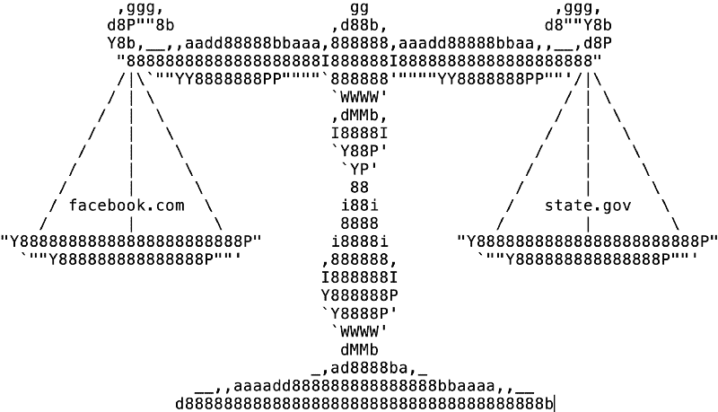
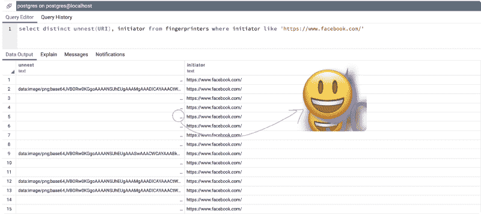
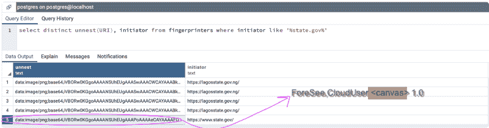

# 奇怪的同床异梦:指纹现象…或者 state.gov 对 facebook.com

> 原文：<https://www.freecodecamp.org/news/strange-bedfellows-fingerprinting-phenomena-or-state-gov-versus-facebook-com-8d123866e7df/>

作者:内森·雷廷格

# 奇怪的同床异梦:指纹现象…或者 state.gov 对 facebook.com



credit to Normand Veilleux

浏览互联网时，你**更信任**谁:[](https://www.facebook.com)*还是[*state.gov*](https://www.state.gov)？*

*一个下意识的反应可能是选择 state.gov，考虑到扎克伯格不断推出精准得不可思议的 T2 广告和 state . gov 看似无害的目的。或者你可能会觉得这只是一个“邪恶的选择”，当你被逼到一个角落时，你会被迫选择政府运营的网站。嘿，至少这是你，以某种未知的，脆弱的方式，投了一票，对不对？*

*还有一些人可能想知道信任的标准应该是什么。这是在测试谁能更好地保护我的秘密([haveibenpwned](https://haveibeenpwned.com))还是谁更有可能把我视为一个金钱数字(等等，[这个金钱数字有多高](https://www.cnbc.com/2019/02/11/reddit-users-are-the-least-valuable-of-any-social-network.html?__source=facebook%7Cmain))？还有一些人可能会试着深入挖掘，从通俗的角度定义“信任”:**这个网站不告诉我能做什么？***

*令人惊讶的是，我们在这里找到了相似之处。*

*但首先，有一点背景…*

### *跟踪*

*在众多“追踪”网站访问量的方法中——为什么我在亚马逊上搜索电视广告后会看到这些广告，*哦，等等* *这实际上是一个非常好的交易**[点击点击点击](https://medium.freecodecamp.org/what-you-should-know-about-web-tracking-and-how-it-affects-your-online-privacy-42935355525)*——最好的是那些你不必征得用户同意的广告。因为让我们面对它，如果有人要求你“接受”一个 cookie 或服务条款，你会。相信我，有一次我说“不”，结果被踢回了谷歌。*

*

[I♥cookies](https://www.juniqe.com/i-accept-cookies-framed-poster-2459619.html)* 

*但这里的关键，至少在信任方面，是知识。你现在，以某种方式，意识到屈服于你刚刚同意的任何事情。希望你不会像上次一样不得不[放弃你最大的孩子](https://www.theguardian.com/technology/2014/sep/29/londoners-wi-fi-security-herod-clause)，但在很大程度上，你已经同意，无论你访问的网站上发生了什么，都不是“他们”的错。*

> *…因为网站漏洞欺骗你的妻子而被抓——[没有过错](https://www.forbes.com/sites/beltway/2015/10/22/ashley-madisons-online-terms-and-conditions-may-leave-it-legally-undressed/#2106932e6b40)*

> *…一次又一次地被骚扰，因为你的跟踪者一直使用你的虚假资料，向你的工作场所发送大量随机邮件— [没有错](https://www.buzzfeednews.com/article/tylerkingkade/grindr-herrick-lawsuit-230-online-stalking)*

### *指纹识别*

*为了避免这种可能棘手的知识问题，网站建设者可能更喜欢使用更隐秘的技术，如指纹识别来识别用户，就像 cookies 识别用户一样。*

*好的，另一个备份——什么是 cookie？饼干就像是你发给秘密俱乐部成员的秘密密码。没有秘密密码，谁也进不了门，但你不是只用一个密码，而是给每个成员他们自己的特殊密码。所以你知道鲍勃的密码是“长春花”，你也知道“长春花”在上个月被使用了七十次；哇，鲍勃，你也许应该离开俱乐部休息一下。*

*

Top secret #2 by Jerzy Wierzy* 

*以类似的方式，指纹识别就像收集 Bob 的详细信息，而不需要使用他的特殊密码记录。试试这个:*

> *他有一点…魁梧。不是瘦的那一面，而是比较大的那一面。而且他是橙色的，眼睛周围有白色的圈。他的头发是金黄色的。他的头发看起来不太真实。然后他的脸皱了起来。*

*你可能已经猜到这是特朗普，但“猜测”对网站所有者来说不够好。相反，你需要很多很多独特的细节，这样你才能明确地说“我知道那是特朗普，[不可能是别人](https://panopticlick.eff.org)”*

### *证据就在布丁里*

*那么，这一切与 state.gov、facebook.com 和纳拉亚南教授的推特有什么关系呢？这三个网站目前都使用指纹技术来检查你。*

*尽管你可能会受宠若惊，但有点奇怪的是，一家估值为 7.37 美元的公司和一家代表我们国务院的网站# diplomacyinaction 使用同样卑鄙的身份识别手段。但是我跑题了，我是怎么想出来的？*

*我构建了一个 Google Chrome 扩展来搜索指纹识别中使用的一种非常特殊的技术(例如，画布指纹识别)。我在 Selenium web-scrape 上运行了这个扩展，获取了大约 50 万个网站的数据，创建了一个指纹尝试数据库。我的 Chrome 扩展基本上与研究人员 Günes Acar 用来识别 ftc.gov 指纹的 Chrome 扩展类型相同(他使用了 [CanvasFingerprintBlock](https://chrome.google.com/webstore/detail/canvasfingerprintblock/ipmjngkmngdcdpmgmiebdmfbkcecdndc?hl=en-US) )。*

*下面是一个相关的 SQL 查询，展示了 facebook 对画布指纹的使用:*

*

facebook.com’s canvas image (pulled from ellipsis truncation)* 

*左侧列中的字符串是 base64 编码的，但是我将它转换回一个图像，看它看起来像什么，用箭头显示。*

*这是 state.gov 的另一个例子:*

*

state.gov’s canvas image (same one from ftc.gov)* 

*事实证明，脸书对表情符号的使用揭示了用户的许多独特细节——比如让某人在 Hahvahd[Yahd](https://www.npr.org/2015/08/25/434668684/testing-boston-authenticity-with-park-the-car-on-harvard-yard)T3 中拿着 cah。分析公司[预见](https://www.foresee.com)印刷的文字也是如此，尽管*乔克先生，电视问答博士，包几个 lynx！*会更好，因为它是一个不完全但相当接近的[完美的 pangram](https://english.stackexchange.com/questions/167709/a-perfect-honest-pangram-that-is-understandable-for-a-regular-native-user) 。*

*

lenscrafters.com’s canvas image* 

*无论哪种方式，表情符号和奇怪阴影的预见文本都是要求由你的计算机绘制的——没有告诉你——并且都提供了许多关于你是谁的独特细节。一种偷偷摸摸的指纹形式。*

### *state.gov 并不孤单！*

*在我的数据库中，实际上有 304 个网站使用相同的“ForSee”图像来提取用户的独特性。此外，他们中的许多人使用。gov 顶级域名——所以看起来 foresee 在政府网站上有很好的“地位”。*

### *所以你的意思是…*

*在谈论我们的隐私时，也许我们不应该相信任何一个网站。*

*总之，这里是使用这一特定画布图像的网站的完整列表-但请注意，scape 发生在 2018 年夏天，因此一些网站可能自那时起已经更新。如果你想自己重现这些结果，使用带有[CanvasFingerprintBlock](https://chrome.google.com/webstore/detail/canvasfingerprintblock/ipmjngkmngdcdpmgmiebdmfbkcecdndc?hl=en-US)* *扩展名的 Chrome，并直接访问列出的 URL。*

```
*`https://www.dignityhealth.org/https://www.stagingclub.com/https://www.nemours.org/https://www.thankyou.com/cms/thankyouhttps://www.upmc.com/http://www.proflowers.com/https://www.coach.com/https://ucrdatatool.gov/https://www.aarp.org/aarp-foundation/https://www.bcbsm.com/https://www.barclays.co.uk/https://www.smithsonianmag.com/https://www.menswearhouse.com/https://www.jcpenney.com/https://www.sce.com/wps/portal/home/!ut/p/b1/04_Sj9CPykssy0xPLMnMz0vMAfGjzOIt3Q1cPbz8DTzdQwKNDTyNAw38gh0djQ0MzIAKIoEKDHAARwNC-sP1o8BK8JhQkBthkO6oqAgAStf4Iw!!/dl4/d5/L2dBISEvZ0FBIS9nQSEh/https://www.sodimac.cl/sodimac-cl/blackfridayhttps://www.unicare.com/health-insurance/home/overviewhttps://nij.gov/Pages/welcome.aspxhttps://kidshealth.org/https://www.autonation.com/https://www.fbfs.com/find-an-agenthttps://www.mass.gov/orgs/office-of-jury-commissionerhttps://www.argos.co.uk/https://www.billygoat.com/na/en_us/home.htmlhttps://www.hertz.ca/rentacar/reservation/https://www.josbank.com/https://www.pizzahut.com/https://www.npower.com/https://www.carhartt.com/https://www.briggsandstratton.com/na/en_us/home.htmlhttps://pioneervalley.aaa.com/https://www.basspro.com/shop/enhttps://www.ftc.gov/https://www.stanleyblackanddecker.com/https://www.hickoryfarms.com/http://www.clubmonaco.ca/home/index.jsp?geos=2https://www.avid.com/sibelius-ultimatehttps://www.amd.com/enhttp://www.abbott.com/https://myamerigroup.com/Pages/welcome.aspxhttps://www.spectrumbusiness.net/loginhttps://nortonhealthcare.com/https://valottery.com/https://www.comed.com/Pages/default.aspxhttps://www.rue21.com/store/https://www.bls.gov/https://www.allenedmonds.com/https://www.myprime.com/https://www.mass.gov/orgs/massachusetts-registry-of-motor-vehicleshttps://www.ferrismowers.com/na/en_us/home.htmlhttp://www.three.co.uk/https://glucerna.com/https://www.us.elsevierhealth.com/https://www.tui.co.uk/https://www.labcorp.com/https://nationalzoo.si.edu/?fonzref=index.htmlhttp://www.emdmillipore.com/US/en?RedirectedFrom=http%3A%2F%2Fmerckmillipore.com%2F&bd=1https://thebenefitsguide.com/https://www.childrensmn.org/https://www.verabradley.com/us/Homehttps://www.asu.edu/https://www.irs.gov/https://www.mass.gov/https://www.carecreditpay.com/pmyp/showSearchhttp://www.doingbusiness.org/http://www.kraftcanada.com/https://www.redfcu.org/https://www.marks.com/https://www.snapper.com/na/en_us/home.htmlhttp://www.emdmillipore.com/?RedirectedFrom=http://emdmillipore.com/https://www.humana.com/dental-insurancehttps://www.bge.com/Pages/default.aspxhttps://www.usps.com/https://myaccountrwd.allstate.com/anon/account/login?campaign=145https://www.dfs.co.uk/https://snb.com/https://www.royalcanin.com/https://www.epa.gov/https://www.dremel.com/en_US/https://www.snapfish.co.nz/store/homehttps://www.slu.edu/medicine/clinics-community/hrc/https://www.mazdausa.com/http://www.enviroflash.info/https://www.truevalue.com/https://ftccomplaintassistant.gov/#nbhttps://www.nationalcar.com/en/home.htmlhttps://www.mdanderson.org/https://www.ups.com/us/en/global.pagehttp://www.eatonpowersource.com/https://www.gatorade.com/https://www.uscis.gov/https://www.harlequin.com/shop/index.htmlhttps://myavista.com/https://www.bcbsga.com/https://montgomerycountymd.gov/https://www.spectrum.net/https://www.tricare-west.com/https://www.aarp.org/https://www.progressive.com/agent/https://www.bea.gov/https://www.makinghomeaffordable.gov/pages/default.aspxhttps://hnfs.com/https://www.simplicitymfg.com/na/en_us/home.htmlhttps://www.chop.edu/https://www.stouffers.com/enhttps://bjs.gov/https://www.e-verify.gov/https://www.hottopic.com/https://www.mynavyexchange.com/https://www.mcdonalds.com/us/en-us.htmlhttps://www.magazineluiza.com.br/http://www.cooperindustries.com/content/public/en.htmlhttp://www.slu.edu/https://www.smilemakers.com/https://usitc.gov/https://www.humana.com/http://choa.org/https://www.colehaan.com/https://www.snapfish.co.uk/homehttp://girlshealth.gov/https://www.homecenter.com.co/homecenter-co/https://thunderbird.asu.edu/https://www.northernnewengland.aaa.com/?zip=03766&stateprov=nh&city=lebanon&devicecd=PChttps://www.ugi.com/https://www.verizonwireless.com/tablets/asus-zenpad-z8s/#sku=sku2600003?cmp=cse-Shopping-ASUS-P00J&cmp=CSE-C-HQ-NON-R-AC-NONE-NONE-2C0PX0-PX-EBAY-ASUS-P00J&cvosrc=cse.EBAY.ASUS-P00J&cvo_crid={campaign}http://www.coldwatercreek.com/https://www.usajobs.gov/https://www.lg.com/us/mobile-phones/warrantyhttps://www.usbank.com/index.htmlhttps://www.stanfordchildrens.org/https://www.buffalowildwings.com/https://www.fanatics.com/https://ensure.com/https://www.realtor.ca/mlshttps://ttb.gov/https://www.nationalcar.com/en/home.html?action=emcIndexhttps://www.abercrombie.com/shop/ushttps://lifefitness.co.uk/https://www.lg.com/ushttps://www.thenorthface.com/https://www.constellation.com/https://www.purepoint.com/https://www.sba.gov/https://www.beaumont.edu/http://www.boden.co.uk/https://www.acehardware.com/https://www.uvmhealth.org/Pages/home.aspxhttps://www.falabella.com.co/falabella-co/https://mobiloil.com/enhttps://www.verizonwireless.com/?intcmp=vzwdomhttps://www.ftd.com/https://www.va.gov/https://www.francescas.com/https://nortonchildrens.com/https://teenshealth.org/en/teens/https://www.bloomingdales.com/http://www.cooperindustries.com/content/public/en/bussmann/electrical.htmlhttps://www.oakley.com/en-ushttps://www.avid.com/https://starbuckscollegeachievement.info/welcomehttps://www.serve.com/https://ieeeusa.org/https://www.la-z-boy.com/https://www.myhealthybluela.com/la/louisiana-home.htmlhttps://lifefitness.com/http://www.worldbank.org/https://www.smithsonianstore.com/https://www.lennox.com/https://www.qualcomm.cn/https://www.pbgc.gov/https://www.metroairport.com/https://www.vagisil.com/http://www.nationalrail.co.uk/https://www.coachoutlet.com/https://www.gmfleet.com/https://www.sec.gov/https://providentcu.org/index.asp?i=homehttps://www.hayward-pool.com/shop/en/poolshttp://www.cspire.com/https://www.famousfootwear.com/https://www.enfamil.com/https://www.steinmart.com/https://www.kcpl.com/https://www.progressivecommercial.com/https://www.boots.com/webapp/wcs/stores/servlet/TopCategoriesDisplay?catalogId=28501&langId=-1&storeId=11352&webrewrite=Y&geoOpts=Yhttps://www.sony.com/https://www.silverscript.com/https://www.falabella.com.pe/falabella-pe/https://www.marriottvacationclub.com/https://www.flagstar.com//https://www.hertz.com/rentacar/reservation/https://www.nordstromrack.com/http://www.morethantired.com/https://www.homedepot.ca/en/home.htmlhttps://carecredit.com/https://www.cspire.com/business/https://www.patelco.org/https://www.ralphlauren.com/https://www.berries.com/https://www.gci.com/https://www.beaumont.org/https://www.barneyswarehouse.com/https://www.verizonwireless.com/smartphones/google-pixel-2/#sku=sku2690617?cmp=cse-Shopping-GA00141-US&cmp=CSE-C-HQ-NON-R-AC-NONE-NONE-2C0PX0-PX-EBAY-GA00141-US&cvosrc=cse.EBAY.GA00141-US&cvo_crid={campaign}https://www.state.gov/http://www.naturemade.com/#vtrlbl4lQ6UOFkCi.97https://www.avmed.org/https://www.anthem.com/https://www.caringbridge.org/https://www.mydreampool.com/https://www.snapfish.com/photo-gift/homehttps://www.progressive.com/https://www.airspacemag.com/https://www.sony.es/https://voegol.com.br/pthttps://www.personalcreations.com/https://www.ssfcu.org/https://www.subaru.com/https://www.virginatlantic.com/us/enhttps://www.qualcomm.com/https://www.nhtsa.gov/https://www.barneys.com/https://www.autotrader.com/https://www.nflshop.com/https://www.si.edu/https://www.smithsonianjourneys.org/https://stanfordhealthcare.org/https://www.sony.co.uk/https://www.findlaw.com/https://www.allrecipes.com/https://www.falabella.com/falabella-cl/http://www.naturemade.com/supplements/folic-acid?&utm_content=addotnet_11165150-AIjWvqOWintQjLiqLHeEtQ#H1kJKcPEe0zLLUck.97https://www.theglobeandmail.com/https://www.k12.com/http://www.calgary.ca/SitePages/cocis/default.aspxhttps://www.moderncoinmart.com/https://www.citipricerewind.com/https://www.uspto.gov/https://login.usajobs.gov/Access/Transitionhttps://www.bluebird.com/https://www.peco.com/Pages/default.aspxhttps://treasurydirect.gov/https://www.enterprisecarsales.com/https://www.horizonblue.com/https://unicor.gov/index.aspxhttp://www.ladyfanatics.com/https://www.oakleysi.com/en-ushttps://shop.nordstrom.com/https://www.proplants.com/https://www.allinahealth.org/https://www.blinds.com/https://www.asuprepdigital.org/http://www.bathandbodyworks.com/https://pediasure.com/https://www.fbfs.com/https://www.wrangler.com/https://www.usmint.gov/https://www.messa.org/https://www.empireblue.com/http://www.bodenusa.com/https://www.walgreens.com/https://www.cdse.edu/https://www.naturalizer.com/https://www.ieee.org/https://thebenefitsguide.com/why-are-gen-xers-falling-behind-on-health-care/http://www.epymtservice.com/index.htmlhttps://www.imf.org/external/index.htmhttps://www.allrecipes.com/recipes/17235/everyday-cooking/allrecipes-magazine-recipes/https://www.vanguardengines.com/na/en_us/home.htmlhttp://www.brittany-ferries.co.uk/https://www.verybestbaking.com/https://www.youngliving.com/vo/#/login/culture/en-UShttps://www.torrid.com/homepagehttp://www.uscourts.gov/https://www.maybelline.com/https://www.keurig.ca/http://trieagleenergy.com/https://www.bareminerals.com/https://www.caremark.com/wps/portalhttps://www.alliancerxwp.com/http://www.thecompanystore.com/https://www.boschtools.com/us/en/https://www.fedshirevets.gov/https://pedialyte.com/https://www.womenshealth.gov/https://www.realtor.ca/https://www.justformen.com/https://www.burlington.com/https://www.ovc.gov/https://uvahealth.com/https://www.sodimac.com.pe/sodimac-pe/https://www.timberland.com/https://www.hopkinsmedicine.org/https://www.hautelook.com/http://www.clubmonaco.com/home/index.jsphttps://catalog.usmint.gov/bureau-of-engraving.htmlhttps://www.keurig.com/https://www.pepboys.com/https://www.interflora.co.uk/https://www.goya.com/en/https://www.bankatunion.com/https://www.bobcat.com/https://home.bluecrossma.com/https://www.talbots.com/online/https://www.cvsspecialty.com/wps/portal/specialty`*
```

**截至 2019 年 2 月 15 日，看起来 ftc.gov 版本的预见代码库不再触发画布指纹操作。然而，这并不能取代这样一个事实，即预见继续使用技术在其他政府网站，如 state.gov 和 uscourts.gov，以及 ftc.gov 已经使用这种做法在过去的事实。*

***我自己开发的 Chrome 扩展版本与 CanvasFingerprintBlock 略有不同，因此您的里程数可能会有所不同。如果你真的想去钓鱼，打开 Chrome 里的 inspector，搜索`toDataUrl()`；您将面对大量的 javascript，但这是 canvas 作为指纹识别工具的主要功能之一。*