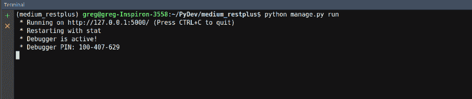
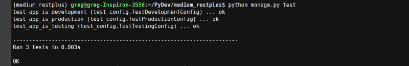
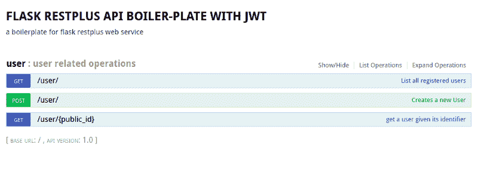
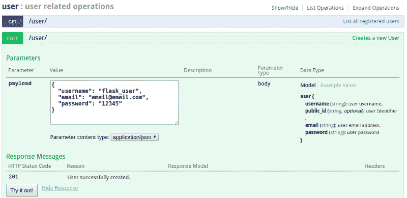
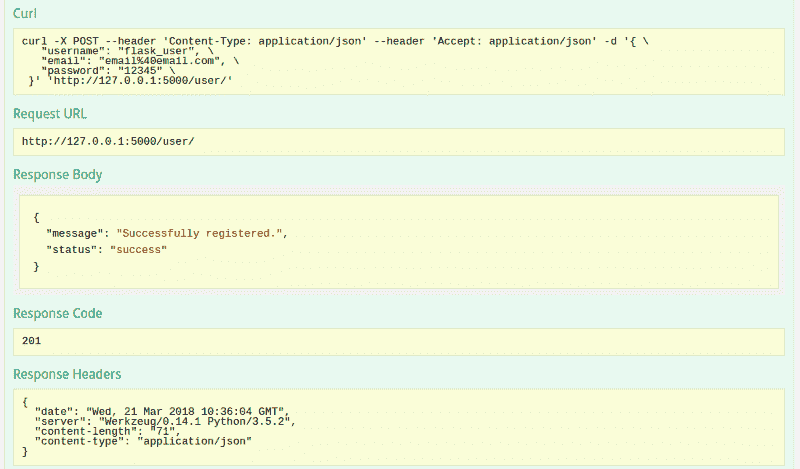
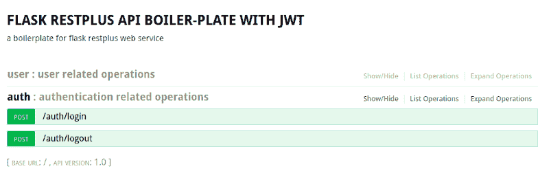

# 如何为产品构建构建 Flask-RESTPlus web 服务

> 原文：<https://www.freecodecamp.org/news/structuring-a-flask-restplus-web-service-for-production-builds-c2ec676de563/>

格雷格·奥比纳

# 如何为产品构建构建 Flask-RESTPlus web 服务


Image credit - frsjobs.co.uk

在本指南中，我将一步一步地向您展示如何为测试、开发和生产环境构建 Flask RESTPlus web 应用程序。我将使用基于 Linux 的操作系统(Ubuntu)，但大多数步骤可以在 Windows 和 Mac 上复制。

在继续阅读本指南之前，您应该对 Python 编程语言和 Flask micro framework 有一个基本的了解。如果你对这些不熟悉，我推荐你看一看一篇介绍性的文章- [如何使用 Python 和 Flask 构建一个 web app。](https://medium.freecodecamp.org/how-to-use-python-and-flask-to-build-a-web-app-an-in-depth-tutorial-437dbfe9f1c6)

#### 本指南的结构

本指南分为以下几个部分:

*   [特性](https://www.freecodecamp.org/news/structuring-a-flask-restplus-web-service-for-production-builds-c2ec676de563/#features)
*   [什么是 Flask-RESTPlus？](https://www.freecodecamp.org/news/structuring-a-flask-restplus-web-service-for-production-builds-c2ec676de563/#what-is-flask-restplus)
*   [设置和安装](https://www.freecodecamp.org/news/structuring-a-flask-restplus-web-service-for-production-builds-c2ec676de563/#setup-and-installation)
*   [项目设置和组织](https://www.freecodecamp.org/news/structuring-a-flask-restplus-web-service-for-production-builds-c2ec676de563/#project-setup-and-organization)
*   [配置设置](https://www.freecodecamp.org/news/structuring-a-flask-restplus-web-service-for-production-builds-c2ec676de563/#configuration-settings)
*   [烧瓶脚本](https://www.freecodecamp.org/news/structuring-a-flask-restplus-web-service-for-production-builds-c2ec676de563/#flask-script)
*   [数据库模型和迁移](https://www.freecodecamp.org/news/structuring-a-flask-restplus-web-service-for-production-builds-c2ec676de563/#database-models-and-migration)
*   [测试](https://www.freecodecamp.org/news/structuring-a-flask-restplus-web-service-for-production-builds-c2ec676de563/#testing)
*   [配置](https://www.freecodecamp.org/news/structuring-a-flask-restplus-web-service-for-production-builds-c2ec676de563/#configuration)
*   [用户操作](https://www.freecodecamp.org/news/structuring-a-flask-restplus-web-service-for-production-builds-c2ec676de563/#user-operations)
*   [安全和认证](https://www.freecodecamp.org/news/structuring-a-flask-restplus-web-service-for-production-builds-c2ec676de563/#security-and-authentication)
*   [路由保护和授权](https://www.freecodecamp.org/news/structuring-a-flask-restplus-web-service-for-production-builds-c2ec676de563/#route-protection-and-authorization)
*   [额外提示](https://www.freecodecamp.org/news/structuring-a-flask-restplus-web-service-for-production-builds-c2ec676de563/#extra-tips)
*   [延长 App &结论](https://www.freecodecamp.org/news/structuring-a-flask-restplus-web-service-for-production-builds-c2ec676de563/#extending-the-app-conclusion)

#### 特征

我们将在项目中使用以下特性和扩展。

*   [Flask-Bcrypt](https://flask-bcrypt.readthedocs.io/) :一个 *Flask 扩展，为您的应用程序*提供 Bcrypt 散列实用程序。
*   使用 Alembic 为 Flask 应用程序处理 SQLAlchemy 数据库迁移的扩展。数据库操作可以通过 Flask 命令行界面或 Flask 脚本扩展来实现。
*   [Flask-SQLAlchemy](http://flask-sqlalchemy.pocoo.org/) : *对 [Flask](http://flask.pocoo.org/) 的扩展，为你的应用程序增加了对 [SQLAlchemy](http://www.sqlalchemy.org/) 的支持。*
*   PyJWT : *一个 Python 库，允许你编码和解码 JSON Web 令牌(JWT)。JWT 是一个开放的行业标准( [RFC 7519](https://tools.ietf.org/html/rfc7519) )，用于安全地代表双方之间的权利主张。*
*   Flask-Script : *一个扩展，为在 Flask 中编写外部脚本和其他属于 web 应用程序本身之外的命令行任务提供支持。*
*   [名称空间](http://flask-restplus.readthedocs.io/en/stable/scaling.html) ( [蓝图](http://exploreflask.com/en/latest/blueprints.html))
*   [flask-rest](https://flask-restplus.readthedocs.io/)
*   UnitTest

#### 什么是 Flask-RESTPlus？

Flask-RESTPlus 是 Flask 的扩展，增加了对快速构建 REST APIs 的支持。Flask-RESTPlus 鼓励用最少的设置实现最佳实践。它提供了一组一致的装饰器和工具来描述您的 API，并适当地公开它的文档(使用 Swagger)。

#### 设置和安装

通过在终端中键入命令`pip --version`来检查是否安装了 pip，然后按回车键。

```
pip --version
```

如果终端以版本号响应，这意味着安装了 pip，因此转到下一步，否则[安装 pip](https://pip.pypa.io/en/latest/installing/) 或使用 Linux 包管理器，在终端上运行下面的命令并按 enter。选择 Python 2.x 或 3.x 版本。

*   Python 2.x

```
sudo apt-get install python-pip
```

*   Python 3.x

```
sudo apt-get install python3-pip
```

设置虚拟环境和虚拟环境包装器(根据上面安装的版本，您只需要其中一个):

```
sudo pip install virtualenv

sudo pip3 install virtualenvwrapper
```

点击[链接](https://medium.com/@gitudaniel/installing-virtualenvwrapper-for-python3-ad3dfea7c717)了解虚拟环境包装器的完整设置。

创建一个新环境，并通过在终端上执行以下命令来激活它:

```
mkproject name_of_your_project
```

#### 项目设置和组织

我将使用一个[功能结构](http://exploreflask.com/en/latest/blueprints.html#functional-structure)来组织他们所做的项目文件。在功能结构中，模板被分组在一个目录中，静态文件在另一个目录中，视图在第三个目录中。

在项目目录中，创建一个名为`app`的新包。在`app`里面，创建两个包`main` 和`test`。您的目录结构应该类似于下图。

```
.
├── app
│   ├── __init__.py
│   ├── main
│   │   └── __init__.py
│   └── test
│       └── __init__.py
└── requirements.txt
```

我们将使用功能结构来模块化我们的应用程序。
在`main`包内，再创建三个包，分别是:`controller`、`service`和`model`。`model`包将包含我们所有的数据库模型，而`service`包将包含我们应用程序的所有业务逻辑，最后`controller`包将包含我们所有的应用程序端点。树结构现在应该如下所示:

```
.
├── app
│   ├── __init__.py
│   ├── main
│   │   ├── controller
│   │   │   └── __init__.py
│   │   ├── __init__.py
│   │   ├── model
│   │   │   └── __init__.py
│   │   └── service
│   │       └── __init__.py
│   └── test
│       └── __init__.py
└── requirements.txt
```

现在让我们安装所需的软件包。确保您创建的虚拟环境已激活，并在终端上运行以下命令:

```
pip install flask-bcrypt

pip install flask-restplus

pip install Flask-Migrate

pip install pyjwt

pip install Flask-Script

pip install flask_testing
```

通过运行以下命令创建或更新`requirements.txt`文件:

```
pip freeze > requirements.txt
```

生成的`requirements.txt`文件应该类似于下图:

```
alembic==0.9.8
aniso8601==3.0.0
bcrypt==3.1.4
cffi==1.11.5
click==6.7
Flask==0.12.2
Flask-Bcrypt==0.7.1
Flask-Migrate==2.1.1
flask-restplus==0.10.1
Flask-Script==2.0.6
Flask-SQLAlchemy==2.3.2
Flask-Testing==0.7.1
itsdangerous==0.24
Jinja2==2.10
jsonschema==2.6.0
Mako==1.0.7
MarkupSafe==1.0
pycparser==2.18
PyJWT==1.6.0
python-dateutil==2.7.0
python-editor==1.0.3
pytz==2018.3
six==1.11.0
SQLAlchemy==1.2.5
Werkzeug==0.14.1
```

#### 配置设置

在`main`包中创建一个名为`config.py`的文件，内容如下:

```
import os

# uncomment the line below for postgres database url from environment variable
# postgres_local_base = os.environ['DATABASE_URL']

basedir = os.path.abspath(os.path.dirname(__file__))

class Config:
    SECRET_KEY = os.getenv('SECRET_KEY', 'my_precious_secret_key')
    DEBUG = False

class DevelopmentConfig(Config):
    # uncomment the line below to use postgres
    # SQLALCHEMY_DATABASE_URI = postgres_local_base
    DEBUG = True
    SQLALCHEMY_DATABASE_URI = 'sqlite:///' + os.path.join(basedir, 'flask_boilerplate_main.db')
    SQLALCHEMY_TRACK_MODIFICATIONS = False

class TestingConfig(Config):
    DEBUG = True
    TESTING = True
    SQLALCHEMY_DATABASE_URI = 'sqlite:///' + os.path.join(basedir, 'flask_boilerplate_test.db')
    PRESERVE_CONTEXT_ON_EXCEPTION = False
    SQLALCHEMY_TRACK_MODIFICATIONS = False

class ProductionConfig(Config):
    DEBUG = False
    # uncomment the line below to use postgres
    # SQLALCHEMY_DATABASE_URI = postgres_local_base

config_by_name = dict(
    dev=DevelopmentConfig,
    test=TestingConfig,
    prod=ProductionConfig
)

key = Config.SECRET_KEY
```

配置文件包含三个环境设置类，包括`testing`、`development`和`production`。

我们将使用[应用工厂模式](http://flask.pocoo.org/docs/0.12/patterns/appfactories/)来创建我们的 Flask 对象。这种模式对于创建具有不同设置的应用程序的多个实例非常有用。这有助于我们通过调用带有所需参数的`create_app`函数在测试、开发和生产环境之间切换。

在`main`包内的`__init__.py`文件中，输入以下代码行:

```
from flask import Flask
from flask_sqlalchemy import SQLAlchemy
from flask_bcrypt import Bcrypt

from .config import config_by_name

db = SQLAlchemy()
flask_bcrypt = Bcrypt()

def create_app(config_name):
    app = Flask(__name__)
    app.config.from_object(config_by_name[config_name])
    db.init_app(app)
    flask_bcrypt.init_app(app)

    return app
```

#### 烧瓶脚本

现在让我们创建我们的应用程序入口点。在项目的根目录下，创建一个名为`manage.py`的文件，内容如下:

```
import os
import unittest

from flask_migrate import Migrate, MigrateCommand
from flask_script import Manager

from app.main import create_app, db

app = create_app(os.getenv('BOILERPLATE_ENV') or 'dev')

app.app_context().push()

manager = Manager(app)

migrate = Migrate(app, db)

manager.add_command('db', MigrateCommand)

@manager.command
def run():
    app.run()

@manager.command
def test():
    """Runs the unit tests."""
    tests = unittest.TestLoader().discover('app/test', pattern='test*.py')
    result = unittest.TextTestRunner(verbosity=2).run(tests)
    if result.wasSuccessful():
        return 0
    return 1

if __name__ == '__main__':
    manager.run()
```

`manage.py`中的上述代码执行以下操作:

*   `line 4`和`5`分别导入 migrate 和 manager 模块(我们很快就会用到 migrate 命令)。
*   `line 9`调用我们最初创建的`create_app`函数，用环境变量中的所需参数创建应用程序实例，该环境变量可以是以下任意一个- `dev`、`prod`、`test`。如果环境变量中没有设置，则使用默认的`dev`。
*   `line 13`和`15`通过将`app`实例传递给它们各自的构造函数来实例化管理器和迁移类。
*   在`line 17`中，我们将`db`和`MigrateCommand`实例传递给`manager`的`add_command`接口，通过 Flask-Script 公开所有数据库迁移命令。
*   `line 20`和`25`将这两个函数标记为可从命令行执行。

> **Flask-Migrate 公开了两个类，`Migrate`和`MigrateCommand`。`Migrate`类包含了扩展的所有功能。`MigrateCommand`类仅在需要通过 Flask-Script 扩展公开数据库迁移命令时使用。**

此时，我们可以通过在项目根目录下运行下面的命令来测试应用程序。

```
python manage.py run
```

如果一切正常，您应该会看到类似这样的内容:



#### 数据库模型和迁移

现在让我们创建我们的模型。我们将使用 sqlalchemy 的`db`实例来创建我们的模型。

`db`实例包含了来自`****sqlalchemy****`和`[****sqlalchemy.orm****](http://docs.sqlalchemy.org/en/latest/orm/scalar_mapping.html#module-sqlalchemy.orm)` 和的所有函数和帮助器。它提供了一个名为`Model`的类，这是一个可用于声明模型的声明基础。

在`model`包中，创建一个名为`user.py`的文件，内容如下:

```
from .. import db, flask_bcrypt

class User(db.Model):
    """ User Model for storing user related details """
    __tablename__ = "user"

    id = db.Column(db.Integer, primary_key=True, autoincrement=True)
    email = db.Column(db.String(255), unique=True, nullable=False)
    registered_on = db.Column(db.DateTime, nullable=False)
    admin = db.Column(db.Boolean, nullable=False, default=False)
    public_id = db.Column(db.String(100), unique=True)
    username = db.Column(db.String(50), unique=True)
    password_hash = db.Column(db.String(100))

    @property
    def password(self):
        raise AttributeError('password: write-only field')

    @password.setter
    def password(self, password):
        self.password_hash = flask_bcrypt.generate_password_hash(password).decode('utf-8')

    def check_password(self, password):
        return flask_bcrypt.check_password_hash(self.password_hash, password)

    def __repr__(self):
        return "<User '{}'>".format(self.username)
```

`user.py`中的上述代码执行以下操作:

*   `line 3:``user`类继承自`db.Model`类，后者将该类声明为 sqlalchemy 的模型。
*   `line 7`到`13`为用户表创建所需的列。
*   `line 21`是字段`password_hash`的设置器，它使用`flask-bcrypt`通过提供的密码生成一个散列。
*   `line 24`将给定的密码与已经保存的`password_hash`进行比较。

现在，为了从我们刚刚创建的`user`模型生成数据库表，我们将通过`manager`接口使用`migrateCommand`。为了让`manager`检测我们的模型，我们必须通过向`manage.py`文件添加以下代码来导入`user`模型:

```
...
from app.main.model import user
...
```

现在，我们可以通过在项目根目录上运行以下命令来执行**迁移**:

1.  使用 alembic 的`init`命令启动迁移文件夹，以执行迁移。

```
python manage.py db init
```

2.使用`migrate`命令，根据模型中检测到的变化创建一个迁移脚本。这还不影响数据库。

```
python manage.py db migrate --message 'initial database migration'
```

3.使用`upgrade`命令将迁移脚本应用到数据库

```
python manage.py db upgrade
```

如果一切运行成功，您应该在主包中生成一个新的 sqlLite 数据库
`flask_boilerplate_main.db`文件。

> 每次数据库模型改变时，重复`migrate`和`upgrade`命令

### 测试

#### 配置

为了确保我们的环境配置的设置工作正常，让我们为它编写几个测试。

在测试包中创建一个名为`test_config.py`的文件，内容如下:

```
import os
import unittest

from flask import current_app
from flask_testing import TestCase

from manage import app
from app.main.config import basedir

class TestDevelopmentConfig(TestCase):
    def create_app(self):
        app.config.from_object('app.main.config.DevelopmentConfig')
        return app

    def test_app_is_development(self):
        self.assertFalse(app.config['SECRET_KEY'] is 'my_precious')
        self.assertTrue(app.config['DEBUG'] is True)
        self.assertFalse(current_app is None)
        self.assertTrue(
            app.config['SQLALCHEMY_DATABASE_URI'] == 'sqlite:///' + os.path.join(basedir, 'flask_boilerplate_main.db')
        )

class TestTestingConfig(TestCase):
    def create_app(self):
        app.config.from_object('app.main.config.TestingConfig')
        return app

    def test_app_is_testing(self):
        self.assertFalse(app.config['SECRET_KEY'] is 'my_precious')
        self.assertTrue(app.config['DEBUG'])
        self.assertTrue(
            app.config['SQLALCHEMY_DATABASE_URI'] == 'sqlite:///' + os.path.join(basedir, 'flask_boilerplate_test.db')
        )

class TestProductionConfig(TestCase):
    def create_app(self):
        app.config.from_object('app.main.config.ProductionConfig')
        return app

    def test_app_is_production(self):
        self.assertTrue(app.config['DEBUG'] is False)

if __name__ == '__main__':
    unittest.main()
```

使用以下命令运行测试:

```
python manage.py test
```

您应该得到以下输出:



#### 用户操作

现在让我们来处理以下与用户相关的操作:

*   创建新用户
*   用他的`public_id`获得注册用户
*   获取所有注册用户。

**用户服务类:**这个类处理所有与用户模型相关的逻辑。
在`service`包中，新建一个文件`user_service.py`，内容如下:

```
import uuid
import datetime

from app.main import db
from app.main.model.user import User

def save_new_user(data):
    user = User.query.filter_by(email=data['email']).first()
    if not user:
        new_user = User(
            public_id=str(uuid.uuid4()),
            email=data['email'],
            username=data['username'],
            password=data['password'],
            registered_on=datetime.datetime.utcnow()
        )
        save_changes(new_user)
        response_object = {
            'status': 'success',
            'message': 'Successfully registered.'
        }
        return response_object, 201
    else:
        response_object = {
            'status': 'fail',
            'message': 'User already exists. Please Log in.',
        }
        return response_object, 409

def get_all_users():
    return User.query.all()

def get_a_user(public_id):
    return User.query.filter_by(public_id=public_id).first()

def save_changes(data):
    db.session.add(data)
    db.session.commit() 
```

`user_service.py`中的上述代码执行以下操作:

*   `line 8`到`29`通过首先检查用户是否已经存在来创建新用户；如果用户不存在，它返回成功`response_object`，否则返回错误代码`409`和失败`response_object`。
*   `line 33`和`37`分别通过提供`public_id`返回所有注册用户的列表和一个用户对象。
*   `line 40`到`42`提交对数据库的更改。

> 不需要使用 [jsonify](http://flask.pocoo.org/docs/0.12/api/#module-flask.json) 将对象格式化为 JSON，Flask-restplus 会自动完成

在`main`包中，创建一个名为`util`的新包。这个包将包含我们在应用程序中可能需要的所有必要的实用程序。

在`util`包中，创建一个新文件`dto.py`。顾名思义，数据传输对象()将负责在进程间传送数据。在我们自己的例子中，它将用于为我们的 API 调用封送数据。随着我们的进展，我们会更好地理解这一点。

```
from flask_restplus import Namespace, fields

class UserDto:
    api = Namespace('user', description='user related operations')
    user = api.model('user', {
        'email': fields.String(required=True, description='user email address'),
        'username': fields.String(required=True, description='user username'),
        'password': fields.String(required=True, description='user password'),
        'public_id': fields.String(description='user Identifier')
    })
```

`dto.py`中的上述代码执行以下操作:

*   `line 5`为用户相关操作创建新的名称空间。Flask-RESTPlus 提供了一种使用与[蓝图](http://exploreflask.com/en/latest/blueprints.html#what-is-a-blueprint)几乎相同的模式的方法。主要思想是把你的应用程序分成可重用的名称空间。命名空间模块将包含模型和资源声明。
*   `line 6`通过`line 5`中的`api`名称空间提供的`model`接口创建一个新的用户 dto。

**用户控制器:**用户控制器类处理所有与用户相关的传入 HTTP 请求。

在`controller`包下，创建一个名为`user_controller.py`的新文件，内容如下:

```
from flask import request
from flask_restplus import Resource

from ..util.dto import UserDto
from ..service.user_service import save_new_user, get_all_users, get_a_user

api = UserDto.api
_user = UserDto.user

@api.route('/')
class UserList(Resource):
    @api.doc('list_of_registered_users')
    @api.marshal_list_with(_user, envelope='data')
    def get(self):
        """List all registered users"""
        return get_all_users()

    @api.response(201, 'User successfully created.')
    @api.doc('create a new user')
    @api.expect(_user, validate=True)
    def post(self):
        """Creates a new User """
        data = request.json
        return save_new_user(data=data)

@api.route('/<public_id>')
@api.param('public_id', 'The User identifier')
@api.response(404, 'User not found.')
class User(Resource):
    @api.doc('get a user')
    @api.marshal_with(_user)
    def get(self, public_id):
        """get a user given its identifier"""
        user = get_a_user(public_id)
        if not user:
            api.abort(404)
        else:
            return user
```

`line 1`到`8`导入用户控制器所需的所有资源。
我们在用户控制器中定义了两个具体的类，分别是
`userList`和`user`。这两个类扩展了抽象的 flask-restplus 资源。

> 具体的资源应该从这个类 *扩展，并为每个支持的 HTTP 方法公开方法。* *如果使用不支持的 HTTP 方法调用资源，**API 将返回一个响应，状态为 405 方法不允许。* *否则，调用适当的方法，并从将资源添加到 API 实例时使用的 URL 规则中传递所有参数* *。*

上面`line 7`中的`api`命名空间为控制器提供了几个装饰器，包括但不限于以下内容:

*   api。 ****路线**** : **一个装修工给路线资源**
*   api。****marshal _ with****:**一个 decorator 指定用于序列化的字段(这是我们使用前面创建的**`**userDto**`**)**
*   api。****_ list _ marshal _ with****:**快捷键装饰为** `**marshal_with**` **上面带有** `**as_list = True**`
*   api。 ****doc**** : **一个装饰者给被装饰的对象添加一些 api 文档**
*   api。 ****响应:**** **装饰者指定一个期望的响应**
*   api。 ****期望:**** **一个装饰者指定期望的输入模型(我们还是用** `**userDto**` **来表示期望的输入)**
*   api。 ****param:**** **一个装饰者指定一个期望的参数**

我们现在已经用用户控制器定义了我们的名称空间。现在是将它添加到应用程序入口点的时候了。

在`app`包的`__init__.py`文件中，输入以下内容:

```
# app/__init__.py

from flask_restplus import Api
from flask import Blueprint

from .main.controller.user_controller import api as user_ns

blueprint = Blueprint('api', __name__)

api = Api(blueprint,
          title='FLASK RESTPLUS API BOILER-PLATE WITH JWT',
          version='1.0',
          description='a boilerplate for flask restplus web service'
          )

api.add_namespace(user_ns, path='/user')
```

`blueprint.py`中的上述代码执行以下操作:

*   在`line 8`中，我们通过传递`name`创建一个蓝图实例，而`import_name.` `API`是应用资源的主要入口点，因此需要用`line 10`中的`blueprint`进行初始化。
*   在`line 16`中，我们将用户名称空间`user_ns`添加到`API`实例的名称空间列表中。

我们现在已经确定了我们的蓝图。是时候在我们的 Flask app 上注册了。
通过导入`blueprint`并将其注册到 Flask 应用程序实例来更新`manage.py`。

```
from app import blueprint
...

app = create_app(os.getenv('BOILERPLATE_ENV') or 'dev')
app.register_blueprint(blueprint)

app.app_context().push()

...
```

我们现在可以测试我们的应用程序，看看一切都工作正常。

```
python manage.py run
```

现在在浏览器中打开 URL `[http://127.0.0.1:5000](http://127.0.0.1:5000)`。你应该看看 swagger 文档。



让我们使用 swagger 测试功能来测试**创建新用户**端点。



您应该会得到以下响应



#### 安全性和身份验证

让我们创建一个模型`blacklistToken`来存储列入黑名单的令牌。在`models`包中，创建一个`blacklist.py`文件，内容如下:

```
from .. import db
import datetime

class BlacklistToken(db.Model):
    """
    Token Model for storing JWT tokens
    """
    __tablename__ = 'blacklist_tokens'

    id = db.Column(db.Integer, primary_key=True, autoincrement=True)
    token = db.Column(db.String(500), unique=True, nullable=False)
    blacklisted_on = db.Column(db.DateTime, nullable=False)

    def __init__(self, token):
        self.token = token
        self.blacklisted_on = datetime.datetime.now()

    def __repr__(self):
        return '<id: token: {}'.format(self.token)

    @staticmethod
    def check_blacklist(auth_token):
        # check whether auth token has been blacklisted
        res = BlacklistToken.query.filter_by(token=str(auth_token)).first()
        if res:
            return True
        else:
            return False
```

让我们不要忘记迁移更改以使其在我们的数据库中生效。
在`manage.py`中导入`blacklist`类。

```
from app.main.model import blacklist
```

运行`migrate`和`upgrade`命令

```
python manage.py db migrate --message 'add blacklist table'

python manage.py db upgrade
```

接下来在服务包中创建`blacklist_service.py`，包含以下内容，用于将令牌列入黑名单:

```
from app.main import db
from app.main.model.blacklist import BlacklistToken

def save_token(token):
    blacklist_token = BlacklistToken(token=token)
    try:
        # insert the token
        db.session.add(blacklist_token)
        db.session.commit()
        response_object = {
            'status': 'success',
            'message': 'Successfully logged out.'
        }
        return response_object, 200
    except Exception as e:
        response_object = {
            'status': 'fail',
            'message': e
        }
        return response_object, 200
```

用编码和解码令牌的两个静态方法更新`user`模型。添加以下导入内容:

```
import datetime
import jwt
from app.main.model.blacklist import BlacklistToken
from ..config import key
```

*   编码

```
def encode_auth_token(self, user_id):
        """
        Generates the Auth Token
        :return: string
        """
        try:
            payload = {
                'exp': datetime.datetime.utcnow() + datetime.timedelta(days=1, seconds=5),
                'iat': datetime.datetime.utcnow(),
                'sub': user_id
            }
            return jwt.encode(
                payload,
                key,
                algorithm='HS256'
            )
        except Exception as e:
            return e
```

*   解码:在解码认证令牌时，考虑黑名单令牌、过期令牌和无效令牌。

```
 @staticmethod  
  def decode_auth_token(auth_token):
        """
        Decodes the auth token
        :param auth_token:
        :return: integer|string
        """
        try:
            payload = jwt.decode(auth_token, key)
            is_blacklisted_token = BlacklistToken.check_blacklist(auth_token)
            if is_blacklisted_token:
                return 'Token blacklisted. Please log in again.'
            else:
                return payload['sub']
        except jwt.ExpiredSignatureError:
            return 'Signature expired. Please log in again.'
        except jwt.InvalidTokenError:
            return 'Invalid token. Please log in again.'
```

现在让我们为`user`模型编写一个测试，以确保我们的`encode`和`decode`函数正常工作。

在`test`包中，创建包含以下内容的`base.py`文件:

```
from flask_testing import TestCase
from app.main import db
from manage import app

class BaseTestCase(TestCase):
    """ Base Tests """

    def create_app(self):
        app.config.from_object('app.main.config.TestingConfig')
        return app

    def setUp(self):
        db.create_all()
        db.session.commit()

    def tearDown(self):
        db.session.remove()
        db.drop_all()
```

在扩展测试环境的每个测试用例之前和之后,`BaseTestCase`设置好我们的测试环境。

用以下测试用例创建`test_user_medol.py`:

```
import unittest
import datetime

from app.main import db
from app.main.model.user import User
from app.test.base import BaseTestCase

class TestUserModel(BaseTestCase):

    def test_encode_auth_token(self):
        user = User(
            email='test@test.com',
            password='test',
            registered_on=datetime.datetime.utcnow()
        )
        db.session.add(user)
        db.session.commit()
        auth_token = user.encode_auth_token(user.id)
        self.assertTrue(isinstance(auth_token, bytes))

    def test_decode_auth_token(self):
        user = User(
            email='test@test.com',
            password='test',
            registered_on=datetime.datetime.utcnow()
        )
        db.session.add(user)
        db.session.commit()
        auth_token = user.encode_auth_token(user.id)
        self.assertTrue(isinstance(auth_token, bytes))
        self.assertTrue(User.decode_auth_token(auth_token.decode("utf-8") ) == 1)

if __name__ == '__main__':
    unittest.main() 
```

用`python manage.py test`运行测试。所有的测试都应该通过。

让我们创建 ****认证端点**** 为 ****登录**** 和 ****注销**** 。

*   首先，我们需要一个`dto`作为登录负载。我们将对`login`端点中的`@expect`注释使用 auth dto。将下面的代码添加到`dto.py`

```
class AuthDto:
    api = Namespace('auth', description='authentication related operations')
    user_auth = api.model('auth_details', {
        'email': fields.String(required=True, description='The email address'),
        'password': fields.String(required=True, description='The user password '),
    })
```

*   接下来，我们创建一个身份验证助手类来处理所有与身份验证相关的操作。这个`auth_helper.py`将在服务包中，并将包含两个静态方法，分别是`login_user`和`logout_user`

> **当用户注销时，用户的令牌被列入黑名单，即用户不能使用相同的令牌再次登录。**

```
from app.main.model.user import User
from ..service.blacklist_service import save_token

class Auth:

    @staticmethod
    def login_user(data):
        try:
            # fetch the user data
            user = User.query.filter_by(email=data.get('email')).first()
            if user and user.check_password(data.get('password')):
                auth_token = user.encode_auth_token(user.id)
                if auth_token:
                    response_object = {
                        'status': 'success',
                        'message': 'Successfully logged in.',
                        'Authorization': auth_token.decode()
                    }
                    return response_object, 200
            else:
                response_object = {
                    'status': 'fail',
                    'message': 'email or password does not match.'
                }
                return response_object, 401

        except Exception as e:
            print(e)
            response_object = {
                'status': 'fail',
                'message': 'Try again'
            }
            return response_object, 500

    @staticmethod
    def logout_user(data):
        if data:
            auth_token = data.split(" ")[1]
        else:
            auth_token = ''
        if auth_token:
            resp = User.decode_auth_token(auth_token)
            if not isinstance(resp, str):
                # mark the token as blacklisted
                return save_token(token=auth_token)
            else:
                response_object = {
                    'status': 'fail',
                    'message': resp
                }
                return response_object, 401
        else:
            response_object = {
                'status': 'fail',
                'message': 'Provide a valid auth token.'
            }
            return response_object, 403
```

*   现在让我们为`login`和`logout`操作创建端点。
    在控制器包中，创建
    `auth_controller.py`，内容如下:

```
from flask import request
from flask_restplus import Resource

from app.main.service.auth_helper import Auth
from ..util.dto import AuthDto

api = AuthDto.api
user_auth = AuthDto.user_auth

@api.route('/login')
class UserLogin(Resource):
    """
        User Login Resource
    """
    @api.doc('user login')
    @api.expect(user_auth, validate=True)
    def post(self):
        # get the post data
        post_data = request.json
        return Auth.login_user(data=post_data)

@api.route('/logout')
class LogoutAPI(Resource):
    """
    Logout Resource
    """
    @api.doc('logout a user')
    def post(self):
        # get auth token
        auth_header = request.headers.get('Authorization')
        return Auth.logout_user(data=auth_header)
```

*   此时，剩下的唯一事情就是向应用程序`Blueprint`注册 auth `api`名称空间

用以下内容更新`app`包的`__init__.py`文件

```
# app/__init__.py

from flask_restplus import Api
from flask import Blueprint

from .main.controller.user_controller import api as user_ns
from .main.controller.auth_controller import api as auth_ns

blueprint = Blueprint('api', __name__)

api = Api(blueprint,
          title='FLASK RESTPLUS API BOILER-PLATE WITH JWT',
          version='1.0',
          description='a boilerplate for flask restplus web service'
          )

api.add_namespace(user_ns, path='/user')
api.add_namespace(auth_ns)
```

使用`python manage.py run`运行应用程序，并在浏览器中打开 url `[http://127.0.0.1:5000](http://127.0.0.1:5000)`。

swagger 文档现在应该反映新创建的带有`login`和`logout`端点的`auth`名称空间。



在我们编写一些测试来确保我们的身份验证按预期工作之前，让我们修改我们的注册端点，以便在注册成功后自动登录用户。

将下面的方法`generate_token`添加到`user_service.py`:

```
def generate_token(user):
    try:
        # generate the auth token
        auth_token = user.encode_auth_token(user.id)
        response_object = {
            'status': 'success',
            'message': 'Successfully registered.',
            'Authorization': auth_token.decode()
        }
        return response_object, 201
    except Exception as e:
        response_object = {
            'status': 'fail',
            'message': 'Some error occurred. Please try again.'
        }
        return response_object, 401
```

`generate_token`方法通过对用户`id.`进行编码生成一个认证**令牌**，这个**令牌**就是作为响应返回的。

接下来，用下面的`save_new_user`方法更换**返回**块

```
response_object = {
    'status': 'success',
    'message': 'Successfully registered.'
}
return response_object, 201
```

随着

```
return generate_token(new_user)
```

现在是测试`login`和`logout`功能的时候了。在测试包中创建一个新的测试文件`test_auth.py`，内容如下:

```
import unittest
import json
from app.test.base import BaseTestCase

def register_user(self):
    return self.client.post(
        '/user/',
        data=json.dumps(dict(
            email='example@gmail.com',
            username='username',
            password='123456'
        )),
        content_type='application/json'
    )

def login_user(self):
    return self.client.post(
        '/auth/login',
        data=json.dumps(dict(
            email='example@gmail.com',
            password='123456'
        )),
        content_type='application/json'
    )

class TestAuthBlueprint(BaseTestCase):

    def test_registered_user_login(self):
            """ Test for login of registered-user login """
            with self.client:
                # user registration
                user_response = register_user(self)
                response_data = json.loads(user_response.data.decode())
                self.assertTrue(response_data['Authorization'])
                self.assertEqual(user_response.status_code, 201)

                # registered user login
                login_response = login_user(self)
                data = json.loads(login_response.data.decode())
                self.assertTrue(data['Authorization'])
                self.assertEqual(login_response.status_code, 200)

    def test_valid_logout(self):
        """ Test for logout before token expires """
        with self.client:
            # user registration
            user_response = register_user(self)
            response_data = json.loads(user_response.data.decode())
            self.assertTrue(response_data['Authorization'])
            self.assertEqual(user_response.status_code, 201)

            # registered user login
            login_response = login_user(self)
            data = json.loads(login_response.data.decode())
            self.assertTrue(data['Authorization'])
            self.assertEqual(login_response.status_code, 200)

            # valid token logout
            response = self.client.post(
                '/auth/logout',
                headers=dict(
                    Authorization='Bearer ' + json.loads(
                        login_response.data.decode()
                    )['Authorization']
                )
            )
            data = json.loads(response.data.decode())
            self.assertTrue(data['status'] == 'success')
            self.assertEqual(response.status_code, 200)

if __name__ == '__main__':
    unittest.main()
```

访问 [github repo](https://github.com/cosmic-byte/flask-restplus-boilerplate) 获取更详尽的测试案例。

#### 路由保护和授权

到目前为止，我们已经成功地创建了我们的端点，实现了登录和注销功能，但是我们的端点仍然没有受到保护。

我们需要一种方法来定义规则，以确定我们的哪个端点是开放的，或者需要认证，甚至是管理权限。

我们可以通过为端点创建自定义装饰器来实现这一点。

在保护或授权任何端点之前，我们需要知道当前登录的用户。我们可以通过使用 flask 库`request.`从当前请求的头中提取`Authorization token`来实现这一点，然后我们从`Authorization token`中解码用户详细信息。

在`auth_helper.py`文件的`Auth`类中，添加以下静态方法:

```
@staticmethod
def get_logged_in_user(new_request):
        # get the auth token
        auth_token = new_request.headers.get('Authorization')
        if auth_token:
            resp = User.decode_auth_token(auth_token)
            if not isinstance(resp, str):
                user = User.query.filter_by(id=resp).first()
                response_object = {
                    'status': 'success',
                    'data': {
                        'user_id': user.id,
                        'email': user.email,
                        'admin': user.admin,
                        'registered_on': str(user.registered_on)
                    }
                }
                return response_object, 200
            response_object = {
                'status': 'fail',
                'message': resp
            }
            return response_object, 401
        else:
            response_object = {
                'status': 'fail',
                'message': 'Provide a valid auth token.'
            }
            return response_object, 401
```

现在我们可以从请求中检索登录的用户，让我们继续创建`decorators.`

在`util`包中创建一个文件`decorator.py`，内容如下:

```
from functools import wraps
from flask import request

from app.main.service.auth_helper import Auth

def token_required(f):
    @wraps(f)
    def decorated(*args, **kwargs):

        data, status = Auth.get_logged_in_user(request)
        token = data.get('data')

        if not token:
            return data, status

        return f(*args, **kwargs)

    return decorated

def admin_token_required(f):
    @wraps(f)
    def decorated(*args, **kwargs):

        data, status = Auth.get_logged_in_user(request)
        token = data.get('data')

        if not token:
            return data, status

        admin = token.get('admin')
        if not admin:
            response_object = {
                'status': 'fail',
                'message': 'admin token required'
            }
            return response_object, 401

        return f(*args, **kwargs)

    return decorated
```

更多关于**装饰者**以及如何创建他们的信息，请看[这个链接](https://realpython.com/primer-on-python-decorators/)。

现在我们已经分别为有效令牌和管理令牌创建了装饰器`token_required`和`admin_token_required`，剩下的就是用 freecodecamp orgappropriate **装饰器**来注释我们希望保护的端点。

#### 额外提示

目前，为了在我们的应用程序中执行一些任务，我们需要运行不同的命令来启动应用程序、运行测试、安装依赖项等。我们可以通过使用`Makefile.`将所有命令安排在一个文件中来自动化这些过程

在应用程序的根目录下，创建一个没有文件扩展名的`Makefile`。该文件应包含以下内容:

```
.PHONY: clean system-packages python-packages install tests run all

clean:
   find . -type f -name '*.pyc' -delete
   find . -type f -name '*.log' -delete

system-packages:
   sudo apt install python-pip -y

python-packages:
   pip install -r requirements.txt

install: system-packages python-packages

tests:
   python manage.py test

run:
   python manage.py run

all: clean install tests run
```

以下是 make 文件的选项。

1.  `make install`:安装系统包和 python 包
2.  `make clean`:清理 app
3.  `make tests`:运行所有的测试
4.  `make run`:启动应用程序
5.  `make all`:执行 app 的`clean-up`、`installation`，运行`tests`、`starts`。

### 扩展应用程序和结论

复制当前的应用程序结构并扩展它以向应用程序添加更多的功能/端点是非常容易的。只需查看之前已实施的任何路线。

如果您有任何问题、意见或建议，请随时发表评论。此外，如果这篇文章对你有帮助，请点击拍手图标，这样其他人也会在这里看到并受益。

访问 [github 库](https://github.com/cosmic-byte/flask-restplus-boilerplate)以获得完整的项目。

感谢阅读，祝你好运！