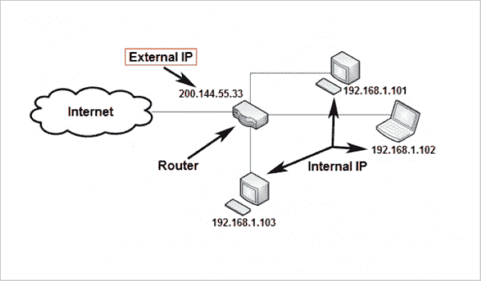
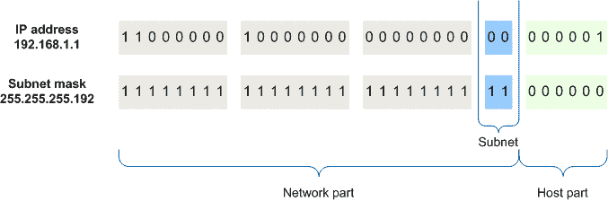

# 子网掩码定义

> 原文：<https://www.freecodecamp.org/news/subnet-mask-definition/>

子网掩码定义了可以在网络或子网中使用的 IP 地址范围。它还将 IP 地址分为两部分:网络位和主机位。

划分子网时会用到子网掩码，也就是将一个网络分成更小的网络。通过调整子网掩码，您可以设置网络中可用 IP 地址的数量。

例如，简单家庭网络的常见子网掩码是`255.255.255.0`。此子网掩码允许家庭网络中最多有 254 个可用的 IP 地址。换句话说，多达 254 台计算机、电话和其他互联网连接设备可以连接到您的路由器/网络并访问互联网。

A simple network / subnet. Source: [What Is My IP Address?](https://www.popularmechanics.com/technology/a32729384/how-to-find-ip-address/)

子网掩码将 IP 地址分成网络位和主机位。当一台设备看到另一台设备的 IP 地址的网络和主机位时，它可以判断出另一台设备是否属于同一个网络(家庭、企业等)。)，还是在其他地方在线

An IP address and subnet mask. Source: [IPv4](https://support.huawei.com/enterprise/en/doc/EDOC1100145159)

查看本文了解更多关于子网、子网掩码及其工作原理的信息。

## 相关技术术语:

*   [子网定义](https://www.freecodecamp.org/news/subnet-definition/)