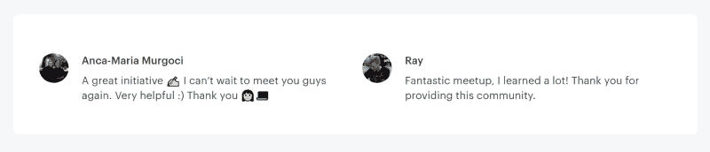
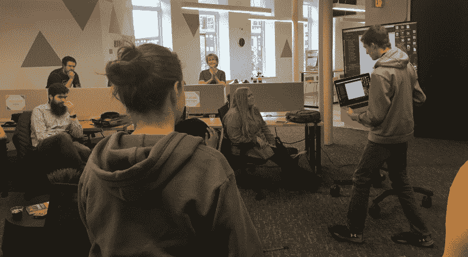
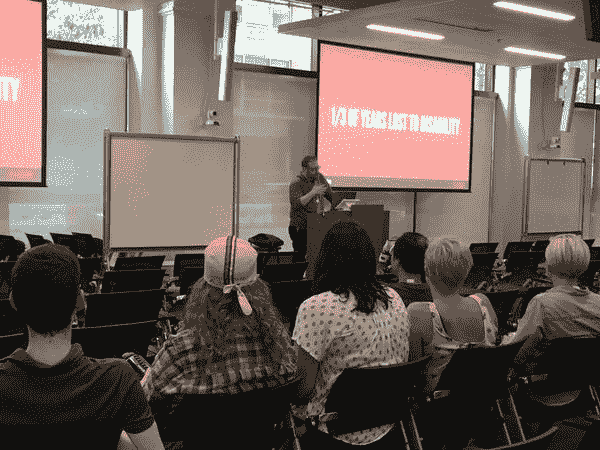

# 我三年来主持免费代码营聚会的成功和失败

> 原文：<https://www.freecodecamp.org/news/successes-and-failures-from-three-years-of-hosting-freecodecamp-meetups-b3f5c5825273/>

早在 2015 年，我就在当地开了一个聚会，与其他学习者和程序员见面。我当时并不知道它会给我这么大的帮助，让我认识这么棒的人。

我首先在脸书创建了一个群组页面，取代了今年早些时候成立的一个不活跃的本地 freeCodeCamp 群组。会员开始一次加入一个，当我发布第一次会议时，大约有 20 - 30 个。

### 起初

我们最初的几次会议充斥着代码和咖啡。我们在当地的一家咖啡馆聚在一起，讨论免费代码营的挑战和项目，并谈论技术。在最初的几次聚会中，我们有大约 4 - 8 名成员出现，几个月后，我们开始超越这个小咖啡馆。

大约在那个时候，我在印第安纳波利斯发展了近一年的网络，并遇到了几个有兴趣与当地自由代码营成员交流的人。我联系了几家合作空间，其中几家同意免费接待我们。此外，我工作的公司提出每月为小组购买一次比萨饼。剩下唯一要做的事情就是安排会议并让成员们知道。

每周都有新成员加入，脸书集团开始快速发展，我们决定成立一个 meetup.com 组织来扩大我们的覆盖范围。许多人在 meetup 网站上寻找编码组，因此参加 meetup 的成员平均数量增加了一倍多。现在，我们平均有 17 - 28 个参与者。

一位经验丰富的本地开发人员 Jared Wilcurt 主动提出开始帮助这个团队，这是我们成功背后的一个重要原因。他非常有条理，是一个优秀的演讲者，也是一个伟大的老师。近两年来，他帮我策划了所有的活动。

> 关于 Meetup.com 的一个注意事项:在该平台上每六个月主持一个小组需要花费 90 美元。支付费用的一些选择可以是接受捐款、寻找赞助商、在组织者之间分摊费用(这是我们目前正在做的)，或者将您的群添加到已经主持 meetup 的某人的帐户中，因为 meetup.com 允许您以一个付费会员组织三个群。

### 我们最好的聚会

以下是我们参加过的最好的聚会，以及所涵盖内容的总结。

#### 起草开发人员简历

这是一位资深开发人员的演讲，他鼓励成员们在演讲时带上自己的简历。简历对于被雇佣来说仍然是非常重要的，这次会议详细说明了如何写技术简历，并澄清了许多误解。最后我们还进行了精彩的互动问答。

#### 技术面试实践

我们招募了 9 名有技术面试经验的本地开发人员。足够多的成员出现，每个面试官有两个成员。

Participant reviews from the meetup

这次活动包括练习回答各种类型的面试问题以及白板演示部分。这是一件很棒的事情，在同一时间听到所有被采访的人的声音，然后看到参与者带着更多的自信离开。最后，我们收到了来自与会者和采访者的积极反馈。我们期待着将来再次举办这样的活动。

#### 迷你黑客马拉松

协作是一项需要掌握的重要技能。我们每个季度都会举办 6-7 小时的短期黑客马拉松，帮助人们提高协作技能。这些是初学者友好的活动，没有参与的先决条件。

A team showing off what they built

在这个活动中，人们可以选择和谁一起工作，也可以随机被选入一个团队。这两种方式似乎都很好。我们在开始时从建议列表中随机选择一个主题(例如，游戏、电影、猫等等)，每个团队(通常 3 - 4 人)围绕该主题构建他们想要的任何内容。

在我们举办的最初几个黑客马拉松中，我们花了很多时间教人们协作技术，对于大多数编程新手来说，很难快速掌握 Git 之类的东西。幸运的是，我们发现了一个名为 [Glitch](https://glitch.com/) 的网站，它允许你在同一个代码编辑器中作为一个团队进行协作——它也非常容易使用。

我们开始与 [Girl Develop It](https://www.girldevelopit.com/) 合作，让更多人参与这些活动。一些当地公司还在参与者们埋头苦干的时候，慷慨地为他们买了食物。

#### freeCodeCamp 远程黑客马拉松

我们与来自加里(芝加哥附近)、印第安纳波利斯和 CA freeCodeCamp 团体的成员进行了 24 小时的黑客攻击。有一些经验丰富的和一些初级的参与者，所以它允许很多指导发生。

这次活动进行得非常顺利，但是我们没有时间组织第二次活动。如果我们能找到一个在线系统来创建团队并在未来组织另一个团队，那将是非常棒的。

#### 心理健康聚会

心理健康是一个没有人真正想谈论的话题，尽管它不成比例地影响着科技行业。

Ed speaking at the meetup about mental health in the developer community

[开源精神疾病](https://osmihelp.org/)的埃德·芬克勒来到我们这里，和我们谈论我们如何能恰当地帮助人们，并就工作场所的这些问题展开讨论。作为一个一直在焦虑和其他问题中挣扎的人，我很高兴意识到我不是唯一一个。

### 一些不太顺利的聚会

#### Ruby Workshop 简介

我们有一位来自当地编码训练营的令人惊讶的教练，我们认为一切都准备好了，可以开始了。不对！

我们从来没有考虑到人们会有不同的编码环境，并且在下载和安装需求时会有很多麻烦。在此之前，我们所有的其他研讨会都是以 JavaScript 为中心的，我们没有为我们面临的挑战做好准备。我们中途停下来，让老师给我们演示一下这门语言。

> 我仍然对那件事感到难过。将来，我们可能会在活动开始前建立一个在线环境，供参与者使用。

#### Node 和 Express 简介(使用 Mongo)

标题说明了一切。我们试图在短时间内做太多的事情。即使老师知识渊博，学习者的眼睛开始变得呆滞，看起来他们离开时比以前更加困惑。

### 运行 Meetup 群组的提示

根据我的经验，这里有一些成功运营 meetup 群组的小技巧。

1.  通过一个名为“规划”的房间开始群聊，就 meetup 想法进行合作，并让更多人参与进来(我们使用 Discord，因为它有一个很好的用户界面，是免费的，我们可以为各种主题创建许多房间)。
2.  联系当地的公司和共同工作/创客空间，寻找志愿者、会议场所和食物赞助。
3.  制作一个电子表格来记录你举办的活动，来了多少人，以及任何将来可以学习的东西。如果你要寻找赞助商，这也是有帮助的。
4.  为将来的聚会创建感兴趣话题的调查(我们使用谷歌调查)。在每项活动结束时发布一个简短的调查网址，鼓励人们填写调查，这很好。多项选择题比简答题得到更多的回答，所以我们大多坚持这样做。
5.  **在每次聚会**时，提及该团体由志愿者管理，提供帮助的人越多，你能为成员举办的活动就越多、越好。这是寻求帮助的好方法。
6.  当你参加其他聚会时，询问组织者你是否可以提及你当地的 freeCodeCamp 组织——寻找志愿者、导师和新成员。
7.  小组项目可以成为一种有价值的学习资源。协作对于程序员来说是一项重要的技能，如果学习者能够在一个支持性的环境中学习这项技能，将会非常有帮助。我们作为一个团队建立了一个本地的 freeCodeCampIndy 网站，并从中获得了很多乐趣。
8.  食物有帮助？但是如果这是不可能的，那么一定要让人们知道，这样他们就可以计划在活动之前或之后吃东西。

### 最后

开一个聚会既有回报又耗时。它给了我很多机会和在当地社区的联系，但我必须学会平衡我的时间，知道什么时候寻求帮助。虽然花了一些时间，但我认为我们终于有了一个在人们学习编码时帮助和支持他们的好系统。

如果我在这里遗漏了什么，请在评论中告诉我。谢谢你。