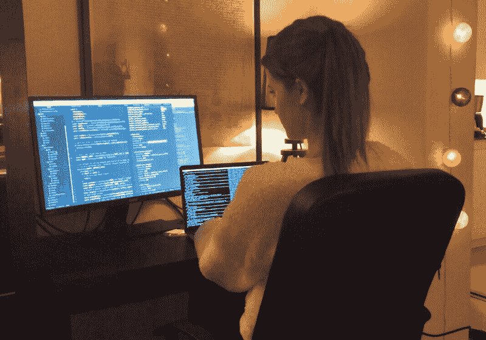
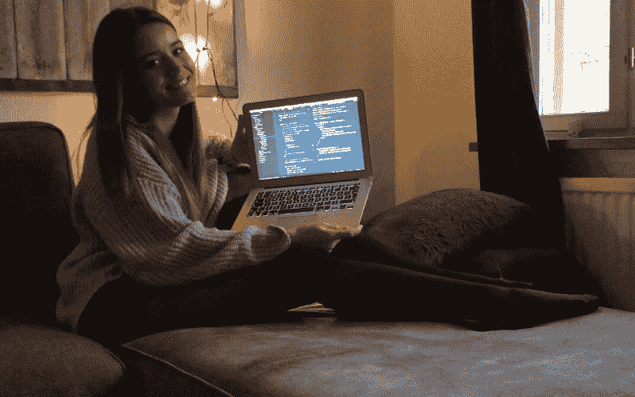
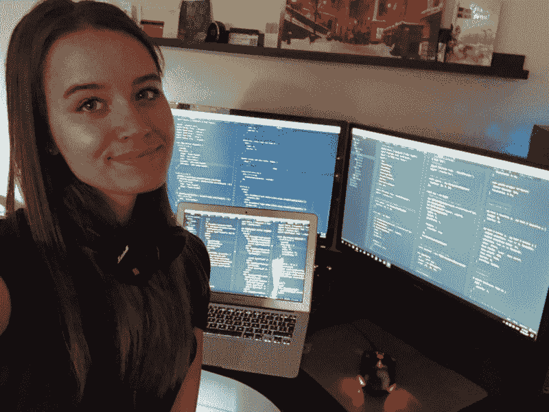

# 如何成功地自学如何编码

> 原文：<https://www.freecodecamp.org/news/successfully-teaching-yourself-how-to-code-f6aac23db44a/>

莉迪亚·哈利

# 如何成功地自学如何编码

在我发表了关于我如何成为一名 19 岁的软件开发人员的文章 [**之后，数百人找到我，并向我传达了基本相同的信息:**“我喜欢读你的文章，我真的很想学习如何编程，但我就是迈不过这第一步。这太令人沮丧和不知所措了，我想念组织和动力。”**我想让尽可能多的人参与到技术世界中来，我认为关注那些非常积极但不知道如何做的人非常重要。**](https://medium.com/@lydiahallie/advice-from-a-19-y-o-girl-software-developer-88737bcc6be5)

我知道现在有成千上万的资源可以“教你如何编码”。然而，这肯定不是最重要的部分，也不是本文真正要讨论的内容。如何围绕它构建你的生活，处理所有的新信息，让自己保持动力，关注正确的部分是至关重要的。

是的，莉迪亚，这听起来不错，但我觉得这只是又一篇能激励我 10 分钟的文章，直到我再次疯狂观看网飞！在我开始之前，我真的想让你认识到，如果你愿意自学如何编码，或者学习如何编码，你是很棒的。你已经证明了你可以提前考虑几个步骤，可以把自己远远推出舒适区，即使你还没有这样做！**如果你能对学习你还不知道的东西和感觉势不可挡的东西感到兴奋，你肯定会成为一名优秀的开发人员。**

我当了很多年的家教，我经常看到一种模式，当学生告诉我他们不再有动力了。他们专注于一个更大的目标，忽略了他们正在做的微小但非常重要的改进，这让他们觉得自己没有任何进展。虽然我知道这是学习新技能时需要牢记的一件非常重要的事情，但我发现自己在开始编程时也有同样的想法。我觉得我实际上没有取得任何进步，因为我认为我周围的每个人都比我高很多层次，我永远也不可能做得这么好。

当我考虑所有这些的时候，我完全忽略了我已经完成的许多重要步骤。在我知道之前，我甚至不用考虑两次就可以编写代码，并且每次都可以创建更复杂的应用程序。仅仅因为我一直把自己和有多年经验的人比较，我甚至没有把这看作是进步。我所能想到的就是“我离我的目标还很远。”

学习编程时的困难是真实的，每个人都在努力克服它。有些人的驼峰比其他人大，但我真的想帮你克服这一点。它绝对不需要在那里，因为它都在你的脑海里，但是说起来容易做起来难。每个人的奋斗是不同的，但我将专注于人们在学习如何编程时面临的最常见的问题:**如何尽可能有效地处理新信息，以及如何保持动力。**我不打算关注如何找到最好的资源，因为这是*非常*主观的。

Even when I finished a relatively small project, I felt so happy! I had learned so much along the way, and was able to create something with technologies I’d never worked with before.

#### 有效处理新信息

每个人都是不同的，而且不是每个人吸收信息的方式都一样。是的*，队长显而易见*，但这并不像看起来那么显而易见。**在你开始学习如何编码之前，你需要学习如何学习。**

你很快就会发现，或者可能已经发现，有两种资源随处可得:在线课程和语言文档。然而，只要你不是某种超人的天才，你就不会仅仅通过观看课程(尤其是因为很难保持专注，我们不要欺骗自己，他们可能会非常无聊)或阅读纯文本来记住所有的新信息。**在观看课程或阅读文件时感到失落和困惑是完全正常的，每个人都在开始时挣扎。**程序员可能很难向没有那么多相关知识的人解释代码，不用其他含糊的极客术语(看你，栈溢出！).

不管你认为自己有多优秀:**不要跳过基本面。永远从一开始就开始学习一门语言，不要跳过任何东西。基本面极其重要，不重视以后会后悔的！是的，你总是可以谷歌它，但那只会让你成为一个更慢的开发者。如果您正在阅读文档，请从第一页开始(或者在许多情况下从 1.1 页开始)，一路向上阅读。对一些人来说，这似乎是浪费时间，但是相信我:不是的。注意小细节，以后你会感谢自己的！
如果你很难理解基本面，放松！你会没事的。 ***你现在有多努力绝对不代表你以后会成为多好的程序员。*****

每 10 分钟后，或者每读完一段后，**用你自己的话解释你刚刚学到的东西**。这可能很难，但是你很快就会发现哪些部分你还不太明白。教学是最好的学习方式，即使周围没有人！假装你在给别人解释，一旦你发现你对某个部分不太明白:**马上研究一下，并把答案写下来！通过写下来，你会更多地思考答案，这样更容易记住。**

不要只是听课程，也不要只是阅读文档:**通过自己的个人项目积极参与。实施你所学的每一件新事物，不管它有多小！这并不像听起来那么简单，事实上这可能会非常令人沮丧，这时你就知道你做得对了。**你可以通过经常做来提高你的编码技能，而不是简单地了解它！**相信我，即使你没有意识到，但每次你这样做，你都会变得更好！**

Luckily I had Mila to explain everything to!

#### **保持动力**

很多人问我，在平常的一天里，我是如何让自己做这么多代码的。我花了一段时间才找到一个好的方法来解释我背后的想法，但我想我终于找到了！

每个人都喜欢玩游戏，不管是什么类型的游戏。人们喜欢游戏，因为你能获得即时的满足感，你觉得自己完成了某件事，你能看到自己在这方面变得更好。这是激励的完美公式！我已经能够获得同样的体验，不过是一边编码一边代替游戏。而且比你想象的容易多了。

设定小目标。不是因为你不在乎改善:而是因为你 ***做*** 在乎改善。做一个待办事项清单，列出你想在那天完成的事情:也许只是读一页，或者看一门课程，或者只是写 10 行代码。通过说你已经完成了所有的待办事项，你会感到非常满足，对自己的进步也更加自信。说“*我今天做了我想做的一切*”，比说“*我今天只完成了课程的 2%*”要好得多。另外，即使你只阅读了一页或创建了一个输入框，了解这一点仍然非常重要。*即时满足！*

不断提醒自己已经走了多远。这可能看起来很难，因为它经常被忽视。你没有积极地看到自己的进步，但是相信我:每天你编码(哪怕一点点)，你都在变得更好。做到这一点的最好方法是写一个小日记。用一句话解释一下那天你在纠结什么，一个月后再回头看看。有非常非常大的机会，你现在根本不挣扎！*你可以看到自己在这方面变得越来越好。*

做一个你真正感兴趣的个人项目！不是那数百万待办事项中的一个，而是你真正想要做的事情。现在，不要想自动驾驶汽车或机器人可以帮你洗碗，而是选择一些更小的东西，比如重新创建一个网站布局或一个小游戏，你会发现你更有动力去完成它。一旦这个项目完成了，你实际上有东西可以展示:*你完成了一些事情！*

意识到你做得比你想象的要好得多。这也被称为冒名顶替综合症。你可能会觉得你周围的每个人都比你知道得多，比你擅长得多:但事实并非如此。我怎么强调都不为过:如果你继续努力，你会成为一名优秀的开发人员。你已经证明了只要有足够的动机去学习，你就有能力编码，你完全可以做到这一点。

#### 要时刻牢记的事情

*   **永远不要拿自己和其他开发者比较**。非常老套的建议，但却至关重要。不要拿你的第一章和别人的第二十章比较。你会比你想象的要快得多，快得多！我把这张照片贴在上面，因为我知道如果我在 4 个月前看到它，我会被它吓倒。现在，我只是对它一笑置之，甚至可以指出我在那里犯的一些错误！
*   你取得的进步比你想象的要大得多。每一次你学习或编码，你都在成长。接受就好(我知道这很难)。
*   每个人一开始都会挣扎，你并不孤单，这并不意味着你会是一个糟糕的程序员。你现在的感觉完全正常，这只是学习过程的一部分。很快，你会回过头来看你正在经历的挫折，并同意我的观点！

如果可以的话，试着找一个导师。我拥有了我梦寐以求的最好的一个，如果你向我伸出援手，我绝对愿意成为你的*。如果你能向某人快速提问并获得一些灵感，这是很好的，这肯定有助于度过那个难关。*

欢迎向我提问，或者在我的 [Instagram](http://www.instagram.com/theavocoder) 上给我发消息，或者在 [LinkedIn](https://www.linkedin.com/in/lydia-hallie/) 上加我！