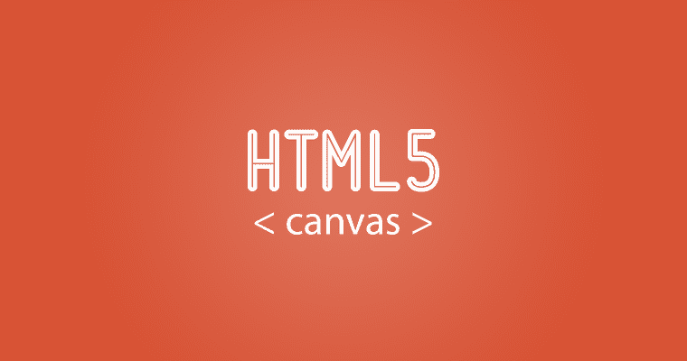
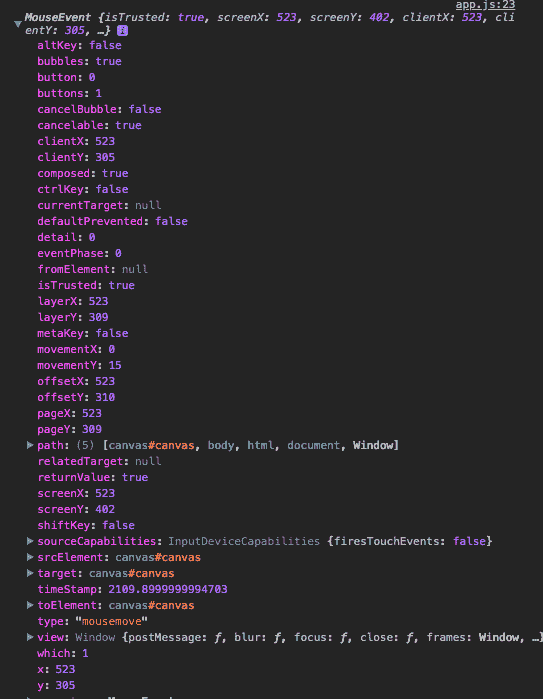

# 用 canvas 元素和 JavaScript 度过你的星期天(或任何一天)。

> 原文：<https://www.freecodecamp.org/news/sunday-with-canvas-element-and-javascript-38ae80e0fbeb/>

阿什什·南丹·辛格

# 用 canvas 元素和 JavaScript 度过你的星期天(或任何一天)。

最近在 JavaScript30 天挑战中，我有机会尝试一下 HTML 内置的 canvas 属性。说服我写下整个经历的是相对的舒适程度和学习曲线。

在其最简单的形式中，HTML canvas 元素使 web 开发人员能够通过 javaScript 在网页上绘制图形，这一点使得 HTML 元素更加有趣。

**< canva** s >元素只是一个容器——你总是使用 JavaScript 来实际绘制图形。有人可能会说，我们总是可以添加点，或者为此添加一个 SVG，但是这又有什么意思呢？:D

回到 **< canva** s >元素:画布是 HTML 页面上的一个矩形区域。默认情况下，画布没有边框和内容。

标记如下所示:

> <canvas id="”canvas”" width="”200&quot;" height="”100&quot;"></canvas>

#### 开始

好了，介绍到此为止。让我们专注于使用一些普通的旧 JavaScript 构建一些有趣的东西，(不太旧——ES6！).首先，我们将看一看启动文件。

我们来分解一下。我们有一个名为 **style.css.** 的样式表，然后我们开始定义一个宽度和高度分别为 800 和 800 的**画布**元素。最后，我们有一个名为 **app.js** 的**脚本**标签，所有的神奇都发生在这里。关于这一点，让我们开始用我们自己的 app.js 做一些事情。

*   为了简单起见，我们从选择第一行中的 canvas 元素开始，并将值存储在名为 **canvas** 的常量变量中。
*   然后，我们在 2D 方面捕获同一个画布的上下文，并将其设置为**变量。**
*   将画布的宽度和高度分别设置为窗口的内部宽度和高度。

现在我们终于有了画布，我们继续定义画布的最基本属性。

*   ctx.strokeStyle 设置或返回用于笔画的颜色、渐变或图案。是的，你没看错:默认颜色看起来#BADASS。
*   **ctx.lineWidth s** 设置或返回当前线宽。我们把它设为 1，稍后我们会讲到。
*   设置或返回两条线相交时创建的角的类型。我们将它设置为圆形，这样当两条线相交时，我们就有了一个整齐的连接点。
*   ctx.lineCap 设置或返回线条的结束端的样式。我们将它设置为圆形，这样当我们没有遇到任何其他线时，我们仍然会根据前面定义的笔画宽度得到相同的整洁的管道图形。

现在我们已经有了所有这些部分，让我们来看看我们如何在画布上真正地画画。

首先，我们需要为画布上的鼠标移动添加一些事件侦听器，然后触发一个函数，该函数将在画布上实际绘制一些东西。让我们看看 app.js 文件中可能增加的内容。

让我们来分解一下:

*   我们首先定义一个名为**is drawing**的变量，它将帮助我们判断用户是否真的试图在画布上绘图。我们稍后将回到这一点。
*   现在，让我们有一个名为 **draw** 的函数，它将被触发，稍后将负责整个动作。
*   最后，我们为各种事件添加了一组事件监听器，以确保我们捕捉到正确的事件，并且只在需要时执行 **draw** 函数。

通过声明 **isDrawing** 变量并将其属性设置为 **false，**一旦画布元素被加载为未绘制，我们就设置画布的**初始状态**。然后，在每个后续的事件监听器中，我们使用一个**内联函数**，并且每次都根据触发的事件类型更改 **isDrawing** 函数的值。

在 draw 函数开始时，如果 **isDrawing** 的值被设置为 false，则该函数在遇到 return 语句后被调用。如果 **isDrawing** 设置为真，则执行绘制功能。

#### 绘图功能

让我们扩展一下绘图函数:

*   我们从全局定义两个变量开始， **lastX，lastY，**并将初始值设为 0。
*   如果你现在去你浏览器的控制台，你会看到你有一个巨大的记录你所有的鼠标移动的日志。这个 **MouseEvent** 对象有一些非常重要和有用的属性:

MouseEvent object

我们只对这个对象的 offsetX 和 offsetY 属性感兴趣。

*   利用这个 **ctx.beginPath，**我们开始一条路径，或者重置当前路径。这两者都是我们希望为每个触发的事件所做的。
*   **ctx.moveTo** 将路径移动到画布中的指定点，而不创建线条。在我们的例子中，这将是 lastX 和 lastY 在全局范围的函数之外定义的。
*   **ctx.lineTo** 添加一个新点，并从画布中最后一个指定点创建一条线到该点。
*   **ctx.stroke()** 居然画出了你定义的路径——真正的苦工，伙计们！

在 **ctx.lineTo、**中，我们利用事件属性 **offsetX** 和 **offsetY** 来获取画布中 X 和 Y 的最新点，只是为了用 **ctx.lineTo.** 绘制一条线

我们几乎万事俱备。网页上的每一个鼠标事件都会在画布上画一条线——但是有些麻烦，也没有太多的东西。所以让我们添加一些赃物。

#### 赃物！

现在，所有的线都是从画布中的 0 和 0 点开始绘制的。当我们加载画布时，甚至当我们执行 draw 函数时，我们将它设置为开始绘制的初始点集。

让我们解决这个问题，以获得更好的实时体验。仔细想想，答案很简单:每次执行 draw 函数时，我们都希望初始点始终是 **MouseEvent 对象**的 **offsetX** 和 **offsetY** 属性。

通过使用 ES6 数组析构，我们可以将 lastX 和 lastY 的值重置为 MouseEvent 对象的 offsetX 和 offsetY 属性。我们可以在 draw 函数的最后这样做。在添加了一些 swag 之后，让我们来看看 app.js 文件。

*   一旦 **mousemove** 事件发生，我们就触发 draw 函数。然后，我们继续使用 ES6 析构在 draw 函数中设置 lastX 和 lastY 的值。
*   在发生 **mousedown** 事件的情况下，首先我们将内联函数更改为 block，如您所见，然后我们再次将 lastX 和 lastY 值设置为事件的 offset 属性。这是为了确保当我们从画布上的一个点移动到另一个点时，画布上的线条是可见的。

让我们把它变得丰富多彩，并在笔触中添加一些动态。

天啊。！

这很难处理，但是让我们把它分解一下。

*   我定义了一个名为 **hue** 的新变量，并将其属性设置为 0。
*   如果你还不知道 hue，不知道它为什么这么棒，那就去谷歌上试试吧，或者点击这里。

在其最简单的形式中，hsl 允许我们使用 0 到 360 度范围内的相同的彩虹颜色。每个数字都有一个亮度和 alpha 值。定义 hsl 大概是这样的:hsl(173，99%，50%)。这里数字 173 代表一种颜色，99%是亮度，50%是 alpha 值。

同样，通过使用一些令人敬畏的 ES6 反斜线，我们可以利用 hsl 并通过这样做来影响它:

`ctx.strokeStyle = `hsl(${hue}, 100%, 50%)``

正如我们在上述要点的第 7 行所做的那样。

接下来，我们增加**色调**变量的值，它随着每个**鼠标移动**事件改变笔画的颜色。一旦色调值增加到 360，我们在上述要点的第 14 行将色调值重置为 0。但即使我们不这样做，我们仍然会有同样的结果。即便如此，我们还是做正确的事吧。:D lol

`if(hue>360){`
`hue =` 0
}

接下来，让我们为每次绘制的笔画宽度添加一些动态，如下所示:

`if(ctx.lineWidth>=75 || ctx.lineWidth<=1){`
`direction = !direct`离子；
}

`if(direction){`
`ctx.lineWidth++`
`} else {`
`ctx.lineWidth = 0`

我们在这里所做的就是首先检查当前的**线宽**是大于 75 还是小于 1。如果是，那么我们反转变量**方向**的值，该值默认设置为真。

接下来我们检查变量**方向**的值是否为真。如果是，则将线宽值增加 1，否则将**线宽**重置为 0。

这不太像 JavaScript。如果你一直正确地跟随，你现在应该已经准备好你漂亮的画布了。

让我们快速看一下最终的文件结构。因为我们只改变了 app.js 文件，所以我只向您展示它，因为 index.html 从一开始就几乎没有改变。

考虑到 canvas 元素与 JavaScript 的结合，这只是冰山一角。我鼓励你多做一点研究，让画布看起来更好。也许添加几个按钮来清空屏幕，或者选择一种特定的颜色在画布上绘制。这么多选择！

我想说的是有无数种方法可以让它变得更好。如果我有值得更新的东西，我一定会更新这个故事。

最后，我想给你们看一个视频，看看画布最后会是什么样子。

希望你喜欢阅读这一切！任何意见或建议，以改善或进一步讨论这一点，真的很感谢。你也可以在推特和 T2【linkedIn】上和我联系。