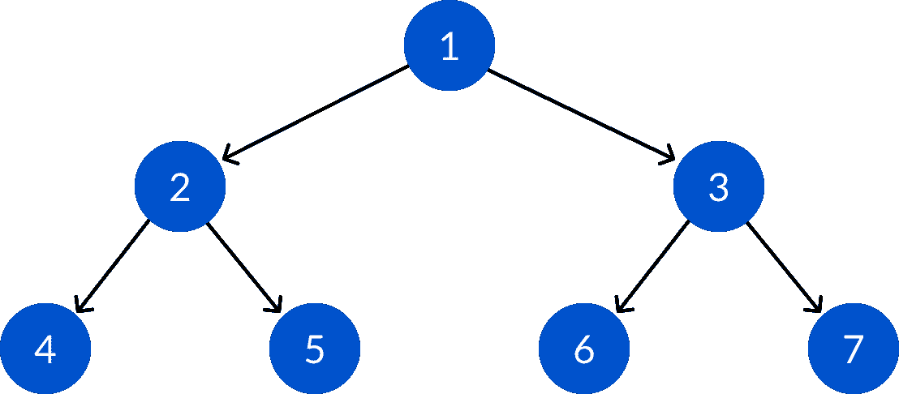
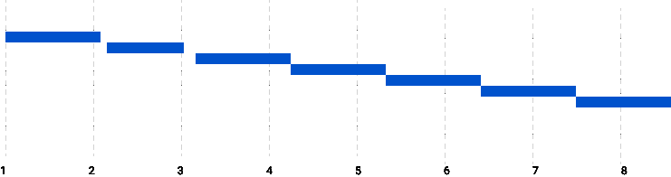
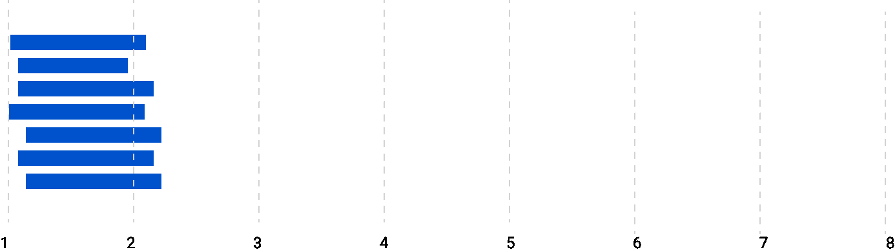

# 如何用 Goroutines 增强深度优先搜索

> 原文：<https://www.freecodecamp.org/news/supercharge-your-dfs-with-goroutines/>

## 什么是深度优先搜索？

深度优先搜索是一种流行的图遍历算法。深度优先搜索在现实应用中的一个应用是在站点地图中。

站点地图是网站页面的列表。它们以分层的方式组织起来，从根节点开始描述网站的整体结构。

### 该算法

站点映射包括加载根链接，解析页面上的内部链接，然后递归地对这些链接应用相同的过程。这给了我们一个图形数据结构，但是为了简单起见，我们可以假设它是一棵树。

### 问题是

如果我们以这种方式实现算法，加载和解析 HTML 页面需要时间，并且会阻塞整个遍历过程。

假设一个 HTTP 响应平均需要*300 毫秒*，并且站点上有 100 个页面需要映射。300*100 = 30000ms = > 30 秒。因此，该进程将保持空闲 300 秒。

## 我们如何改善这一点？

在页面加载期间，如果实现了多线程架构，您可以发送多个 HTTP 请求并解析收到的 HTML 页面。

这种并发方法比前面提到的方法快 7 倍。

实现线程可能会给许多开发人员敲响警钟。然而，Golang 为您提供了一组漂亮的概念，如 goroutines、通道和同步实用程序，使工作变得更加容易。

我之前谈过站点映射，但是，如果你学习如何为二叉树编写深度优先搜索算法，它会更好更简单。您可以将本文中学到的知识应用到许多不同的事情中。

我们开始吧！

你可以在 [GitHub](https://github.com/zerefwayne/article-snippets/tree/master/supercharge-dfs-with-goroutines) 上找到本文使用的代码。

## 设置树



### 节点定义

节点结构是二叉树的基本构造块。它有一个数据，一个左子指针和右子指针。为了模拟处理节点的延迟，您必须分配一个以微秒为单位的随机睡眠时间。

```
type Node struct {
	Data interface{}
	Sleep time.Duration
	Left *Node
	Right *Node
}
```

### 节点生成器功能

返回一个指向新节点的指针。睡眠被分配 0-100 微秒的持续时间。

```
func NewNode(data interface{}) *Node {

	node := new(Node)

	node.Data = data
	node.Left = nil
	node.Right = nil

	rand.Seed(time.Now().UTC().UnixNano())
	duration := int64(rand.Intn(100))
	node.Sleep = time.Duration(duration) * time.Microsecond

	return node
}
```

现在您已经建立了树，可以实现深度优先搜索和一个函数来处理节点。

## 单线程深度优先搜索

### ProcessNode()

`ProcessNode()`是一个函数，当遍历过程中必须处理节点时，将调用该函数。

通常你会打印或存储节点的值。然而，为了展示 goroutines 的优势，您必须实现一个计算密集型任务，大约需要 1 秒钟。

在每次迭代中，节点休眠`n.Sleep`微秒，并在任务完成后打印出`Node <data> ✅`。

```
func (n *Node) ProcessNode() {

	var hello []int

	for i := 0; i < 10000; i++ {
		time.Sleep(n.Sleep)
		hello = append(hello, i)
	}

	fmt.Printf("Node %v ✅\n", n.Data)
}
```

### 深度优先搜索递归函数

这是一个通过递归实现的单线程深度优先搜索函数——对于以前编写过它的人来说，它可能看起来很熟悉。

```
func (n *Node) DFS() {

	if n == nil {
		return
	}

	n.Left.DFS()
	n.ProcessNode()
	n.Right.DFS()
}
```

### 实现 main()函数

在 main 函数中，创建一个包含 7 个节点的完整二叉树。

要查看已经过了多长时间，启动`start`，然后从根开始 DFS。一旦完成，`main()`就会打印出经过的时间。

```
var wg sync.WaitGroup

func main() {

	root := NewNode(1)
	root.Left = NewNode(2)
	root.Right = NewNode(3)
	root.Left.Left = NewNode(4)
	root.Left.Right = NewNode(5)
	root.Right.Left = NewNode(6)
	root.Right.Right = NewNode(7)

	start := time.Now()
	root.DFS()
	fmt.Printf("\nTime elapsed: %v\n\n", time.Since(start))

}
```

### 输出

深度优先搜索花费了`8.75s`来完成。

大多数时候，当每个节点被处理时，处理器是空闲的。它还会阻止其他节点在完成休眠时间后进行处理。

在现实世界中，这种情况发生在 I/O 或外部 HTTP 调用期间。

```
Node 4 ✅
Node 2 ✅
Node 5 ✅
Node 1 ✅
Node 6 ✅
Node 3 ✅
Node 7 ✅

Time elapsed: 8.75086767s
```

## 用 Goroutines 增强你的深度优先搜索

[https://tenor.com/embed/15699421](https://tenor.com/embed/15699421)

与其他编程语言相比，转换进程和深度优先搜索函数只涉及很小的变化:

1.  用`go`命令调用递归函数。
2.  维护一个`waitGroup`来跟踪进程中的函数，这样程序不会在所有函数都完成之前退出。

### DFSParallel()

`wg.Add(1)`:在进入递归之前，将将要启动的 goroutine 添加到`waitGroup`中。

你也可以运行`wg.Add(3)`，然后启动三个 goroutines，它就会完成工作。然而，这更美观，并且清楚地表明将要发生的事情。

`defer wg.Done()`:当函数返回时，将`waitGroup`计数器减 1。这表示例程已经完成。

`go`:在新的 goroutine 中启动功能。

```
func (n *Node) DFSParallel() {

	defer wg.Done()

	if n == nil {
		return
	}

	wg.Add(1)
	go n.Left.DFSParallel()

	wg.Add(1)
	go n.ProcessNodeParallel()

	wg.Add(1)
	go n.Right.DFSParallel()
}
```

### ProcessNodeParallel()

这里没什么要做的，只是在函数启动后添加一个`defer wg.Done()`。它会通知`waitGroup`这个 goroutine 已经完成。

```
func (n *Node) ProcessNodeParallel() {

	defer wg.Done()

	var hello []int

	for i := 0; i < 10000; i++ {
		time.Sleep(n.Sleep)
		hello = append(hello, i)
	}

	fmt.Printf("Node %v ✅\n", n.Data)
}
```

### 在 main()中调用 DFSParallel()

`GOMAXPROCS`告诉 Go 编译器在计算机上所有可用的逻辑内核上运行线程。

这也将帮助您处理多个节点。这里实现的并发设计模式展示了在计算机上拥有多个内核的好处。程序不仅可以在一个节点睡眠时处理其他节点，还可以同时处理多个节点。

您可以像以前一样将`DFSParallel()`作为 goroutine 启动，并将其添加到等待组。

等待所有 goroutines 完成。它等待 goroutines 计数为 0，然后将控件向前移动。

```
...
	// Go will use maximum number of processors available to process goroutines
	processors := runtime.GOMAXPROCS(runtime.NumCPU())

    fmt.Printf("\nTime elapsed: %v\n\n", time.Since(start))

	// Starts the timer
	start = time.Now()

	// Adds one goroutine the WaitGroup
	wg.Add(1)
	// Start the DFS Goroutine
	go root.DFSParallel()
	// Waits for all goroutines to complete
	wg.Wait()

	fmt.Printf("\nProcessors: %v Time elapsed: %v\n", processors, time.Since(start))

}
```

Add this to the main()

### 输出

```
Node 7 ✅
Node 4 ✅
Node 2 ✅
Node 6 ✅
Node 5 ✅
Node 1 ✅
Node 3 ✅

Processors: 8 Time elapsed: 1.295332809s
```

正如预期的那样，深度优先搜索算法仅用了 **1.3 秒**就完成了，而不是之前实现中的 **8.7 秒**。

## 说明

#### 正常实施

正如您所预期的那样，这些函数以预先排序的方式连续运行。每个功能需要大约 1.1 秒来完成，导致运行时间很长。

但是，每个节点也会休眠大约 1 秒钟，在此期间，处理器保持空闲，因为所有内容都在一个线程中运行。



Normal Implementation Time Graph (x-axis in Seconds)

#### 并行实现

这些功能是独立运行的，几乎每个功能都在大约 0 秒时启动。他们运行了 1 秒钟，每个线程都完成了。

但是，您可以看到，该顺序与之前的实现不同。这是因为它们是独立运行的，并且在不同的时间完成。由于它们几乎同时开始，遍历大约在单个函数的运行时间内完成。



Concurrent Implementation (x-axis in seconds)

## 结论

我发现这个结果相当惊人，因为我只需要几个概念和 5-6 行代码就能让这个程序变得更快。

如果你能识别出可以同时独立运行的函数，这种技术可以证明是对你的围棋程序的一个重大推动。如果您的函数需要同步，您可以使用通道来完成该任务。

你可以在 [GitHub](https://github.com/zerefwayne/article-snippets/tree/master/supercharge-dfs-with-goroutines) 上找到本文使用的代码。

## 补充材料

1.  [https://medium . com/rungo/anatomy-of-goro routines-in-go-concurrency-in-go-a4cb 9272 ff 88](https://medium.com/rungo/anatomy-of-goroutines-in-go-concurrency-in-go-a4cb9272ff88)
2.  [https://blog.golang.org/defer-panic-and-recover](https://blog.golang.org/defer-panic-and-recover)
3.  [https://medium . com/@ Hou zier . saurav/DFS-and-bfs-golang-d 5818 EC 690d 3](https://medium.com/@houzier.saurav/dfs-and-bfs-golang-d5818ec690d3)
4.  [https://medium . com/rungo/anatomy-of-channels-in-go-concurrency-in-go-1ec 336086 ADB](https://medium.com/rungo/anatomy-of-channels-in-go-concurrency-in-go-1ec336086adb)