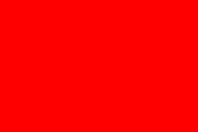
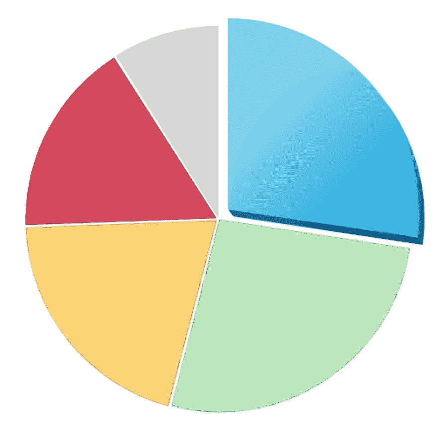

# 什么是 SVG 文件？SVG 图像和标签解释

> 原文：<https://www.freecodecamp.org/news/svg-basics-what-are-scalable-vector-graphics-and-how-do-you-use-them/>

## **【SVG】t1㎡型**

SVG 或可缩放矢量图形是一种 web 标准，用于定义网页中基于矢量的图形。基于 XML，SVG 标准提供标记来描述视口内的路径、形状和文本。标记可以直接嵌入到 HTML 中进行显示，或者保存到一个`.svg`文件中，然后像其他图像一样插入。

您可以手动编写 SVG，但更复杂的图形可以在 Illustrator 或 InkScape 等矢量图形编辑器中设计，并导出为 SVG 文件或代码。

## **SVG 基础知识**

开发人员用`<svg>`标记和 XML 名称空间开始一个 SVG 图形，如下所示:

```
<svg  version="1.1">

</svg>
```

该示例还包括一个`version`属性。`version`属性是可选的，但是为了符合 XML 规范，建议使用它。

该示例不会显示任何内容，它只是建立了一个视口。您可以添加`height`和`width`属性来设置视口的显示大小，这实际上为您建立了一个画布。

视口就位后，您可以添加基本的图形、文本和路径元素。

```
<svg
     version="1.1"
     width="100%"
     viewbox="0 0 600 300"
     >
  <rect x="10" y="10" width="100" height="100" fill="#f7b2c1" />
  <circle cx="240" cy="60" r="50" fill="#c1b2f7" stroke="#b2c1f7" stroke-width="15"/>
  <text x="450" y="70" font-size="20" text-anchor="middle">SVG Text is browser readable!</text>
  <g stroke="#b2c1f7"> <!-- g is for group -->
    <path stroke-width="2" d="M10 170 l590 0" />
    <path stroke-width="4" d="M10 190 l590 0" />
    <path stroke-width="6" d="M10 210 l590 0" />
  </g>  
</svg> 
```

可以看到输出，用[这个 codepen](https://codepen.io/SgiobairOg/pen/OxbNpW) 里的代码玩。

在开始的`svg`标签中我们添加了一个宽度属性来设置视窗的宽度为容器宽度的 100%,你可以使用百分比或者像素宽度。开始的 svg 标签也有`viewbox`属性，它定义了一个窗口，通过这个窗口可以看到 svg 的元素，在这个例子中，视图框的范围是从(0，0)到(600，300)。在 SVG 空间中，X 轴从左边的零开始，向右增加；Y 轴从顶部的零开始，向底部增加。

第一个新标签是`<rect />`标签，它在 SVG 视口中定义了一个矩形。在这种情况下，我们定义一个正方形，它从顶部和左侧起 10 个单位，100 个单位高和宽。`fill`属性设置形状的填充颜色。

接下来，我们用`<circle />`标签定义一个圆或椭圆。该示例定义了一个以(240，60)为圆心、半径为 50 个单位的圆。`stroke`和`stroke-width`属性设置笔画颜色和大小。

您可以使用`text`标签向图形添加文本。示例文本从文本的中间锚定到(450，70)处的一点，字体大小为 20 个单位。SVG 文本的好处是它可以和图形的其他部分一起缩放，但是浏览器和网络机器人仍然可以读取它。

当您想要将相同的属性或 CSS 样式应用于多个 SVG 元素时，您可以使用`<g>`标签将它们分组。分配给`<g>`标签的属性，如示例中的`stroke`属性，将应用于组中的所有元素。在这种情况下是三个`<path />`元件。

`<path />`元素定义了视口中的矢量路径。路径由`d`属性定义。在第一个例子中，定义为“移动到绝对坐标(10，170) *和*画一条线到 X 方向的相对坐标 590 和 Y 方向的相对坐标 0。

以下命令可用于创建路径:

M =移动到 L =直线到 H =水平线到 V =垂直线到 Z =闭合路径 C =(三次贝塞尔)曲线到 S =平滑曲线到 Q =二次贝塞尔曲线到 T =平滑二次贝塞尔曲线到 A =圆弧

### **画布元素**

画布图形可以绘制到

上的 getContext 方法创建上下文

```
<p> Before canvas</p >
<canvas width ="120" height ="60"> </canvas>
<p >After canvas</p>
<script>
    var canvas = document.querySelector("canvas");
    var context = canvas.getContext("2d");
    context.fillStyle = "red";
    context.fillRect (10, 10, 100, 50);
</script>
```



创建上下文对象后，该示例绘制了一个 100 像素宽、50 像素高的红色矩形，其左上角的坐标为(10，10)。

### **绘制饼状图**

results 变量包含一个表示调查响应的对象数组。

```
var results = [
{ name : "Satisfied", count: 1043, color: "lightblue"} ,
{ name : Neutral", count: 563 , color: "lightgreen"} ,
{ name : Unsatisfied", count: 510 , color: "pink"} ,
{ name : "No comment", count: 175 , color: "silver"}
];
```

为了绘制饼图，我们绘制了许多饼图扇区，每个扇区由一条弧线和一对指向该弧线中心的线组成。我们可以通过将一个完整的圆(2 π)除以回答总数，然后将该数字(每个回答的角度)乘以做出给定选择的人数，来计算每个弧所占的角度。

```
<canvas width ="200" height ="200"></canvas>
<script>
    var cx = document.querySelector("canvas").getContext("2d");
    var total = results.reduce(function (sum, choice) {
    return sum + choice.count;
    }, 0);

    // Start at the top

    var currentAngle = -0.5 * Math.PI;
    results.forEach (function (result) {
    var sliceAngle = (result.count / total) * 2 * Math.PI;
    cx.beginPath() ;
    // center = 100, 100, radius = 100
    // from current angle, clockwise by slice's angle
    cx.arc(100, 100, 100, currentAngle, currentAngle + sliceAngle);
    currentAngle += sliceAngle;
    cx.lineTo(100, 100);
    cx.fillStyle = result.color ;
    cx.fill() ;
    });
</script>
```

这绘制了如下图表:



### **浏览器支持**

所有现代浏览器都支持 SVG 。IE 9 到 IE 11 的缩放存在一些问题，但是这些问题可以通过使用`width`、`height`、`viewbox`和 CSS 来解决。

## **编辑**

*   用于创建和编辑 SVG 图形的网络和桌面工具，免费

## **创建 SVG 的工具**

很少有工具能够以绘图程序的形式创建 SVG。

*   这是一个开源的工具，提供了一个易于使用的图形界面。
*   Adobe Illustrator 是一款矢量图像的商业工具。

更多工具，请参考[支持 SVG 的 W3C 工具列表](https://https//www.w3.org/Graphics/SVG/WG/wiki/Implementations)

## **为什么应该使用 SVG**

作为一种矢量图像格式，它允许您在不损失任何质量和特别轻的重量的情况下调整图像的大小。作为一种 XML 格式，它允许您从 JavaScript 尤其是 CSS 的全部功能中获益。

## 关于 SVG 的更多信息:

*   [为什么应该使用 SVG 图像](https://www.freecodecamp.org/news/a-fresh-perspective-at-why-when-and-how-to-use-svg/)
*   [在 VS 代码中使用 SVG 需要知道什么](https://www.freecodecamp.org/news/things-you-need-to-know-about-working-with-svg-in-vs-code-63be593444dd/)
*   [如何让您的 SVG 按钮变得易于使用](https://www.freecodecamp.org/news/how-to-make-your-fancy-svg-button-accessible-83c9172c3c15/)