# 如何处理时区并使您的软件与国际客户同步

> 原文：<https://www.freecodecamp.org/news/synchronize-your-software-with-international-customers/>

当你开发一些软件时，你可能一开始不会考虑时区。除非你生活在一个必须处理多个时区的国家，比如美国或俄罗斯。

我最近遇到了一个关于时区的问题。有一些单元测试对日期做出断言，这些断言曾经在我法国的办公室有效，但在摩洛哥对我们团队的新成员无效。

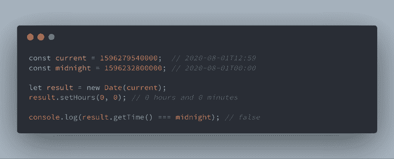

Here is the unit test working in France but not in Morocco

‌This 是我学习如何正确处理国际软件的日期和时间的机会。在本文中，我将介绍时区问题，并分享一些要遵循的规则。

## 时区快速介绍

由于地球有点像球体，日本的太阳正在升起，而美国的太阳正在落下。如果每个人都使用全球时间，比如说`09:00`在日本是日出，但对美国人来说是日落。不太方便。

为了确保每个人的时间都与太阳时间一致，有必要根据您所在的位置调整全球时间。结果，地球被分成**个时区**，每个时区都有一个**时差**。这个偏移量是要添加到全球时间中的分钟数，以获得您的时区时间。它可以是积极的，也可以是消极的。

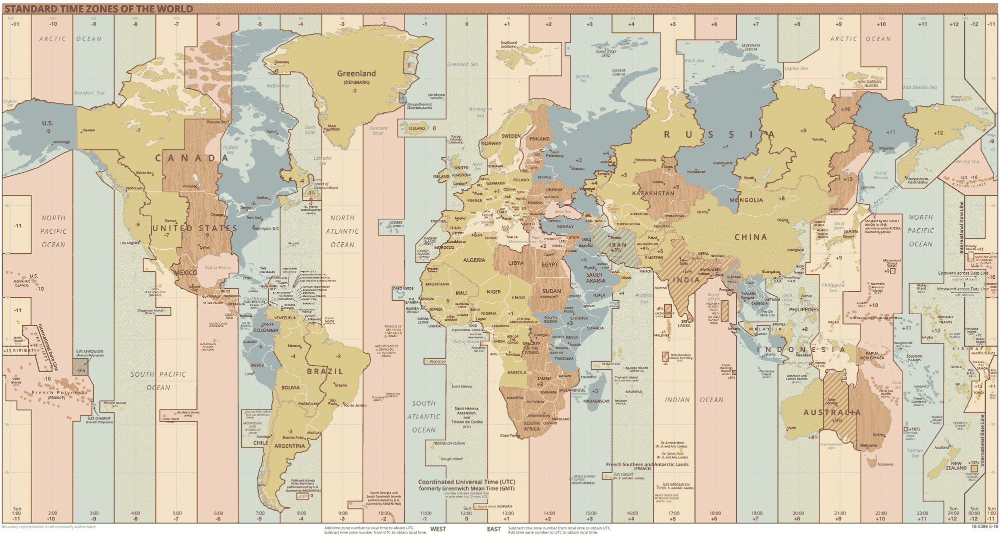

Standard world time zones — Illustration by [Hellerick](https://commons.wikimedia.org/wiki/User:Hellerick) from [Wikimedia Commons](https://en.wikipedia.org/wiki/File:Standard_World_Time_Zones.png)

全球时间称为 [**UTC**](https://en.wikipedia.org/wiki/Coordinated_Universal_Time) **，**代表协调世界时。你可能也听说过 [**GMT**](https://en.wikipedia.org/wiki/Greenwich_Mean_Time) 是一个没有任何时差的时区。

例如，当世界协调时为`10:50`时，三藩市的`03:50`有`-0700`时差，而北京的`18:50`有`+0800`时差。然而，这种转变不仅仅是在整个小时内:尼泊尔的时差是`+0545`。可以在[维基百科](https://en.wikipedia.org/wiki/List_of_tz_database_time_zones)上查一下。

除了时区带来的时差之外，一些国家每年还会调整两次时钟。 [**夏令时或夏令时**](https://en.wikipedia.org/wiki/Daylight_saving_time) 夏令时前的时区偏移增加一小时。然后，时钟被重置为冬季时区时间。目标是让白天变长。

计算时区最常见的方法是使用 IANA 时区数据库。您最终得到一个类似于`Europe/Paris`的字符串，它遵循区域/城市模式。此外，微软还维护着自己的用于其操作系统的微软时区数据库。但是这可能会在跨平台运行时引起问题。NET 核心应用程序。

IANA 仍然是首选。微软的数据库不经常更新，它包含较少的历史，相当奇怪的时区名称(例如:`Romantic Standard Time`)，并且容易出错。例如，尽量不要混淆`Arab`、`Arabic`和`Arabian Standard Time`。关于每个数据库及其差异的更多细节，[查看本文](https://codeofmatt.com/what-is-a-time-zone/)。

最后一件事:写日期有很多方法。幸运的是，[](https://en.wikipedia.org/wiki/ISO_8601)**ISO 8601 规范为日期格式设置了一个通用规则。**

```
`November 11, 2018 at 12:51:43 AM (in a time zone at UTC+00:00)
2018-11-05T12:51:43Z <- Z stands for UTC

November 11, 2018 at 12:51:43 AM (in a time zone at UTC +07:30)
2018-11-05T12:51:43+0730`
```

## **计算机如何处理日期**

**计算机只能使用数字进行运算。这意味着`2020-08-01 +1`不等于`2020-08-02`，无法处理。**

**为了更容易地处理日期，我们可以用数字来表示日期。这就是**时间戳**的意义所在。它是从预先定义的日期(或**纪元**)到指定日期所经过的毫秒数。**

**太好了，那我们选个纪元吧！实际上，公共纪元已经设置好了，它的值是**1970 年 1 月 1 日(午夜 UTC)** 。**

**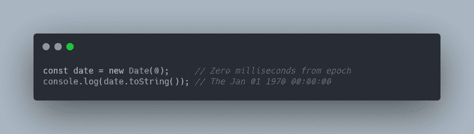**

**为了确保您理解了，请在浏览器中运行前面的代码片段。什么？你没有得到同样的结果？**

**好吧，我作弊了一点才得到这个结果…我应该得到`Thu Jan 01 1970 01:00 GMT+0100`因为我的电脑时区设置为欧洲/巴黎。**

**实际上，时间戳为零的时刻是格林威治时间的午夜，但考虑到时区的偏移，孟买的`05:45`甚至是旧金山的`1969-12-31T16:30`。**

> **规则#1:时间戳只用于保存，不用于显示。它被认为是 UTC，因为它不包括任何偏移或时区。**

**您之前没有得到“正确”的日期，因为 JavaScript 使用您的本地时区来显示最准确的日期/时间。**

**现在，尝试下面的代码片段。我相信你会得到和我一样的结果:**

**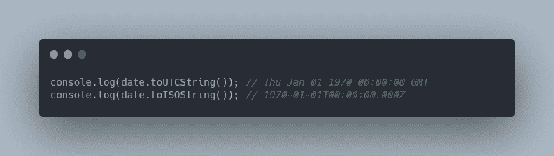**

**是的，全球每个人的零时间戳是 UTC 的`1970-01-01T00:00:00` **。尽管如此，如果你选择另一个时区，这是不正确的。****

**总而言之，`toString`使用您的本地时区显示日期，而`toUTCString`基于 UTC。也不要被与`toUTCString`相同但输出 ISO 8601 格式的`toISOString`(它的名字应该是`toUTCISOString`)所迷惑。**

**我推荐使用 [date 命令](http://man7.org/linux/man-pages/man1/date.1.html)将第二个时间戳(不是毫秒)转换成可读的字符串。将此命令与 UTC 选项一起使用可确保它不会考虑您的计算机/浏览器的时区。**

```
`# Linux
$ date -d @1586159897 -u 
Mon Apr  6 07:58:17 UTC 2020

# For Osx users
$ date -r 1586159897 -u` 
```

## **让我们修复我们的单元测试**

**我遇到的时区问题是在我的单元测试中。花点时间去阅读它，理解它所要表达的意思:**

**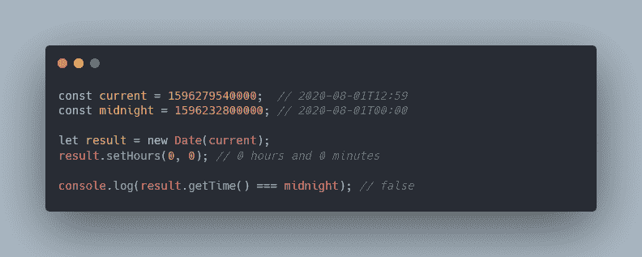**

**在这个测试中，目标是检查`setHours`是否将日期的小时和分钟设置为零(午夜)。我首先选择一个不在午夜的随机时间戳。然后将结果与当天午夜的时间戳进行比较。**

**实际上它正在工作——但前提是此时你的时区偏移是`+0200`(包括夏令时)。例如，它不适用于非洲/卡萨布兰卡(`+0100`包括夏令时)。让我们看看这些时间戳是如何打印的:**

**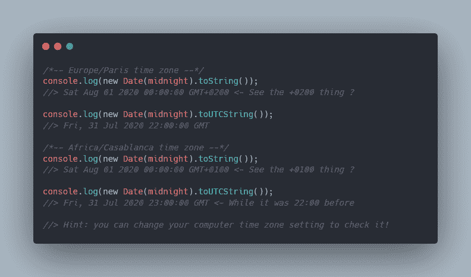**

**就是这样，两个结果的 UTC 日期不一样。这也意味着产生的时间戳也不相同。**

**如你所见，巴黎的偏移量是`+0200`卡萨布兰卡的偏移量是`+0100`。但都显示午夜有`toString`。这意味着`setHours`功能使用您的计算机时区来执行操作。`toString`使用您的时区显示日期。**

**这不是这个测试的唯一问题:如果你在旧金山运行这个测试会怎么样？没错，由于`-0700`偏移，这两个日期的日期都是`2020-07-31`。**

**使这项测试可靠并在全世界范围内有效的最安全的方法是使用您当地时区的日期。您将不再使用时间戳来设置初始日期。**

**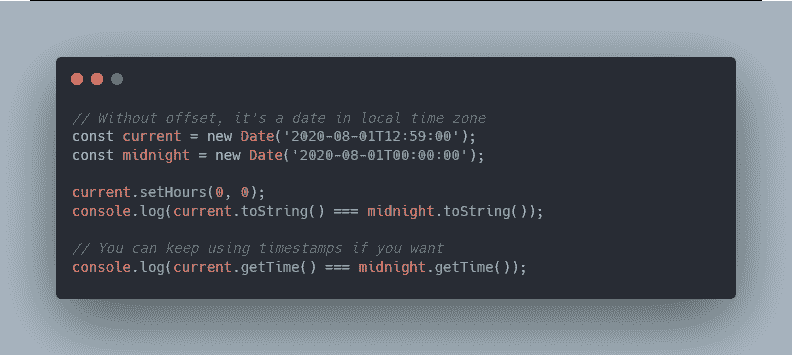**

**我们可以增强之前关于时间戳的规则:**

> **规则#2:字符串日期适合使用用户的时区和计算来显示。它们不在 UTC 上，但通常包括一个偏移量。**

## **在服务器端保持最新状态**

**关于时间戳的规则仍然适用于服务器端。然而，关于使用字符串日期的第二条规则不能使用。**

**事实上，在某些情况下，使用 PHP、Java 和 Rails 等技术，页面是在服务器端呈现的( [SSR](https://www.quora.com/What-is-the-difference-between-client-side-and-server-side-rendering-Why-is-server-side-rendering-required-for-React-and-Redux) )。这意味着所有的 HTML 都是由服务器生成的，它不知道客户端的时区。想想服务器——它只不过是地球上的一台计算机。它也有自己的时区，但不一定与客户的时区相同。**

> **规则 3:服务器可能知道客户端的时区，或者发送 UTC 日期。服务器的时区并不重要。**

**新的 Java 8 日期/时间被认为是帮助您处理日期的最容易理解和最清晰的 API 之一。我不打算在这里解释它是如何工作的，但是让我们回顾一些有趣的点。**

**`LocalDateTime`、`OffsetDateTime`和`ZonedDateTime`是用来计算和显示日期和时间的 3 个类。不再有`Date`或`DateTime`混淆显示当地日期和 UTC 日期。**

**下面的例子摘自[这篇很棒的文章](https://yawk.at/java.time/)(由 Jonas Konrad 撰写)，它用一堆例子描述了 Java 8 日期/时间 API。顺便说一句，非常感谢他，他好心地让我引用它的代码片段！**

**让我们来看看这三个类之间的区别:**

**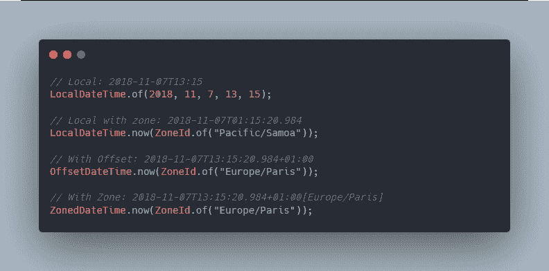**

**`OffsetDateTime`和`ZonedDateTime`有一个很小但很重要的区别，你注意到了吗？**

**顾名思义，`OffsetDateTime`只知道本地日期和 UTC 之间的偏差。这意味着它处理 DST 的方式不同于附加到时区的日期。**

**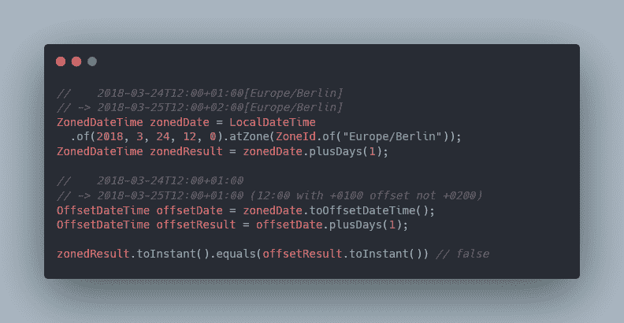**

**带有时区的示例似乎是正确的行为。实际上，两者都是正确的，因为增加 1 天可能意味着:**

*   **增加 1 天并保持相同的时间(用`ZonedDateTime`处理 DST)**
*   **给当前日期加上 24 小时(带`OffsetDateTime`)。**

**还记得关于时间戳的第一条规则吗？您应该只使用 UTC 时间戳进行保存。Java API 提供了一个`Instant`类，它是一个时间戳，可以从用于显示日期的三个类中的任何一个获得。**

**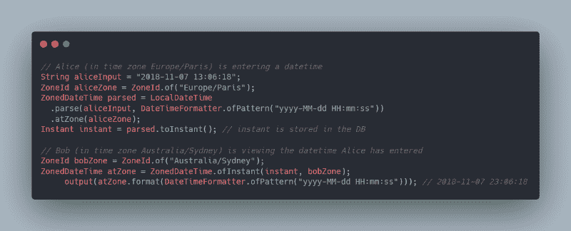**

## **最后的想法**

**在本文中，您已经了解了时间戳是用于保存的(规则#1)，而字符串日期是用于显示的(规则#2)。你有没有注意到纪元的秒数是一个相当大的数字？**

**这就是为什么继 [Unix 千年虫(Y2K)问题](https://en.wikipedia.org/wiki/Year_2000_problem)之后，又出现了 [Y2K38 问题](https://en.wikipedia.org/wiki/Year_2038_problem)，代表 2038 年。在`2038-01-19T03:14:07Z`时，时间戳(以秒为单位)将达到 32 位有符号整数的最大值`2,147,483,647`。再多加一秒就会变成负数。**

**

This sign indicates January 1900 instead of January 2000 — Picture from [Wikipedia Commons](https://en.wikipedia.org/wiki/File:Bug_de_l%27an_2000.jpg)** 

**‌On 论坛，人们说他们不在乎，因为他们的软件 20 年不用重写。嗯，这可能是真的，但让我们仍然考虑一些解决方案(使用 MySQL):**

*   **将`TIMESTAMP`类型更新为 64 位有符号整数**
*   **将 UTC 日期保存在`DATETIME`列，而不是`TIMESTAMP`列**

**这两种解决方案各有优缺点。第一个看起来像是一个后来报告问题的黑客。然而，它在几乎无限长的时间内(几十亿年)解决了这个问题。当问题再次出现时，您的软件将被弃用，不再使用。**

**第二种解决方案也可以工作很长时间(直到`9999-12-31T23:59:59Z`)。**

**对于日志，建议使用`TIMESTAMP`，而对于其他需求，`DATETIME`更好。记住时间戳不能存储在`1970-01-01T00:00:00Z`之前的日期，也不能存储在`2038-01-19T03:14:07Z`之后的日期。这意味着你应该使用`DATETIME`来保存过去和未来的日期。**

**此外，在 MySQL 中,`TIMESTAMP`以 UTC 存储，但是根据指定的时区显示(并在保存前转换为 UTC)。当你需要获得一个本地日期时，这个机制就派上了用场，并且不存在于`DATETIME`中。**

**关于处理日期的流行库 [moment.js](https://momentjs.com/) 的最后一句话。我首先试验了一个问题，并想警告你:**

**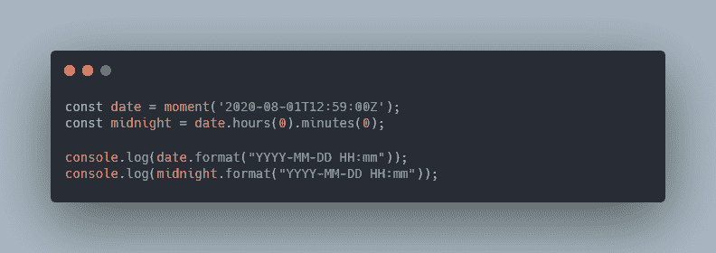**

**两个`console.log`都将输出`2020-08-02 00:00`。如果你习惯于函数式编程，你会期望`hours`和`minutes`返回一个新的 moment 对象，因为它们是[纯函数](https://en.wikipedia.org/wiki/Pure_function)。事实并非如此——他们修改输入日期并返回以便链接。**

**谢谢你一直读到最后。我希望我的这次经历对你有用。对了，我对`TIMESTAMP`和`DATETIME`的选择不是很有信心，所以不要犹豫，分享一下你的经验吧！**

**如果你觉得这篇文章有用，请在社交媒体上分享，以帮助其他人找到它，并表示你的支持！？**

****别忘了查看我的[作者页面](https://www.freecodecamp.org/news/author/jbardon/)上即将发布的文章**？**