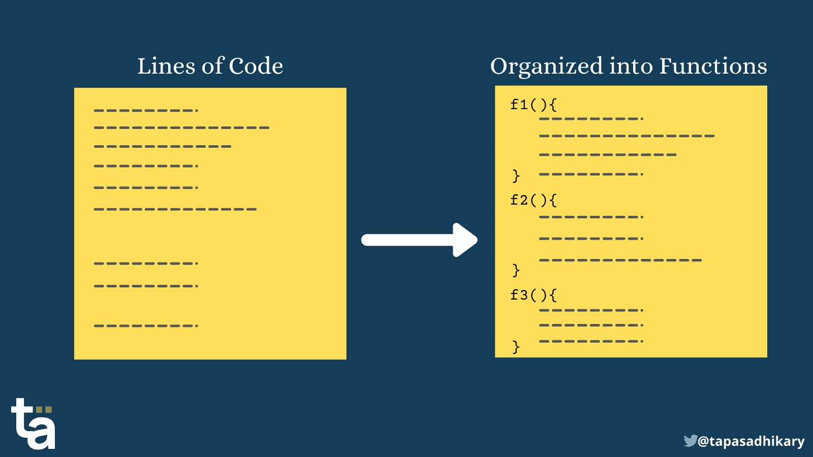
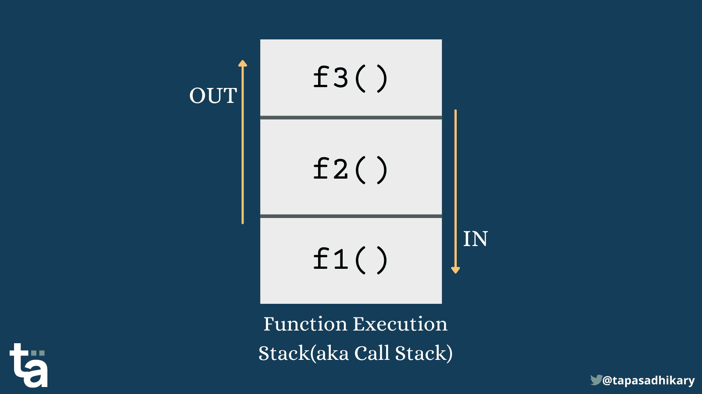
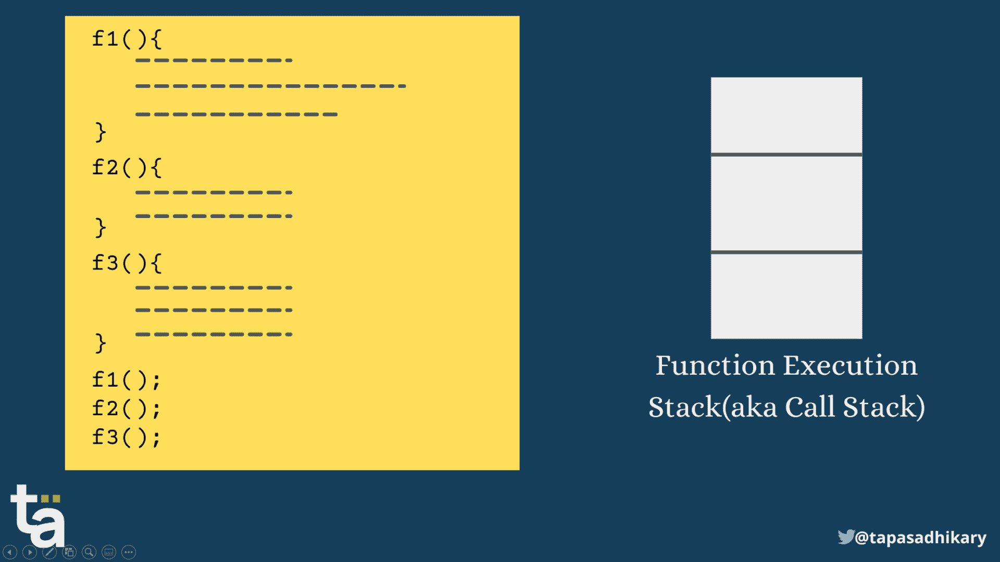
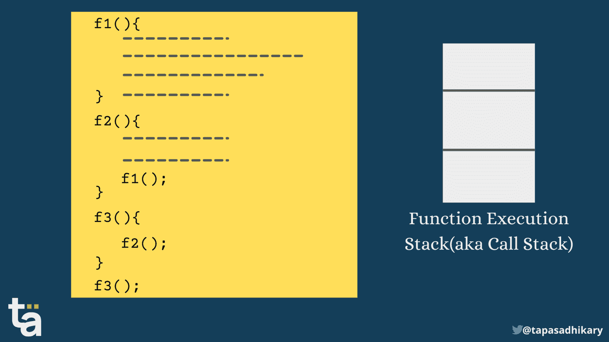
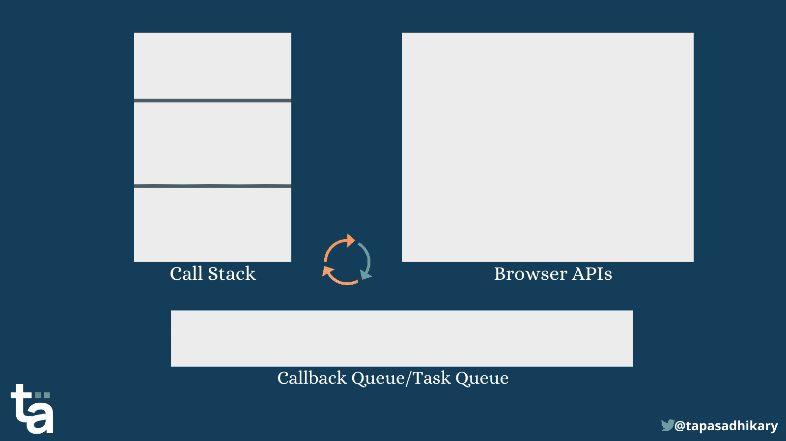
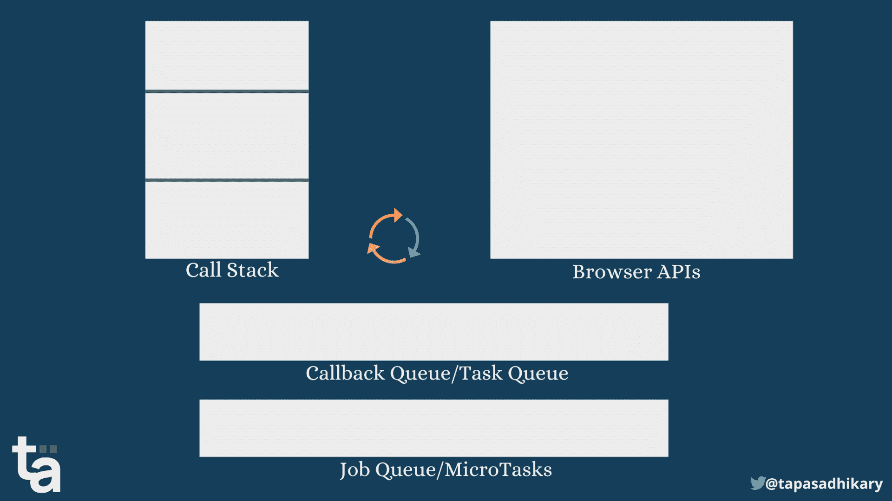

# 同步与异步 JavaScript——调用堆栈、承诺等等

> 原文：<https://www.freecodecamp.org/news/synchronous-vs-asynchronous-in-javascript/>

让我以问“什么是 JavaScript”开始这篇文章。好吧，这是我迄今为止发现的最令人困惑的中肯答案:

> JavaScript 是一种单线程、非阻塞、异步、并发编程语言，具有很大的灵活性。

等等，它是不是同时说了单线程和异步？如果您理解单线程的含义，您可能会将它与同步操作联系起来。那么，JavaScript 怎么可能是异步的呢？

在本文中，我们将学习 JavaScript 的同步和异步部分。在 web 编程中，您几乎每天都会用到这两者。

如果您也喜欢从视频内容中学习，本文也可以作为视频教程在此处获得:🙂

[https://www.youtube.com/embed/pIjfzjsoVw4?feature=oembed](https://www.youtube.com/embed/pIjfzjsoVw4?feature=oembed)

# 在本文中，您将了解到:

*   JavaScript 是如何同步的。
*   JavaScript 单线程时异步操作是如何发生的。
*   理解同步和异步如何帮助您更好地理解 JavaScript 承诺。
*   大量简单但强大的例子详细介绍了这些概念。

# JavaScript 函数是一等公民

在 JavaScript 中，您可以创建和修改一个函数，将它用作参数，从另一个函数返回它，并将它赋给一个变量。所有这些能力允许我们在任何地方使用函数来逻辑地放置一堆代码。



Lines of code organized into functions logically

我们需要告诉 JavaScript 引擎通过调用函数来执行它们。它看起来会像这样:

```
// Define a function
function f1() {
    // Do something
    // Do something again
    // Again
    // So on...
}

// Invoke the function
f1();
```

默认情况下，函数中的每一行都按顺序执行，一次执行一行。即使在代码中调用多个函数也是如此。再次，一行一行。

# 同步 JavaScript——函数执行堆栈如何工作

那么当你定义一个函数然后调用它时会发生什么呢？JavaScript 引擎维护一个名为`function execution stack`的`stack`数据结构。堆栈的目的是跟踪当前正在执行的函数。它执行以下操作:

*   当 JavaScript 引擎调用一个函数时，它会将它添加到堆栈中，然后开始执行。
*   如果当前执行的函数调用另一个函数，引擎会将第二个函数添加到堆栈中，并开始执行它。
*   一旦执行完第二个函数，引擎就从堆栈中取出它。
*   控制返回到上次离开第一个函数的地方继续执行。
*   一旦第一个函数的执行结束，引擎就将它从堆栈中取出。
*   继续同样的方式，直到没有东西放入堆栈。

函数执行栈也被称为`Call Stack`。



Function Execution Stack

让我们看一个例子，三个函数依次执行:

```
function f1() {
  // some code
}
function f2() {
  // some code
}
function f3() {
  // some code
}

// Invoke the functions one by one
f1();
f2();
f3();
```

现在让我们看看函数执行堆栈会发生什么:



A step-by-step flow shows the execution order

你看到那里发生了什么吗？首先，`f1()`进入堆栈，执行，然后弹出。然后`f2()`做同样的事情，最后`f3()`。在那之后，堆栈是空的，没有别的东西可以执行。

好，现在让我们来看一个更复杂的例子。这里有一个函数`f3()`调用另一个函数`f2()`，后者又调用另一个函数`f1()`。

```
function f1() {
  // Some code
}
function f2() {
  f1();
}
function f3() {
  f2();
}
f3();
```

让我们看看函数执行堆栈是怎么回事:



A step-by-step flow shows the execution order

注意，第一个`f3()`进入堆栈，调用另一个函数`f2()`。所以现在`f2()`进去了，而`f3()`还在堆栈中。`f2()`功能调用`f1()`。因此，是时候让`f1()`进入堆栈，而`f2()`和`f3()`都留在里面了。

首先，`f1()`完成执行并从堆栈中出来。就在那个`f2()`结束之后，最后是`f3()`。

底线是在`function execution stack`中发生的一切都是连续的。这是 JavaScript 的`Synchronous`部分。JavaScript 的`main`线程确保它在开始查看任何东西之前处理好堆栈中的所有东西`elsewhere`。

太好了！既然我们已经理解了 JavaScript 中的`synchronous`操作是如何工作的，现在让我们抛硬币来看看它的`asynchronous`面。你准备好了吗？

# 异步 JavaScript——浏览器 API 和承诺如何工作

单词`asynchronous`的意思是**不同时发生**。在 JavaScript 的上下文中是什么意思？

通常情况下，按顺序执行事情效果很好。但是有时您可能需要从服务器获取数据或者延迟执行一个函数，这是您不希望发生的事情。所以，您希望代码执行`asynchronously`。

在这些情况下，您可能不希望 JavaScript 引擎暂停其他顺序代码的执行。因此，在这种情况下，JavaScript 引擎需要更有效地管理事情。

我们可以用两个主要的触发器对大多数异步 JavaScript 操作进行分类:

1.  **浏览器 API/Web API** 事件或函数。这些方法包括像`setTimeout`这样的方法，或者像 click、mouse over、scroll 等事件处理程序。
2.  **承诺**。一个独特的 JavaScript 对象，允许我们执行异步操作。

如果你不习惯承诺，不要担心。要阅读这篇文章，你不需要知道更多。在文章的最后，我提供了一些链接，这样你就可以用对初学者最友好的方式开始学习承诺。

## 如何处理浏览器 API/Web API

像`setTimeout`和事件处理程序这样的浏览器 API 依赖于`callback`函数。当异步操作完成时，回调函数执行。下面是一个关于`setTimeout`函数如何工作的例子:

```
function printMe() {
  console.log('print me');
}

setTimeout(printMe, 2000);
```

`setTimeout`功能在经过一定时间后执行功能。在上面的代码中，文本`print me`在延迟 2 秒后登录到控制台。

现在假设我们在`setTimeout`函数之后还有几行代码，如下所示:

```
function printMe() {
  console.log('print me');
}

function test() {
  console.log('test');
}

setTimeout(printMe, 2000);
test(); 
```

那么，我们期望这里会发生什么？你认为输出会是什么？

JavaScript 引擎是否会等待 2 秒钟来调用`test()`函数并输出:

```
printMe
test
```

或者它会设法把`setTimeout`的回调函数放在一边，继续它的其他执行吗？因此，输出可能是这样的:

```
test
printMe
```

如果你猜的是后者，那你就对了。这就是异步机制发挥作用的地方。

## JavaScript 回调队列如何工作(也称为任务队列)

JavaScript 维护一个回调函数队列。它被称为回调队列或任务队列。一个队列数据结构是`First-In-First-Out(FIFO)`。所以，首先进入队列的回调函数有机会先出去。但问题是:

*   JavaScript 引擎什么时候把它放入队列？
*   JavaScript 引擎什么时候将它从队列中取出？
*   它从队列中出来后去了哪里？
*   最重要的是，所有这些与 JavaScript 的异步部分有什么关系？

哇，好多问题！让我们在下图的帮助下找出答案:



上图显示的是我们已经见过的常规`call stack`。如果浏览器 API(如 setTimeout)启动并从该 API 调用回调函数，需要跟踪另外两个部分。

JavaScript 引擎继续执行调用堆栈中的函数。因为它没有将回调函数直接放入堆栈，所以不存在任何代码在堆栈中等待/阻塞执行的问题。

引擎创建一个`loop`来周期性地查看队列，以找到它需要从那里获取的内容。当堆栈为空时，它从队列中提取一个回调函数到调用堆栈中。现在回调函数通常像堆栈中的其他函数一样执行。循环继续。这个循环以`Event Loop`而闻名。

所以，这个故事的寓意是:

*   当浏览器 API 出现时，将回调函数放在队列中。
*   在堆栈中照常执行代码。
*   事件循环检查队列中是否有回调函数。
*   如果是这样，将回调函数从队列中拉到堆栈中并执行。
*   继续循环。

好了，让我们看看下面的代码是如何工作的:

```
function f1() {
    console.log('f1');
}

function f2() {
    console.log('f2');
}

function main() {
    console.log('main');

    setTimeout(f1, 0);

    f2();
}

main();
```

代码执行一个带有回调函数`f1()`的`setTimeout`函数。请注意，我们没有给它任何延迟。这意味着我们期望函数`f1()`立即执行。在 setTimeout 之后，我们执行另一个函数`f2()`。

那么，你认为输出会是什么？这是:

```
main
f2
f1
```

但是，您可能认为`f1`应该在`f2`之前打印，因为我们没有延迟 f1 的执行。但不，事实并非如此。还记得我们上面讨论的`event loop`机制吗？现在，让我们看一下上面代码的一步一步的流程。


Event loop - see the step-by-step execution

以下是写出来的步骤:

1.  `main()`函数进入调用堆栈。
2.  它有一个控制台日志来打印单词 main。`console.log('main')`执行并退出堆栈。
3.  发生 setTimeout 浏览器 API。
4.  回调函数将它放入回调队列。
5.  在堆栈中，执行照常发生，所以`f2()`进入堆栈。执行`f2()`的控制台日志。两者都从堆栈中删除。
6.  `main()`也从堆栈中弹出。
7.  事件循环识别出调用堆栈是空的，并且队列中有一个回调函数。
8.  回调函数`f1()`然后进入堆栈。开始执行。控制台日志执行，`f1()`也从堆栈中出来。
9.  此时，堆栈和队列中没有其他东西可以进一步执行。

我希望现在你已经清楚 JavaScript 的`asynchronous`部分是如何在内部工作的了。但是，这还不是全部。我们还要看`promises`。

## JavaScript 引擎如何处理承诺

在 JavaScript 中，承诺是帮助您执行异步操作的特殊对象。

您可以使用`Promise`构造函数创建一个承诺。您需要向它传递一个`executor`函数。在 executor 函数中，您定义了当一个承诺成功返回或抛出错误时您想要做什么。你可以通过分别调用`resolve`和`reject`方法来实现。

以下是 JavaScript 中的一个承诺示例:

```
const promise = new Promise((resolve, reject) =>
        resolve('I am a resolved promise');
);
```

在执行承诺之后，我们可以使用`.then()`方法处理结果，使用`.catch()`方法处理任何错误。

```
promise.then(result => console.log(result))
```

每次使用`fetch()`方法从商店获取数据时，您都使用了 promises。

这里的要点是 JavaScript 引擎不使用我们之前看到的浏览器 API 的`callback queue`。它使用另一个称为`Job Queue`的特殊队列。

## JavaScript 中的作业队列是什么？

每当代码中出现一个承诺，executor 函数就会进入作业队列。事件循环照常工作，查看队列，但是当`stack`空闲时，给予`job queue`项优先于`callback queue`项的优先权。

回调队列中的项目称为`macro task`，而作业队列中的项目称为`micro task`。

所以整个流程是这样的:

*   对于`event loop`的每个循环，完成`callback queue`中的一个任务。
*   一旦任务完成，事件循环访问`job queue`。它完成了作业队列中的所有`micro tasks`,然后开始下一步工作。
*   如果两个队列在相同的时间点获得条目，`job queue`比`callback queue`获得优先权。

下图显示了包含的作业队列以及其他预先存在的项目。


现在，让我们看一个例子来更好地理解这个序列:

```
function f1() {
    console.log('f1');
}

function f2() {
    console.log('f2');
}

function main() {
    console.log('main');

    setTimeout(f1, 0);

    new Promise((resolve, reject) =>
        resolve('I am a promise')
    ).then(resolve => console.log(resolve))

    f2();
}

main();
```

在上面的代码中，我们像以前一样有一个`setTimeout()`函数，但是我们在它后面引入了一个承诺。现在记住我们学过的所有内容，并猜测输出。

如果您的答案与此相符，则您答对了:

```
main
f2
I am a promise
f1
```

现在让我们来看看动作的流程:



Callback queue vs. Job queue

流程与上面的几乎相同，但是注意作业队列中的项目如何优先于任务队列中的项目是至关重要的。还要注意，即使`setTimeout`没有延迟也没有关系。它总是关于在回调队列之前的作业队列。

好了，我们已经了解了理解 JavaScript 中同步和异步执行所需的一切。

# 这是给你的一个测验！

让我们做个小测验来测试一下你的理解程度。猜测以下代码的输出，并应用到目前为止我们获得的所有知识:

```
function f1() {
 console.log('f1');
}

function f2() { 
    console.log('f2');
}

function f3() { 
    console.log('f3');
}

function main() {
  console.log('main');

  setTimeout(f1, 50);
  setTimeout(f3, 30);

  new Promise((resolve, reject) =>
    resolve('I am a Promise, right after f1 and f3! Really?')
  ).then(resolve => console.log(resolve));

  new Promise((resolve, reject) =>
    resolve('I am a Promise after Promise!')
  ).then(resolve => console.log(resolve));

  f2();
}

main();
```

以下是预期的输出:

```
main
f2
I am a Promise, right after f1 and f3! Really?
I am a Promise after Promise!
f3
f1
```

你想要更多这样的测验吗？前往该仓库进行更多练习。

如果你被卡住或需要任何澄清，我的 DM 总是在 Twitter 上打开[。](https://twitter.com/tapasadhikary)

# 概括起来

总结一下:

*   JavaScript 引擎使用堆栈数据结构来跟踪当前执行的函数。这个堆栈被称为函数执行堆栈。
*   函数执行堆栈(也称为调用堆栈)一行一行、一个接一个地顺序执行函数。
*   当异步操作/延迟完成时，浏览器/web API 使用回调函数来完成任务。回调函数被放在回调队列中。
*   promise executor 函数放在作业队列中。
*   对于事件循环的每个循环，在回调队列之外完成一个宏任务。
*   一旦任务完成，事件循环访问作业队列。它在寻找下一件事情之前完成作业队列中的所有微任务。
*   如果两个队列在同一时间点获得条目，则作业队列优先于回调队列。

# 在结束之前...

目前就这些。我希望您觉得这篇文章很有见地，并且有助于您更好地理解 JavaScript 的同步和异步概念。

我们来连线。你可以在 [Twitter(@tapasadhikary)](https://twitter.com/tapasadhikary) 、我的 [Youtube 频道](https://youtube.com/c/TapasAdhikary?sub_confirmation=1)、以及 [GitHub(atapas)](https://github.com/atapas) 上关注我。

如前所述，这里有几篇文章你可能会觉得有用，

*   [JavaScript 承诺——解释得像我五岁一样](https://blog.greenroots.info/javascript-promises-explain-like-i-am-five)
*   [JavaScript 承诺链——处理承诺的艺术](https://blog.greenroots.info/javascript-promise-chain-the-art-of-handling-promises)
*   [JavaScript async 和 await -请用简单的英语](https://blog.greenroots.info/javascript-async-and-await-in-plain-english-please)
*   [介绍 PromiViz -可视化并学习 JavaScript promise API](https://blog.greenroots.info/introducing-promiviz-visualize-and-learn-javascript-promise-apis)